# Chess Game Analysis: kar2on vs Abhimod123

- **Result:** 1-0
- **Date:** 2026.04.03
- **Opening:** Closed Sicilian Defense Traditional Line 3.Nf3 g6 4.Bc4 Bg7

### Move 1 (White): e4 - Best Move ✅

Played **e4**.

### Move 1 (Black): c5 - Good 👍

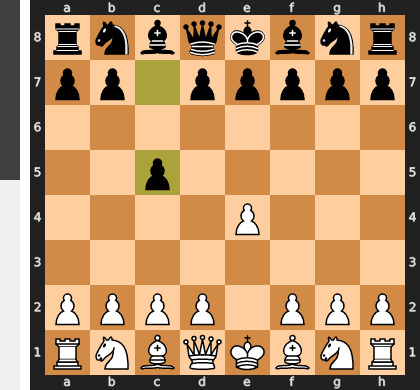

Played **c5**. The engine recommended **e5**.

### Move 2 (White): Nf3 - Best Move ✅

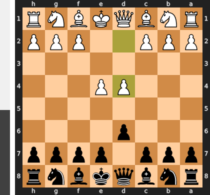

Played **Nf3**.

### Move 2 (Black): Nc6 - Best Move ✅

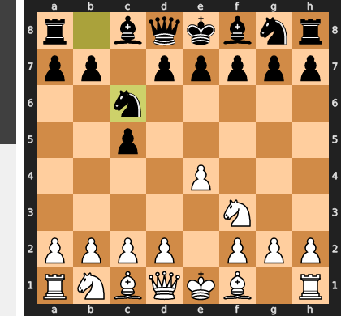

Played **Nc6**.

### Move 3 (White): Bc4 - Good 👍

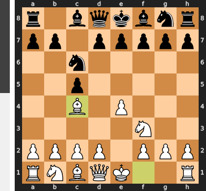

Played **Bc4**. The engine recommended **Bb5**.

### Move 3 (Black): g6 - Good 👍

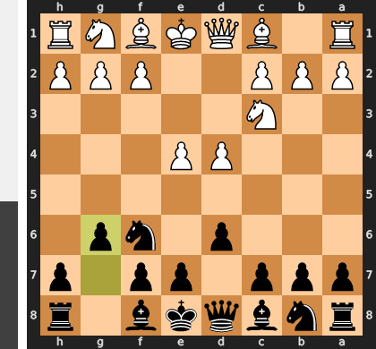

Played **g6**. The engine recommended **e6**.

### Move 4 (White): Nc3 - Inaccuracy ⁈

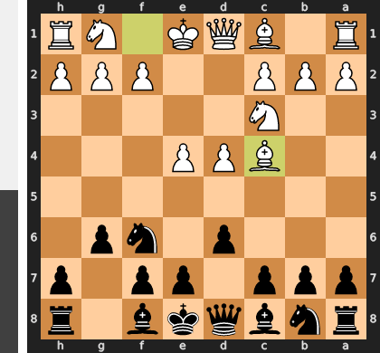

Played **Nc3**. The engine recommended **c3**.

### Move 4 (Black): Bg7 - Best Move ✅

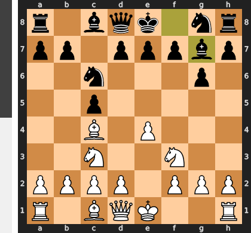

Played **Bg7**.

### Move 5 (White): d4 - Inaccuracy ⁈

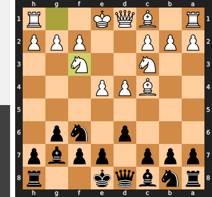

Played **d4**. The engine recommended **O-O**.

### Move 5 (Black): cxd4 - Best Move ✅

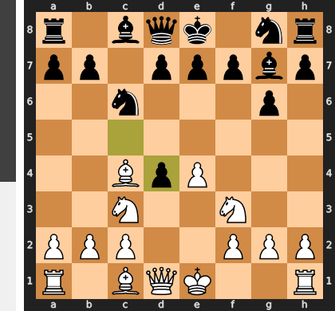

Played **cxd4**.

### Move 6 (White): Nb5 - Best Move ✅

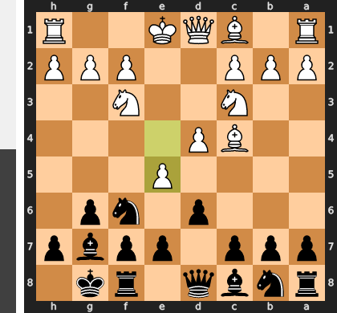

Played **Nb5**.

### Move 6 (Black): Nf6 - Best Move ✅

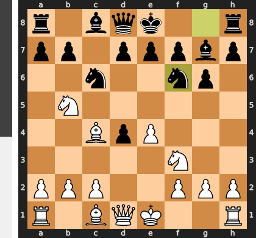

Played **Nf6**.

### Move 7 (White): Nbxd4 - Inaccuracy ⁈

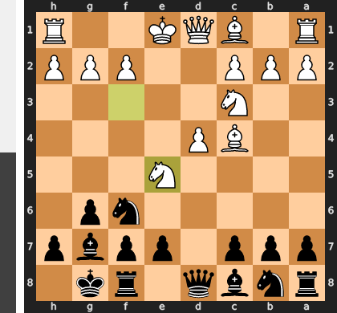

Played **Nbxd4**. The engine recommended **Qe2**.

### Move 7 (Black): Nxe4 - Best Move ✅

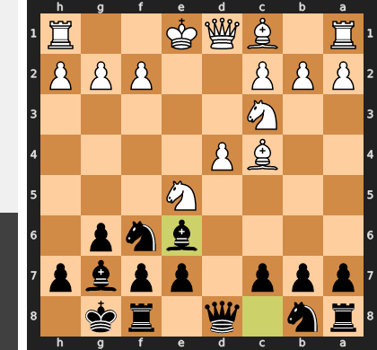

Played **Nxe4**.

### Move 8 (White): Nxc6 - Good 👍

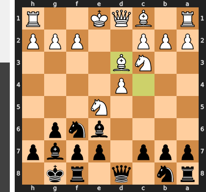

Played **Nxc6**. The engine recommended **O-O**.

### Move 8 (Black): bxc6 - Best Move ✅

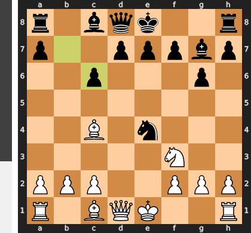

Played **bxc6**.

### Move 9 (White): O-O - Best Move ✅

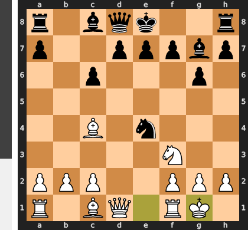

Played **O-O**.

### Move 9 (Black): O-O - Best Move ✅

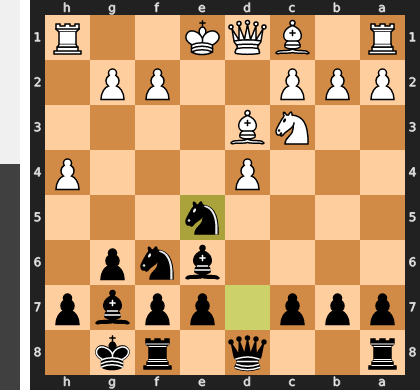

Played **O-O**.

### Move 10 (White): Bf4 - Inaccuracy ⁈

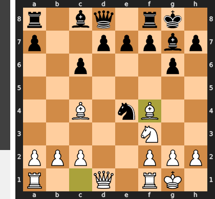

Played **Bf4**. The engine recommended **Bb3**.

### Move 10 (Black): d6 - Inaccuracy ⁈

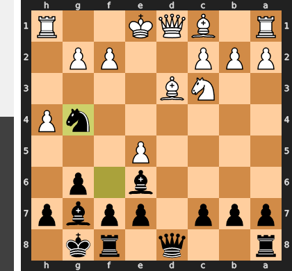

Played **d6**. The engine recommended **d5**.

### Move 11 (White): Bd3 - Good 👍

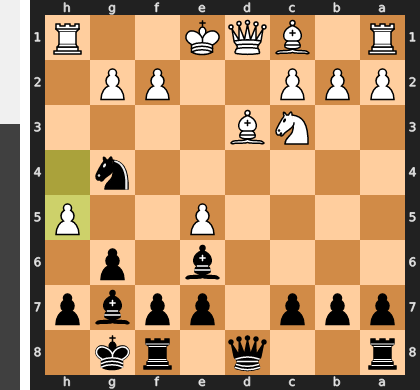

Played **Bd3**. The engine recommended **Re1**.

### Move 11 (Black): Nc5 - Best Move ✅

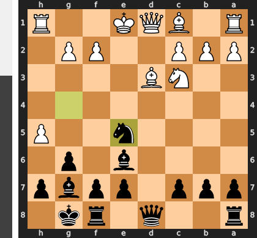

Played **Nc5**.

### Move 12 (White): Bc4 - Good 👍

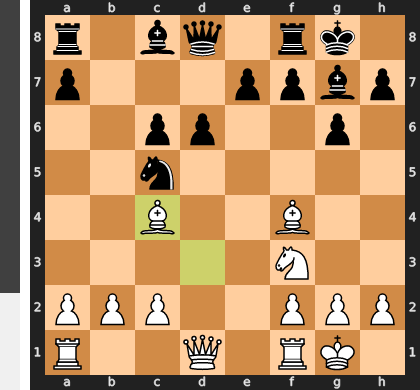

Played **Bc4**. The engine recommended **Qc1**.

### Move 12 (Black): e5 - Good 👍

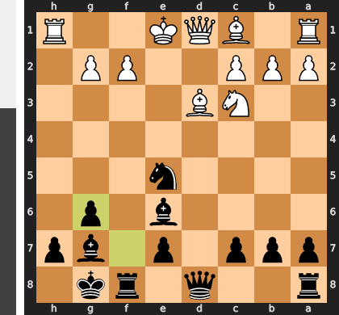

Played **e5**. The engine recommended **d5**.

### Move 13 (White): Bg5 - Good 👍

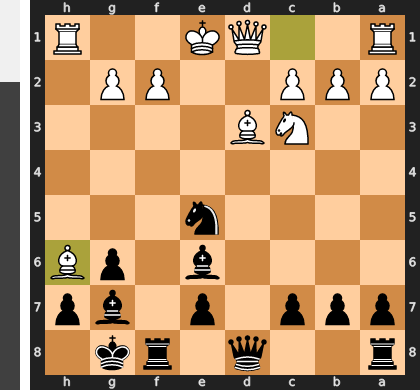

Played **Bg5**. The engine recommended **Be3**.

### Move 13 (Black): Qb6 - Mistake ❓

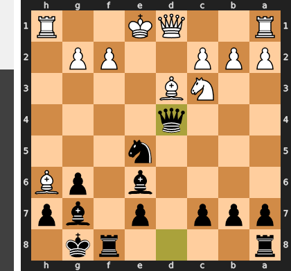

While Qb6 appears active by pressuring the b2-pawn, it is a grave miscalculation as it misplaces the queen and neglects the critical d6-pawn. This error allows White to seize the initiative with the brilliant tactical shot Be7!, deflecting the fianchettoed bishop and enabling the devastating follow-up Qxd6. The superior Qc7 would have kept the queen centralized to guard d6, maintaining Black's firm control over the position and preparing the decisive ...d5 pawn break.

### Move 14 (White): Be3 - Mistake ❓

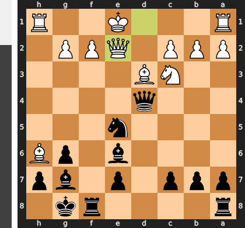

By playing the routine developing move Be3, White fatally neglected the central tension, giving up the perfect moment to resolve it favorably with Qxd6. This critical error hands Black a free tempo to play the powerful pawn break `...d5!`, which immediately seizes the initiative. This thrust shatters White's central setup, forces the exchange of the crucial c4-bishop, and unleashes Black's pieces, leaving White suddenly passive and strategically worse.

### Move 14 (Black): d5 - Good 👍

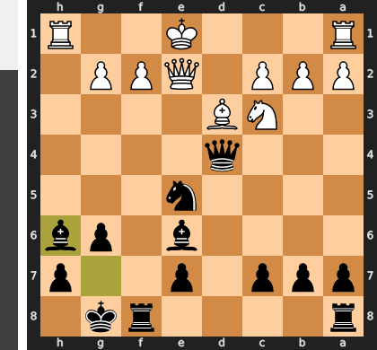

Played **d5**. The engine recommended **Rd8**.

### Move 15 (White): Bb3 - Inaccuracy ⁈

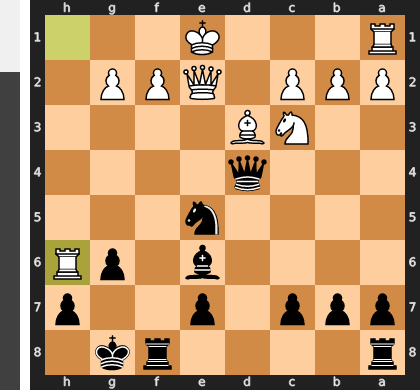

Played **Bb3**. The engine recommended **Bxd5**.

### Move 15 (Black): e4 - Good 👍

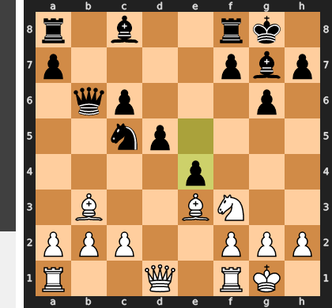

Played **e4**. The engine recommended **d4**.

### Move 16 (White): Ng5 - Good 👍

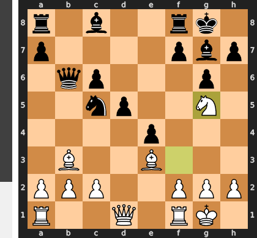

Played **Ng5**. The engine recommended **Nd4**.

### Move 16 (Black): Bxb2 - Blunder ❌

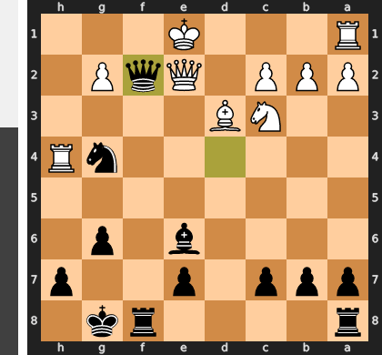

This move was a catastrophic miscalculation of the position's dynamics, trading a winning central strategy for a single, poisoned pawn. The bishop on b2 becomes a liability rather than an attacker, allowing White to decisively play Bxc5 to eliminate Black's all-important knight. After the queen recaptures, the simple Rb1 move now traps the wayward bishop, completely unraveling Black's coordination and turning a winning advantage into a losing position.

### Move 17 (White): Rb1 - Best Move ✅

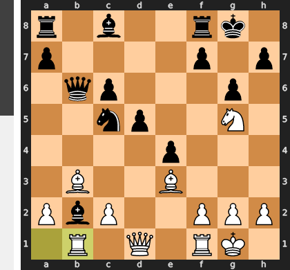

Played **Rb1**.

### Move 17 (Black): Bg7 - Good 👍

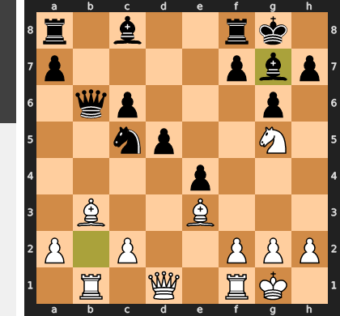

Played **Bg7**. The engine recommended **Ba3**.

### Move 18 (White): f3 - Blunder ❌

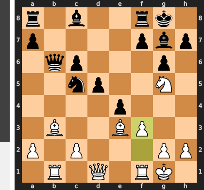

The move f3 is a disastrous miscalculation, as it fatally weakens the king's diagonal and removes a key defender of the bishop on e3. This tactical oversight invites the crushing blow ...d4!, a devastating pawn thrust that forks both of White's bishops. After this simple retort, White's entire central structure collapses, leading to a decisive loss of material.

### Move 18 (Black): Be6 - Mistake ❓

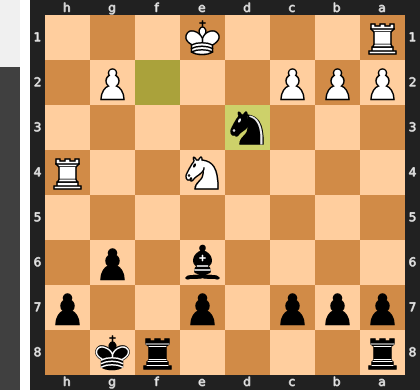

This move fatally misunderstands the position by challenging the g5-knight while ignoring the true source of Black's advantage: the suffocating e4-pawn. Playing Be6 allows White the simple, game-saving response of `fxe4`, which liquidates the central tension under favorable terms and instantly breathes life into White's cramped pieces. Instead of maintaining the unbearable pressure with a move like Qa5, Black has single-handedly solved all of White's problems, turning a winning position into an equal one.

### Move 19 (White): fxe4 - Inaccuracy ⁈

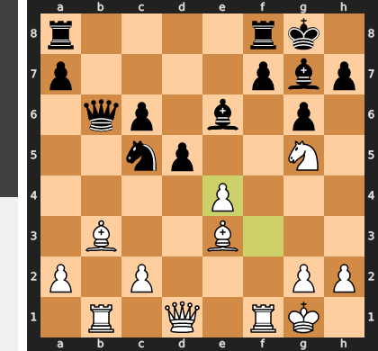

Played **fxe4**. The engine recommended **Nxe6**.

### Move 19 (Black): dxe4 - Blunder ❌

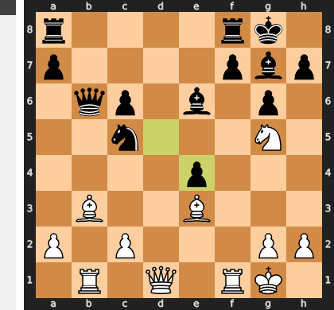

This capture is a fatal miscalculation that opens critical lines for White's better-coordinated attacking pieces. By removing the d5-pawn, Black eliminated the key supporter of his c5-knight, allowing White to immediately force a winning sequence starting with the sacrifice `Bxc5!`. After Black is forced to recapture, the crushing follow-up `Nxe6` forks the queen and rook, completely dismantling Black's defensive structure.

### Move 20 (White): Bxe6 - Best Move ✅

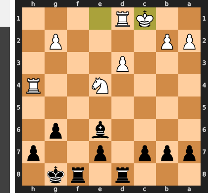

Played **Bxe6**.

### Move 20 (Black): Qa5 - Good 👍

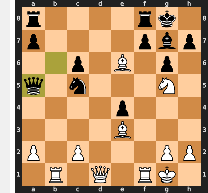

Played **Qa5**. The engine recommended **Nxe6**.

### Move 21 (White): Bb3 - Mistake ❓

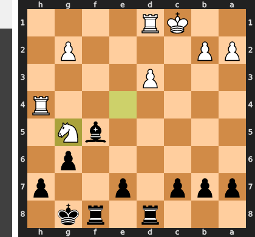

White gravely misunderstood the position's urgency, playing a quiet positional move when a tactical kill was available. The decisive Bxf7+ would have immediately shattered the king's pawn cover, leading to an unstoppable attack after the forced Kxf7. Instead, Bb3 squanders the decisive moment and grants Black a critical tempo to consolidate his defenses and fight for survival.

### Move 21 (Black): Nxb3 - Best Move ✅

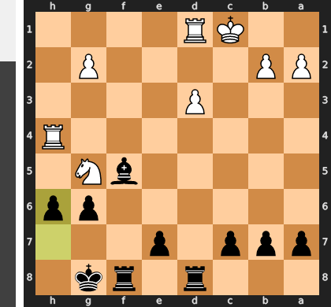

Played **Nxb3**.

### Move 22 (White): axb3 - Good 👍

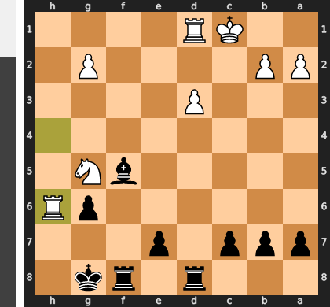

Played **axb3**. The engine recommended **Rxb3**.

### Move 22 (Black): Rad8 - Good 👍

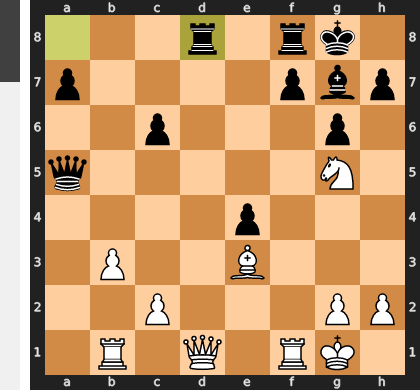

Played **Rad8**. The engine recommended **h6**.

### Move 23 (White): Qe2 - Good 👍

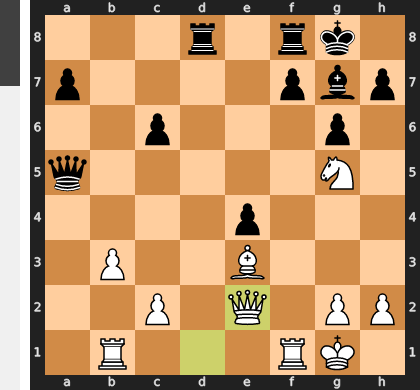

Played **Qe2**. The engine recommended **Qe1**.

### Move 23 (Black): Rfe8 - Mistake ❓

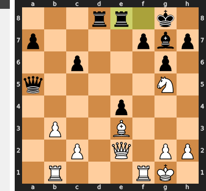

This move is a positional and tactical misjudgment, as it is far too passive and completely misunderstands the urgency of the situation. By leaving the queen sidelined on a5, Black allows White to execute the crushing `Nxf7!` sacrifice, which shatters the kingside pawn cover and initiates an unstoppable mating attack. The correct move, `...Qe5`, would have immediately challenged the dangerous g5-knight and brought Black's most powerful piece back to the defense, neutralizing White's primary threat.

### Move 24 (White): Qc4 - Inaccuracy ⁈

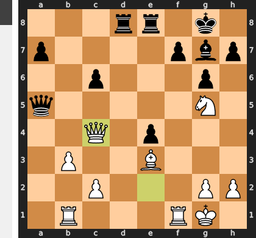

Played **Qc4**. The engine recommended **Nxf7**.

### Move 24 (Black): Bh6 - Blunder ❌

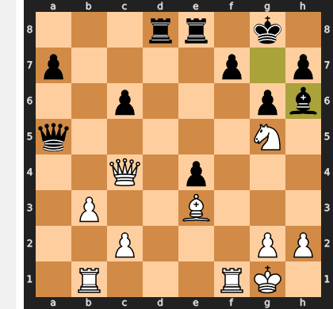

While intending to eliminate the dangerous g5-knight, Black's move fatally abandons the defense of the f7-pawn by moving away its sole defender. This tactical oversight allows White to completely ignore the threat and launch a decisive combination beginning with the crushing rook sacrifice Rxf7!, which overloads Black's remaining pieces and leads directly to a forced checkmate.

### Move 25 (White): Qxf7+ - Best Move ✅

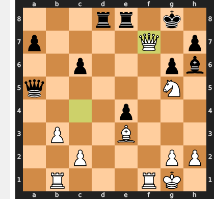

Played **Qxf7+**.

### Move 25 (Black): Kh8 - Best Move ✅

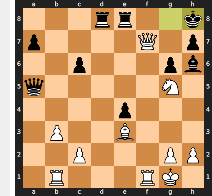

Played **Kh8**.

### Move 26 (White): Qxh7# - Blunder ❌

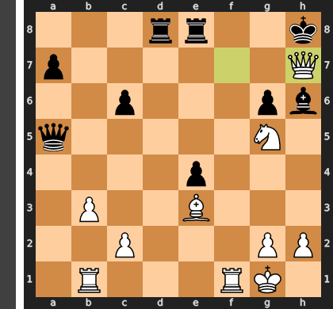

This move is the furthest thing from a blunder; it is the decisive, game-ending checkmate that every player strives for. The engine's "blunder" classification is a common digital misinterpretation, as the evaluation flips from a certain win for White to a lost position for Black simply because the game has concluded. There is no higher tactical or positional achievement than delivering checkmate, which makes any other form of evaluation utterly irrelevant.

