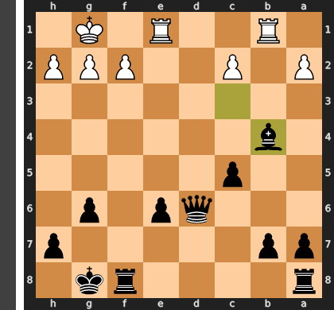
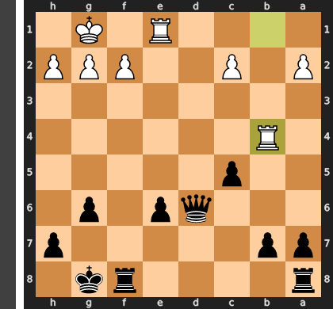
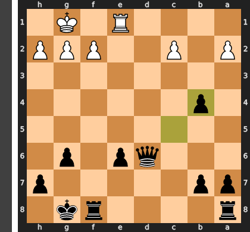
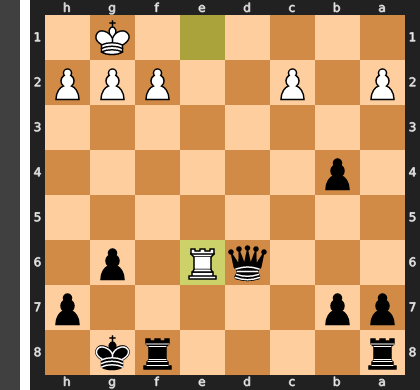
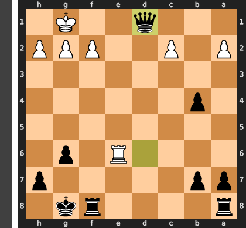
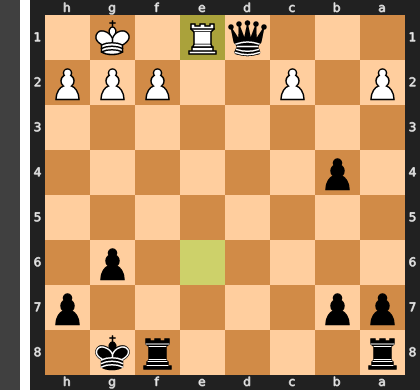
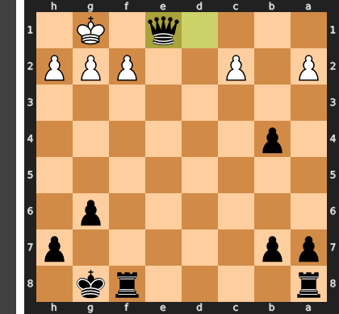

# Chess Game Analysis: Daniyal001021 vs kar2on

- **Result:** 0-1
- **Date:** 2026.04.04
- **Opening:** Pirc Defense Classical Variation 4...Bg7 5.Bc4 O O 6.O O

### Move 1 (White): e4 - Best Move ✅

Played **e4**.

### Move 1 (Black): d6 - Good 👍

Played **d6**. The engine recommended **e5**.

### Move 2 (White): d4 - Best Move ✅

Played **d4**.

### Move 2 (Black): Nf6 - Best Move ✅

Played **Nf6**.

### Move 3 (White): Nc3 - Best Move ✅

Played **Nc3**.

### Move 3 (Black): g6 - Good 👍

Played **g6**. The engine recommended **e5**.

### Move 4 (White): Nf3 - Good 👍

Played **Nf3**. The engine recommended **f4**.

### Move 4 (Black): Bg7 - Best Move ✅

Played **Bg7**.

### Move 5 (White): Bc4 - Good 👍

Played **Bc4**. The engine recommended **Bg5**.

### Move 5 (Black): O-O - Best Move ✅

Played **O-O**.

### Move 6 (White): O-O - Best Move ✅

Played **O-O**.

### Move 6 (Black): c5 - Good 👍

Played **c5**. The engine recommended **Nxe4**.

### Move 7 (White): d5 - Good 👍

Played **d5**. The engine recommended **dxc5**.

### Move 7 (Black): e6 - Good 👍

Played **e6**. The engine recommended **Nbd7**.

### Move 8 (White): dxe6 - Good 👍

Played **dxe6**. The engine recommended **Re1**.

### Move 8 (Black): Bxe6 - Best Move ✅

Played **Bxe6**.

### Move 9 (White): Bxe6 - Best Move ✅

Played **Bxe6**.

### Move 9 (Black): fxe6 - Best Move ✅

Played **fxe6**.

### Move 10 (White): Bg5 - Good 👍

Played **Bg5**. The engine recommended **Qd3**.

### Move 10 (Black): Qb6 - Good 👍

Played **Qb6**. The engine recommended **Nc6**.

### Move 11 (White): Rb1 - Good 👍

Played **Rb1**. The engine recommended **e5**.

### Move 11 (Black): Nbd7 - Good 👍

Played **Nbd7**. The engine recommended **Ne8**.

### Move 12 (White): e5 - Good 👍

Played **e5**. The engine recommended **Qd2**.

### Move 12 (Black): Nxe5 - Best Move ✅

Played **Nxe5**.

### Move 13 (White): Bxf6 - Mistake ❓

This move is a grave strategic miscalculation, as it voluntarily trades White's actively-placed bishop for a pinned knight, completely releasing the tension. After the correct recapture ...Rxf6, Black's rook becomes a dominant force on the f-file and the now-unchallenged e5-knight is cemented as a powerful outpost. White has not only failed to eliminate Black's best piece (with Nxe5) but has actively improved Black's entire position.

### Move 13 (Black): Bxf6 - Good 👍

Played **Bxf6**. The engine recommended **Nxf3+**.

### Move 14 (White): Nxe5 - Best Move ✅

Played **Nxe5**.

### Move 14 (Black): Bxe5 - Best Move ✅

Played **Bxe5**.

### Move 15 (White): Qxd6 - Blunder ❌

By recapturing on d6, White has moved the queen from a safe, coordinating post into a lethal tactical snare. This blunder allows Black to play the decisive `...Bxc3`, removing a key defender and forcing the b-pawn to recapture, after which Black simply wins the now-undefended white queen with `...Qxd6`. White focused on winning back a piece and completely overlooked this simple but devastating two-move sequence that costs the game.

### Move 15 (Black): Qxd6 - Good 👍

Played **Qxd6**. The engine recommended **Bxd6**.

### Move 16 (White): b4 - Inaccuracy ⁈

Played **b4**. The engine recommended **Ne4**.

### Move 16 (Black): Bxc3 - Best Move ✅

Played **Bxc3**.

### Move 17 (White): Rfe1 - Mistake ❓

This move tragically misunderstands the urgency of the position, treating it as a quiet moment when it is in fact a tactical crisis. By failing to play the necessary bxc5 to challenge Black's central control, White hands Black a free hand to play ...cxb4. This response shatters White's queenside structure and unleashes the full, decisive power of the bishop on c3 and queen on d6 against White's exposed pawns.

### Move 17 (Black): Bxb4 - Mistake ❓

Black has mistakenly traded a decisive, paralyzing advantage for a mere pawn. The bishop was a monster, completely immobilizing White's rooks via the pin, but Bxb4 voluntarily releases this crushing pressure. Instead of simply winning the exchange with Bxe1 and keeping White's position in a stranglehold, this move allows White to untangle with c3 and begin to consolidate, needlessly complicating a once-trivial win.

### Move 18 (White): Rxb4 - Mistake ❓

This capture is a grave positional misjudgment, as after the simple ...cxb4, White voluntarily gives Black a winning passed b-pawn and opens the c-file for a decisive rook invasion. Instead of this greedy pawn grab, the superior Re3 would have fortified the third rank and maintained defensive cohesion, avoiding the creation of these fatal, self-inflicted weaknesses.

### Move 18 (Black): cxb4 - Best Move ✅

Played **cxb4**.

### Move 19 (White): Rxe6 - Blunder ❌

This move catastrophically abandons the back rank by trading the rook's vital defensive duties for a meaningless pawn. By removing the only piece that could interpose on the first rank, White allows an immediate ...Qd1+, leading to a swift and forced checkmate.

### Move 19 (Black): Qd1+ - Best Move ✅

Played **Qd1+**.

### Move 20 (White): Re1 - Best Move ✅

Played **Re1**.

### Move 20 (Black): Qxe1# - Best Move ✅

Played **Qxe1#**.

