# Chess Game Analysis: MeisterNell vs kar2on

- **Result:** 1-0
- **Date:** 2026.04.03
- **Opening:** Kings Indian Defense Advance Anti Grunfeld Variation 3...Bg7

### Move 1 (White): d4 - Good 👍

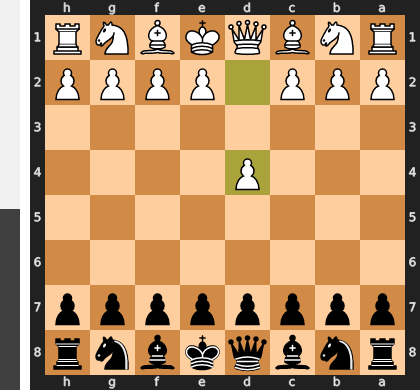

Played **d4**. The engine recommended **e4**.

### Move 1 (Black): Nf6 - Best Move ✅

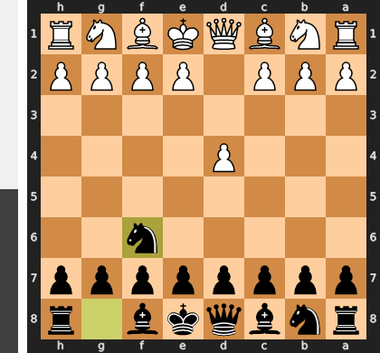

Played **Nf6**.

### Move 2 (White): d5 - Inaccuracy ⁈

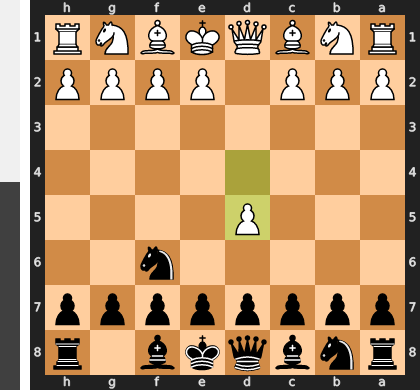

Played **d5**. The engine recommended **c4**.

### Move 2 (Black): g6 - Good 👍

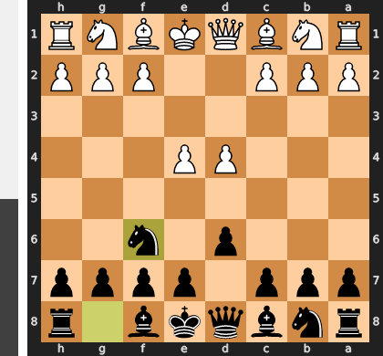

Played **g6**. The engine recommended **e6**.

### Move 3 (White): c4 - Best Move ✅

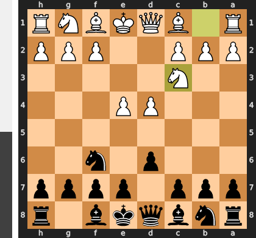

Played **c4**.

### Move 3 (Black): Bg7 - Best Move ✅

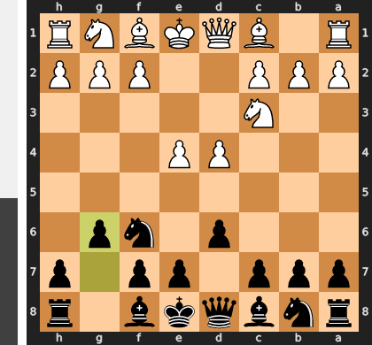

Played **Bg7**.

### Move 4 (White): Nc3 - Best Move ✅

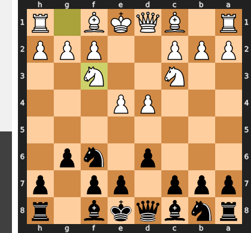

Played **Nc3**.

### Move 4 (Black): O-O - Best Move ✅

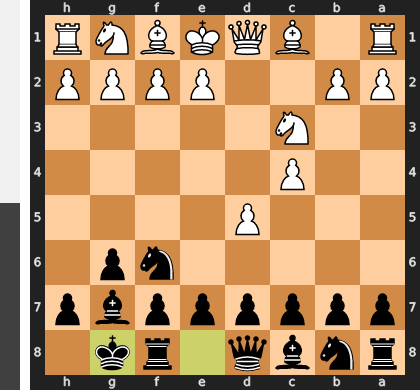

Played **O-O**.

### Move 5 (White): e4 - Best Move ✅

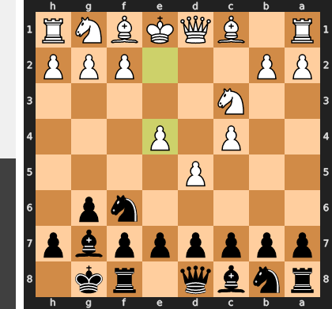

Played **e4**.

### Move 5 (Black): c6 - Good 👍

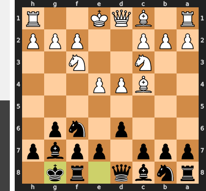

Played **c6**. The engine recommended **d6**.

### Move 6 (White): Nf3 - Best Move ✅

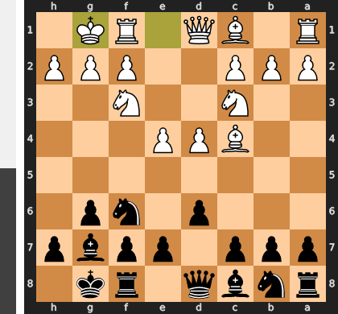

Played **Nf3**.

### Move 6 (Black): cxd5 - Good 👍

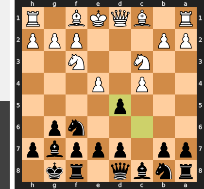

Played **cxd5**. The engine recommended **d6**.

### Move 7 (White): cxd5 - Best Move ✅

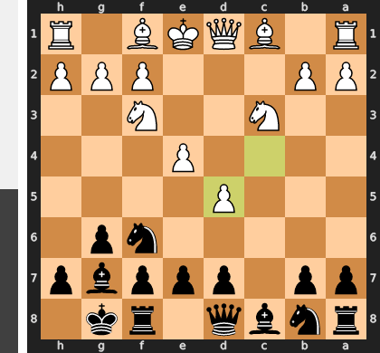

Played **cxd5**.

### Move 7 (Black): e6 - Good 👍

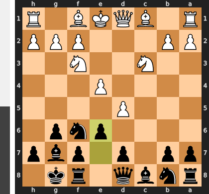

Played **e6**. The engine recommended **d6**.

### Move 8 (White): e5 - Mistake ❓

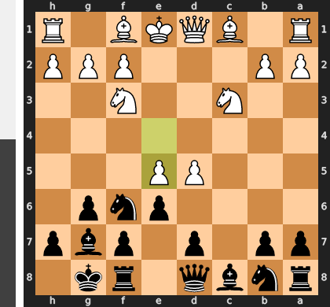

This move is a strategic error because it prematurely releases the central tension that was the source of White's advantage. By provoking the inevitable ...Nxd5 exchange, White liquidates his strong d-pawn clamp and is left with an isolated, weak e-pawn. This single transaction solves all of Black's opening problems, unleashes the fianchettoed bishop on g7, and hands the initiative over to Black.

### Move 8 (Black): Ne8 - Mistake ❓

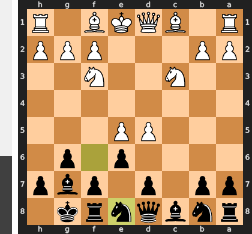

This move is a grave positional error because it passively cedes control of the center instead of challenging White's intrusive d5-pawn. This retreat gives White a free hand to play the crushing `d6!`, which entombs your g7-bishop and permanently strangles your position for space. Instead, the active `...Nxd5` was necessary to eliminate White's central wedge, immediately liberating your powerful fianchettoed bishop and resolving all your strategic problems.

### Move 9 (White): d6 - Mistake ❓

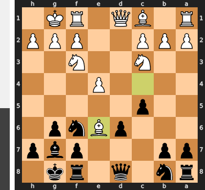

This ambitious push mistakes an advanced pawn for a strong one, prematurely releasing all the central tension that was suffocating Black's position. The d6-pawn is now not a strength but a chronic weakness, and Black's thematic counter-blow with ...f6 will both undermine your e5-pawn and create a perfect blockade. You have traded a dynamic space advantage for a static target, handing the initiative to your opponent.

### Move 9 (Black): Nc6 - Best Move ✅

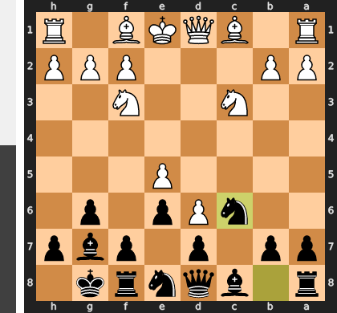

Played **Nc6**.

### Move 10 (White): Bf4 - Best Move ✅

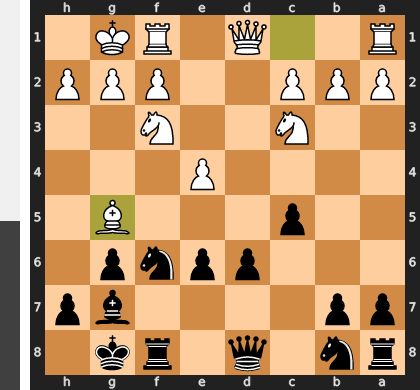

Played **Bf4**.

### Move 10 (Black): b5 - Mistake ❓

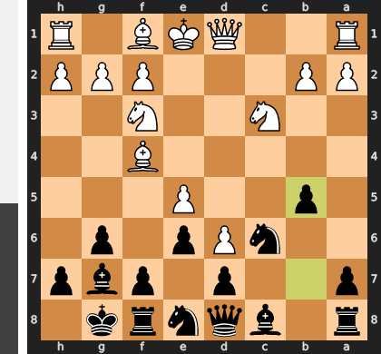

While this ambitious push `...b5` seeks queenside space, it is a grave positional error that fatally weakens the `c6` knight. By moving the b-pawn, you have removed its only defender against my menacing bishop on f4, inviting a capture with `Bxc6` that would shatter your pawn structure. Instead of creating counterplay, this move has given me a clear and powerful plan to attack your newly created weaknesses on the queenside, starting with the now-vulnerable `c6`-pawn.

### Move 11 (White): Bxb5 - Best Move ✅

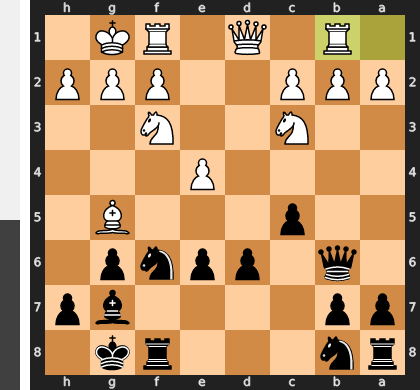

Played **Bxb5**.

### Move 11 (Black): Rb8 - Mistake ❓

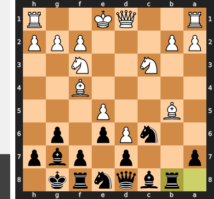

This move is a grave error because it removes the rook as a key defender of the c6-knight, which is the lynchpin holding Black's precarious central defense together. This allows White to immediately execute the devastating exchange Bxc6, after which the chronically weak d7-pawn becomes indefensible and simply falls. Black has fatally neglected the immediate central crisis in favor of a slow queenside plan, leading to a material and positional collapse.

### Move 12 (White): Be2 - Blunder ❌

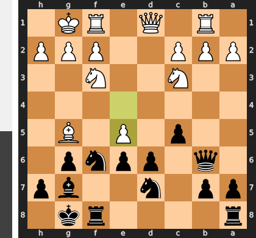

White's entire advantage was based on the bishop on f4, which, in concert with the d6-pawn, paralyzed Black's position by targeting the critical c6-knight. The passive retreat Be2 criminally abandons this pressure, and worse, it now allows Black the thematic and liberating ...f5 pawn break. This single move transforms Black's cramped and passive pieces into active attackers, completely dissolving White's central control and seizing the initiative.

### Move 12 (Black): Rxb2 - Good 👍

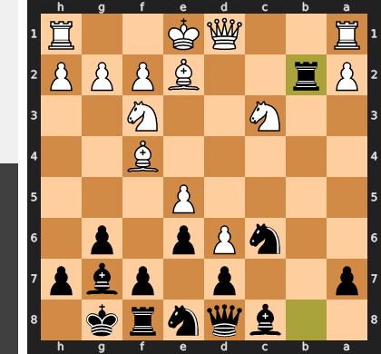

Played **Rxb2**. The engine recommended **Qa5**.

### Move 13 (White): O-O - Best Move ✅

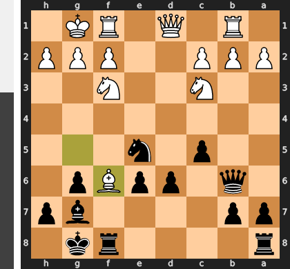

Played **O-O**.

### Move 13 (Black): f6 - Good 👍

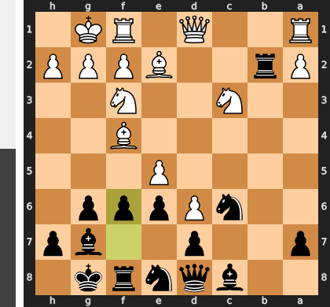

Played **f6**. The engine recommended **Rb4**.

### Move 14 (White): Bb5 - Inaccuracy ⁈

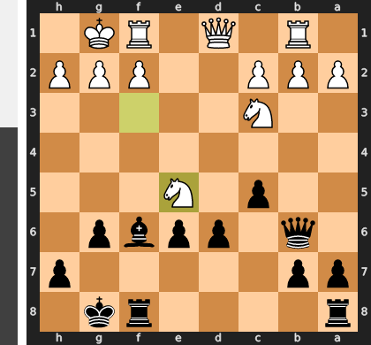

Played **Bb5**. The engine recommended **Rb1**.

### Move 14 (Black): fxe5 - Good 👍

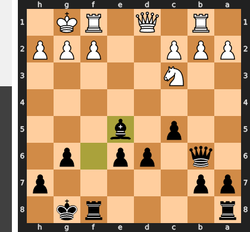

Played **fxe5**. The engine recommended **Nxe5**.

### Move 15 (White): Bg5 - Best Move ✅

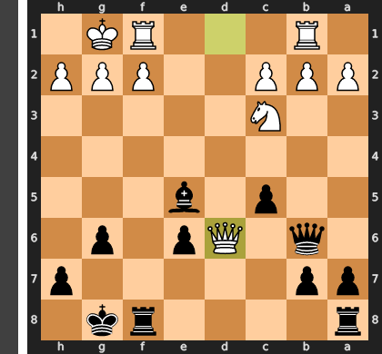

Played **Bg5**.

### Move 15 (Black): Bf6 - Mistake ❓

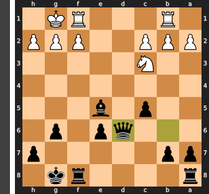

This move unwisely invites a trade on f6 that plays directly into White's hands. After the inevitable Bxf6, Black is forced to either shatter their kingside pawn cover with ...gxf6 or cede crucial control over the monstrous d6-pawn by recapturing with the knight. The correct path was Qb6, creating immediate counter-pressure against the b5-bishop and central bind, rather than voluntarily resolving the tension in White's favor.

### Move 16 (White): Na4 - Blunder ❌

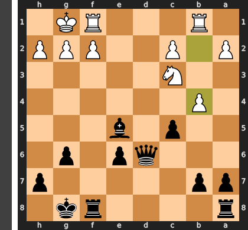

The move Na4 is a grave positional misjudgment that creates an immediate tactical catastrophe. By shifting the knight from its crucial central post on c3, White removes the sole defender of the b5-bishop, inviting Black to decisively refute the move with the sacrifice `...Nxd6!`. After the forced `cxd6`, the devastating `...Rxb5!` simply wins a key piece, dismantling White's entire strategic setup and leaving Black with a winning position.

### Move 16 (Black): Bxg5 - Blunder ❌

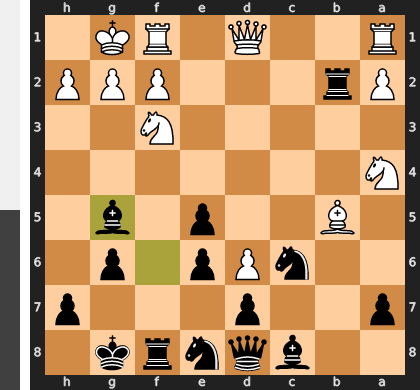

Black's blunder stems from a fatal misdiagnosis of the position; the true problem piece was White's bishop on b5, not the knight on f3. The winning move, Rxb5, was a brilliant exchange sacrifice that would have eliminated the crippling pin on the c6-knight, unleashing Black's pieces for a decisive assault. Instead, Bxg5 leaves White's most dangerous piece on the board and, by trading, invites the white knight to the powerful g5-square, completely squandering the initiative and turning a winning attack into a difficult defense.

### Move 17 (White): Nxb2 - Best Move ✅

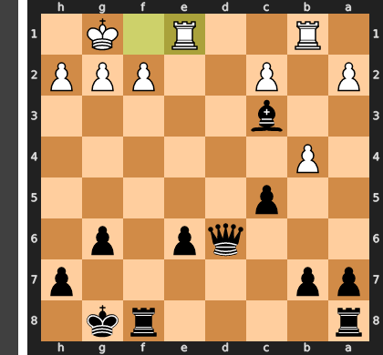

Played **Nxb2**.

