# Chess Game Analysis: kasparov77i vs kar2on

- **Result:** 1-0
- **Date:** 2026.04.04
- **Opening:** Pirc Defense Classical Variation...5.Bc4 O O 6.O O c6

### Move 1 (White): e4 - Best Move ✅

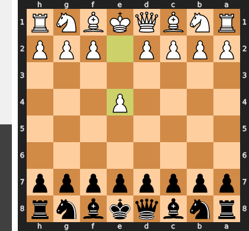

Played **e4**.

### Move 1 (Black): d6 - Good 👍

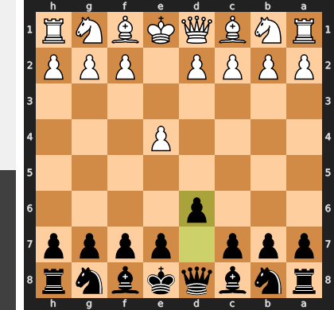

Played **d6**. The engine recommended **e5**.

### Move 2 (White): Nf3 - Good 👍

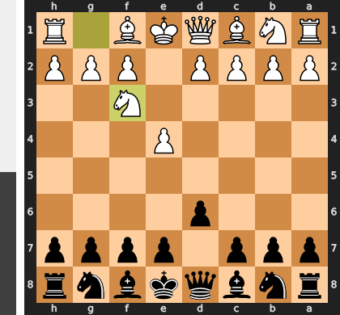

Played **Nf3**. The engine recommended **d4**.

### Move 2 (Black): Nf6 - Best Move ✅

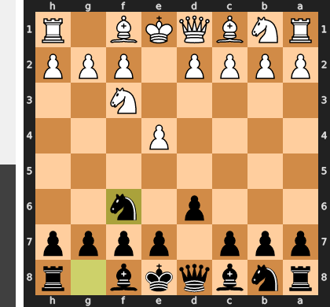

Played **Nf6**.

### Move 3 (White): Nc3 - Best Move ✅

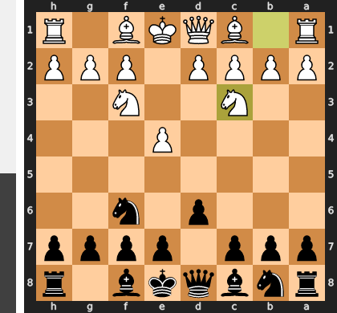

Played **Nc3**.

### Move 3 (Black): g6 - Good 👍

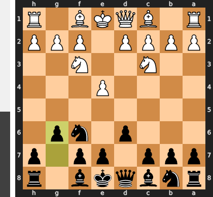

Played **g6**. The engine recommended **c5**.

### Move 4 (White): Bc4 - Good 👍

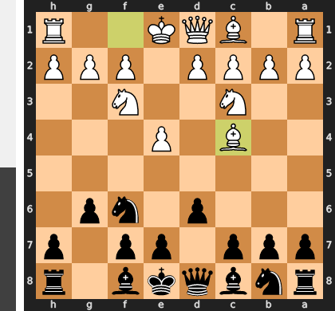

Played **Bc4**. The engine recommended **d4**.

### Move 4 (Black): Bg7 - Best Move ✅

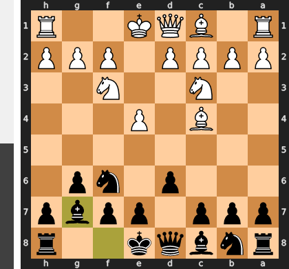

Played **Bg7**.

### Move 5 (White): d4 - Best Move ✅

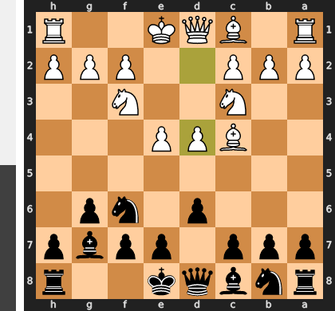

Played **d4**.

### Move 5 (Black): c6 - Good 👍

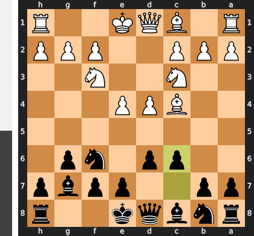

Played **c6**. The engine recommended **O-O**.

### Move 6 (White): O-O - Good 👍

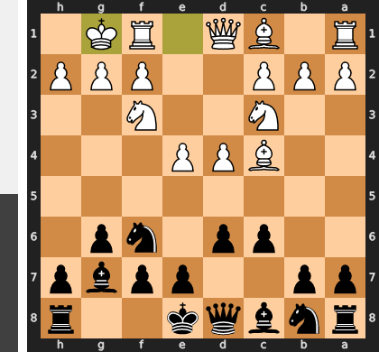

Played **O-O**. The engine recommended **Bb3**.

### Move 6 (Black): O-O - Good 👍

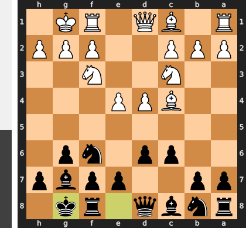

Played **O-O**. The engine recommended **d5**.

### Move 7 (White): Bg5 - Inaccuracy ⁈

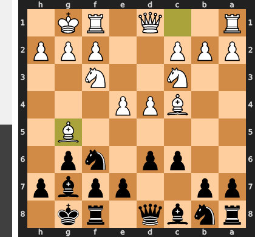

Played **Bg5**. The engine recommended **e5**.

### Move 7 (Black): Be6 - Mistake ❓

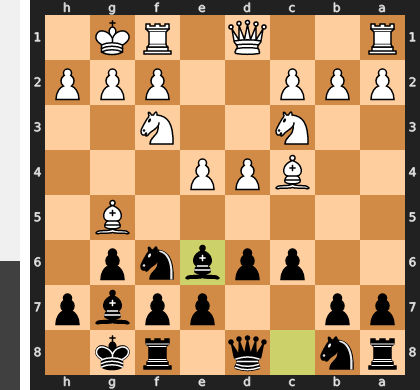

This move is a grave positional error, as it voluntarily trades a passive problem piece (the e6-bishop) for White's most active minor piece (the c4-bishop). After the simple exchange with Bxe6, Black's pawn structure is permanently shattered, creating a weak pawn on e6 and a backward pawn on d6 which will be targets for the rest of the game. Instead, ...b5 would have fought for initiative by kicking the c4-bishop and creating queenside counterplay without incurring such ruinous long-term damage.

### Move 8 (White): Bxe6 - Best Move ✅

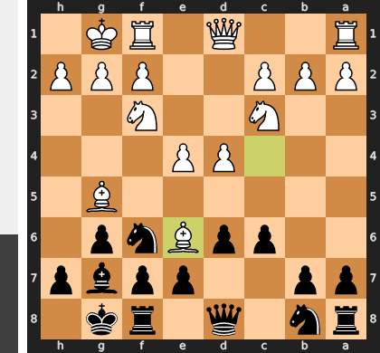

Played **Bxe6**.

### Move 8 (Black): fxe6 - Best Move ✅

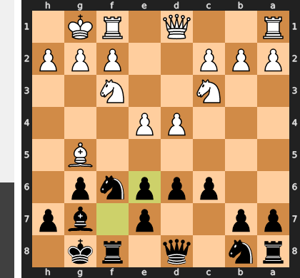

Played **fxe6**.

### Move 9 (White): Qd2 - Good 👍

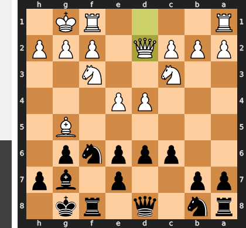

Played **Qd2**. The engine recommended **e5**.

### Move 9 (Black): e5 - Good 👍

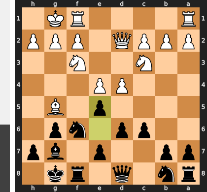

Played **e5**. The engine recommended **Nbd7**.

### Move 10 (White): Bh6 - Inaccuracy ⁈

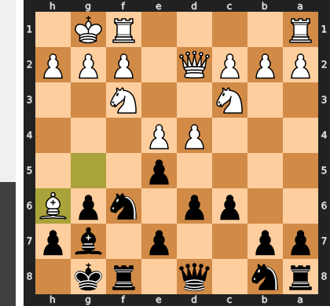

Played **Bh6**. The engine recommended **dxe5**.

### Move 10 (Black): exd4 - Good 👍

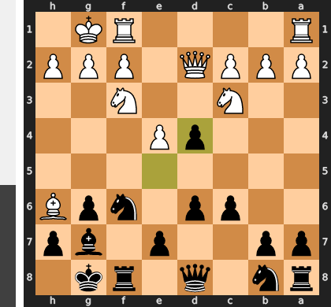

Played **exd4**. The engine recommended **Bxh6**.

### Move 11 (White): Nxd4 - Best Move ✅

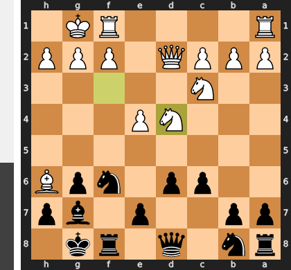

Played **Nxd4**.

### Move 11 (Black): Qb6 - Mistake ❓

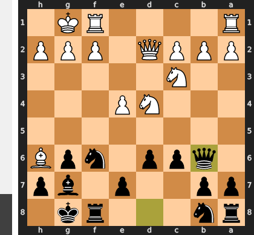

This move is a fatal misjudgment of the position's demands, as Black shifts the queen from a vital defensive post to an irrelevant square in pursuit of the trivial b2-pawn. This tragically ignores the brewing kingside storm, giving White a free hand to immediately crash through with the sequence starting with `Bxg7` and the crushing `Nf5+`, which rips open the king's defenses. The correct `...Qd7` would have kept the queen central to consolidate and prepare to neutralize White's dangerous bishop.

### Move 12 (White): Bxg7 - Best Move ✅

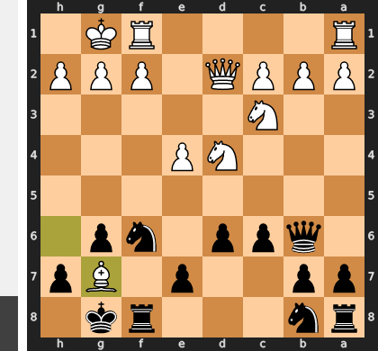

Played **Bxg7**.

### Move 12 (Black): Kxg7 - Best Move ✅

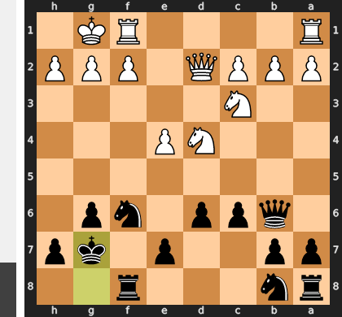

Played **Kxg7**.

### Move 13 (White): Ne6+ - Best Move ✅

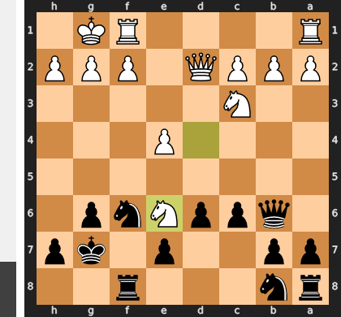

Played **Ne6+**.

### Move 13 (Black): Kf7 - Best Move ✅

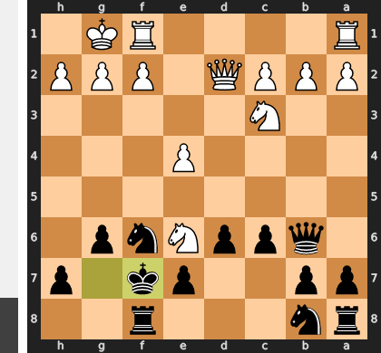

Played **Kf7**.

### Move 14 (White): Nxf8 - Best Move ✅

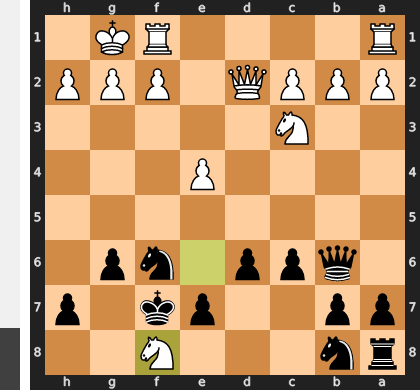

Played **Nxf8**.

### Move 14 (Black): Kxf8 - Best Move ✅

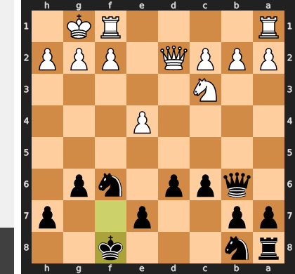

Played **Kxf8**.

### Move 15 (White): Rfe1 - Good 👍

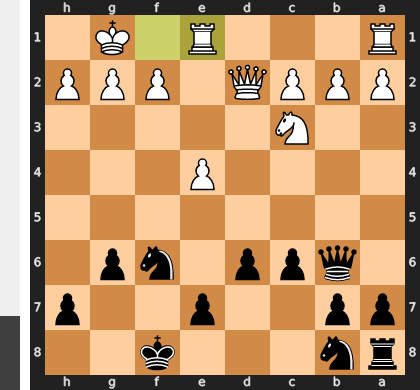

Played **Rfe1**. The engine recommended **Na4**.

### Move 15 (Black): Qxb2 - Mistake ❓

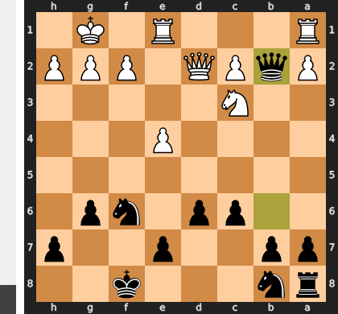

This materialistic capture is a classic mistake of greed, dangerously sidelining the queen and neglecting the urgent need for development and central control. White will now immediately punish this with Rab1, turning the queen into a target and using the gained tempo to prepare a decisive central break with e5. The correct move, ...Nbd7, was essential to solidify the position and contest the center, preventing the very plan White can now execute with devastating effect.

### Move 16 (White): Rab1 - Best Move ✅

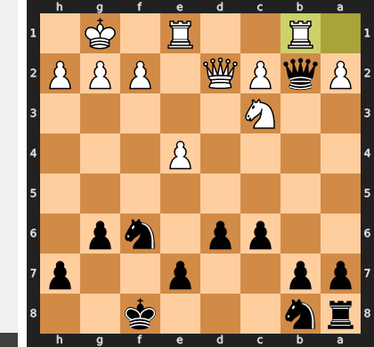

Played **Rab1**.

### Move 16 (Black): Qa3 - Best Move ✅

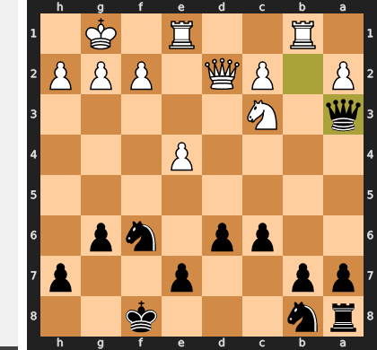

Played **Qa3**.

### Move 17 (White): Rxb7 - Mistake ❓

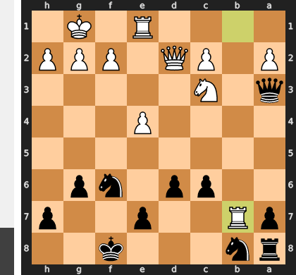

White mistakenly cashed in on a dominant strategic advantage for a small material gain. The rook on b7 was a paralyzing force that single-handedly suffocated Black's entire queenside, but by capturing the pawn, this pressure is released. The superior move e5 would have maintained this bind while simultaneously launching a decisive central assault on the f6-knight, forcing Black to collapse under the pressure on two fronts.

### Move 17 (Black): Nbd7 - Best Move ✅

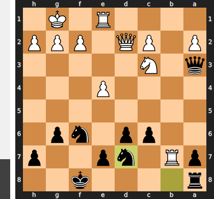

Played **Nbd7**.

### Move 18 (White): e5 - Best Move ✅

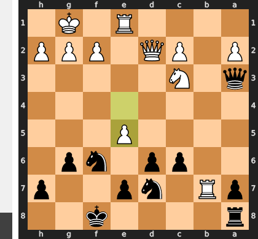

Played **e5**.

### Move 18 (Black): Nxe5 - Good 👍

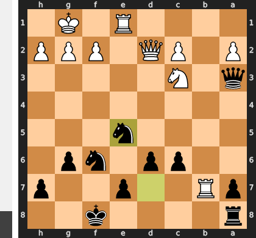

Played **Nxe5**. The engine recommended **dxe5**.

### Move 19 (White): Rxe5 - Blunder ❌

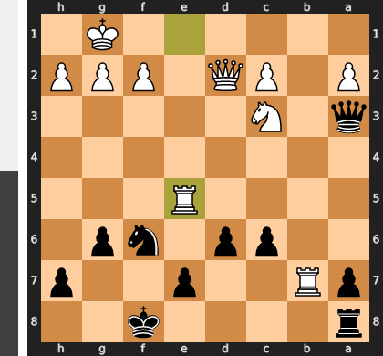

This move was a blunder because it liquidates your primary strategic advantage—the paralyzing rook on the 7th rank—for a single pawn. After Black's simple reply ...dxe5, the once-mighty b7-rook is now a target for the queen, forcing a passive retreat and allowing Black to completely untangle and equalize. Instead of building pressure on Black's weak king and d6-pawn with Ne4, you have released all the tension and forfeited your winning position.

### Move 19 (Black): dxe5 - Best Move ✅

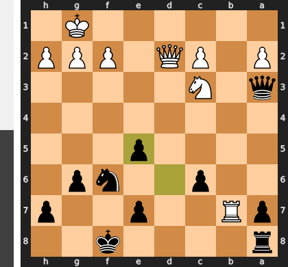

Played **dxe5**.

### Move 20 (White): Qd3 - Good 👍

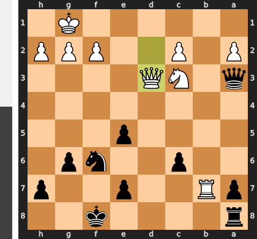

Played **Qd3**. The engine recommended **Qe3**.

### Move 20 (Black): Nd5 - Best Move ✅

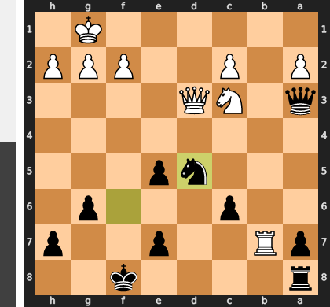

Played **Nd5**.

### Move 21 (White): Rb3 - Mistake ❓

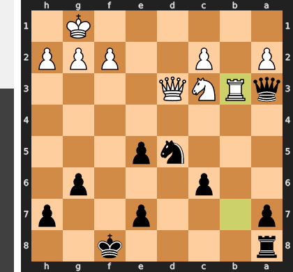

White fatally misjudged the critical defender in the position, believing the rook on c3 to be a target rather than a vital guard. By moving it, White voluntarily abandoned the c2-pawn, allowing Black to land the decisive tactical blow ...Nxc2. This simple capture shatters White's defensive structure, winning material and exposing the back rank to an unstoppable attack.

### Move 21 (Black): Qd6 - Mistake ❓

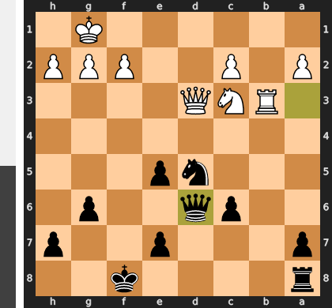

The move ...Qd6 is a positional decision in a moment that demanded a tactical kill-shot, completely overlooking the vulnerability of the White king. The winning move was ...Qc1+, forcing Kh2, followed by the crushing ...Nf4, which creates an unstoppable dual threat of checkmate on h1 and an attack on the white queen. By playing the placid ...Qd6, Black gives White a critical tempo to play Ne2, neutralizing the dominant d5-knight and escaping into a roughly equal endgame where all of Black's advantage has vanished.

### Move 22 (White): Nxd5 - Inaccuracy ⁈

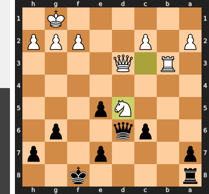

Played **Nxd5**. The engine recommended **Ne4**.

### Move 22 (Black): cxd5 - Best Move ✅

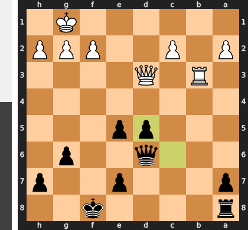

Played **cxd5**.

### Move 23 (White): g3 - Good 👍

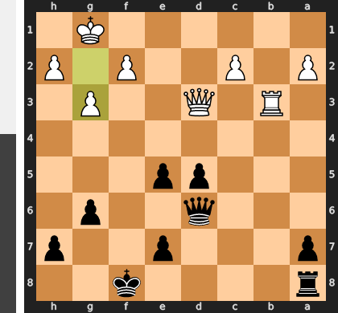

Played **g3**. The engine recommended **h4**.

### Move 23 (Black): Rd8 - Good 👍

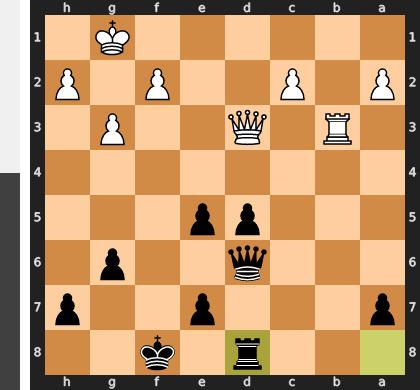

Played **Rd8**. The engine recommended **Rc8**.

### Move 24 (White): Qf3+ - Good 👍

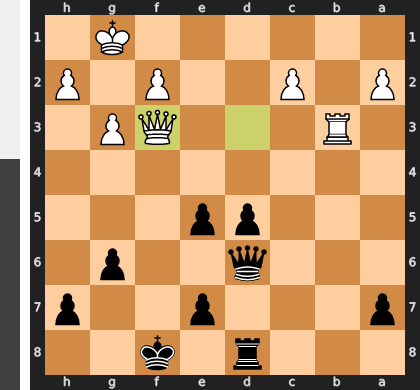

Played **Qf3+**. The engine recommended **h4**.

### Move 24 (Black): Qf6 - Good 👍

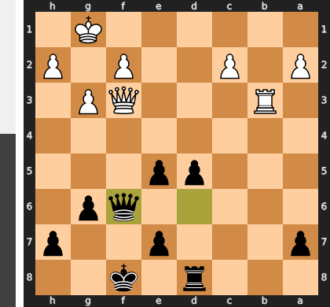

Played **Qf6**. The engine recommended **Kg7**.

### Move 25 (White): Qxf6+ - Mistake ❓

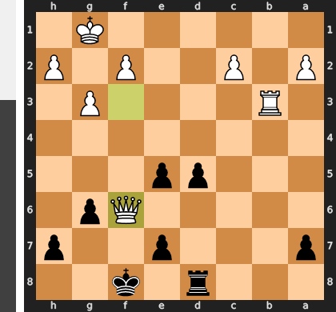

This trade is a grave positional error, as it willingly liquidates into a Rook endgame where Black's powerful, connected central pawns become the decisive factor. White's Queen was the only piece capable of restraining those pawns and creating counterplay; without her, the lone Rook is simply overwhelmed by Black's advancing pawn mass and active King.

### Move 25 (Black): exf6 - Best Move ✅

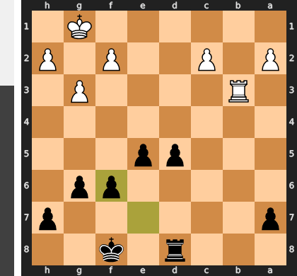

Played **exf6**.

### Move 26 (White): Rb7 - Good 👍

Played **Rb7**. The engine recommended **c3**.

### Move 26 (Black): Rc8 - Best Move ✅

Played **Rc8**.

### Move 27 (White): Rxa7 - Good 👍

Played **Rxa7**. The engine recommended **Rxh7**.

### Move 27 (Black): Rxc2 - Good 👍

Played **Rxc2**. The engine recommended **d4**.

### Move 28 (White): Rxh7 - Best Move ✅

Played **Rxh7**.

### Move 28 (Black): Rxa2 - Good 👍

Played **Rxa2**. The engine recommended **Ke8**.

### Move 29 (White): Rd7 - Best Move ✅

Played **Rd7**.

### Move 29 (Black): d4 - Best Move ✅

Played **d4**.

### Move 30 (White): Rd6 - Mistake ❓

This move misidentifies the critical struggle; attacking the f6-pawn is a sideshow compared to the impending activation of Black's king. Rd6 allows Black to centralize his king with tempo via ...Ke7, which not only defends the pawn but also turns the White rook into a target and prepares to support the unstoppable advance of the d-pawn. The correct plan was the prophylactic h4, creating vital breathing room for the White king and challenging Black's suffocating control of the second rank.

### Move 30 (Black): Ke7 - Best Move ✅

Played **Ke7**.

### Move 31 (White): Rd5 - Best Move ✅

Played **Rd5**.

### Move 31 (Black): Ra3 - Inaccuracy ⁈

Played **Ra3**. The engine recommended **Ke6**.

### Move 32 (White): Kf1 - Good 👍

Played **Kf1**. The engine recommended **h4**.

### Move 32 (Black): Ke6 - Good 👍

Played **Ke6**. The engine recommended **Ra8**.

### Move 33 (White): Rd8 - Best Move ✅

Played **Rd8**.

### Move 33 (Black): Ra2 - Inaccuracy ⁈

Played **Ra2**. The engine recommended **Ke7**.

### Move 34 (White): h4 - Best Move ✅

Played **h4**.

### Move 34 (Black): Kf5 - Good 👍

Played **Kf5**. The engine recommended **Ke7**.

### Move 35 (White): Rf8 - Inaccuracy ⁈

Played **Rf8**. The engine recommended **Kg1**.

### Move 35 (Black): d3 - Best Move ✅

Played **d3**.

### Move 36 (White): Ke1 - Inaccuracy ⁈

Played **Ke1**. The engine recommended **Rd8**.

### Move 36 (Black): e4 - Best Move ✅

Played **e4**.

### Move 37 (White): g4+ - Best Move ✅

Played **g4+**.

### Move 37 (Black): Kxg4 - Blunder ❌

By capturing the h-pawn, the king abandons its crucial duty of supporting the central passed pawns from the safety of the e-file. This greedy move fatally exposes the king on the g-file, allowing White's rook to initiate a devastating series of checks from the side to force a draw. Instead of being the key attacking piece escorting its pawns, the king has now become the sole target, completely squandering the win.

### Move 38 (White): Rxf6 - Best Move ✅

Played **Rxf6**.

### Move 38 (Black): d2+ - Inaccuracy ⁈

Played **d2+**. The engine recommended **Ra1+**.

### Move 39 (White): Kd1 - Best Move ✅

Played **Kd1**.

### Move 39 (Black): Kxh4 - Good 👍

Played **Kxh4**. The engine recommended **Kh5**.

### Move 40 (White): Rxg6 - Best Move ✅

Played **Rxg6**.

### Move 40 (Black): Kh5 - Best Move ✅

Played **Kh5**.

### Move 41 (White): Rg3 - Good 👍

Played **Rg3**. The engine recommended **Rg7**.

### Move 41 (Black): Kh4 - Good 👍

Played **Kh4**. The engine recommended **Rb2**.

### Move 42 (White): Rg8 - Good 👍

Played **Rg8**. The engine recommended **Rg7**.

