# Chess Game Analysis: Abo-ja3far vs kar2on

- **Result:** 0-1
- **Date:** 2026.04.04
- **Opening:** Modern Defense with 1 e4 2.d4 d6 3.Nf3 Nf6

### Move 1 (White): e4 - Best Move ✅

Played **e4**.

### Move 1 (Black): d6 - Good 👍

Played **d6**. The engine recommended **e5**.

### Move 2 (White): Nf3 - Good 👍

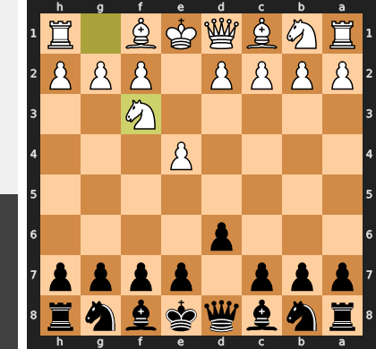

Played **Nf3**. The engine recommended **d4**.

### Move 2 (Black): Nf6 - Best Move ✅

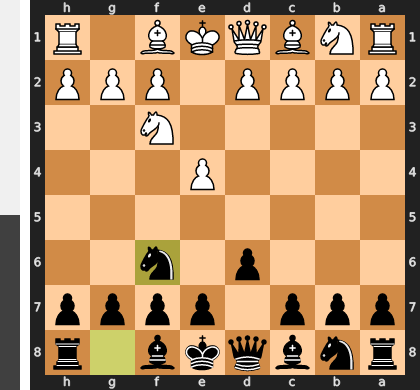

Played **Nf6**.

### Move 3 (White): d4 - Mistake ❓

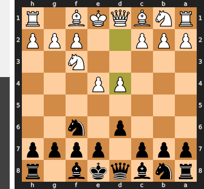

This ambitious central push with d4 is a positional error because it completely ignores Black's immediate threat against the undefended e4-pawn. Black can now seize the initiative with the simple 3...Nxe4, forcing a sequence of trades that activates their pieces and dissolves White's central pawn duo. Instead of fighting for an advantage, White is now forced into a slightly worse, passive position, struggling to prove the d-pawn's advance was justified.

### Move 3 (Black): g6 - Mistake ❓

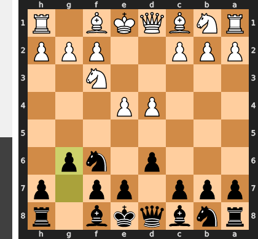

This is a classic case of missing a fleeting tactical window; while g6 is a standard thematic move, it was far too passive in this specific position. The critical move Nxe4 would have immediately exploited White's setup to liquidate the e4-pawn, seizing the initiative and equalizing completely. By allowing White to now play a simple consolidating move like Nc3, Black has forfeited their chance to challenge the center and is now relegated to a cramped and purely defensive game with a significant space disadvantage.

### Move 4 (White): e5 - Inaccuracy ⁈

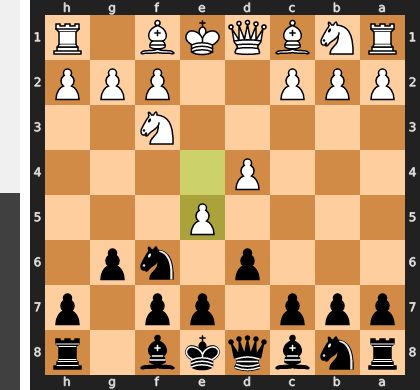

Played **e5**. The engine recommended **Nc3**.

### Move 4 (Black): dxe5 - Best Move ✅

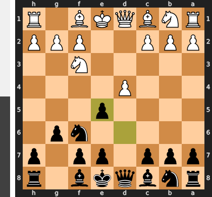

Played **dxe5**.

### Move 5 (White): dxe5 - Inaccuracy ⁈

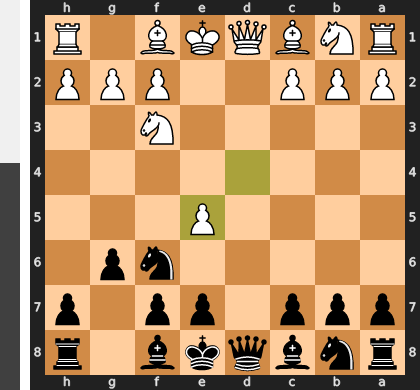

Played **dxe5**. The engine recommended **Nxe5**.

### Move 5 (Black): Qxd1+ - Best Move ✅

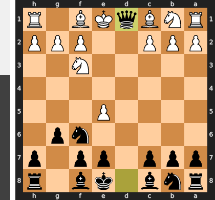

Played **Qxd1+**.

### Move 6 (White): Kxd1 - Best Move ✅

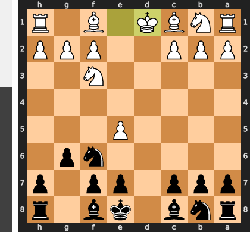

Played **Kxd1**.

### Move 6 (Black): Ng4 - Best Move ✅

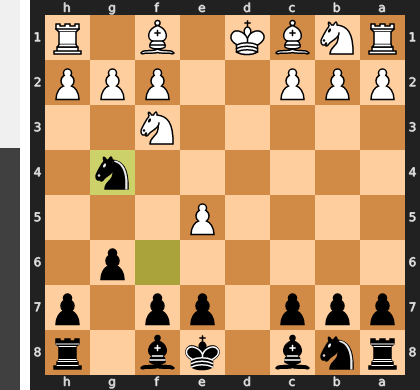

Played **Ng4**.

### Move 7 (White): Ke1 - Best Move ✅

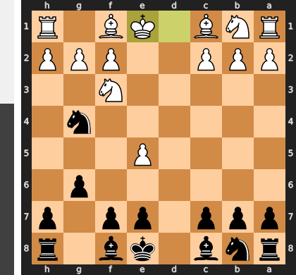

Played **Ke1**.

### Move 7 (Black): Bg7 - Best Move ✅

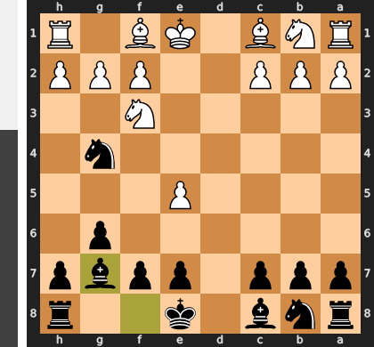

Played **Bg7**.

### Move 8 (White): h3 - Good 👍

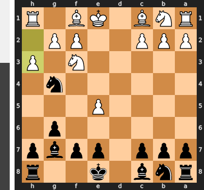

Played **h3**. The engine recommended **Bf4**.

### Move 8 (Black): Nxe5 - Best Move ✅

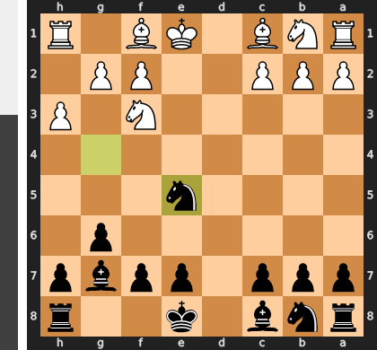

Played **Nxe5**.

### Move 9 (White): Nxe5 - Best Move ✅

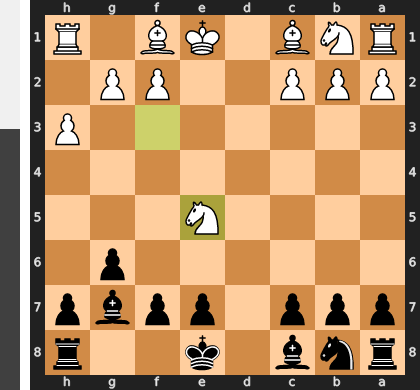

Played **Nxe5**.

### Move 9 (Black): Bxe5 - Best Move ✅

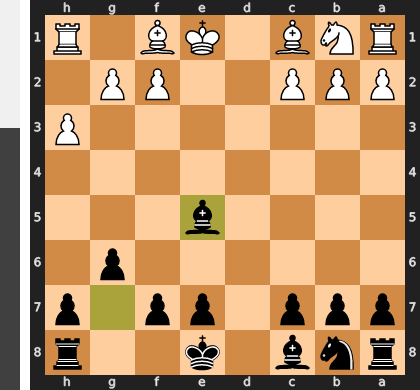

Played **Bxe5**.

### Move 10 (White): Nc3 - Good 👍

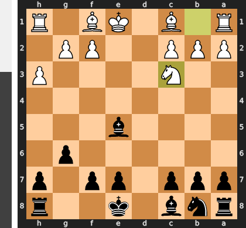

Played **Nc3**. The engine recommended **c3**.

### Move 10 (Black): Bf5 - Best Move ✅

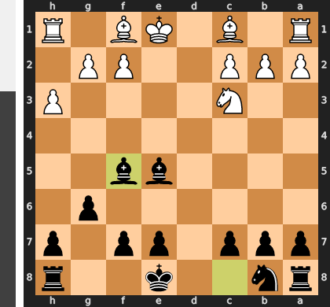

Played **Bf5**.

### Move 11 (White): f4 - Good 👍

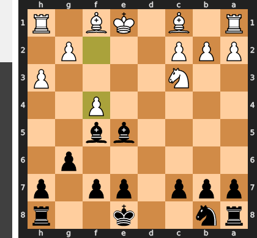

Played **f4**. The engine recommended **g4**.

### Move 11 (Black): Bg7 - Inaccuracy ⁈

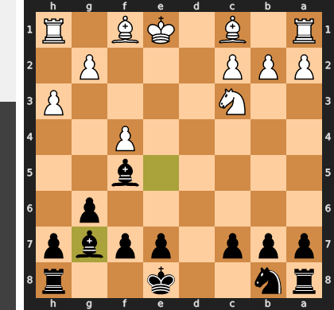

Played **Bg7**. The engine recommended **Bxc3+**.

### Move 12 (White): Bd3 - Mistake ❓

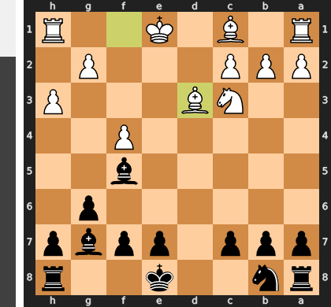

This routine developing move is a grave positional mistake because it is far too passive and turns the bishop into a target. Instead of fighting for the initiative with the active Nd5, White allows Black to play ...Bxd3; after the forced recapture cxd3, White's pawn structure is shattered, leaving a permanent weakness on d3 and, more importantly, creating a gaping hole on the d4-square which a Black knight will soon dominate.

### Move 12 (Black): Bxd3 - Best Move ✅

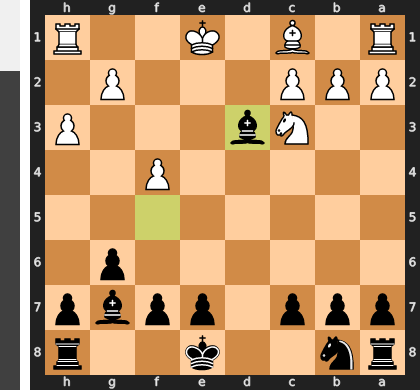

Played **Bxd3**.

### Move 13 (White): cxd3 - Best Move ✅

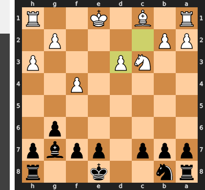

Played **cxd3**.

### Move 13 (Black): Nc6 - Best Move ✅

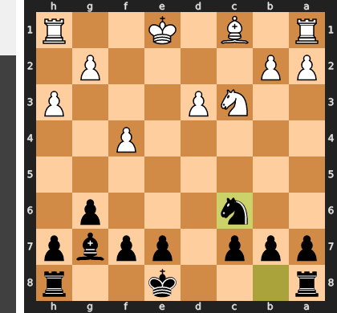

Played **Nc6**.

### Move 14 (White): Nb5 - Inaccuracy ⁈

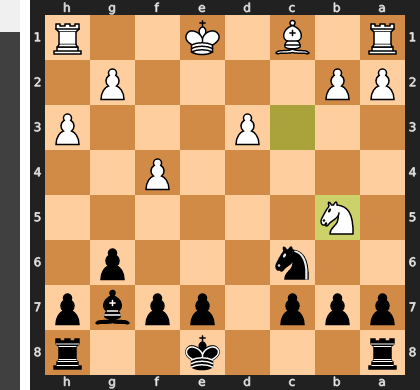

Played **Nb5**. The engine recommended **Be3**.

### Move 14 (Black): O-O-O - Best Move ✅

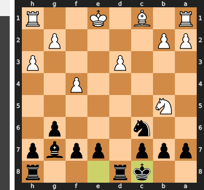

Played **O-O-O**.

### Move 15 (White): Be3 - Inaccuracy ⁈

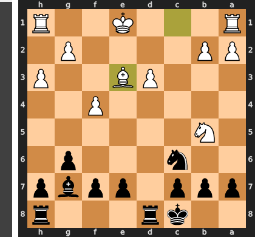

Played **Be3**. The engine recommended **Ke2**.

### Move 15 (Black): a6 - Best Move ✅

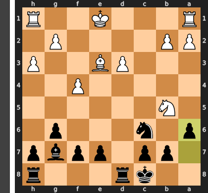

Played **a6**.

### Move 16 (White): Nd4 - Mistake ❓

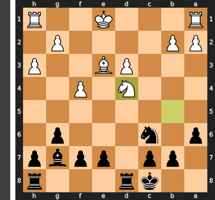

This move is a grave tactical error, as it invites Black to trade on d4, which only serves to open critical lines for Black's better-developed pieces. After the inevitable ...Nxd4 Bxd4, Black's rook seizes the newly opened file with ...Rxd4, creating a dominating central outpost. This powerful rook, combined with the immense pressure from the g7-bishop, creates an overwhelming and decisive attack against White's vulnerable king.

### Move 16 (Black): Bxd4 - Best Move ✅

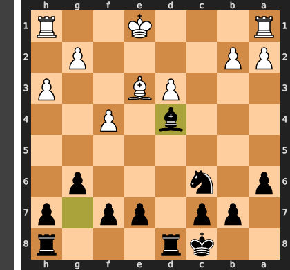

Played **Bxd4**.

