# Chess Game Analysis: jordirules123 vs kar2on

- **Result:** 1-0
- **Date:** 2026.04.04
- **Opening:** Pirc Defense Classical Variation 4...Bg7 5.Bc4 O O 6.O O

### Move 1 (White): e4 - Best Move ✅

Played **e4**.

### Move 1 (Black): d6 - Good 👍

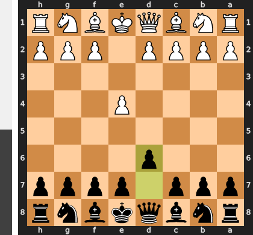

Played **d6**. The engine recommended **e5**.

### Move 2 (White): Bc4 - Inaccuracy ⁈

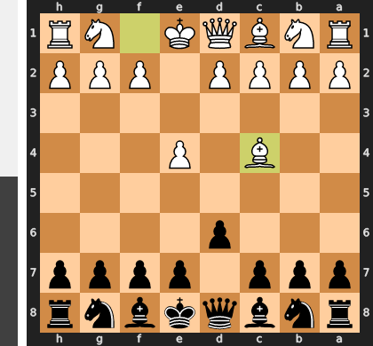

Played **Bc4**. The engine recommended **d4**.

### Move 2 (Black): Nf6 - Best Move ✅

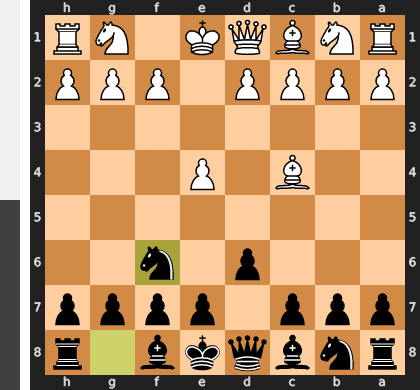

Played **Nf6**.

### Move 3 (White): Nc3 - Best Move ✅

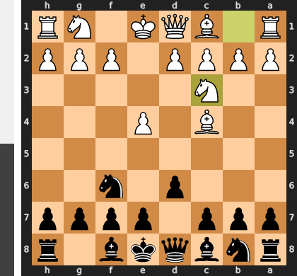

Played **Nc3**.

### Move 3 (Black): g6 - Good 👍

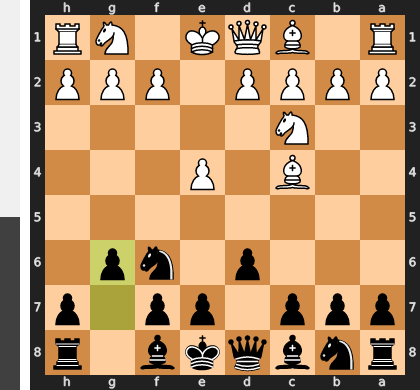

Played **g6**. The engine recommended **c5**.

### Move 4 (White): Nf3 - Best Move ✅

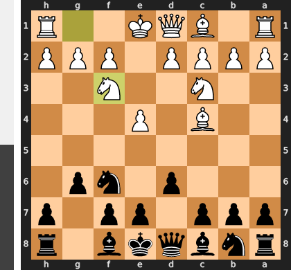

Played **Nf3**.

### Move 4 (Black): Bg7 - Best Move ✅

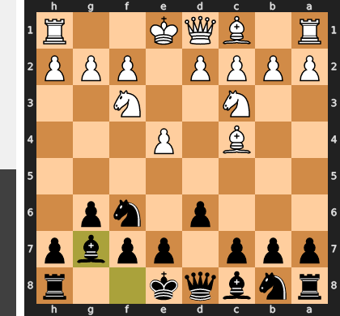

Played **Bg7**.

### Move 5 (White): O-O - Good 👍

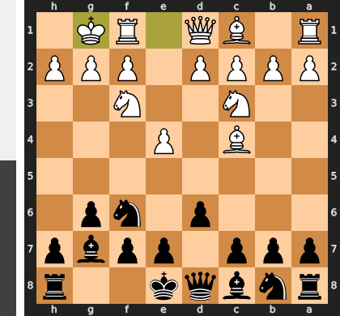

Played **O-O**. The engine recommended **d4**.

### Move 5 (Black): O-O - Good 👍

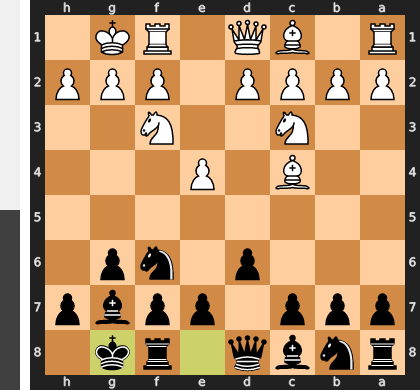

Played **O-O**. The engine recommended **c5**.

### Move 6 (White): d4 - Best Move ✅

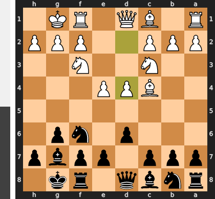

Played **d4**.

### Move 6 (Black): e6 - Inaccuracy ⁈

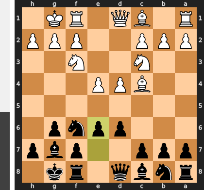

Played **e6**. The engine recommended **Nxe4**.

### Move 7 (White): Bg5 - Good 👍

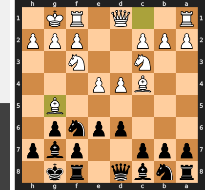

Played **Bg5**. The engine recommended **Qe2**.

### Move 7 (Black): c6 - Inaccuracy ⁈

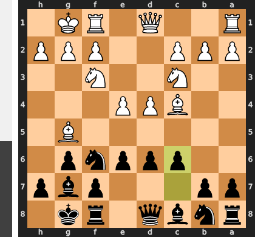

Played **c6**. The engine recommended **h6**.

### Move 8 (White): e5 - Good 👍

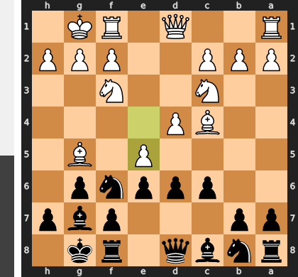

Played **e5**. The engine recommended **Re1**.

### Move 8 (Black): dxe5 - Best Move ✅

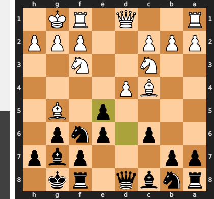

Played **dxe5**.

### Move 9 (White): dxe5 - Good 👍

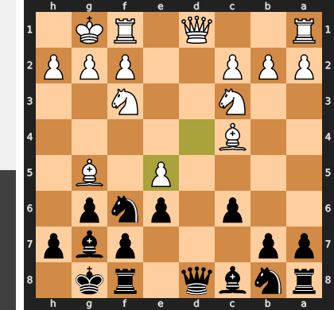

Played **dxe5**. The engine recommended **Nxe5**.

