# Chess Game Analysis: vkuijs vs kar2on

- **Result:** 1-0
- **Date:** 2026.04.04
- **Opening:** Old Indian Defense 3.Nf3 g6

### Move 1 (White): d4 - Good 👍

Played **d4**. The engine recommended **e4**.

### Move 1 (Black): d6 - Good 👍

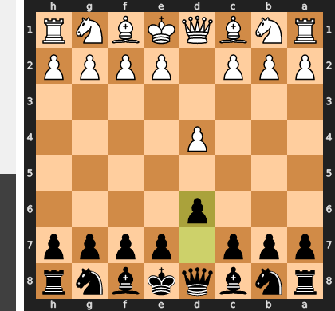

Played **d6**. The engine recommended **d5**.

### Move 2 (White): c4 - Good 👍

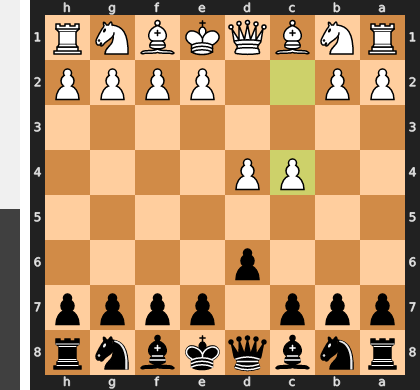

Played **c4**. The engine recommended **e4**.

### Move 2 (Black): Nf6 - Good 👍

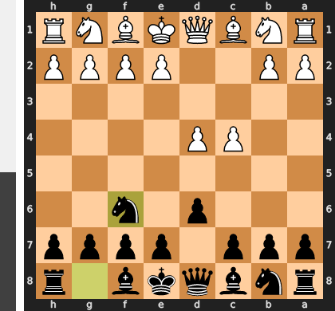

Played **Nf6**. The engine recommended **e5**.

### Move 3 (White): Nf3 - Best Move ✅

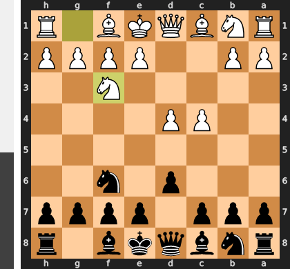

Played **Nf3**.

### Move 3 (Black): g6 - Best Move ✅

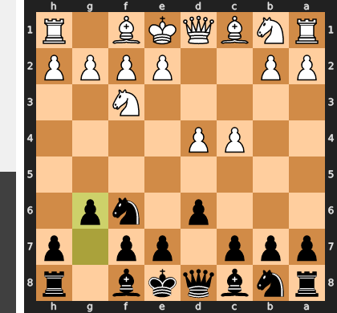

Played **g6**.

### Move 4 (White): e3 - Good 👍

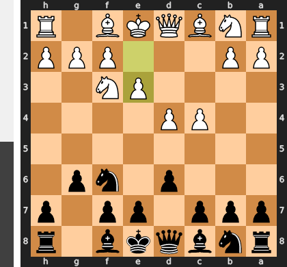

Played **e3**. The engine recommended **Nc3**.

### Move 4 (Black): Bg7 - Best Move ✅

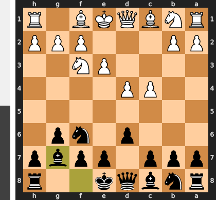

Played **Bg7**.

### Move 5 (White): Nbd2 - Inaccuracy ⁈

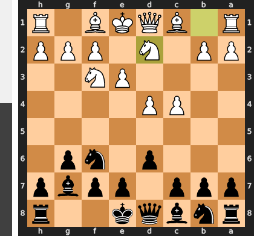

Played **Nbd2**. The engine recommended **Nc3**.

### Move 5 (Black): O-O - Good 👍

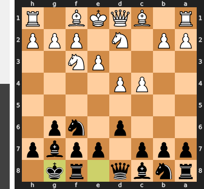

Played **O-O**. The engine recommended **e5**.

### Move 6 (White): Bd3 - Good 👍

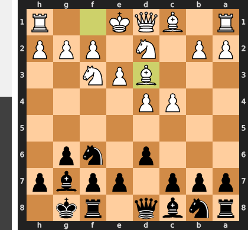

Played **Bd3**. The engine recommended **b4**.

### Move 6 (Black): c5 - Good 👍

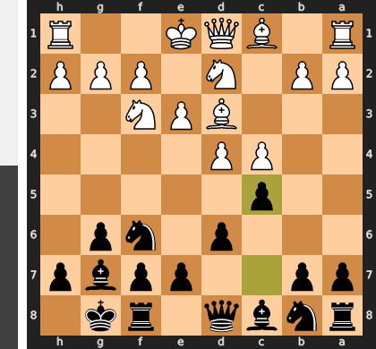

Played **c5**. The engine recommended **e5**.

### Move 7 (White): d5 - Good 👍

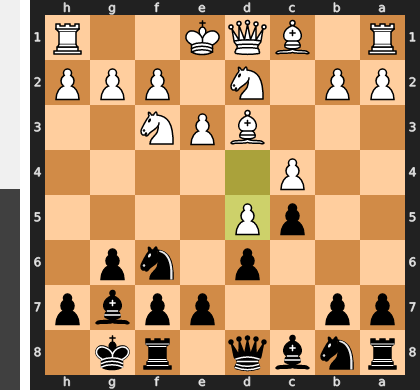

Played **d5**. The engine recommended **O-O**.

### Move 7 (Black): e6 - Good 👍

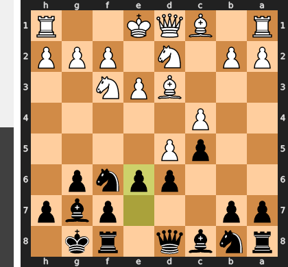

Played **e6**. The engine recommended **b5**.

### Move 8 (White): Rb1 - Mistake ❓

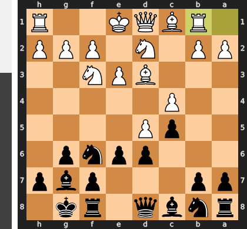

Rb1 is a passive move that completely misunderstands the central tension and cedes the initiative. By failing to play the critical e4, which would have blunted Black's powerful fianchettoed bishop and solidified the d5-pawn, White now invites the crushing ...exd5 break. This allows Black's pieces, particularly the knight and g7-bishop, to flood into the newly opened center and seize a decisive advantage.

### Move 8 (Black): Bd7 - Mistake ❓

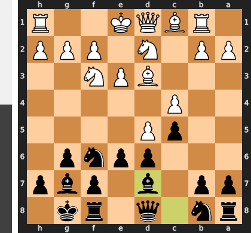

By playing the passive developing move ...Bd7, Black misses the critical moment to resolve the central tension in his favor. This allows White to play e3, cementing the d5-pawn as a formidable space-gaining asset and neutralizing Black's counterplay. The correct ...exd5, followed by ...Re8, would have immediately opened the e-file and transformed the very same d5-pawn from White's strength into a chronic, attackable weakness.

### Move 9 (White): e4 - Inaccuracy ⁈

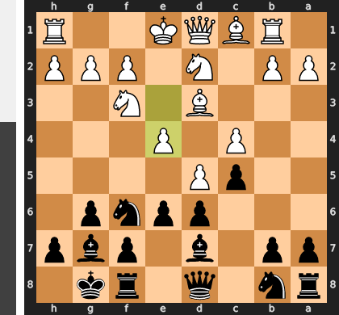

Played **e4**. The engine recommended **dxe6**.

### Move 9 (Black): exd5 - Best Move ✅

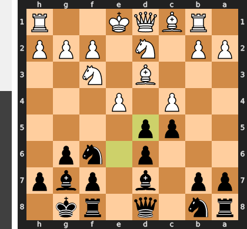

Played **exd5**.

### Move 10 (White): cxd5 - Best Move ✅

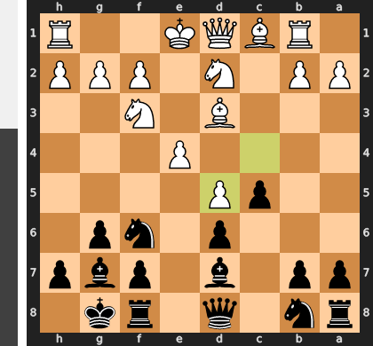

Played **cxd5**.

### Move 10 (Black): Na6 - Best Move ✅

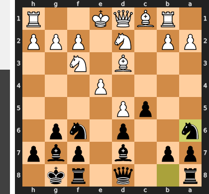

Played **Na6**.

### Move 11 (White): a3 - Good 👍

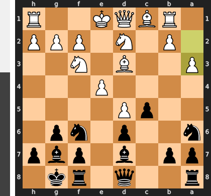

Played **a3**. The engine recommended **Bxa6**.

### Move 11 (Black): Rc8 - Mistake ❓

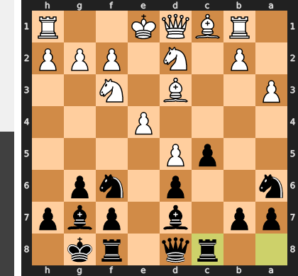

By playing the routine ...Rc8, you've unfortunately missed the critical window to seize the initiative with the thematic ...b5 pawn break. This energetic advance was the key to challenging White's central clamp and creating dynamic queenside counterplay before they could consolidate. Instead, you have granted White a crucial tempo to castle and prepare, effectively neutralizing your advantage and allowing the position to equalize.

### Move 12 (White): O-O - Best Move ✅

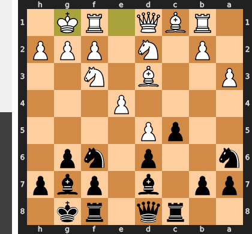

Played **O-O**.

### Move 12 (Black): c4 - Best Move ✅

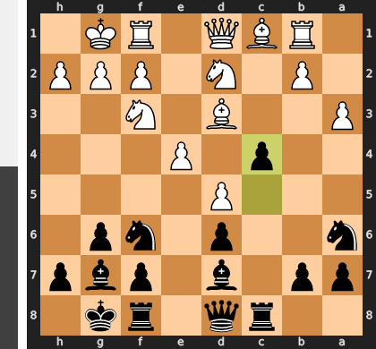

Played **c4**.

### Move 13 (White): Bxc4 - Good 👍

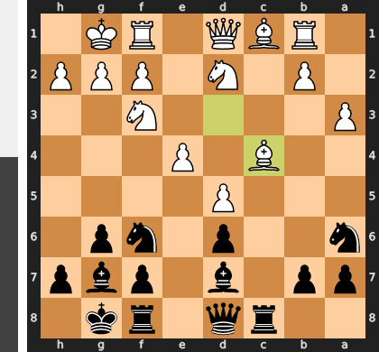

Played **Bxc4**. The engine recommended **Nxc4**.

