# Chess Game Analysis: nogrumblez vs kar2on

- **Result:** 1-0
- **Date:** 2026.04.04
- **Opening:** Pirc Defense Classical Variation 4...Bg7 5.Be3 O O 6.Qd2

### Move 1 (White): e4 - Best Move ✅

Played **e4**.

### Move 1 (Black): d6 - Good 👍

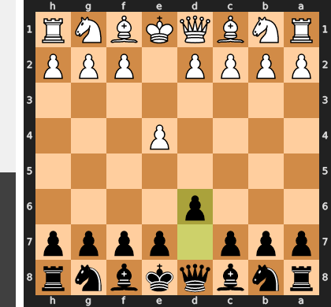

Played **d6**. The engine recommended **e5**.

### Move 2 (White): d4 - Best Move ✅

Played **d4**.

### Move 2 (Black): Nf6 - Best Move ✅

Played **Nf6**.

### Move 3 (White): Nc3 - Best Move ✅

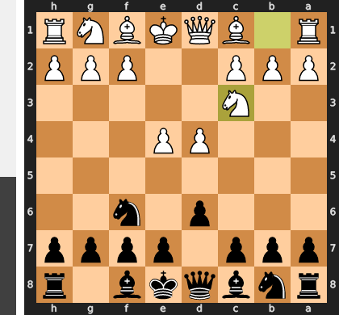

Played **Nc3**.

### Move 3 (Black): g6 - Good 👍

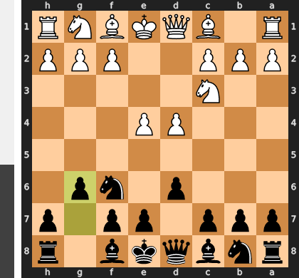

Played **g6**. The engine recommended **e5**.

### Move 4 (White): Nf3 - Good 👍

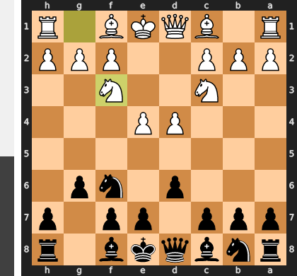

Played **Nf3**. The engine recommended **f4**.

### Move 4 (Black): Bg7 - Best Move ✅

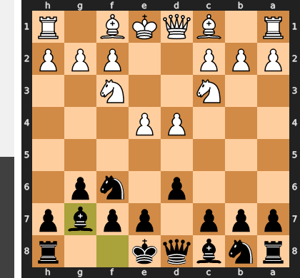

Played **Bg7**.

### Move 5 (White): Be3 - Best Move ✅

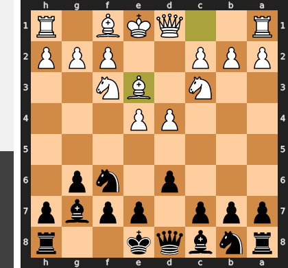

Played **Be3**.

### Move 5 (Black): O-O - Best Move ✅

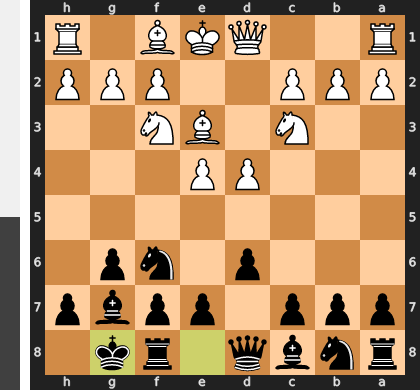

Played **O-O**.

### Move 6 (White): Qd2 - Best Move ✅

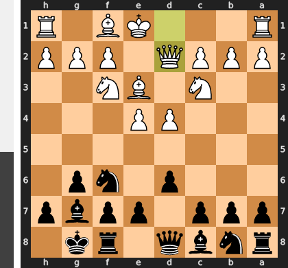

Played **Qd2**.

### Move 6 (Black): b6 - Inaccuracy ⁈

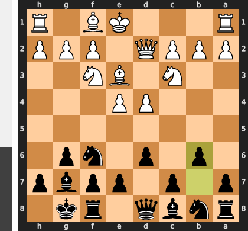

Played **b6**. The engine recommended **c5**.

### Move 7 (White): h3 - Inaccuracy ⁈

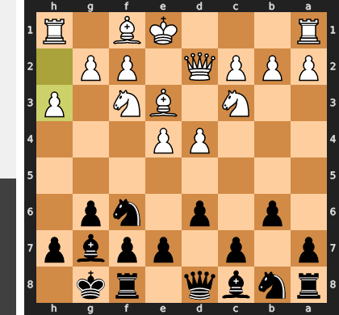

Played **h3**. The engine recommended **Bh6**.

### Move 7 (Black): c5 - Inaccuracy ⁈

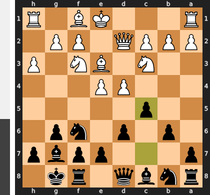

Played **c5**. The engine recommended **Bb7**.

### Move 8 (White): d5 - Good 👍

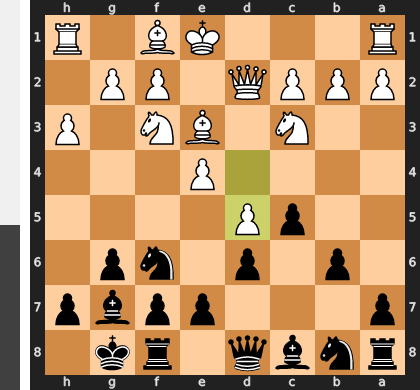

Played **d5**. The engine recommended **Bh6**.

### Move 8 (Black): e6 - Inaccuracy ⁈

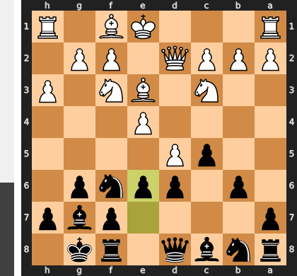

Played **e6**. The engine recommended **Ba6**.

### Move 9 (White): O-O-O - Mistake ❓

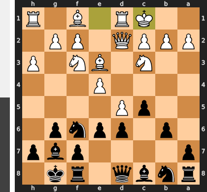

This move is a grave strategic error, as it commits the king to the queenside before resolving the critical central tension. White has now gifted Black the perfect opportunity to play ...exd5, because the simple recapture with the e-pawn fails tactically to ...Nxd5, exploiting the g7-bishop's pin on the c3-knight. By misplacing the king, White has voluntarily released all pressure and single-handedly allowed Black to equalize the game.

### Move 9 (Black): exd5 - Best Move ✅

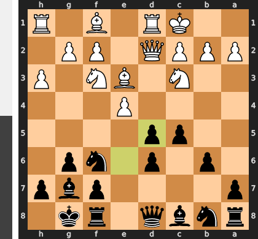

Played **exd5**.

### Move 10 (White): exd5 - Best Move ✅

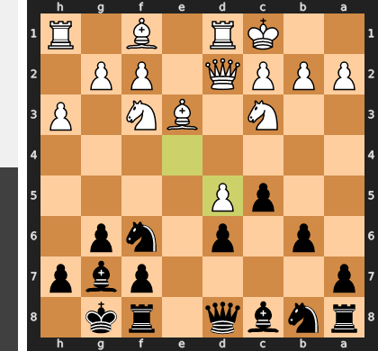

Played **exd5**.

### Move 10 (Black): Re8 - Good 👍

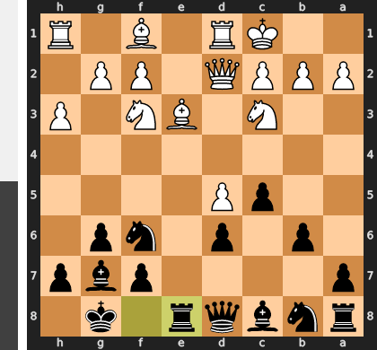

Played **Re8**. The engine recommended **a6**.

### Move 11 (White): g4 - Good 👍

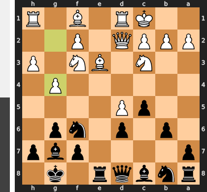

Played **g4**. The engine recommended **Bh6**.

### Move 11 (Black): Bb7 - Mistake ❓

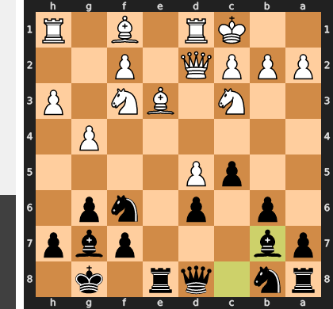

This move tragically misunderstands the urgency of an opposite-side castling position; developing the bishop is far too slow when White is poised to launch a decisive kingside attack with g5. Black's only correct plan is to race, which required the immediate ...a6 to initiate a queenside counter-attack with ...b5 against the white king. Instead of creating threats, the bishop on b7 now becomes a passive spectator to the coming storm on the other side of the board.

### Move 12 (White): g5 - Mistake ❓

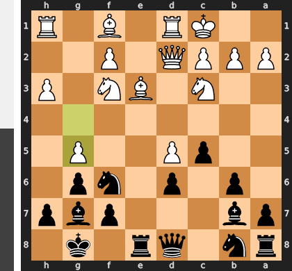

This is a classic case of attacking the wrong target; the aggressive lunge with g5 merely displaces the knight to the excellent h5-square, from where it prepares to occupy the newly weakened f4 outpost. This move prematurely releases all the kingside pressure and turns the g-pawn into a long-term liability, whereas the correct Bh6 would have eliminated the critical g7-bishop, the true guardian of the black king. White has essentially shut down his own attack and handed Black a clear target for counterplay.

### Move 12 (Black): Nh5 - Inaccuracy ⁈

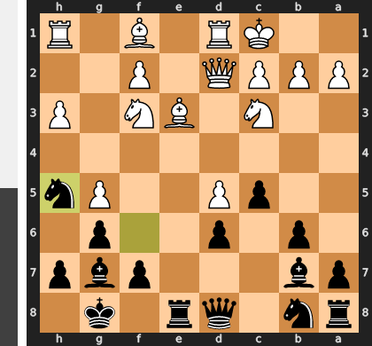

Played **Nh5**. The engine recommended **Ne4**.

### Move 13 (White): Be2 - Inaccuracy ⁈

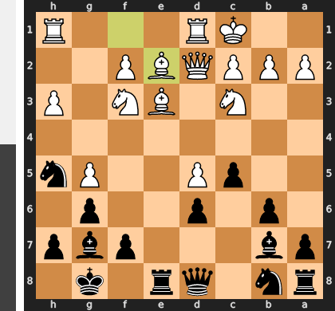

Played **Be2**. The engine recommended **Bb5**.

### Move 13 (Black): Nd7 - Mistake ❓

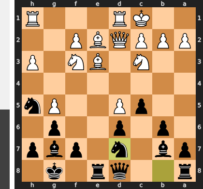

This is a grave positional mistake as it voluntarily moves the f6-knight, the single most important defender of your kingside. By vacating f6, you not only unleash the h5-knight but fatally allow White to play Nf4, creating overwhelming and likely decisive pressure against the now-critical g6 weakness. You have effectively given White a free hand to launch an attack that you are no longer equipped to defend.

### Move 14 (White): Nh2 - Best Move ✅

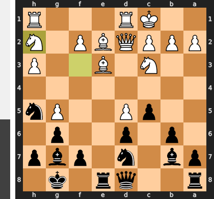

Played **Nh2**.

### Move 14 (Black): Ne5 - Good 👍

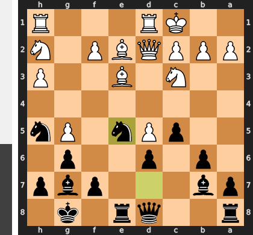

Played **Ne5**. The engine recommended **b5**.

### Move 15 (White): Bxh5 - Mistake ❓

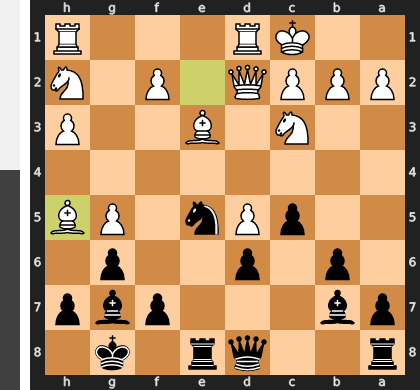

This move was a grave strategic error, as White willingly traded their single most important attacking piece—the bishop that was pinning the kingside and creating all the threats. The recapture with ...dxe5 transforms the position in Black's favor by opening the d-file for a direct counterattack on the exposed White king. Essentially, White single-handedly dismantled their own attack and handed Black the long-term initiative by activating both of Black's bishops and the d8-rook.

### Move 15 (Black): gxh5 - Mistake ❓

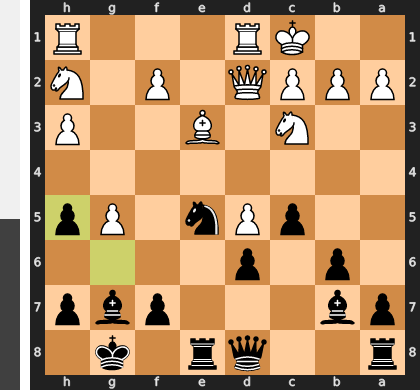

By playing gxh5, Black has committed a grave positional error, voluntarily opening the g-file directly in front of his own king. This move surrenders a critical defensive pawn and creates a clear highway for White's attack, which can now be pursued with f4 to dislodge the crucial e5-knight, followed by Rg1 to generate decisive threats. Black has essentially traded a slight positional edge for a position where he is now forced onto the defensive against a straightforward attack.

### Move 16 (White): Qe2 - Best Move ✅

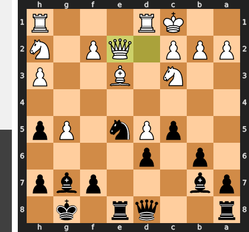

Played **Qe2**.

### Move 16 (Black): Nc4 - Mistake ❓

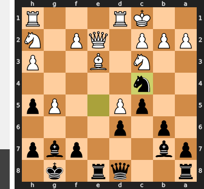

While placing the knight on c4 appears active, it is a grave tactical miscalculation that overlooks White's powerful reply, Qxc4. After the forced recapture bxc4, Black has traded a key defensive piece and dissolved his own central pawn structure, leaving White with a monstrously active queen and a deadly passed d-pawn. This exchange voluntarily trades a temporary nuisance for a permanent, game-deciding positional advantage for White.

### Move 17 (White): Qxc4 - Best Move ✅

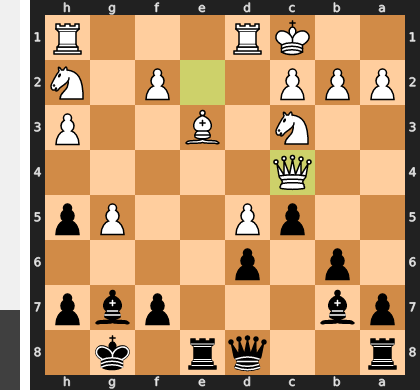

Played **Qxc4**.

