# Chess Game Analysis: highstickrule vs kar2on

- **Result:** 1-0
- **Date:** 2026.04.04
- **Opening:** Pirc Defense Classical Schlechter Variation 5...O O 6.Be3

### Move 1 (White): e4 - Best Move ✅

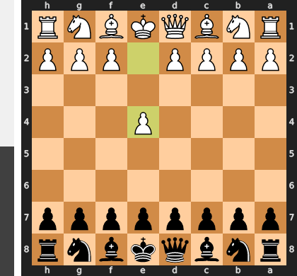

Played **e4**.

### Move 1 (Black): d6 - Good 👍

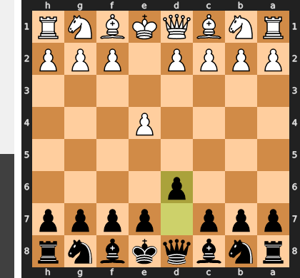

Played **d6**. The engine recommended **e5**.

### Move 2 (White): d4 - Best Move ✅

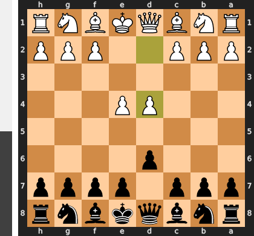

Played **d4**.

### Move 2 (Black): Nf6 - Best Move ✅

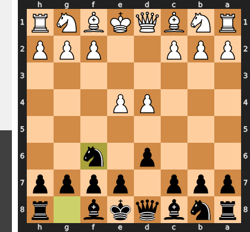

Played **Nf6**.

### Move 3 (White): Nc3 - Best Move ✅

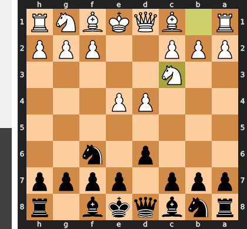

Played **Nc3**.

### Move 3 (Black): g6 - Good 👍

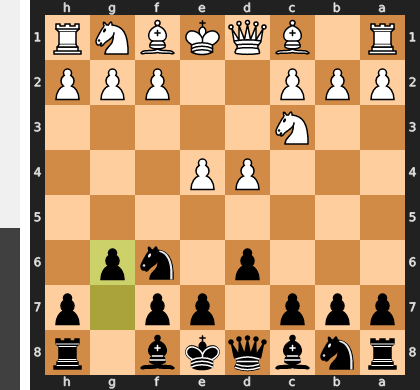

Played **g6**. The engine recommended **e5**.

### Move 4 (White): h3 - Good 👍

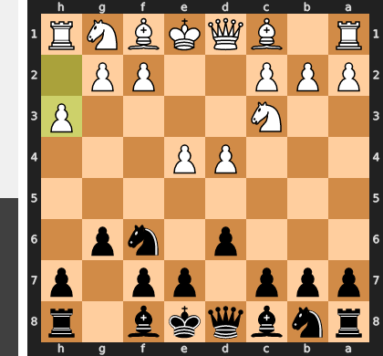

Played **h3**. The engine recommended **Nf3**.

### Move 4 (Black): Bg7 - Best Move ✅

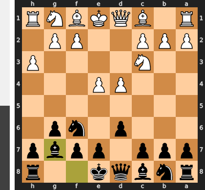

Played **Bg7**.

### Move 5 (White): Nf3 - Good 👍

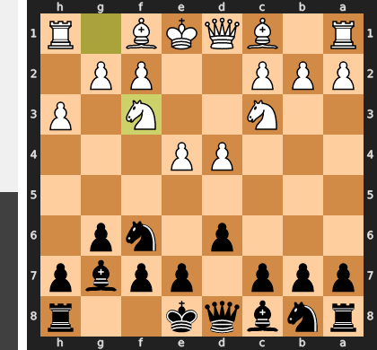

Played **Nf3**. The engine recommended **Be3**.

### Move 5 (Black): O-O - Best Move ✅

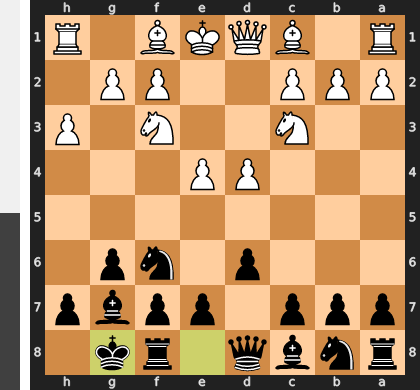

Played **O-O**.

### Move 6 (White): Be3 - Good 👍

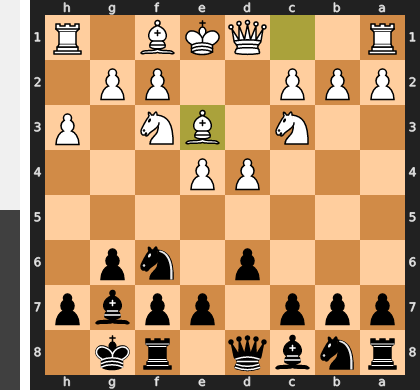

Played **Be3**. The engine recommended **Bd3**.

### Move 6 (Black): c5 - Good 👍

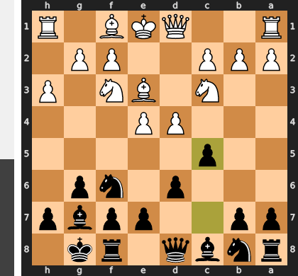

Played **c5**. The engine recommended **d5**.

### Move 7 (White): dxc5 - Best Move ✅

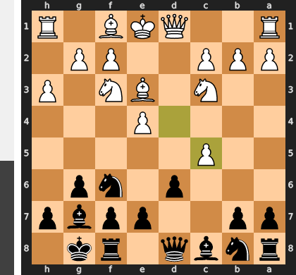

Played **dxc5**.

### Move 7 (Black): dxc5 - Best Move ✅

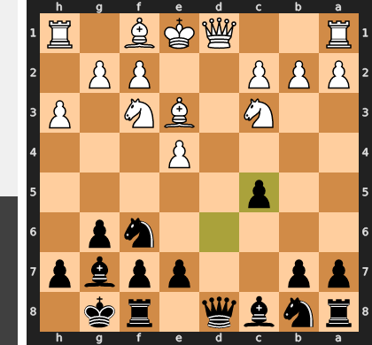

Played **dxc5**.

### Move 8 (White): Qxd8 - Best Move ✅

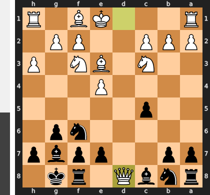

Played **Qxd8**.

### Move 8 (Black): Rxd8 - Best Move ✅

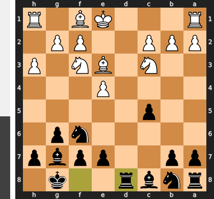

Played **Rxd8**.

### Move 9 (White): Bxc5 - Best Move ✅

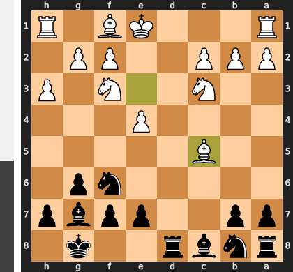

Played **Bxc5**.

### Move 9 (Black): Nc6 - Best Move ✅

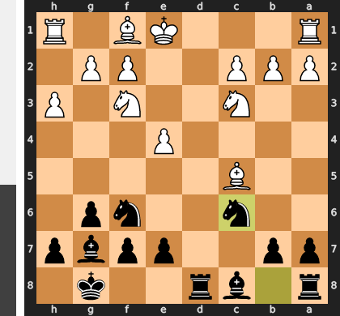

Played **Nc6**.

### Move 10 (White): a3 - Good 👍

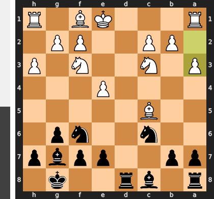

Played **a3**. The engine recommended **Bd3**.

### Move 10 (Black): b6 - Good 👍

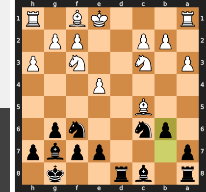

Played **b6**. The engine recommended **Nd7**.

### Move 11 (White): Be3 - Best Move ✅

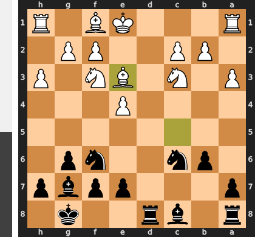

Played **Be3**.

### Move 11 (Black): Nd7 - Good 👍

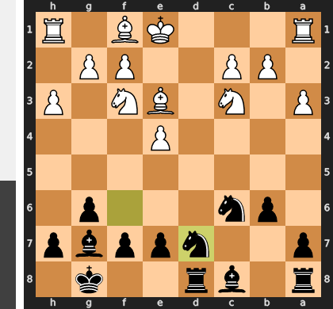

Played **Nd7**. The engine recommended **Na5**.

### Move 12 (White): Bd2 - Mistake ❓

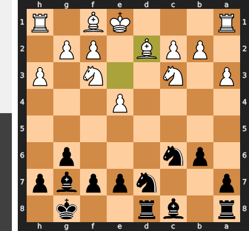

This developing move is a critical loss of tempo because it fails to address the most urgent issue: the vulnerable king in the center. The immediate O-O-O would have secured the king while activating the d-rook to fortify the d4-pawn, but by delaying, White grants Black a free turn to complete development with ...Bb7 and intensify the pressure against the exposed white center. White has essentially handed the initiative to Black, who no longer has to worry about a consolidated and powerful white position.

### Move 12 (Black): Nc5 - Best Move ✅

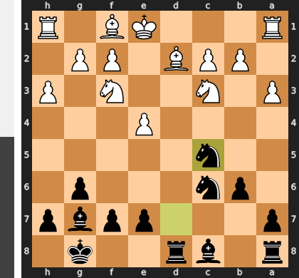

Played **Nc5**.

### Move 13 (White): Bb5 - Good 👍

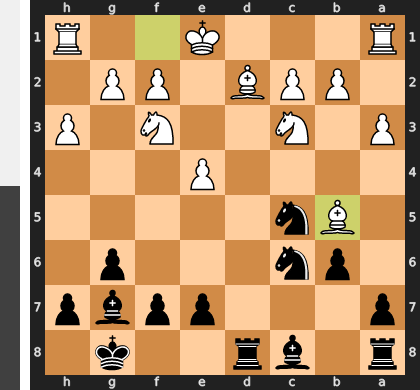

Played **Bb5**. The engine recommended **O-O-O**.

### Move 13 (Black): Nd4 - Mistake ❓

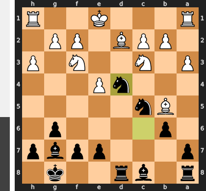

While appearing active, Nd4 is a serious positional error because the knight immediately becomes a target on this exposed square instead of an asset. White can now simply castle queenside, bringing the rook to d1 to create decisive pressure against the vulnerable knight and seizing a clear initiative. Black has voluntarily walked into a powerful pin, surrendering the central tension and allowing White's pieces to achieve ideal coordination.

### Move 14 (White): Nxd4 - Best Move ✅

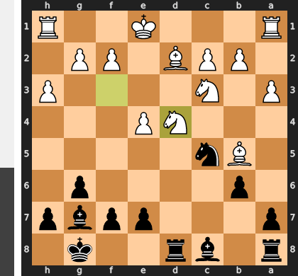

Played **Nxd4**.

### Move 14 (Black): Rxd4 - Good 👍

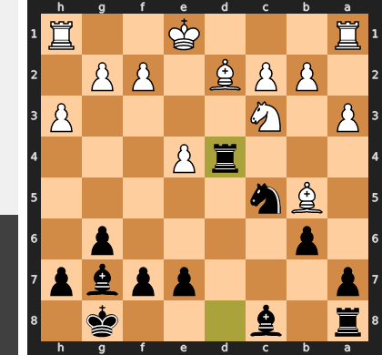

Played **Rxd4**. The engine recommended **Bxd4**.

### Move 15 (White): f3 - Good 👍

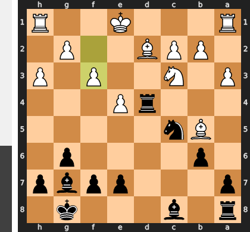

Played **f3**. The engine recommended **O-O-O**.

### Move 15 (Black): Bb7 - Good 👍

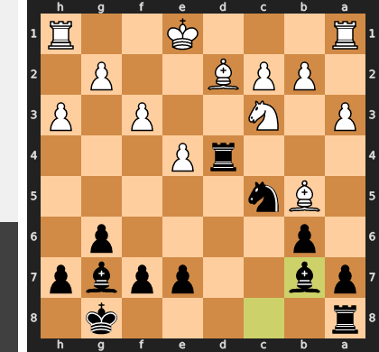

Played **Bb7**. The engine recommended **Be6**.

### Move 16 (White): O-O-O - Good 👍

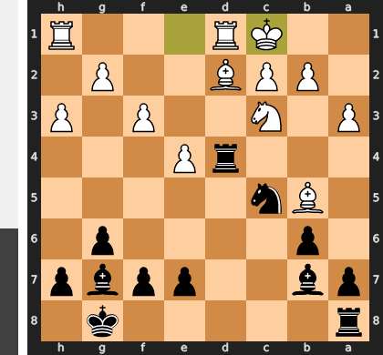

Played **O-O-O**. The engine recommended **h4**.

### Move 16 (Black): Rad8 - Good 👍

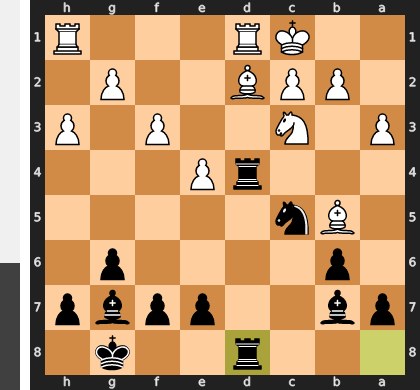

Played **Rad8**. The engine recommended **a6**.

### Move 17 (White): Be3 - Best Move ✅

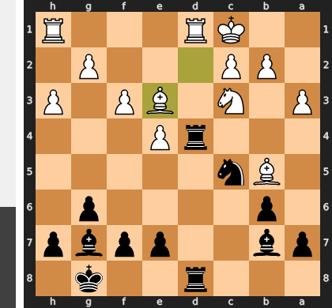

Played **Be3**.

### Move 17 (Black): Rxd1+ - Good 👍

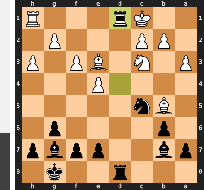

Played **Rxd1+**. The engine recommended **R4d6**.

### Move 18 (White): Rxd1 - Best Move ✅

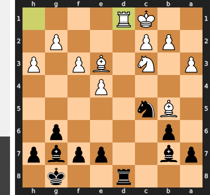

Played **Rxd1**.

### Move 18 (Black): Rxd1+ - Best Move ✅

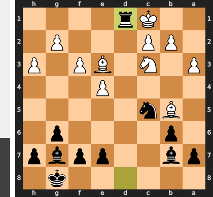

Played **Rxd1+**.

### Move 19 (White): Nxd1 - Best Move ✅

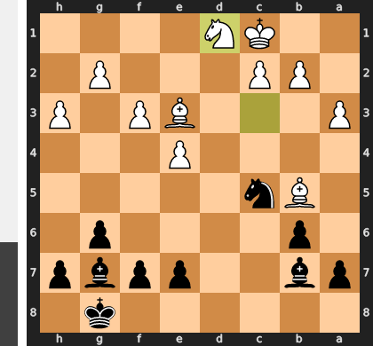

Played **Nxd1**.

### Move 19 (Black): a6 - Good 👍

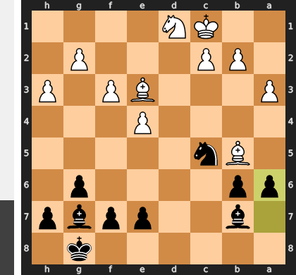

Played **a6**. The engine recommended **Kf8**.

### Move 20 (White): Bxc5 - Inaccuracy ⁈

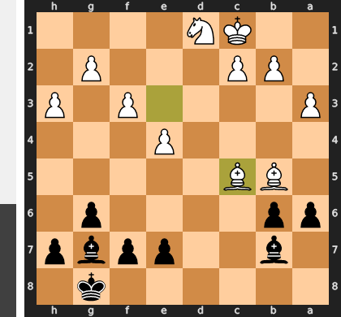

Played **Bxc5**. The engine recommended **Be2**.

### Move 20 (Black): bxc5 - Best Move ✅

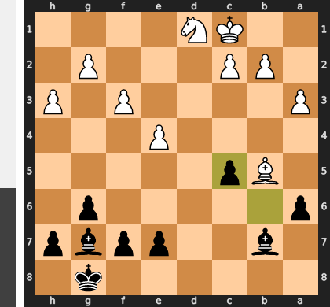

Played **bxc5**.

### Move 21 (White): Bc4 - Best Move ✅

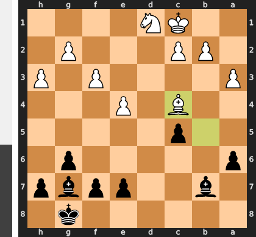

Played **Bc4**.

### Move 21 (Black): e6 - Good 👍

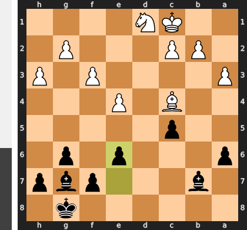

Played **e6**. The engine recommended **Bh6+**.

### Move 22 (White): c3 - Good 👍

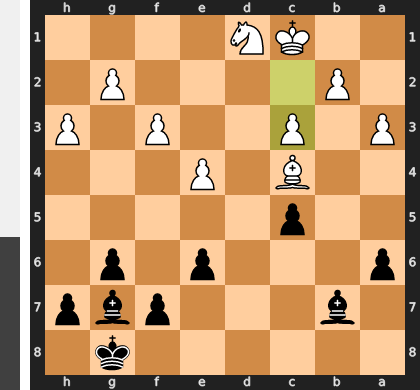

Played **c3**. The engine recommended **Nf2**.

### Move 22 (Black): a5 - Inaccuracy ⁈

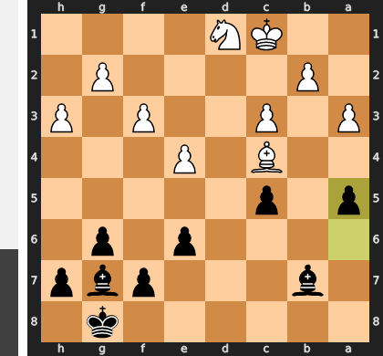

Played **a5**. The engine recommended **Kf8**.

### Move 23 (White): Nf2 - Good 👍

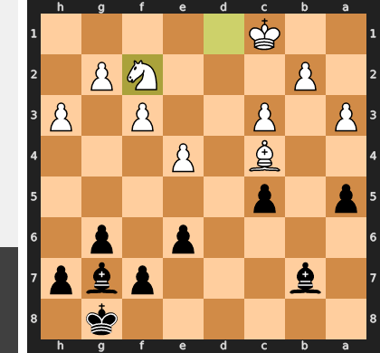

Played **Nf2**. The engine recommended **Bb5**.

### Move 23 (Black): f5 - Mistake ❓

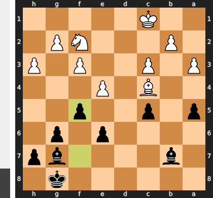

This move is a grave positional mistake as it voluntarily removes the only defender of the crucial e6 pawn, turning it into a permanent and fatal weakness. More importantly, after White's natural reply exf5, Black's king position is irrevocably shattered, as the open g-file and weakened dark squares invite a decisive attack. Instead of fighting for the center, Black has simply opened the floodgates for White's better-placed pieces.

### Move 24 (White): exf5 - Good 👍

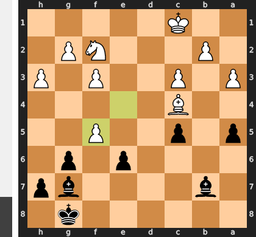

Played **exf5**. The engine recommended **Bxe6+**.

### Move 24 (Black): gxf5 - Good 👍

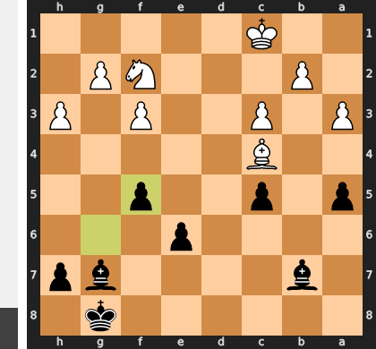

Played **gxf5**. The engine recommended **Bd5**.

### Move 25 (White): Bxe6+ - Best Move ✅

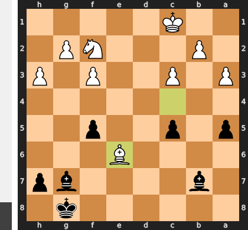

Played **Bxe6+**.

