# Chess Game Analysis: xxDark-Night vs kar2on

- **Result:** 1-0
- **Date:** 2026.04.04
- **Opening:** Modern Defense Pterodactyl Defense...6.h3 O O 7.Nf3 e6

### Move 1 (White): d4 - Good 👍

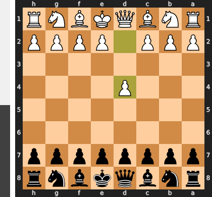

Played **d4**. The engine recommended **e4**.

### Move 1 (Black): Nf6 - Good 👍

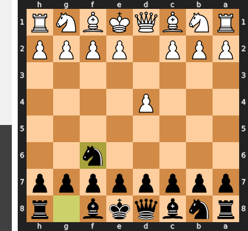

Played **Nf6**. The engine recommended **d5**.

### Move 2 (White): c4 - Best Move ✅

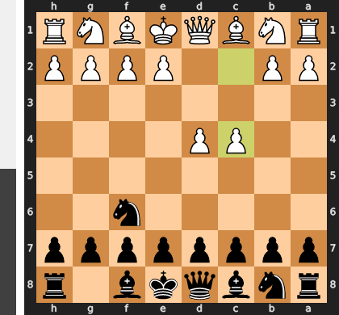

Played **c4**.

### Move 2 (Black): g6 - Good 👍

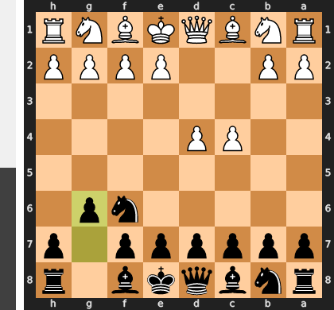

Played **g6**. The engine recommended **c6**.

### Move 3 (White): Nc3 - Best Move ✅

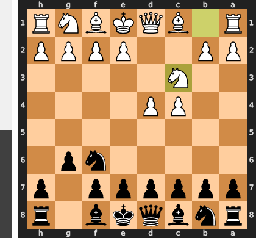

Played **Nc3**.

### Move 3 (Black): Bg7 - Good 👍

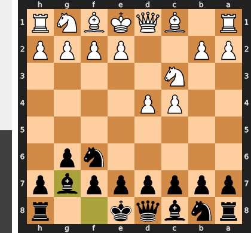

Played **Bg7**. The engine recommended **d5**.

### Move 4 (White): e4 - Best Move ✅

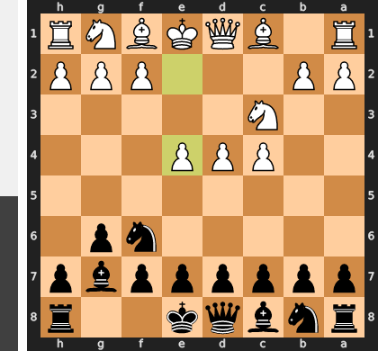

Played **e4**.

### Move 4 (Black): d6 - Good 👍

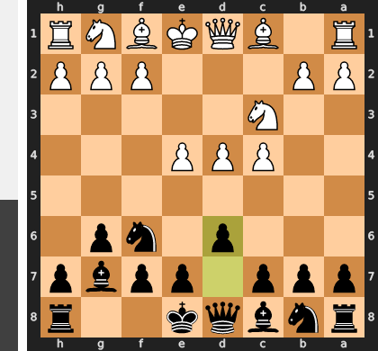

Played **d6**. The engine recommended **O-O**.

### Move 5 (White): Nf3 - Good 👍

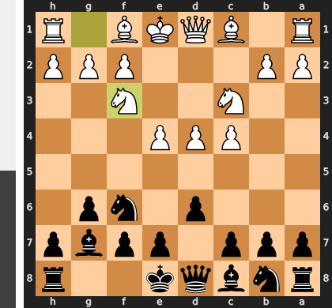

Played **Nf3**. The engine recommended **Be2**.

### Move 5 (Black): O-O - Best Move ✅

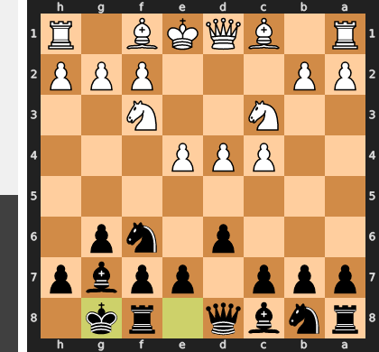

Played **O-O**.

### Move 6 (White): h3 - Good 👍

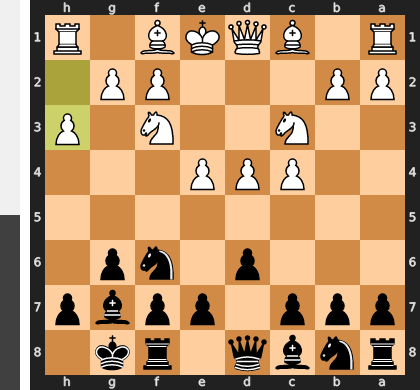

Played **h3**. The engine recommended **Be2**.

### Move 6 (Black): c5 - Inaccuracy ⁈

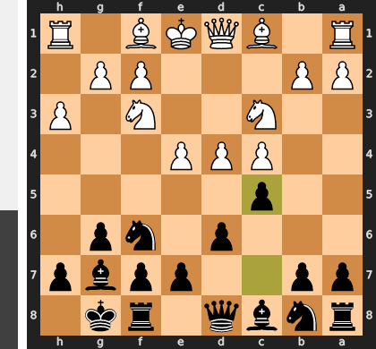

Played **c5**. The engine recommended **e5**.

### Move 7 (White): d5 - Best Move ✅

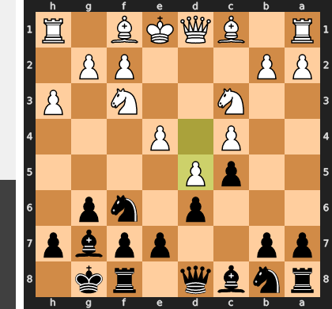

Played **d5**.

### Move 7 (Black): e6 - Best Move ✅

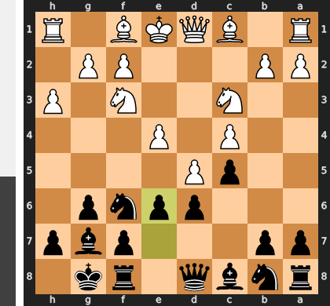

Played **e6**.

### Move 8 (White): Be3 - Good 👍

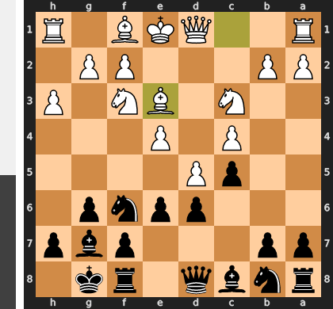

Played **Be3**. The engine recommended **Bd3**.

### Move 8 (Black): exd5 - Good 👍

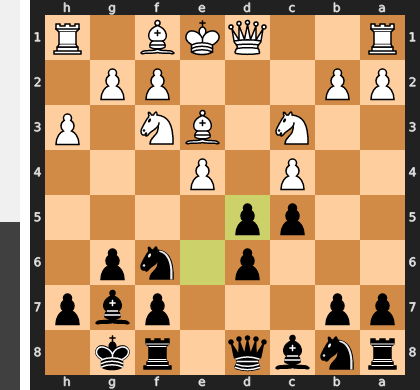

Played **exd5**. The engine recommended **Re8**.

### Move 9 (White): exd5 - Best Move ✅

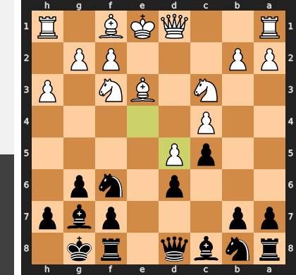

Played **exd5**.

### Move 9 (Black): Re8 - Good 👍

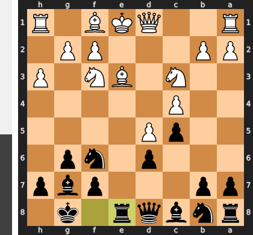

Played **Re8**. The engine recommended **a6**.

### Move 10 (White): Be2 - Good 👍

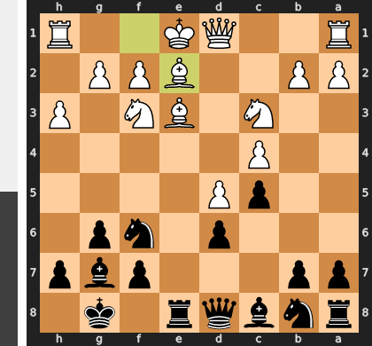

Played **Be2**. The engine recommended **Bd3**.

### Move 10 (Black): Nbd7 - Good 👍

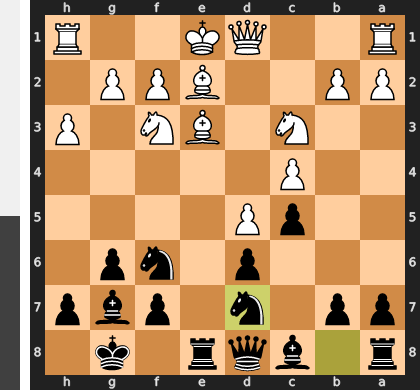

Played **Nbd7**. The engine recommended **Bf5**.

### Move 11 (White): O-O - Best Move ✅

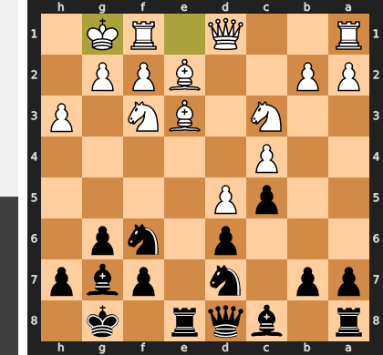

Played **O-O**.

### Move 11 (Black): Nb6 - Good 👍

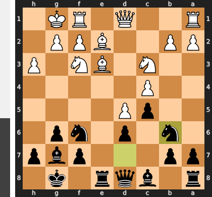

Played **Nb6**. The engine recommended **Ne4**.

### Move 12 (White): Bg5 - Good 👍

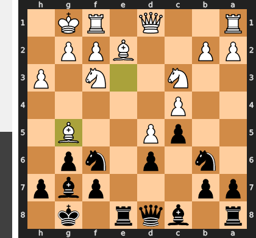

Played **Bg5**. The engine recommended **Bd3**.

### Move 12 (Black): Bd7 - Inaccuracy ⁈

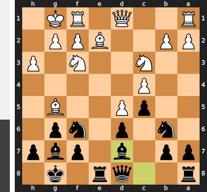

Played **Bd7**. The engine recommended **h6**.

### Move 13 (White): a4 - Good 👍

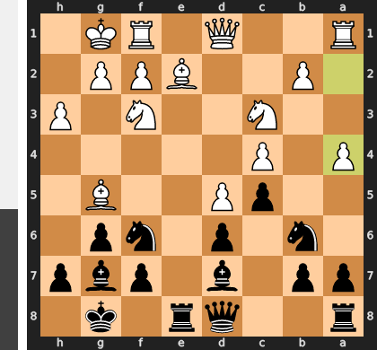

Played **a4**. The engine recommended **Bd3**.

### Move 13 (Black): h6 - Best Move ✅

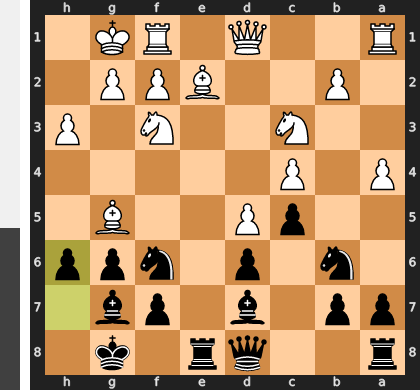

Played **h6**.

### Move 14 (White): Bf4 - Mistake ❓

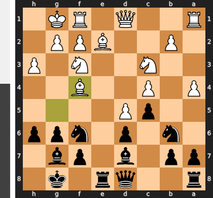

While Bf4 appears to be an active developing move, it is a serious mistake as it exposes the bishop to attack and, more critically, abandons the b2-pawn. This error allows Black to immediately launch a tactical sequence starting with ...Nxa4, sacrificing the knight to open lines and remove a key defender. After the forced recaptures, the devastating follow-up ...Ne4 attacks multiple pieces at once, causing White's central control and coordination to completely collapse.

### Move 14 (Black): Ne4 - Best Move ✅

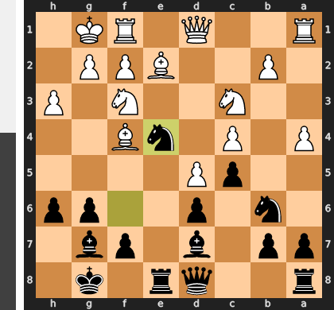

Played **Ne4**.

### Move 15 (White): Nxe4 - Best Move ✅

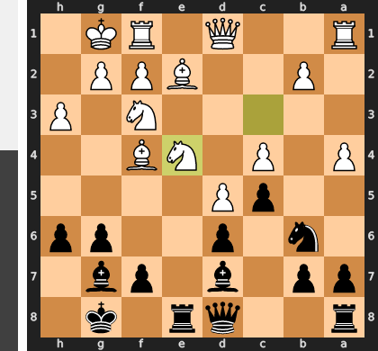

Played **Nxe4**.

### Move 15 (Black): Rxe4 - Best Move ✅

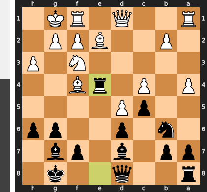

Played **Rxe4**.

### Move 16 (White): Bxd6 - Mistake ❓

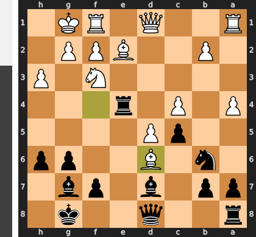

By playing Bxd6, White has committed a classic strategic error, trading his single most active and influential piece for a less critical knight. This exchange simultaneously solved Black's main positional problem by allowing his previously passive d7-bishop to recapture and occupy the dominant d6-square. With White's key defender eliminated and a new Black attacker joining the fray, the immense pressure from the monstrous e4-rook becomes overwhelming and strategically decisive.

### Move 16 (Black): Bxh3 - Mistake ❓

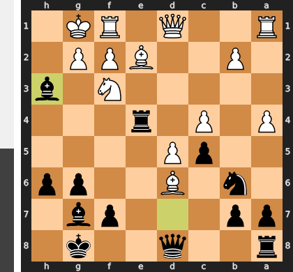

Black's move `Bxh3` is a classic case of a tempting but flawed tactical combination, as it allows White to escape all pressure. While the move prepares to eliminate the dominant d6-bishop, it critically overlooks White's stunning resource `Bxc5!`, which deflects the queen and completely neutralizes the attack. The correct approach, `Bxa4`, would have maintained Black's suffocating positional bind, freeing the b6-knight and keeping all of White's pieces tied down to the defense of the d-pawn and their vulnerable king.

### Move 17 (White): Bxc5 - Best Move ✅

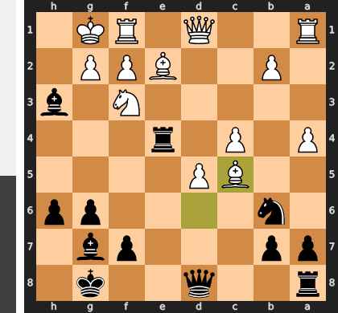

Played **Bxc5**.

### Move 17 (Black): Bf5 - Inaccuracy ⁈

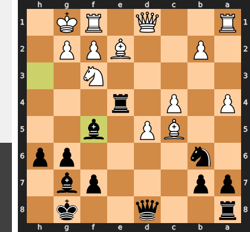

Played **Bf5**. The engine recommended **Bg4**.

### Move 18 (White): Bd4 - Best Move ✅

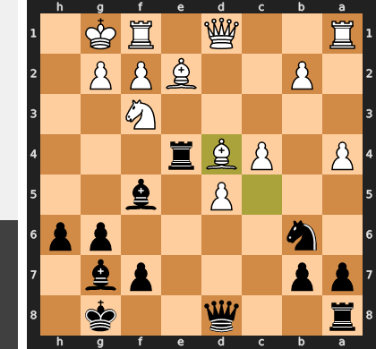

Played **Bd4**.

### Move 18 (Black): Bxd4 - Inaccuracy ⁈

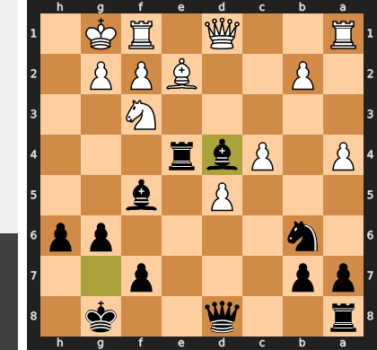

Played **Bxd4**. The engine recommended **Bg4**.

### Move 19 (White): Nxd4 - Best Move ✅

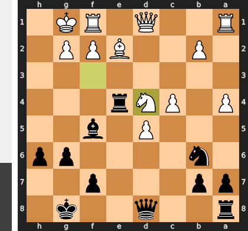

Played **Nxd4**.

### Move 19 (Black): Qe8 - Mistake ❓

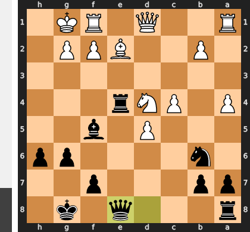

This move is far too passive, relinquishing control of the center and doing nothing to challenge White's monster knight on d4. By retreating the queen to a non-threatening square, Black grants White a crucial free tempo to consolidate the advantage, for instance by shattering the kingside with Nxf5 followed by pressure on the newly created weaknesses. The correct idea was the active ...Qf6, immediately putting the question to White's best piece and fighting for a foothold in the position rather than ceding the initiative.

### Move 20 (White): Nxf5 - Inaccuracy ⁈

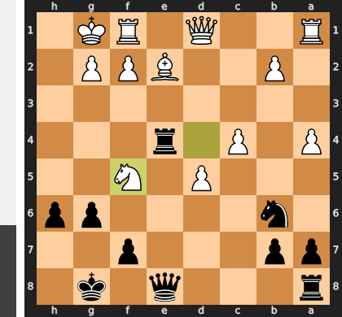

Played **Nxf5**. The engine recommended **Bf3**.

### Move 20 (Black): gxf5 - Inaccuracy ⁈

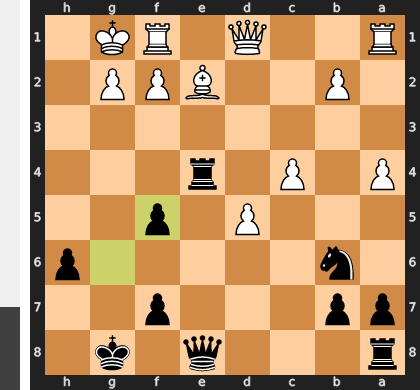

Played **gxf5**. The engine recommended **Rxe2**.

### Move 21 (White): Bd3 - Best Move ✅

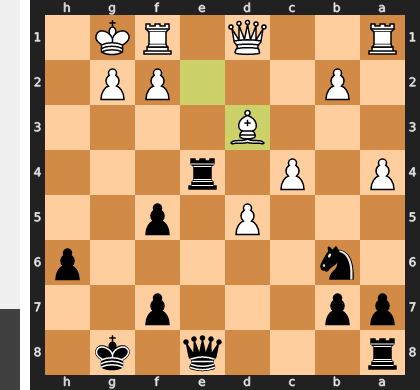

Played **Bd3**.

### Move 21 (Black): Rd4 - Inaccuracy ⁈

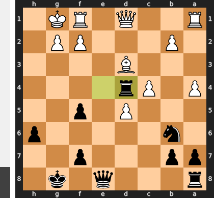

Played **Rd4**. The engine recommended **Rh4**.

### Move 22 (White): Qf3 - Inaccuracy ⁈

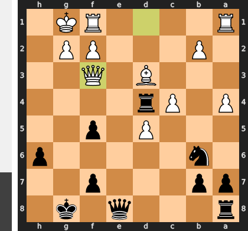

Played **Qf3**. The engine recommended **b3**.

### Move 22 (Black): Qd7 - Mistake ❓

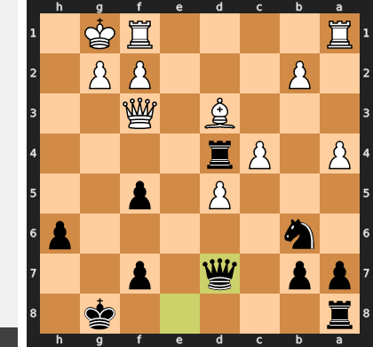

Black's move `...Qd7` is a grave positional mistake as it voluntarily places the queen on the same file as the active d4-rook, allowing White to decisively seize the d-file with `Rad1`. This simple developing move turns Black's greatest asset, the "octopus" rook on d4, into a crippling liability, pinned and soon to be lost. The correct path was the active `...Nxc4`, intending to sacrifice the exchange with `...Rxd5` to eliminate White's crushing d5-pawn and muddy the waters, rather than passively allowing complete paralysis.

### Move 23 (White): b3 - Good 👍

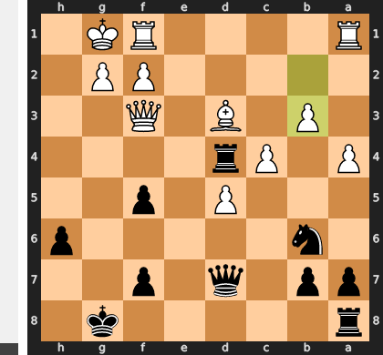

Played **b3**. The engine recommended **Bxf5**.

