# Chess Game Analysis: kar2on vs faninyan

- **Result:** 1-0
- **Date:** 2026.04.04
- **Opening:** Philidor Defense 3.Nc3

### Move 1 (White): e4 - Best Move ✅

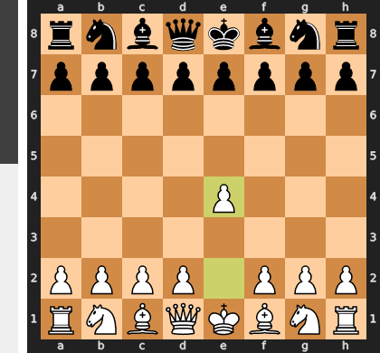

Played **e4**.

### Move 1 (Black): e5 - Best Move ✅

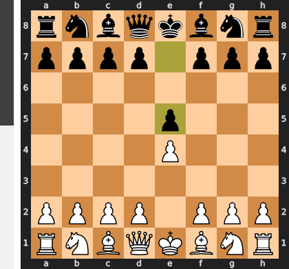

Played **e5**.

### Move 2 (White): Nf3 - Best Move ✅

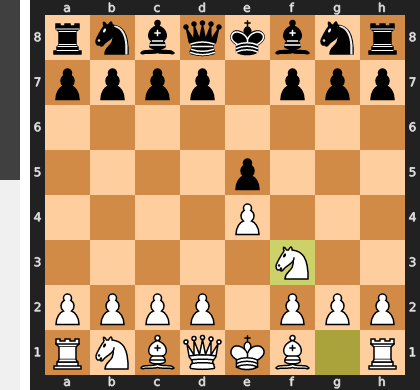

Played **Nf3**.

### Move 2 (Black): d6 - Good 👍

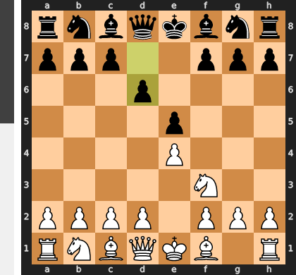

Played **d6**. The engine recommended **Nc6**.

### Move 3 (White): Nc3 - Good 👍

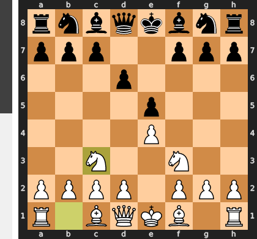

Played **Nc3**. The engine recommended **d4**.

### Move 3 (Black): Bg4 - Inaccuracy ⁈

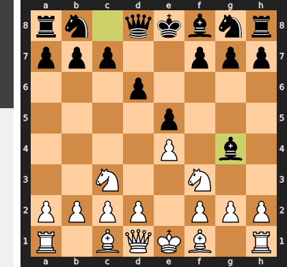

Played **Bg4**. The engine recommended **c5**.

### Move 4 (White): Be2 - Inaccuracy ⁈

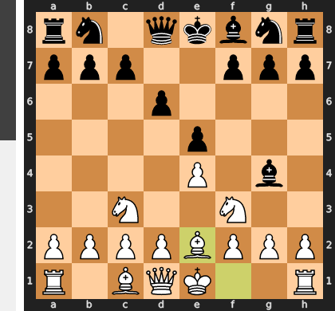

Played **Be2**. The engine recommended **d4**.

### Move 4 (Black): Nc6 - Good 👍

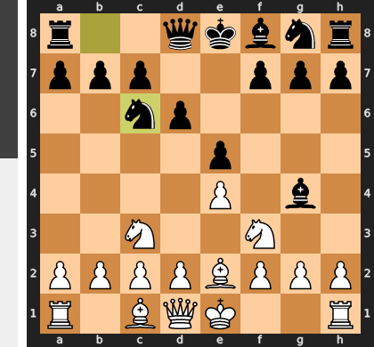

Played **Nc6**. The engine recommended **c5**.

### Move 5 (White): h3 - Good 👍

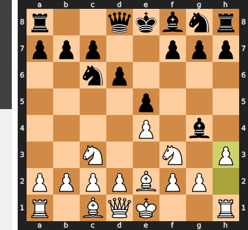

Played **h3**. The engine recommended **Bb5**.

### Move 5 (Black): Bh5 - Mistake ❓

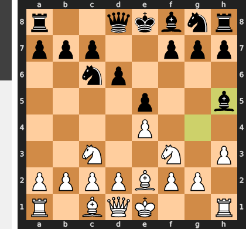

This move is a positional misjudgment because it walks directly into White's plan of `g4`, a pawn thrust perfectly prepared by the earlier `h3`. Instead of creating pressure, the bishop is transformed from an active piece into a target, allowing White to seize a major space advantage and tempo on the kingside. Black has missed the superior `...Bxf3`, which would have forced `gxf3` and inflicted permanent, long-term structural weaknesses around the white king.

### Move 6 (White): Bc4 - Inaccuracy ⁈

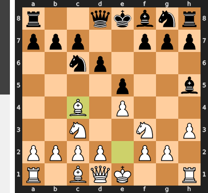

Played **Bc4**. The engine recommended **g4**.

### Move 6 (Black): Nf6 - Best Move ✅

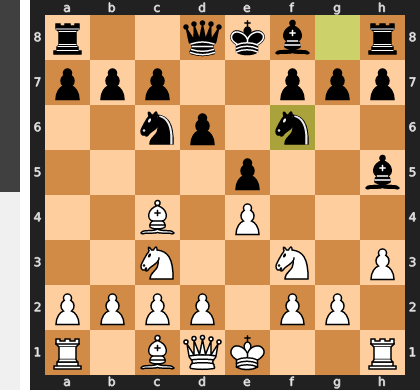

Played **Nf6**.

### Move 7 (White): g4 - Good 👍

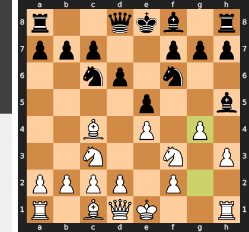

Played **g4**. The engine recommended **d3**.

### Move 7 (Black): Bg6 - Best Move ✅

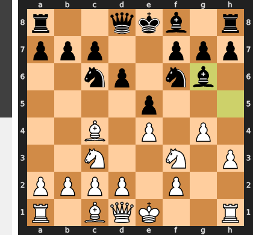

Played **Bg6**.

### Move 8 (White): Ng5 - Mistake ❓

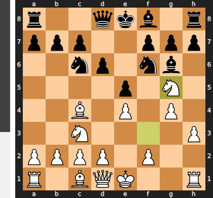

This aggressive lunge with Ng5 is a one-trick pony that fatally ignores White's own compromised kingside, a direct consequence of the earlier g4 push. Black's simple and crushing response ...h6 forces the knight to either retreat or embark on a dubious sacrifice, after which White's attack evaporates, leaving them with nothing but a permanently weakened king position. The move is a strategic miscalculation, trading a fleeting initiative for a lasting structural ruin.

### Move 8 (Black): h6 - Best Move ✅

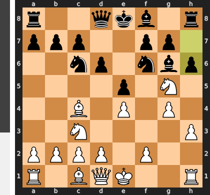

Played **h6**.

### Move 9 (White): Nf3 - Best Move ✅

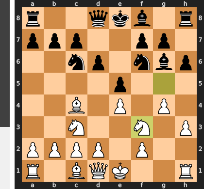

Played **Nf3**.

### Move 9 (Black): Nxe4 - Good 👍

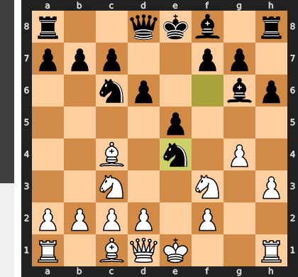

Played **Nxe4**. The engine recommended **h5**.

### Move 10 (White): Nxe4 - Good 👍

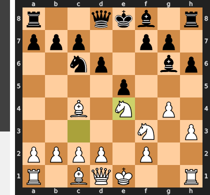

Played **Nxe4**. The engine recommended **Bd5**.

### Move 10 (Black): Bxe4 - Best Move ✅

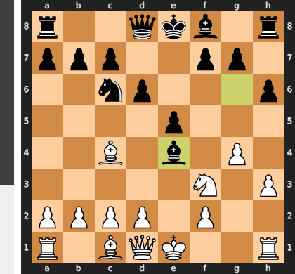

Played **Bxe4**.

### Move 11 (White): d3 - Best Move ✅

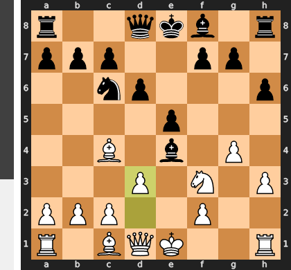

Played **d3**.

### Move 11 (Black): Bxf3 - Mistake ❓

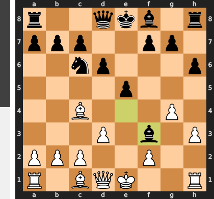

This move is a major positional concession, as it trades away Black's most active and powerful minor piece, the dark-squared bishop, for an undeveloped knight. This exchange single-handedly solves all of White's problems, developing their queen to a dominant central square after the recapture. Instead of maintaining the tension with Bg6 and nursing the weaknesses around White's king, Black has voluntarily released all pressure and allowed White to completely consolidate.

### Move 12 (White): Qxf3 - Best Move ✅

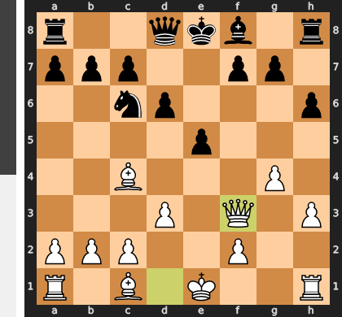

Played **Qxf3**.

### Move 12 (Black): Nd4 - Blunder ❌

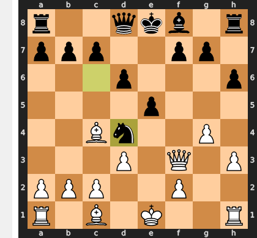

Black's move ...Nd4 is a fatal miscalculation, creating a hollow threat against the queen while completely ignoring the true, decisive threat against the f7-pawn. White can simply disregard the attack and deliver a stunning checkmate with Qxf7#, as Black's knight is a mere spectator to the king's demise. The move was an illusion of activity that tragically overlooked the game's only decisive tactical point.

### Move 13 (White): Qxf7# - Blunder ❌

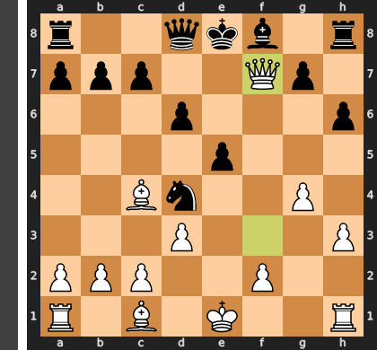

This appears to be a bug or data error in your analysis tool, as delivering checkmate is the ultimate goal and can never be a blunder. The move Qxf7# is definitionally the best possible move, ending the game immediately in White's favor. There are no tactical or positional consequences to consider, as the game has reached its conclusion with a decisive win for White.

