# Chess Game Analysis: kar2on vs streetballandone

- **Result:** 0-1
- **Date:** 2026.04.04
- **Opening:** Petrovs Defense Classical Variation

### Move 1 (White): e4 - Best Move ✅

Played **e4**.

### Move 1 (Black): e5 - Best Move ✅

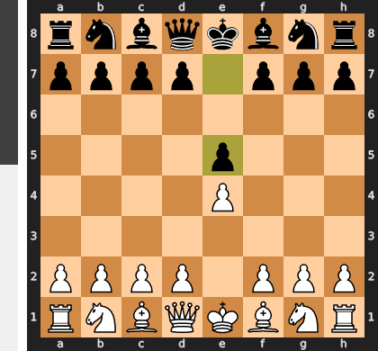

Played **e5**.

### Move 2 (White): Nf3 - Best Move ✅

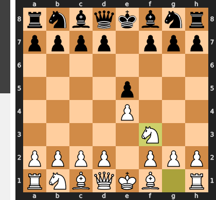

Played **Nf3**.

### Move 2 (Black): Nf6 - Good 👍

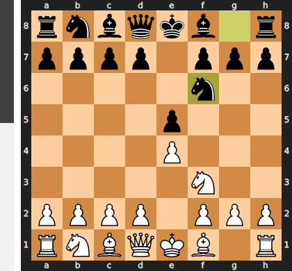

Played **Nf6**. The engine recommended **Nc6**.

### Move 3 (White): Nxe5 - Good 👍

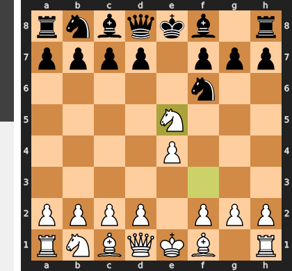

Played **Nxe5**. The engine recommended **d4**.

### Move 3 (Black): Qe7 - Inaccuracy ⁈

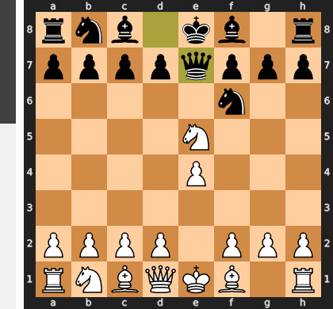

Played **Qe7**. The engine recommended **d6**.

### Move 4 (White): Nf3 - Good 👍

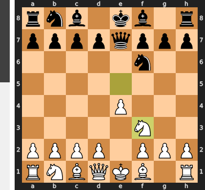

Played **Nf3**. The engine recommended **d4**.

### Move 4 (Black): Qxe4+ - Good 👍

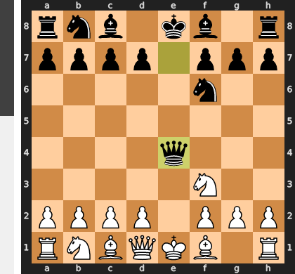

Played **Qxe4+**. The engine recommended **Nxe4**.

### Move 5 (White): Qe2 - Inaccuracy ⁈

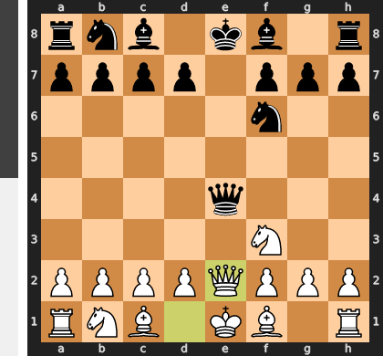

Played **Qe2**. The engine recommended **Be2**.

### Move 5 (Black): Qxe2+ - Good 👍

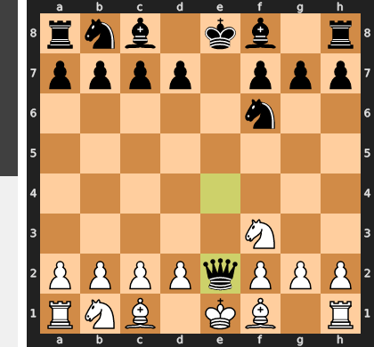

Played **Qxe2+**. The engine recommended **d5**.

### Move 6 (White): Bxe2 - Best Move ✅

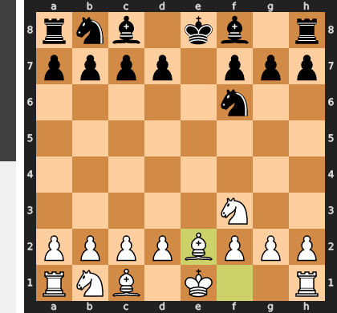

Played **Bxe2**.

### Move 6 (Black): Bc5 - Good 👍

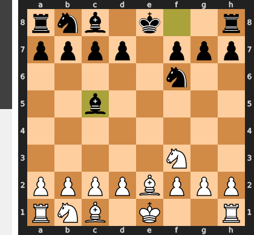

Played **Bc5**. The engine recommended **d5**.

### Move 7 (White): O-O - Good 👍

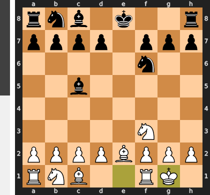

Played **O-O**. The engine recommended **d4**.

### Move 7 (Black): d6 - Good 👍

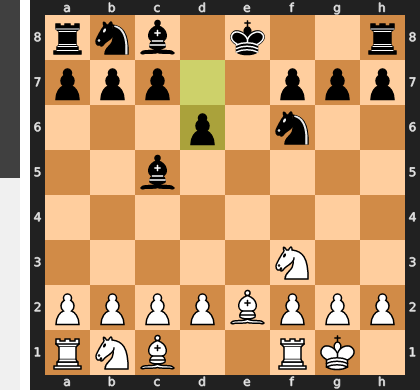

Played **d6**. The engine recommended **Nc6**.

### Move 8 (White): Nc3 - Good 👍

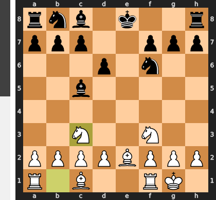

Played **Nc3**. The engine recommended **d4**.

### Move 8 (Black): Nc6 - Best Move ✅

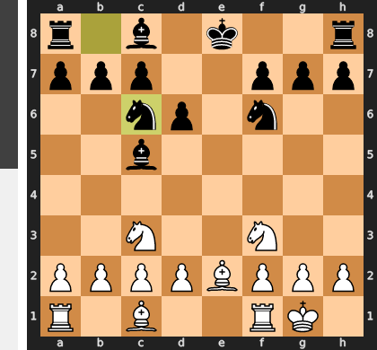

Played **Nc6**.

### Move 9 (White): d3 - Best Move ✅

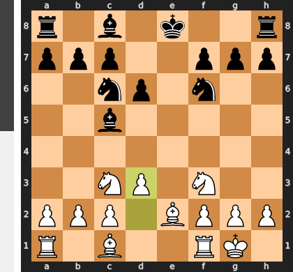

Played **d3**.

### Move 9 (Black): Ng4 - Inaccuracy ⁈

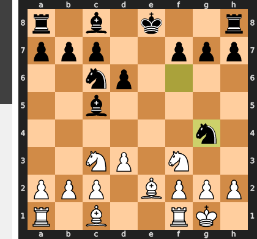

Played **Ng4**. The engine recommended **h6**.

### Move 10 (White): Bg5 - Good 👍

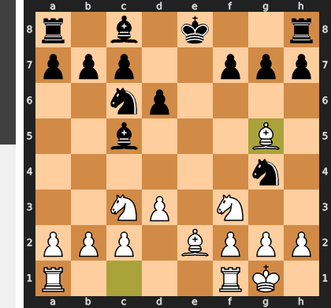

Played **Bg5**. The engine recommended **Nd5**.

### Move 10 (Black): Bxf2+ - Mistake ❓

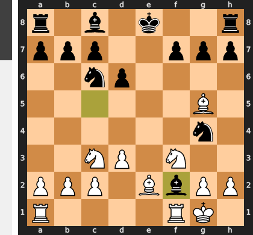

This flashy check is a costly miscalculation, as it trades a critical attacking bishop for a mere pawn and completely extinguishes Black's initiative. After White's simple recapture with the rook, Black's once-threatening knight on g4 is left stranded without a partner, transforming from a key attacker into a liability that can now be easily targeted.

### Move 11 (White): Rxf2 - Best Move ✅

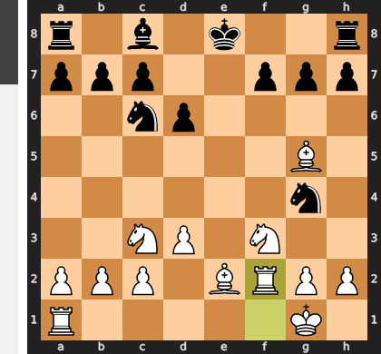

Played **Rxf2**.

### Move 11 (Black): Nxf2 - Best Move ✅

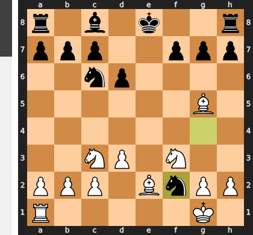

Played **Nxf2**.

### Move 12 (White): Kxf2 - Best Move ✅

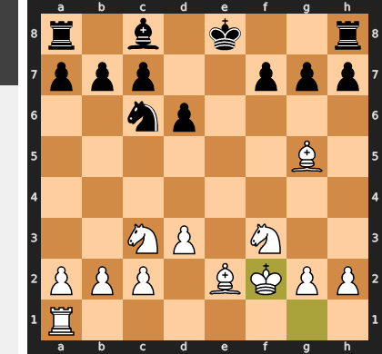

Played **Kxf2**.

### Move 12 (Black): O-O - Good 👍

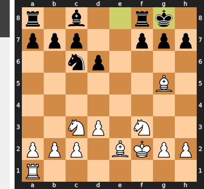

Played **O-O**. The engine recommended **f6**.

### Move 13 (White): Re1 - Good 👍

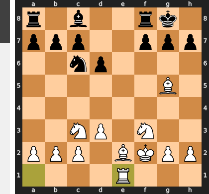

Played **Re1**. The engine recommended **Bd2**.

### Move 13 (Black): Bg4 - Best Move ✅

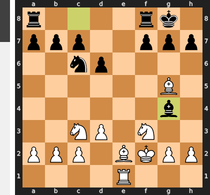

Played **Bg4**.

### Move 14 (White): h3 - Good 👍

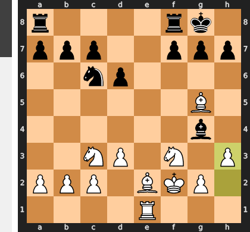

Played **h3**. The engine recommended **Nd5**.

### Move 14 (Black): Bxf3 - Best Move ✅

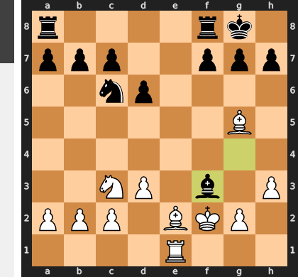

Played **Bxf3**.

### Move 15 (White): Bxf3 - Best Move ✅

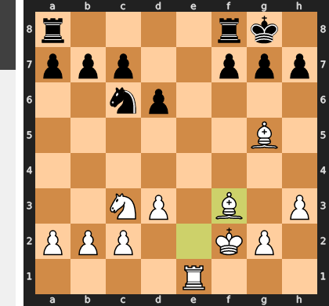

Played **Bxf3**.

### Move 15 (Black): Rae8 - Good 👍

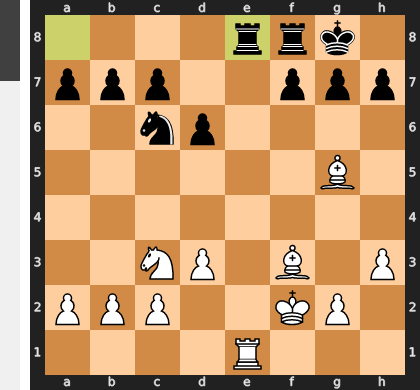

Played **Rae8**. The engine recommended **Ne5**.

### Move 16 (White): Nd5 - Mistake ❓

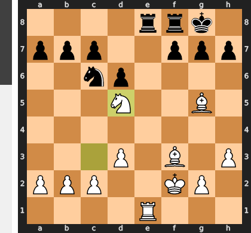

While placing the knight on the beautiful d5 square is tempting, it's a critical positional mistake because it allows Black to force a favorable simplification with ...Rxe1 followed by ...Nxd5. This sequence trades off White's most dominant piece—the very source of the advantage—and completely relieves the suffocating pressure on Black's cramped position. The superior Be3 would have maintained this tension, kept the powerful knight alive, and prepared to challenge for the e-file, preserving the winning bind.

### Move 16 (Black): Rxe1 - Best Move ✅

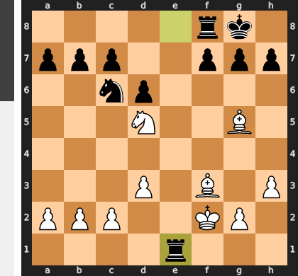

Played **Rxe1**.

### Move 17 (White): Kxe1 - Best Move ✅

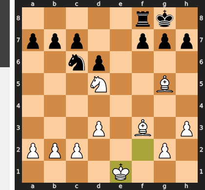

Played **Kxe1**.

### Move 17 (Black): Re8+ - Mistake ❓

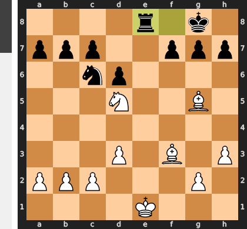

This check is a critical waste of a tempo that only helps your opponent; after the forced Kd2, White's king is actually safer and more centralized. The fundamental problem in the position is White's monstrous knight on d5, and by failing to challenge it with the active `...Nd4`, you have abdicated the central fight for a harmless check, allowing White to consolidate his crushing positional advantage.

### Move 18 (White): Kf2 - Mistake ❓

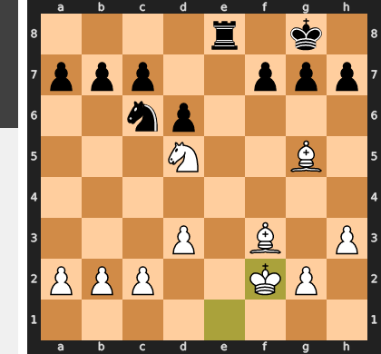

The move Kf2 is a mistake because it needlessly exposes the king to Black's only source of counterplay: the rook on the e-file. By stepping onto the second rank, the king becomes a potential target for checks and allows Black to activate his rook with a move like ...Re4, creating unnecessary complications. The correct Kd1 is a precise prophylactic move, tucking the king safely away from the e-file, completely neutralizing Black's plans and allowing White to focus on the simple conversion of his decisive positional advantage.

### Move 18 (Black): b5 - Mistake ❓

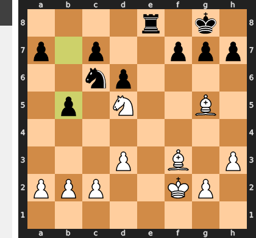

This move is a disastrous positional mistake that creates an immediate, game-ending tactical weakness. By pushing the b-pawn, you have removed the only pawn defender of your c6-knight, which was already under immense pressure; this allows White's knight to simply capture on c7, leading to the collapse of your entire position. The correct idea was the active `...Nd4`, which correctly identifies White's f3-bishop as the key attacking piece and seeks to challenge it, rather than creating a fatal weakness on the queenside.

### Move 19 (White): Nxc7 - Best Move ✅

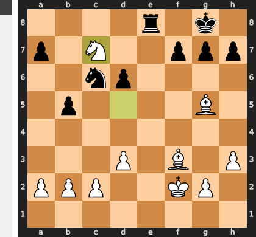

Played **Nxc7**.

### Move 19 (Black): Re5 - Best Move ✅

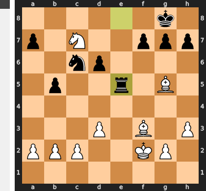

Played **Re5**.

### Move 20 (White): Bxc6 - Inaccuracy ⁈

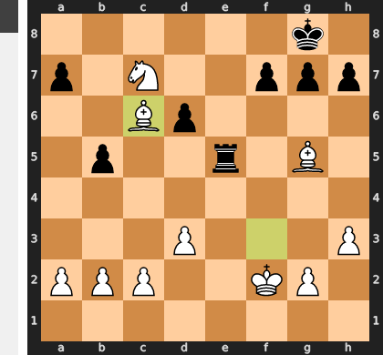

Played **Bxc6**. The engine recommended **Be3**.

### Move 20 (Black): Rxg5 - Good 👍

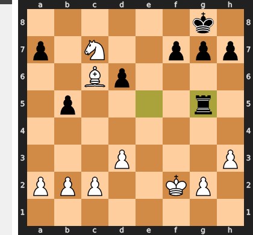

Played **Rxg5**. The engine recommended **Rc5**.

### Move 21 (White): Bxb5 - Blunder ❌

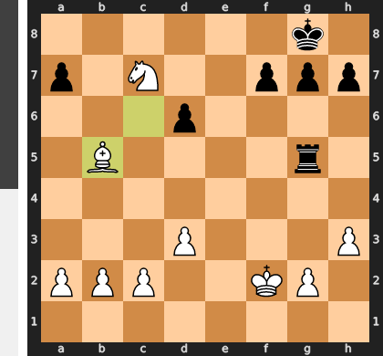

White fatally misunderstood that the paralyzing knight on c7 was the entire source of his winning advantage. The blunder Bxb5 allows Black to respond with ...axb5, which crucially opens the a-file for his rook to swing over to c5 and force the exchange of that very knight. Instead of sacrificing the knight on his own terms with Nxb5 to shatter Black's structure, White has given Black the tools to eliminate the critical piece and completely equalize.

### Move 21 (Black): Rf5+ - Mistake ❓

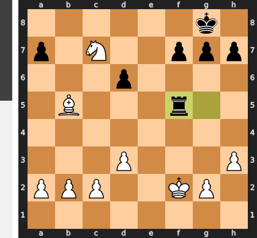

This check is a critical mistake because it's purposeless; after the trivial reply Ke2, White's king is actually safer and Black has solved none of his structural problems, namely the monstrous c7-knight. The correct path was the active Rc5, which immediately challenges White's dominant bishop, offering to favorably liquidate the chronic d6-pawn weakness and fight for central control. Black chose an empty threat over a deep positional solution.

### Move 22 (White): Ke3 - Best Move ✅

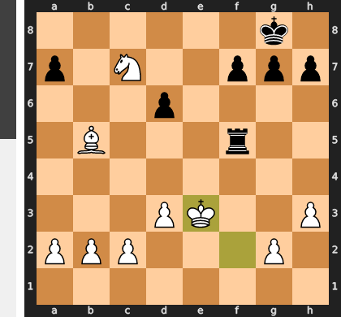

Played **Ke3**.

### Move 22 (Black): Re5+ - Mistake ❓

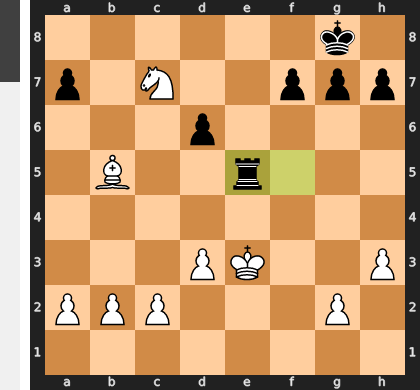

This check is a classic case of misplaced activity, as it solves White's only real problem—the slightly vulnerable king—by forcing it to the superior d2-square. With the king now perfectly safe and centralized, Black's rook is left aimless on e5, and White is free to convert the decisive positional advantage of his dominant knight and bishop unopposed.

### Move 23 (White): Kd4 - Best Move ✅

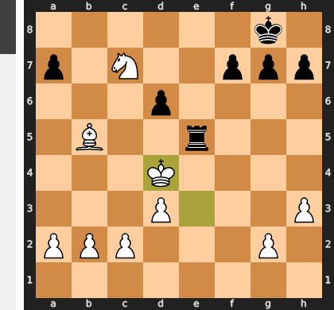

Played **Kd4**.

### Move 23 (Black): Rc5 - Good 👍

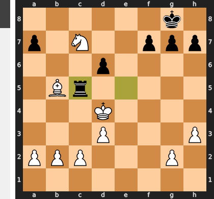

Played **Rc5**. The engine recommended **Rg5**.

