# Chess Game Analysis: kar2on vs streetballandone

- **Result:** 1-0
- **Date:** 2026.04.04
- **Opening:** Sicilian Defense Old Sicilian Variation 3.Bc4

### Move 1 (White): e4 - Best Move ✅

Played **e4**.

### Move 1 (Black): c5 - Good 👍

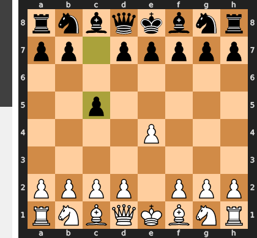

Played **c5**. The engine recommended **e5**.

### Move 2 (White): Nf3 - Best Move ✅

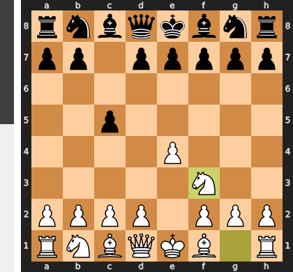

Played **Nf3**.

### Move 2 (Black): Nc6 - Best Move ✅

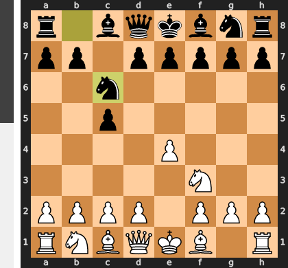

Played **Nc6**.

### Move 3 (White): Bc4 - Good 👍

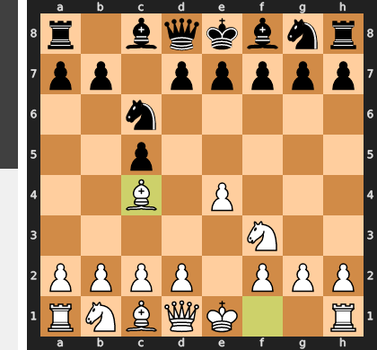

Played **Bc4**. The engine recommended **d4**.

### Move 3 (Black): Nf6 - Good 👍

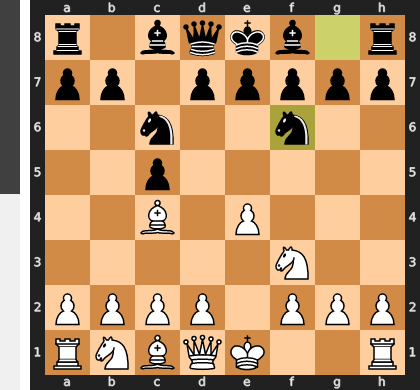

Played **Nf6**. The engine recommended **e6**.

### Move 4 (White): Nc3 - Good 👍

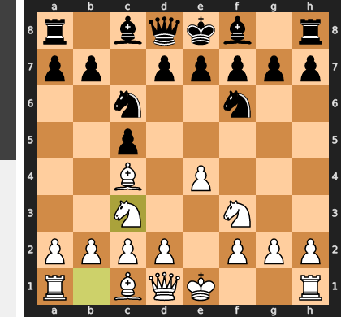

Played **Nc3**. The engine recommended **e5**.

### Move 4 (Black): d5 - Mistake ❓

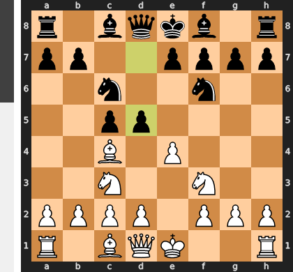

The central challenge with ...d5 is premature, as it leads to a forced sequence of exchanges (exd5 Nxd5, Nxd5 Qxd5) that leaves your queen dangerously exposed in the center. This allows me to immediately seize the initiative with d4!, gaining a critical tempo against your queen and unleashing my pieces into a now-favorable open position. The more circumspect ...e6 was correct, solidifying your center and blunting my dangerous c4 bishop before committing to a central break.

### Move 5 (White): exd5 - Best Move ✅

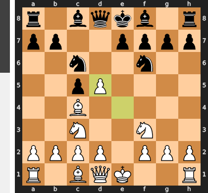

Played **exd5**.

### Move 5 (Black): Bg4 - Blunder ❌

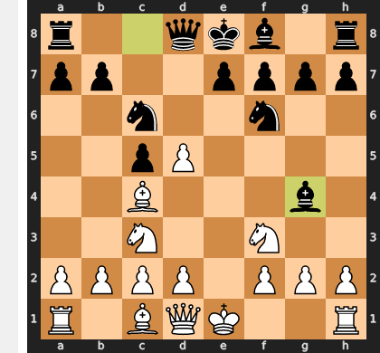

This pin is a fatal miscalculation, as the f3-knight isn't truly pinned. White's simple reply `dxc6` completely refutes Black's idea by forcibly removing the crucial c6-knight, which was the primary defender of the d4 square and the glue holding Black's position together. After the forced `...bxc6`, Black's structure is permanently ruined and White's pieces, particularly the bishop on c4, gain overwhelming scope for a decisive attack.

### Move 6 (White): dxc6 - Best Move ✅

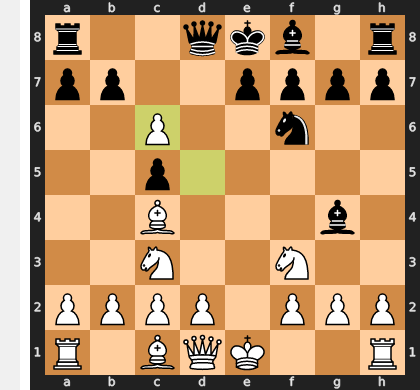

Played **dxc6**.

### Move 6 (Black): bxc6 - Inaccuracy ⁈

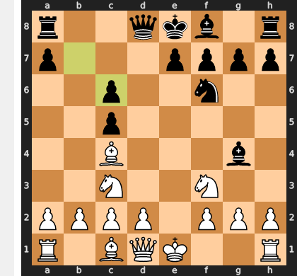

Played **bxc6**. The engine recommended **e6**.

### Move 7 (White): Be2 - Good 👍

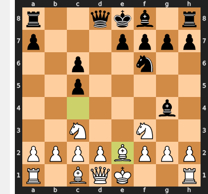

Played **Be2**. The engine recommended **Ne5**.

### Move 7 (Black): Bxf3 - Good 👍

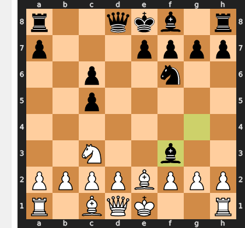

Played **Bxf3**. The engine recommended **e5**.

### Move 8 (White): Bxf3 - Best Move ✅

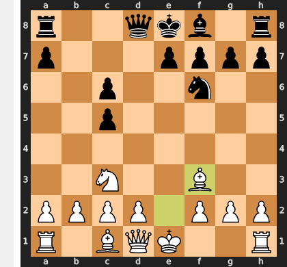

Played **Bxf3**.

### Move 8 (Black): Qd4 - Mistake ❓

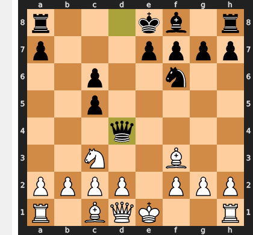

While placing the queen on d4 seems active, it is a devastating tactical blunder that abandons the critical c6-pawn. This allows White the simple but crushing `Bxc6+` fork, which after the forced recapture, leads to the loss of the a8-rook and the complete collapse of Black's position. The recommended `...Nd5` was essential, as it would have challenged White's central control instead of allowing this decisive tactical shot.

### Move 9 (White): Bxc6+ - Best Move ✅

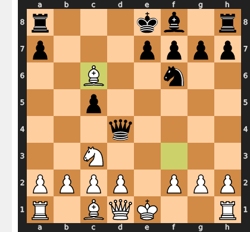

Played **Bxc6+**.

### Move 9 (Black): Kd8 - Good 👍

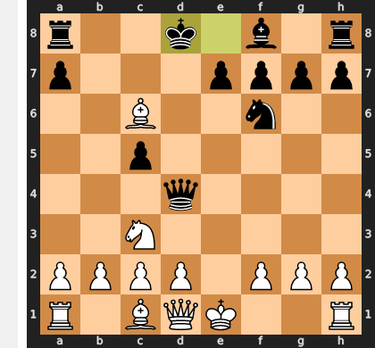

Played **Kd8**. The engine recommended **Nd7**.

### Move 10 (White): Bxa8 - Best Move ✅

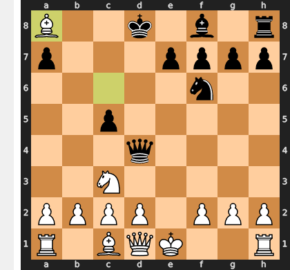

Played **Bxa8**.

### Move 10 (Black): Qe5+ - Good 👍

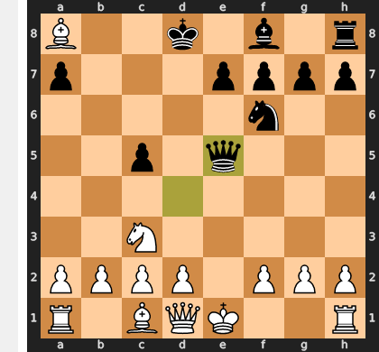

Played **Qe5+**. The engine recommended **e6**.

### Move 11 (White): Qe2 - Best Move ✅

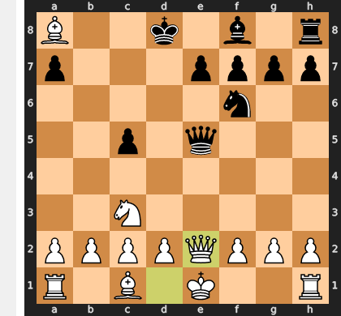

Played **Qe2**.

### Move 11 (Black): Qxe2+ - Best Move ✅

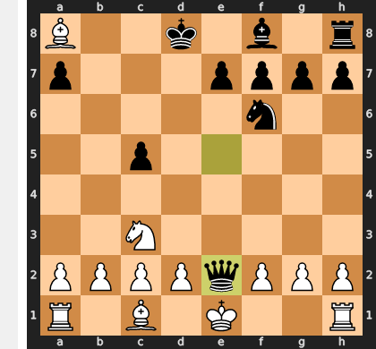

Played **Qxe2+**.

### Move 12 (White): Nxe2 - Good 👍

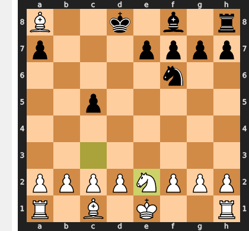

Played **Nxe2**. The engine recommended **Kxe2**.

### Move 12 (Black): e5 - Good 👍

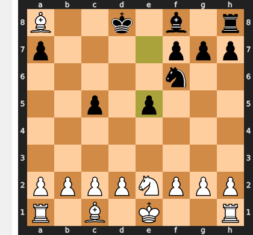

Played **e5**. The engine recommended **e6**.

### Move 13 (White): O-O - Good 👍

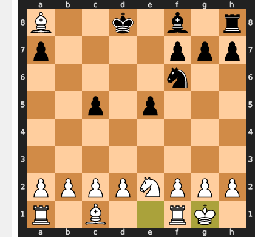

Played **O-O**. The engine recommended **d3**.

### Move 13 (Black): Bd6 - Good 👍

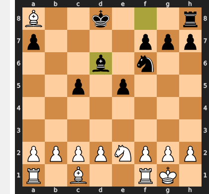

Played **Bd6**. The engine recommended **c4**.

### Move 14 (White): Bf3 - Mistake ❓

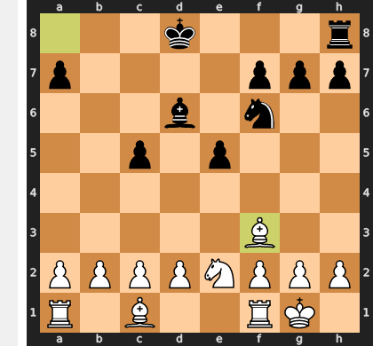

The move Bf3 is a step in the wrong direction, as it passively defends the e4-pawn while critically obstructing White's own f-pawn. White's decisive plan involves playing a quick f4-f5 to rip open the f-file against the exposed black king, a strategy which Bf3 now hinders. This gives Black a crucial tempo to begin consolidating his king position with ...Ke7, diminishing the force of White's otherwise overwhelming attack.

### Move 14 (Black): e4 - Best Move ✅

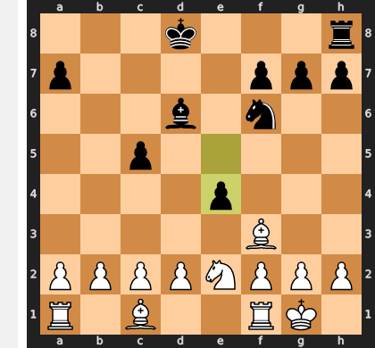

Played **e4**.

### Move 15 (White): Bg4 - Inaccuracy ⁈

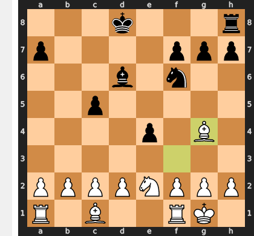

Played **Bg4**. The engine recommended **Bxe4**.

### Move 15 (Black): h5 - Mistake ❓

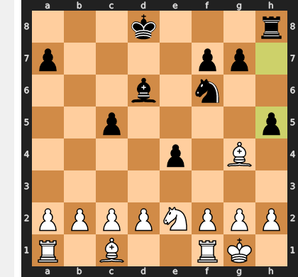

This move is a classic case of treating the symptom instead of the disease. The bishop on g4 is the disease, and ...h5 merely allows it to sidestep to h3, where it remains a monstrously powerful piece, now staring down the newly weakened g6-square. The correct path was to perform surgery with ...Nxg4; while this opens the h-file for an attack, it eliminates the primary source of Black's positional suffocation and gives him a fighting chance to defend.

### Move 16 (White): Bh3 - Good 👍

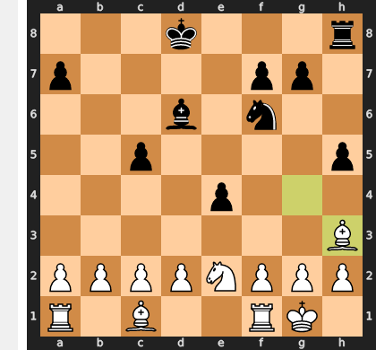

Played **Bh3**. The engine recommended **Bf5**.

### Move 16 (Black): g5 - Good 👍

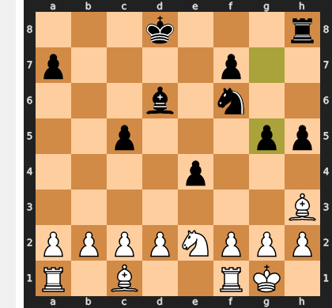

Played **g5**. The engine recommended **Ng4**.

### Move 17 (White): g3 - Good 👍

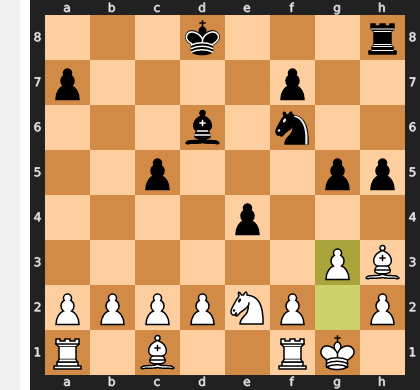

Played **g3**. The engine recommended **Bf5**.

### Move 17 (Black): g4 - Best Move ✅

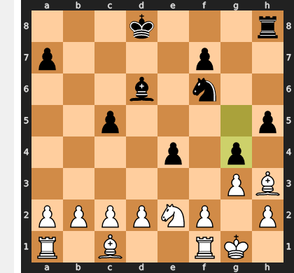

Played **g4**.

### Move 18 (White): Bg2 - Best Move ✅

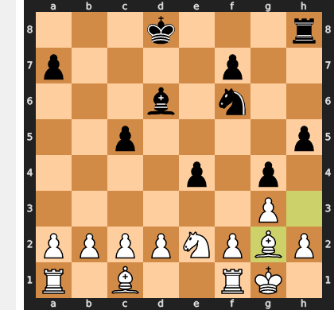

Played **Bg2**.

### Move 18 (Black): Re8 - Good 👍

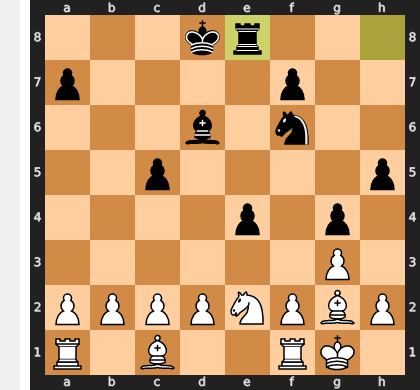

Played **Re8**. The engine recommended **h4**.

### Move 19 (White): Re1 - Good 👍

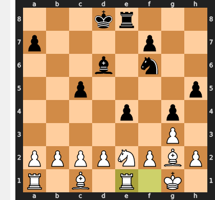

Played **Re1**. The engine recommended **d3**.

### Move 19 (Black): e3 - Inaccuracy ⁈

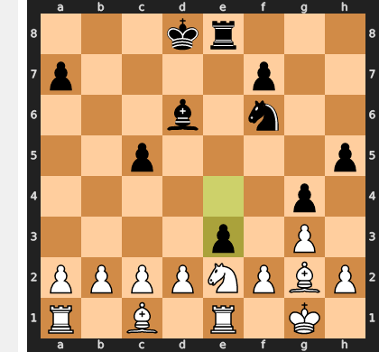

Played **e3**. The engine recommended **c4**.

### Move 20 (White): dxe3 - Best Move ✅

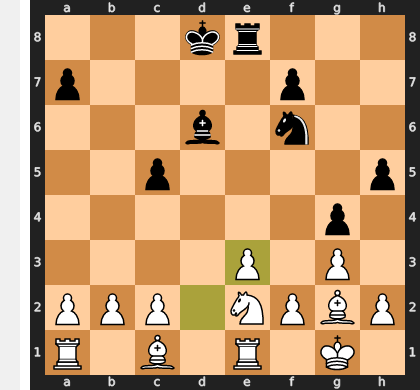

Played **dxe3**.

### Move 20 (Black): Ne4 - Good 👍

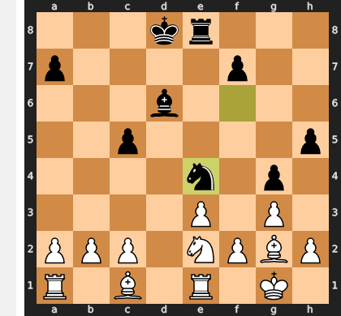

Played **Ne4**. The engine recommended **Kc8**.

