# Chess Game Analysis: kar2on vs brojustwin

- **Result:** 0-1
- **Date:** 2026.04.03
- **Opening:** Pirc Defense Modern Defense Geller System 2...Nf6

### Move 1 (White): e4 - Best Move ✅

Played **e4**.

### Move 1 (Black): d6 - Good 👍

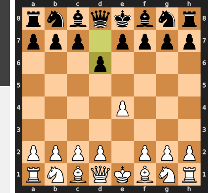

Played **d6**. The engine recommended **e5**.

### Move 2 (White): Nf3 - Good 👍

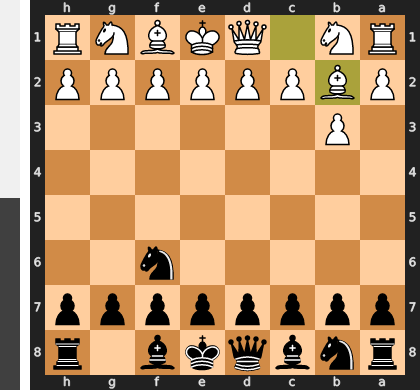

Played **Nf3**. The engine recommended **d4**.

### Move 2 (Black): Nf6 - Best Move ✅

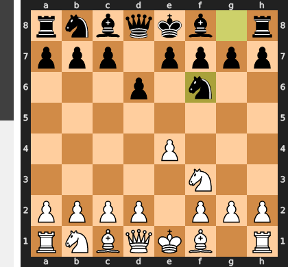

Played **Nf6**.

### Move 3 (White): Bc4 - Mistake ❓

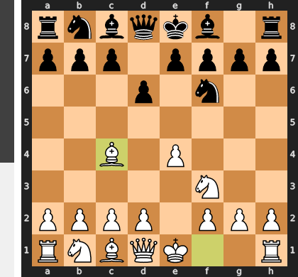

While 3.Bc4 is a standard move in the Italian Game, it is a tactical error in this specific position because the bishop becomes an immediate target. Black can now seize the initiative with the thematic 3...Nxe4!, and after 4.Nxe4, the pawn fork 4...d5 recovers the piece with interest. This sequence forcibly liquidates White's strong central e-pawn, leaving Black with a superior pawn structure and a clear positional advantage.

### Move 3 (Black): h6 - Mistake ❓

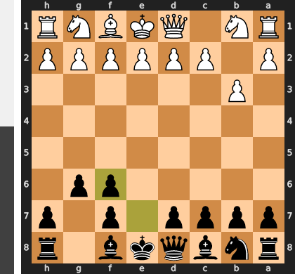

Black's move `...h6` is a critical misunderstanding of the central tension, wasting a vital tempo on a needless prophylactic move. The position was screaming for the tactical shot `...Nxe4!`, which would have immediately challenged White's entire setup by forcing the trade of the dangerous c4-bishop after the powerful `...d5` fork. By choosing to play on the flank, Black misses this fleeting opportunity and allows White to consolidate, turning a promising position for Black into a clear advantage for White.

### Move 4 (White): Nc3 - Best Move ✅

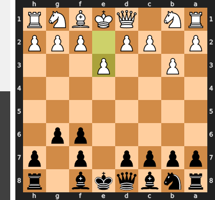

Played **Nc3**.

### Move 4 (Black): e5 - Good 👍

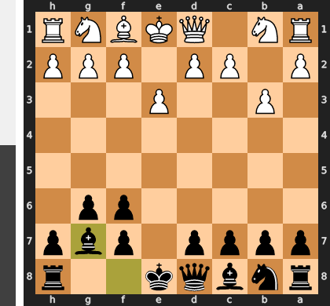

Played **e5**. The engine recommended **e6**.

### Move 5 (White): d3 - Good 👍

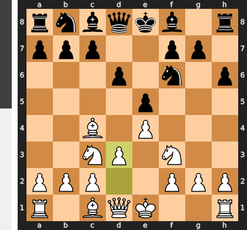

Played **d3**. The engine recommended **d4**.

### Move 5 (Black): Nbd7 - Good 👍

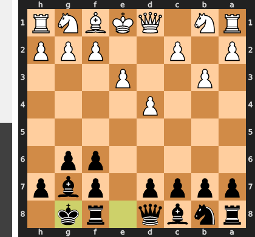

Played **Nbd7**. The engine recommended **Be7**.

### Move 6 (White): O-O - Good 👍

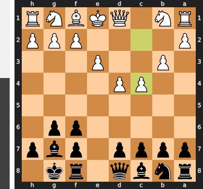

Played **O-O**. The engine recommended **a4**.

### Move 6 (Black): g5 - Inaccuracy ⁈

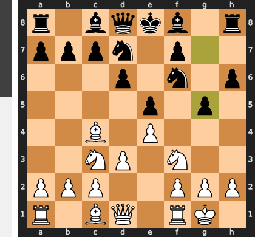

Played **g5**. The engine recommended **c6**.

### Move 7 (White): Nd5 - Inaccuracy ⁈

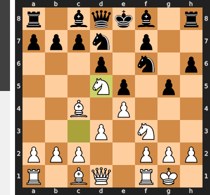

Played **Nd5**. The engine recommended **Ne2**.

### Move 7 (Black): c6 - Inaccuracy ⁈

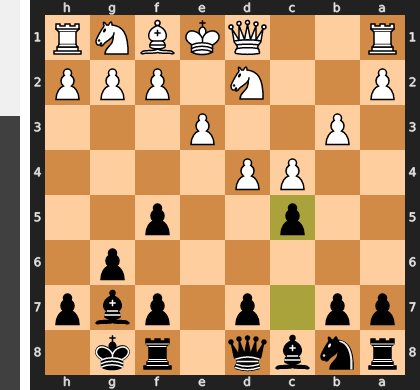

Played **c6**. The engine recommended **Nxd5**.

### Move 8 (White): Nxf6+ - Good 👍

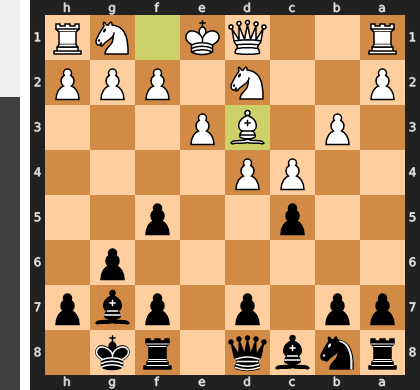

Played **Nxf6+**. The engine recommended **Ne3**.

### Move 8 (Black): Nxf6 - Best Move ✅

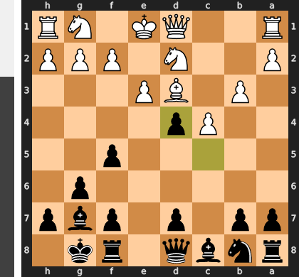

Played **Nxf6**.

### Move 9 (White): d4 - Best Move ✅

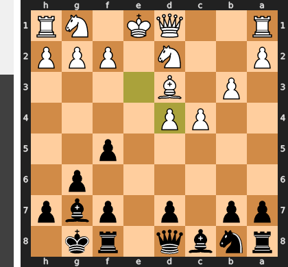

Played **d4**.

### Move 9 (Black): Qe7 - Good 👍

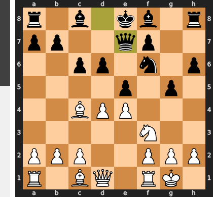

Played **Qe7**. The engine recommended **Bg7**.

### Move 10 (White): dxe5 - Best Move ✅

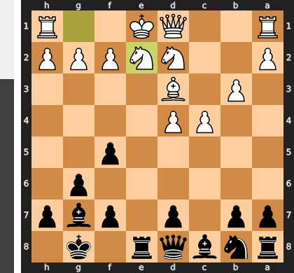

Played **dxe5**.

### Move 10 (Black): dxe5 - Best Move ✅

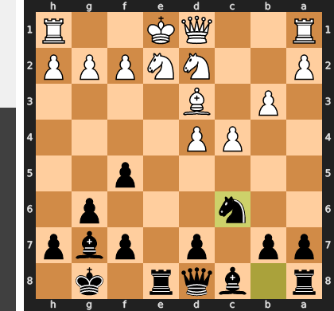

Played **dxe5**.

### Move 11 (White): Be3 - Good 👍

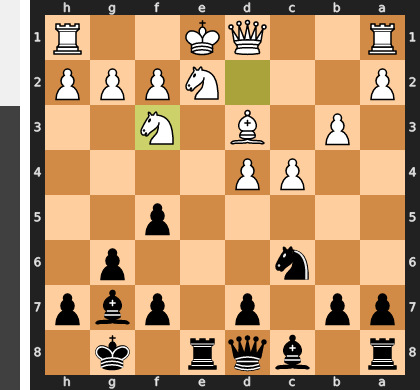

Played **Be3**. The engine recommended **Qe2**.

### Move 11 (Black): Bg4 - Good 👍

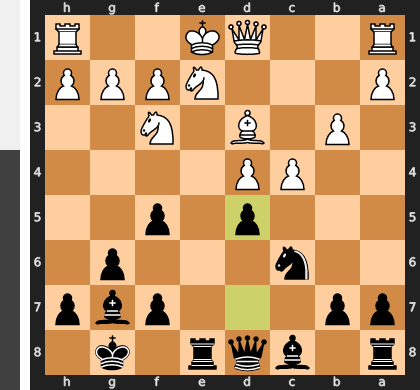

Played **Bg4**. The engine recommended **Bg7**.

### Move 12 (White): c3 - Inaccuracy ⁈

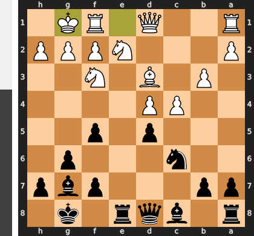

Played **c3**. The engine recommended **Qd3**.

### Move 12 (Black): Qd7 - Mistake ❓

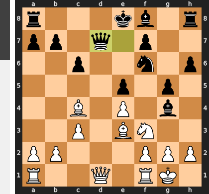

This move is a positional and tactical blunder because it fails to resolve the central tension and instead walks into a devastating tactical shot. By playing the passive ...Qd7, Black allows White to play the powerful sacrifice Nxe5!, which blows open the center and exploits the alignment of Black's queen and uncastled king after ...dxe5 Qxd7+. The correct approach was the active ...Nxe4, using the pin on the f3-knight to immediately dismantle White's central control and seize the initiative.

### Move 13 (White): Qxd7+ - Mistake ❓

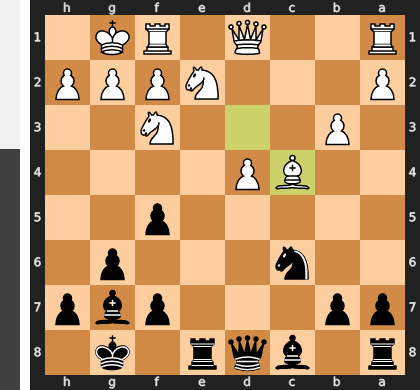

The move Qxd7+ is a strategic error because it voluntarily trades queens, releasing all the accumulated pressure on the black king and liquidating a dynamic attacking advantage into a roughly equal endgame. By keeping the queens on the board with the far superior Nxe5, White could have shattered Black's central defenses (as ...fxe5 is met by Qxe5) and exploited the exposed king before Black has a chance to consolidate.

### Move 13 (Black): Nxd7 - Best Move ✅

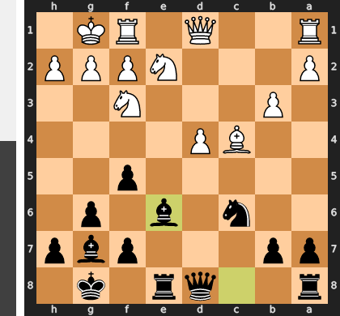

Played **Nxd7**.

### Move 14 (White): Nd2 - Good 👍

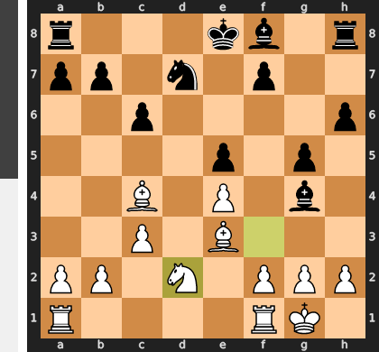

Played **Nd2**. The engine recommended **Rfd1**.

### Move 14 (Black): b5 - Inaccuracy ⁈

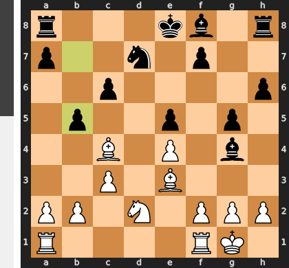

Played **b5**. The engine recommended **Bc5**.

### Move 15 (White): Bb3 - Good 👍

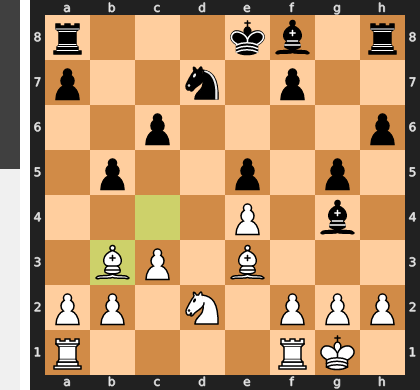

Played **Bb3**. The engine recommended **h3**.

### Move 15 (Black): Bc5 - Good 👍

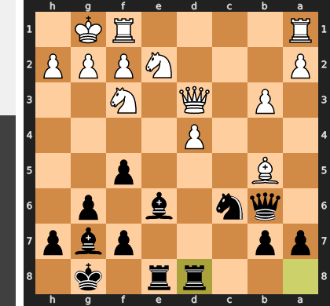

Played **Bc5**. The engine recommended **Nc5**.

### Move 16 (White): Bxc5 - Mistake ❓

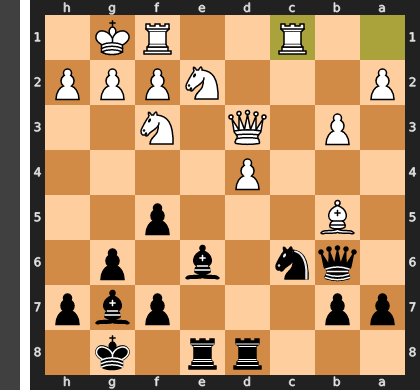

Played **Bxc5**. The engine recommended **a4**.

### Move 16 (Black): Nxc5 - Best Move ✅

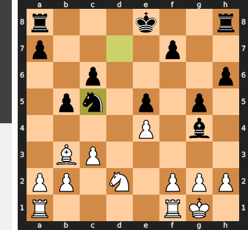

Played **Nxc5**.

### Move 17 (White): f3 - Best Move ✅

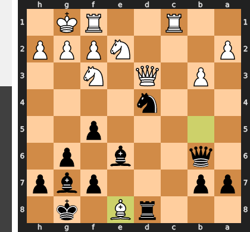

Played **f3**.

### Move 17 (Black): Be6 - Good 👍

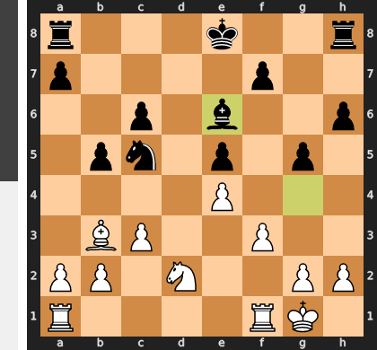

Played **Be6**. The engine recommended **O-O-O**.

### Move 18 (White): Bxe6 - Best Move ✅

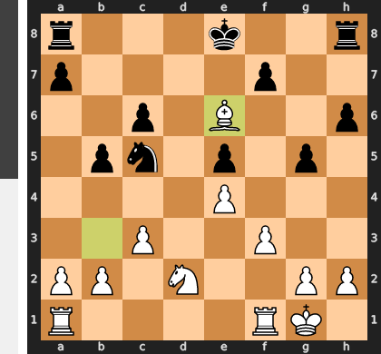

Played **Bxe6**.

### Move 18 (Black): Nxe6 - Best Move ✅

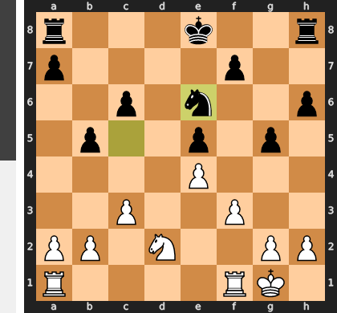

Played **Nxe6**.

### Move 19 (White): Nb3 - Good 👍

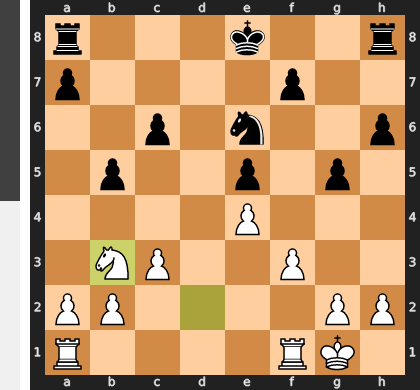

Played **Nb3**. The engine recommended **a4**.

### Move 19 (Black): O-O-O - Good 👍

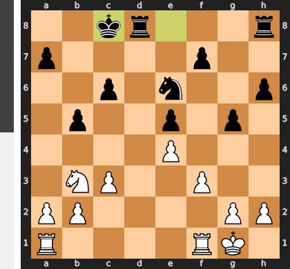

Played **O-O-O**. The engine recommended **Kd7**.

### Move 20 (White): Rad1 - Good 👍

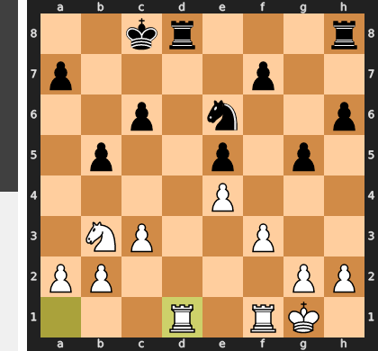

Played **Rad1**. The engine recommended **a4**.

### Move 20 (Black): Rxd1 - Good 👍

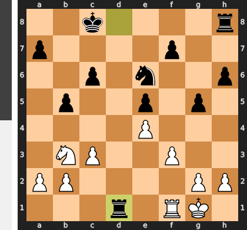

Played **Rxd1**. The engine recommended **h5**.

### Move 21 (White): Rxd1 - Best Move ✅

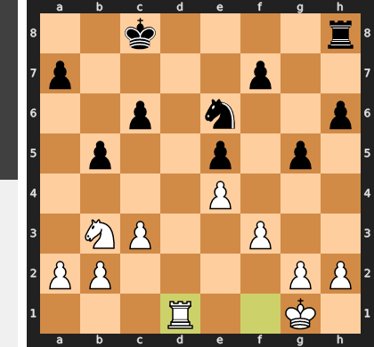

Played **Rxd1**.

### Move 21 (Black): Rd8 - Good 👍

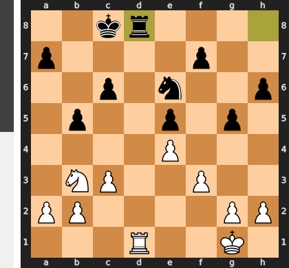

Played **Rd8**. The engine recommended **h5**.

### Move 22 (White): Rxd8+ - Best Move ✅

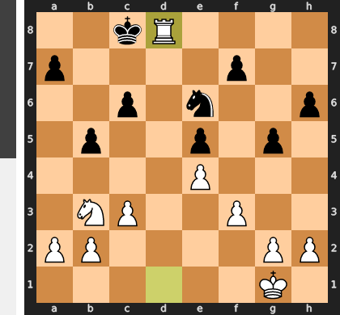

Played **Rxd8+**.

### Move 22 (Black): Nxd8 - Good 👍

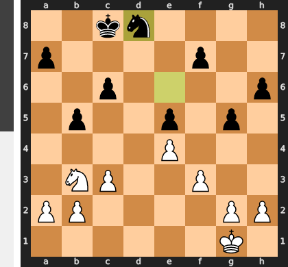

Played **Nxd8**. The engine recommended **Kxd8**.

### Move 23 (White): Nc5 - Best Move ✅

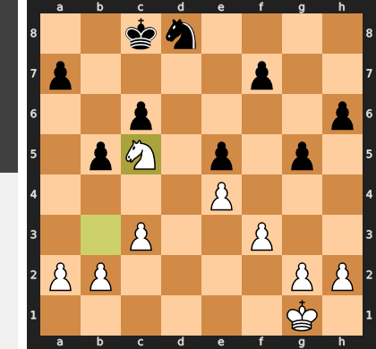

Played **Nc5**.

### Move 23 (Black): Kc7 - Best Move ✅

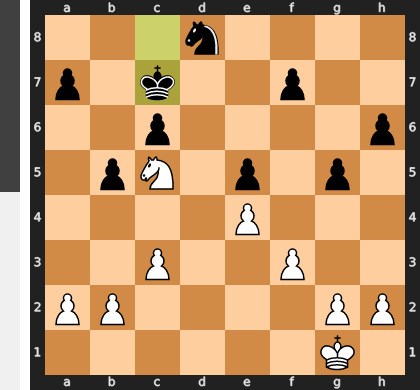

Played **Kc7**.

### Move 24 (White): b4 - Good 👍

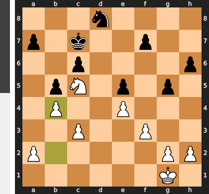

Played **b4**. The engine recommended **Nd3**.

### Move 24 (Black): Kb6 - Mistake ❓

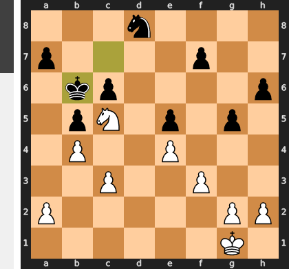

By playing Kb6, the king voluntarily sidelines itself on the queenside, becoming a passive target within the sphere of influence of White's dominant c5-knight. This critical loss of a tempo abandons central control and grants White's king a free path to infiltrate via Kf2-e3-d4, transforming it into the decisive attacking piece. The correct Kd6 would have used the king as a powerful central blockader, challenging White's ambitions directly and holding the fragile position together.

### Move 25 (White): Kf2 - Mistake ❓

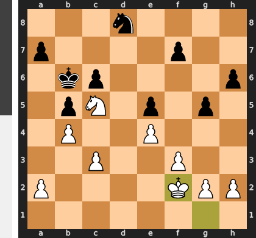

This move is a classic case of mistaken timing; while activating the king is a correct long-term plan, Kf2 is too slow and neglects the urgent, concrete needs of the position. It critically allows Black to play ...a5!, creating an opportunity to challenge the queenside and trade off White's monstrously powerful c5-knight with ...Ne6. The winning move, Nd7+, was a forcing conversion that immediately cashed in the positional advantage for a decisive endgame edge, before Black could organize this very defense.

### Move 25 (Black): Kc7 - Best Move ✅

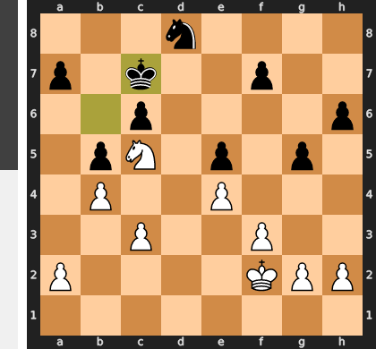

Played **Kc7**.

### Move 26 (White): Ke3 - Good 👍

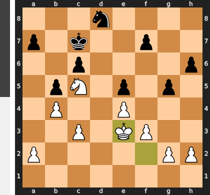

Played **Ke3**. The engine recommended **Kg1**.

### Move 26 (Black): Kd6 - Best Move ✅

Played **Kd6**.

### Move 27 (White): h3 - Good 👍

Played **h3**. The engine recommended **a4**.

### Move 27 (Black): Ne6 - Best Move ✅

Played **Ne6**.

### Move 28 (White): Nxe6 - Best Move ✅

Played **Nxe6**.

### Move 28 (Black): Kxe6 - Best Move ✅

Played **Kxe6**.

### Move 29 (White): g3 - Good 👍

Played **g3**. The engine recommended **c4**.

### Move 29 (Black): Kd6 - Good 👍

Played **Kd6**. The engine recommended **c5**.

### Move 30 (White): a3 - Good 👍

Played **a3**. The engine recommended **f4**.

### Move 30 (Black): c5 - Best Move ✅

Played **c5**.

### Move 31 (White): Kd3 - Good 👍

Played **Kd3**. The engine recommended **g4**.

### Move 31 (Black): cxb4 - Good 👍

Played **cxb4**. The engine recommended **h5**.

### Move 32 (White): axb4 - Best Move ✅

Played **axb4**.

### Move 32 (Black): Kc6 - Best Move ✅

Played **Kc6**.

### Move 33 (White): c4 - Good 👍

Played **c4**. The engine recommended **g4**.

### Move 33 (Black): bxc4+ - Good 👍

Played **bxc4+**. The engine recommended **h5**.

### Move 34 (White): Kxc4 - Best Move ✅

Played **Kxc4**.

### Move 34 (Black): Kb6 - Mistake ❓

Kb6 is a grave positional mistake because it allows White to execute a decisive b4-b5 pawn push, which now dislodges the black king from its active post. This pawn break grants White's king free access to the c5-square, from which it completely dominates the queenside and supports its own passed pawn. The correct move, ...a6, was essential to prevent this b5-lever, thereby neutralizing White's primary winning plan and keeping the position balanced.

### Move 35 (White): Kb3 - Mistake ❓

By playing Kb3, White's king abdicates its control of the center and commits to a flawed plan on the queenside, where there is no breakthrough. This critical loss of tempo allows Black's king to become active and, more importantly, gives Black time to prepare the liberating ...f5 pawn break, completely dissolving White's positional advantage. The winning move, Kd5, would have seized the center, paralyzed the black king, and secured a decisive grip on the position.

### Move 35 (Black): f6 - Good 👍

Played **f6**. The engine recommended **Kb5**.

### Move 36 (White): Ka3 - Good 👍

Played **Ka3**. The engine recommended **Kc4**.

### Move 36 (Black): Kb5 - Good 👍

Played **Kb5**. The engine recommended **Kc6**.

### Move 37 (White): Kb3 - Best Move ✅

Played **Kb3**.

### Move 37 (Black): a5 - Blunder ❌

This move is a catastrophic positional blunder because it voluntarily breaks Black's own blockade of the queenside. After the inevitable bxa5 Kxa5, the white king is unleashed and decisively penetrates via the c4-square, where it will feast on the now-defenseless kingside pawns. By inviting White to open the position, Black has tragically transformed his own king from a vital blockader into a stranded spectator on the edge of the board.

### Move 38 (White): bxa5 - Best Move ✅

Played **bxa5**.

### Move 38 (Black): Kxa5 - Good 👍

Played **Kxa5**. The engine recommended **Kc5**.

### Move 39 (White): Kc4 - Best Move ✅

Played **Kc4**.

### Move 39 (Black): Ka6 - Good 👍

Played **Ka6**. The engine recommended **g4**.

### Move 40 (White): Kd5 - Best Move ✅

Played **Kd5**.

### Move 40 (Black): Ka5 - Good 👍

Played **Ka5**. The engine recommended **Kb5**.

### Move 41 (White): Ke6 - Best Move ✅

Played **Ke6**.

### Move 41 (Black): g4 - Good 👍

Played **g4**. The engine recommended **Kb4**.

