# Chess Game Analysis: kar2on vs bruhiamurs

- **Result:** 1-0
- **Date:** 2026.04.04
- **Opening:** Giuoco Piano Game 4.Nc3

### Move 1 (White): e4 - Best Move ✅

Played **e4**.

### Move 1 (Black): e5 - Best Move ✅

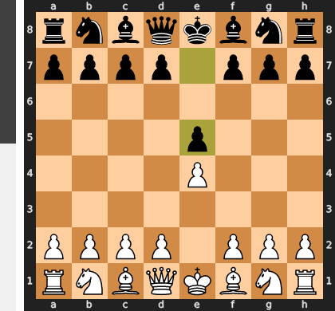

Played **e5**.

### Move 2 (White): Nf3 - Best Move ✅

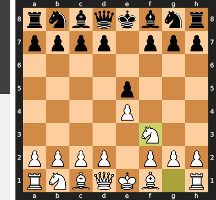

Played **Nf3**.

### Move 2 (Black): Nc6 - Best Move ✅

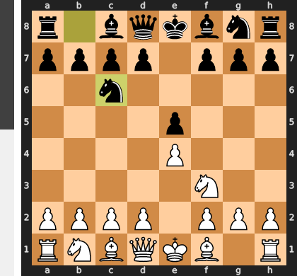

Played **Nc6**.

### Move 3 (White): Bc4 - Good 👍

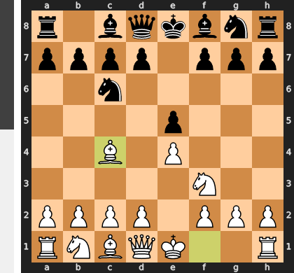

Played **Bc4**. The engine recommended **Bb5**.

### Move 3 (Black): Bc5 - Best Move ✅

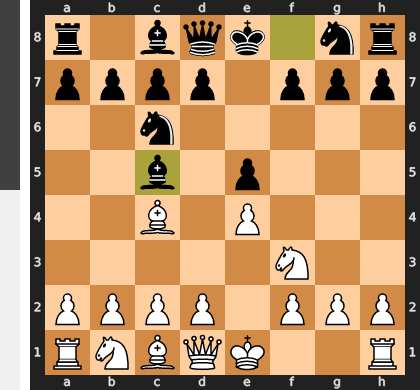

Played **Bc5**.

### Move 4 (White): Nc3 - Good 👍

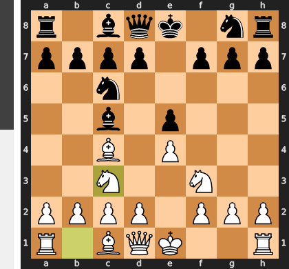

Played **Nc3**. The engine recommended **c3**.

### Move 4 (Black): f6 - Inaccuracy ⁈

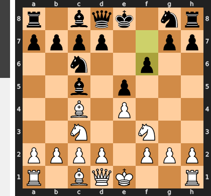

Played **f6**. The engine recommended **Nf6**.

### Move 5 (White): d3 - Good 👍

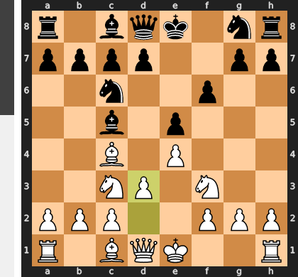

Played **d3**. The engine recommended **Nh4**.

### Move 5 (Black): Nge7 - Best Move ✅

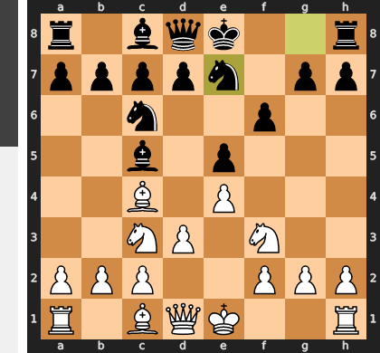

Played **Nge7**.

### Move 6 (White): Na4 - Good 👍

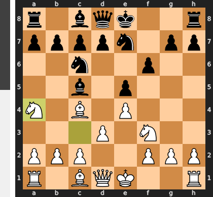

Played **Na4**. The engine recommended **Nd2**.

### Move 6 (Black): a6 - Blunder ❌

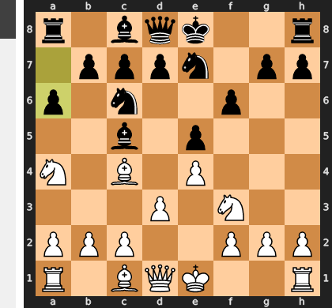

The move ...a6 is a grave positional misunderstanding, as the intended plan to retreat the bishop to a7 is far too slow. It completely ignores White's crushing response, Nxc5, which forces the ...dxc5 recapture and permanently shatters Black's queenside pawn structure. By failing to play the solid ...d6 first (which would prepare to meet Nxc5 with the much healthier ...bxc5 recapture), Black has transformed a dynamic, equal position into one with a chronic weakness on c5 and a fatal open d-file for White to exploit.

### Move 7 (White): Nxc5 - Best Move ✅

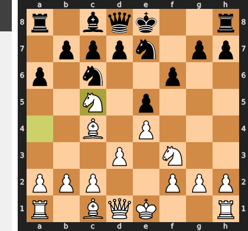

Played **Nxc5**.

### Move 7 (Black): b6 - Best Move ✅

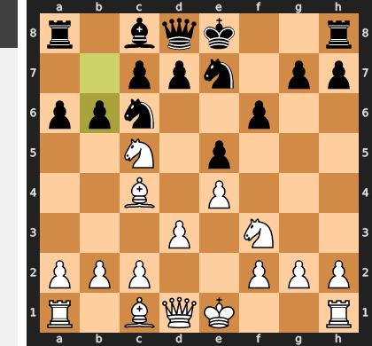

Played **b6**.

### Move 8 (White): Nb3 - Best Move ✅

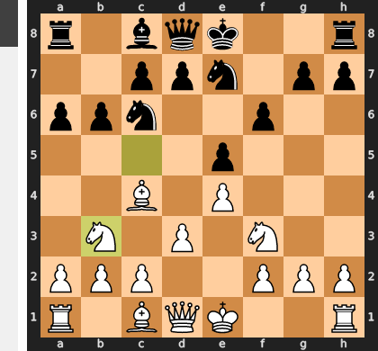

Played **Nb3**.

### Move 8 (Black): b5 - Best Move ✅

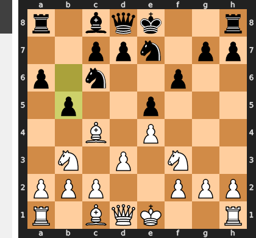

Played **b5**.

### Move 9 (White): Bd5 - Best Move ✅

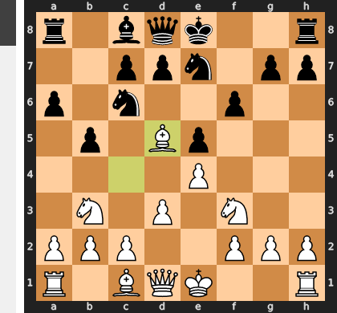

Played **Bd5**.

### Move 9 (Black): Nxd5 - Best Move ✅

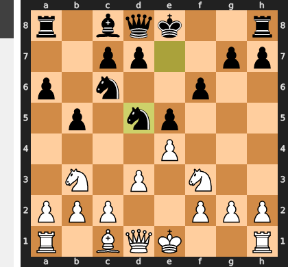

Played **Nxd5**.

### Move 10 (White): exd5 - Best Move ✅

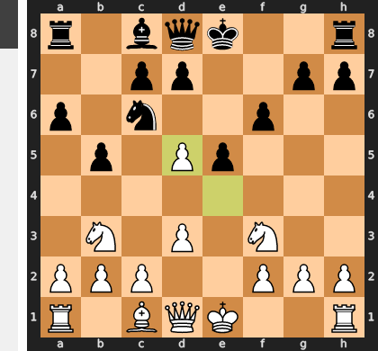

Played **exd5**.

### Move 10 (Black): Ne7 - Best Move ✅

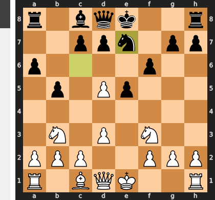

Played **Ne7**.

### Move 11 (White): O-O - Best Move ✅

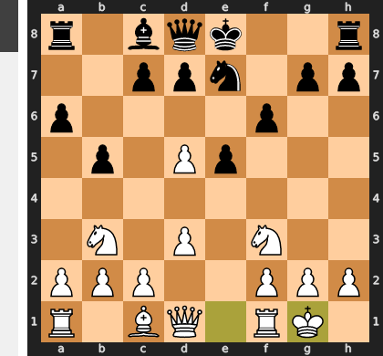

Played **O-O**.

### Move 11 (Black): Nxd5 - Mistake ❓

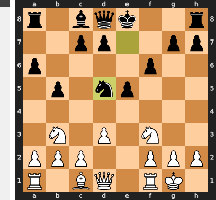

This is a grave positional error, as Black voluntarily trades his single best piece—the centralized d5-knight that was holding his position together. This exchange gifts White a dominant passed e-pawn after `exd5`, which fatally cramps Black's development and provides a clear, decisive long-term advantage. Instead of fighting for the center, Black has simply ceded it, leaving his remaining pieces passive and disorganized.

### Move 12 (White): Re1 - Mistake ❓

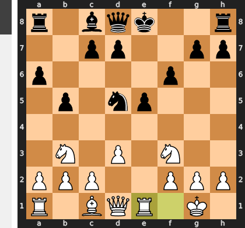

This was a mistake of passivity, failing to seize a fleeting tactical moment. The move Re1 improves the rook's position, but it gives Black time to solve the problem of their uncastled king. The correct move, the temporary sacrifice Nxe5, would have immediately punished Black by ripping open the center; the follow-up Qh5+ would then decisively exploit the exposed king, leading to a winning attack.

### Move 12 (Black): d6 - Good 👍

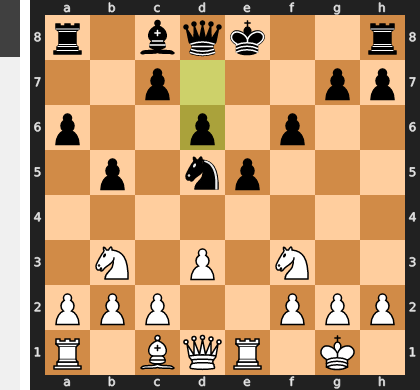

Played **d6**. The engine recommended **O-O**.

### Move 13 (White): d4 - Best Move ✅

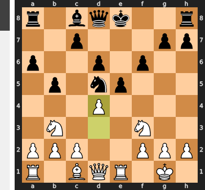

Played **d4**.

### Move 13 (Black): Bg4 - Good 👍

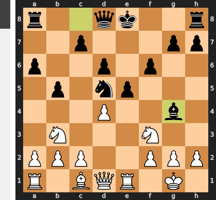

Played **Bg4**. The engine recommended **O-O**.

### Move 14 (White): h3 - Good 👍

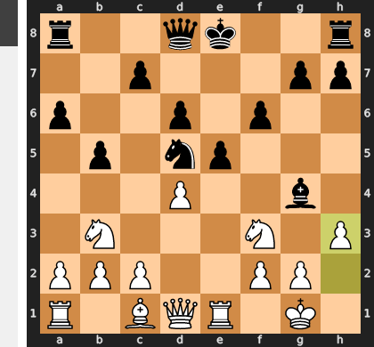

Played **h3**. The engine recommended **dxe5**.

### Move 14 (Black): Bxf3 - Mistake ❓

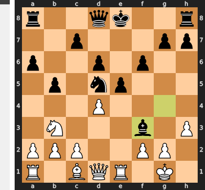

This trade is a major strategic concession, as you've voluntarily relinquished your most active minor piece, which was a critical supporter of your vital d5-knight. Instead of preserving this key asset with Bh5 to maintain the pressure, you have resolved the tension for White, who after recapturing will have a free hand to coordinate an attack against your now less-supported center.

### Move 15 (White): Qxf3 - Best Move ✅

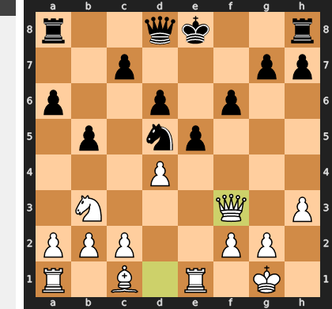

Played **Qxf3**.

### Move 15 (Black): c6 - Best Move ✅

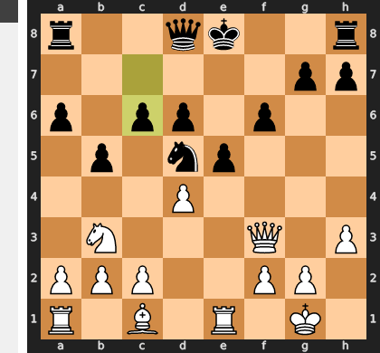

Played **c6**.

### Move 16 (White): dxe5 - Good 👍

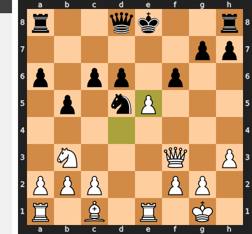

Played **dxe5**. The engine recommended **Qh5+**.

### Move 16 (Black): dxe5 - Good 👍

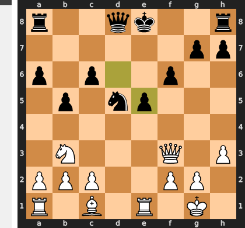

Played **dxe5**. The engine recommended **fxe5**.

### Move 17 (White): Nc5 - Inaccuracy ⁈

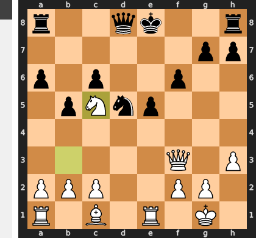

Played **Nc5**. The engine recommended **Qh5+**.

### Move 17 (Black): O-O - Good 👍

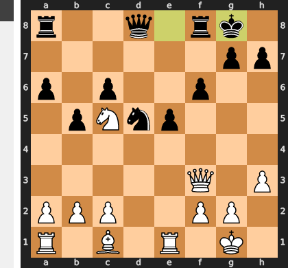

Played **O-O**. The engine recommended **Qe7**.

### Move 18 (White): Ne6 - Good 👍

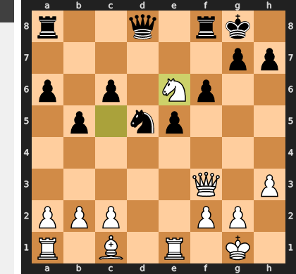

Played **Ne6**. The engine recommended **Qe2**.

### Move 18 (Black): Qa5 - Best Move ✅

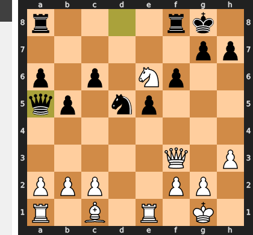

Played **Qa5**.

### Move 19 (White): Nxf8 - Blunder ❌

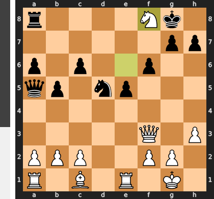

White's blunder was trading a monster attacking knight, which was the entire basis of the winning advantage, for a passive defensive rook. This exchange not only relieved all pressure on the Black king but fatally passed the initiative to Black. Now, after the simple ...Kxf8, Black's previously awkward queen and d5-knight are unleashed to create powerful threats against White's suddenly vulnerable king.

### Move 19 (Black): Qxe1+ - Best Move ✅

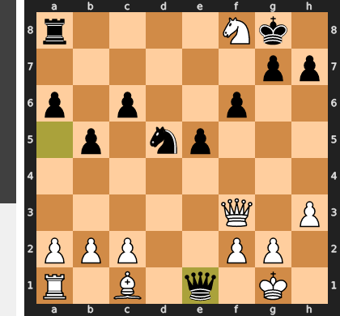

Played **Qxe1+**.

### Move 20 (White): Kh2 - Best Move ✅

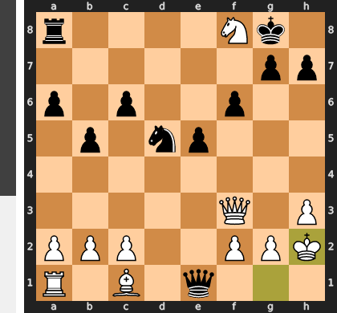

Played **Kh2**.

### Move 20 (Black): Kxf8 - Best Move ✅

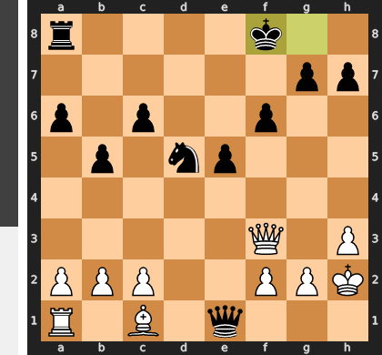

Played **Kxf8**.

### Move 21 (White): b3 - Good 👍

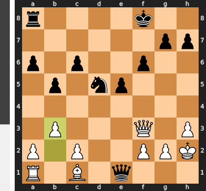

Played **b3**. The engine recommended **a4**.

### Move 21 (Black): Nf4 - Blunder ❌

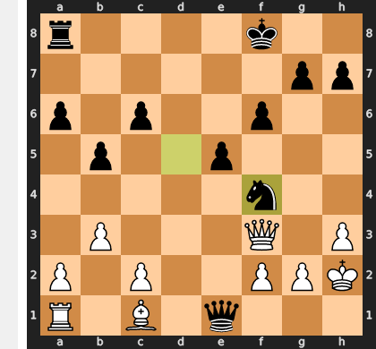

This move is a tragic case of a misguided attack that backfires fatally. By blocking the f-file, Black not only relieves the critical pressure on White's king but also critically unleashes the previously dormant c1-bishop. White's simple reply, Ba3, now attacks the queen with a decisive tempo, launching a winning counter-attack that completely turns the tables.

### Move 22 (White): Bb2 - Blunder ❌

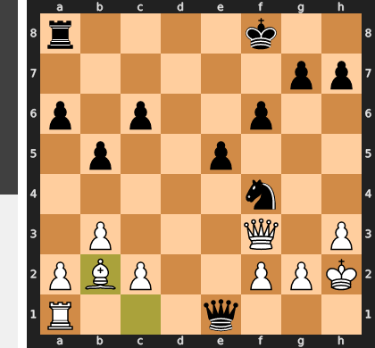

White's winning position relied entirely on the tactical shot Ba3+, a deflecting check that forces the black king to move and allows White to capture the invading queen on e1 without getting checkmated. The passive Bb2 tragically misses this point, giving Black the crucial tempo needed to play ...Rd8 and bring a new, decisive attacker into the fight against the exposed white king.

### Move 22 (Black): Qb4 - Mistake ❓

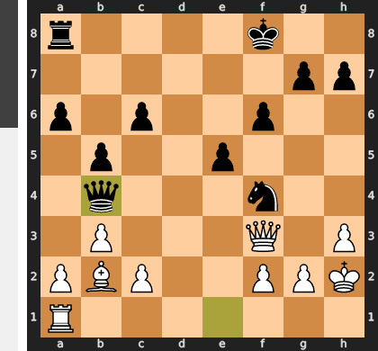

While seemingly active, Qb4 misplaces the queen on the flank where it is easily repelled by a3, giving White a crucial tempo. This allows White to execute the winning plan of g3, dislodging the dominant f4-knight which was the lynchpin of Black's entire position. Without that key defender, the c6-pawn becomes fatally weak and Black's defenses crumble.

### Move 23 (White): Rd1 - Inaccuracy ⁈

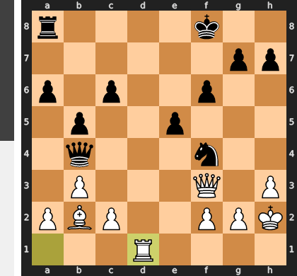

Played **Rd1**. The engine recommended **Qxc6**.

### Move 23 (Black): Kf7 - Mistake ❓

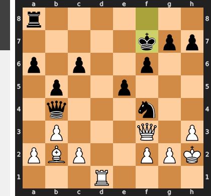

This move is a disastrous miscalculation of king safety, turning the king from a sheltered spectator into the main target. By stepping to f7, the king walks directly into a devastating attack beginning with `Rd7+`, which forces it out into the open at g6. There, it is mercilessly hunted by White's queen, leading to a swift and decisive mating net from which there is no escape.

### Move 24 (White): Qxc6 - Mistake ❓

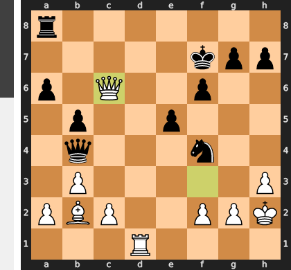

This is a classic case of misplaced priorities; White traded a decisive, paralyzing attack for a mere pawn. By moving the queen from its dominant central post to the edge of the board, White relinquishes the immediate pressure on the f7-king and grants Black a crucial tempo to consolidate with Re8. The correct move, Rd7+, would have mercilessly continued the assault, forcing Black's king into a fatal bind from which it could not escape.

### Move 24 (Black): Nh5 - Blunder ❌

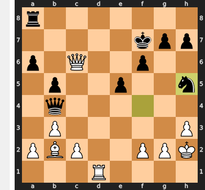

By playing ...Nh5, Black fatally removes the only defender of the critical f6 pawn, completely ignoring the primary threat of White's rook and queen coordinating for a decisive attack. This disastrous move invites the crushing sequence Rd7+ followed by Qxf6, which rips open the kingside defenses and leads to a swift collapse. The correct defensive idea was to activate the passive a8-rook with ...Ra7, preparing to meet White's d-file invasion and keep the king's fragile fortress intact.

### Move 25 (White): Qxa8 - Best Move ✅

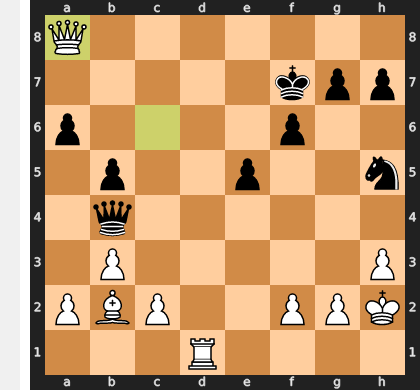

Played **Qxa8**.

### Move 25 (Black): Qf4+ - Good 👍

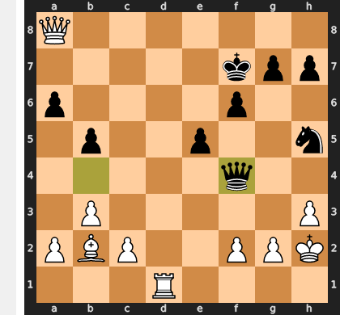

Played **Qf4+**. The engine recommended **Qe7**.

### Move 26 (White): Kg1 - Best Move ✅

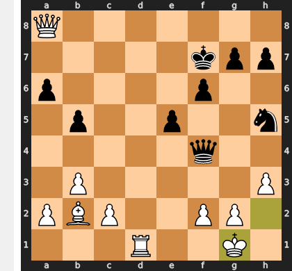

Played **Kg1**.

### Move 26 (Black): e4 - Good 👍

Played **e4**. The engine recommended **h6**.

### Move 27 (White): Re1 - Good 👍

Played **Re1**. The engine recommended **Qd5+**.

### Move 27 (Black): e3 - Mistake ❓

This move is a critical misunderstanding of the position; it liquidates Black's most powerful strategic asset—the passed pawn—for a temporary attack that White can easily parry with `fxe3`. This capture not only removes the pawn but also opens the f-file for White's own counterplay, making the win decisive. The correct approach was the prophylactic `...g5`, which would have first addressed the urgent matter of king safety by preparing `...Kg6`, keeping the menacing e-pawn as a long-term threat instead of cashing it in prematurely.

### Move 28 (White): Rxe3 - Best Move ✅

Played **Rxe3**.

### Move 28 (Black): Ng3 - Blunder ❌

This seemingly active move is a fatal self-block, tragically cutting off the king's only escape route along the g-file. By creating this self-inflicted prison, Black allows White to force a swift and decisive checkmate beginning with the unstoppable Qe8+. Instead of creating threats, the knight has single-handedly sealed its own king's doom.

### Move 29 (White): Rxg3 - Blunder ❌

An almost unbelievable blunder, White overlooked a simple and decisive mate in one with Qe8#. Instead of delivering the final blow, Rxg3 is a tragically passive move that completely reverses the game's dynamics. White needlessly abandons the winning attack, freeing the formidable black queen to create terrifying counter-threats against the now-exposed white king.

### Move 29 (Black): Qd2 - Blunder ❌

This move is a fatal blunder because it creates a simplistic, one-move threat of mate on e1 which is effortlessly parried by Kh2. Once White's king sidesteps to safety, Black's queen becomes a helpless spectator to the unstoppable mating attack delivered by White's own queen and rook. The correct idea was to eliminate the primary attacker with ...Qxg3, which would have dismantled the mating net and forced White to find a much more difficult path to victory.

### Move 30 (White): Qb7+ - Best Move ✅

Played **Qb7+**.

