# Chess Game Analysis: DocEvill vs kar2on

- **Result:** 0-1
- **Date:** 2026.04.03
- **Opening:** Pirc Defense Main Line 4.Be3 Bg7 5.f3 O O 6.Qd2

### Move 1 (White): e4 - Best Move ✅

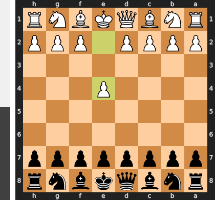

Played **e4**.

### Move 1 (Black): d6 - Good 👍

Played **d6**. The engine recommended **e5**.

### Move 2 (White): d4 - Best Move ✅

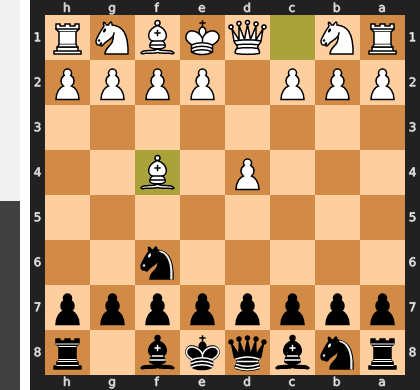

Played **d4**.

### Move 2 (Black): Nf6 - Best Move ✅

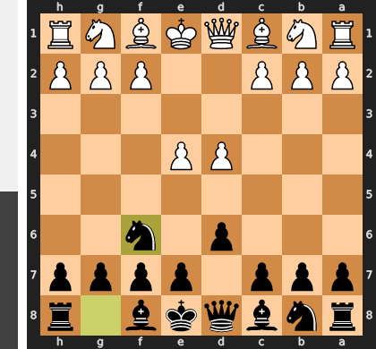

Played **Nf6**.

### Move 3 (White): f3 - Good 👍

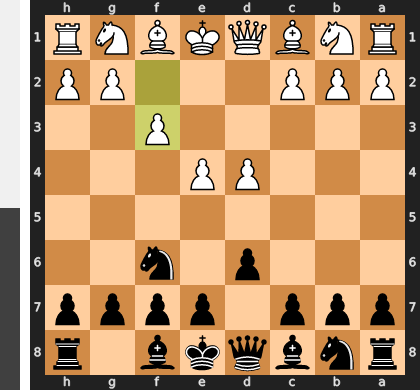

Played **f3**. The engine recommended **Nc3**.

### Move 3 (Black): g6 - Good 👍

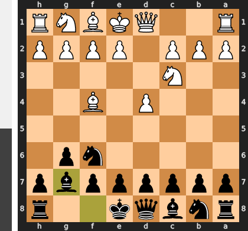

Played **g6**. The engine recommended **e5**.

### Move 4 (White): Be3 - Best Move ✅

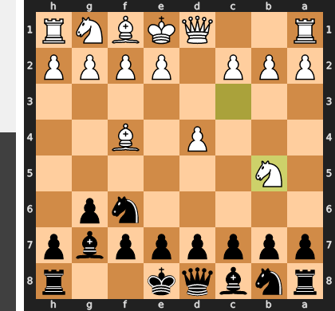

Played **Be3**.

### Move 4 (Black): Bg7 - Best Move ✅

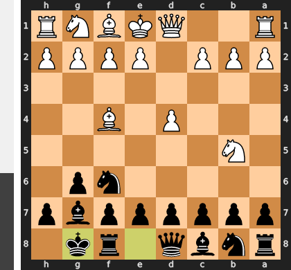

Played **Bg7**.

### Move 5 (White): Nc3 - Best Move ✅

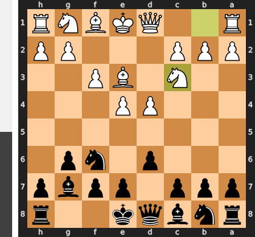

Played **Nc3**.

### Move 5 (Black): O-O - Good 👍

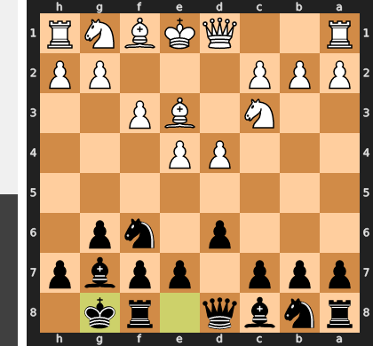

Played **O-O**. The engine recommended **c6**.

### Move 6 (White): Qd2 - Good 👍

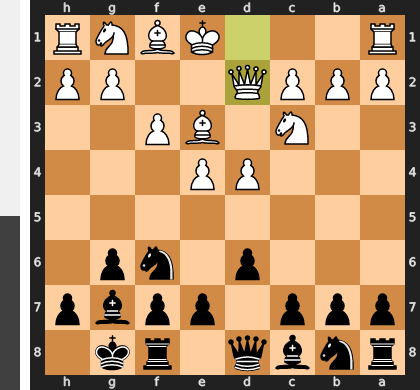

Played **Qd2**. The engine recommended **Nge2**.

### Move 6 (Black): c5 - Best Move ✅

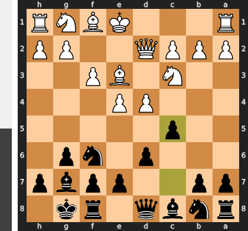

Played **c5**.

### Move 7 (White): Bh6 - Mistake ❓

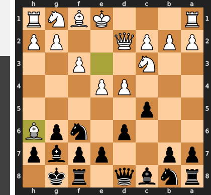

While the strategic idea of trading off Black's fianchettoed bishop is understandable, playing Bh6 was premature and neglected the central tension. This move gives Black a free hand to resolve the center favorably with ...cxd4, opening the c-file for their own use and turning White's d4-pawn into a permanent weakness. White has squandered a crucial tempo on a long-range plan, allowing Black's pieces to seize the initiative and flow into superior, active squares.

### Move 7 (Black): cxd4 - Best Move ✅

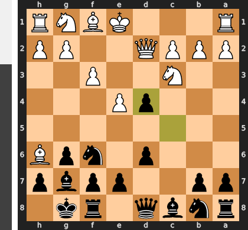

Played **cxd4**.

### Move 8 (White): Bxg7 - Inaccuracy ⁈

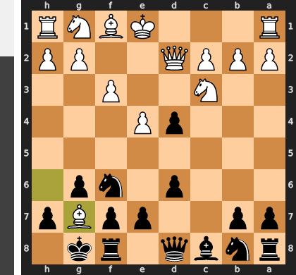

Played **Bxg7**. The engine recommended **Nce2**.

### Move 8 (Black): Kxg7 - Mistake ❓

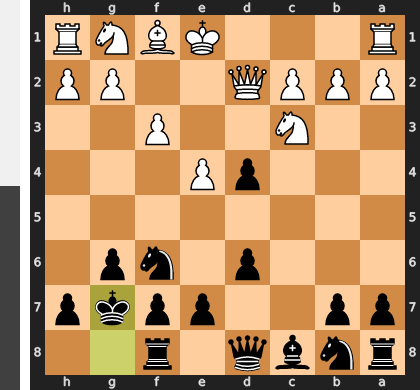

Recapturing on g7 is a natural human reflex, but it misses the critical dynamic opportunity of the position and solves none of Black's problems. The mistake was overlooking the powerful in-between move ...dxc3, which would have forced the trade of White's key central knight, thus seizing control of the d5-square and the center. By instead playing ...Kxg7, Black allows White to consolidate with Qxd4, keeping all his pieces while Black's king becomes a permanent, self-inflicted weakness on the exposed g7-square.

### Move 9 (White): Qxd4 - Best Move ✅

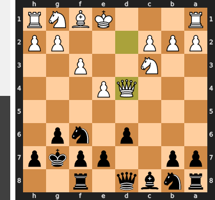

Played **Qxd4**.

### Move 9 (Black): Nc6 - Best Move ✅

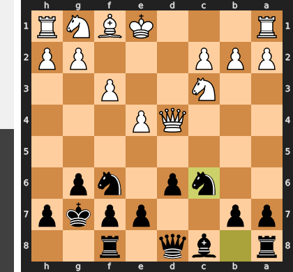

Played **Nc6**.

### Move 10 (White): Qe3 - Good 👍

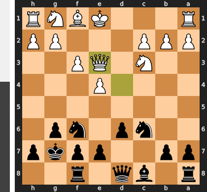

Played **Qe3**. The engine recommended **Qd2**.

### Move 10 (Black): Nb4 - Mistake ❓

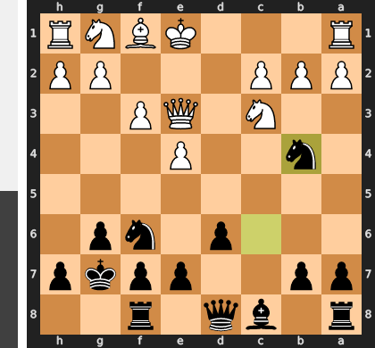

This knight sortie to b4 is a classic case of chasing a superficial threat while neglecting the position's core strategic needs. White will simply play Qd2, simultaneously defending c2 and preparing to castle, leaving the b4 knight awkwardly placed and the initiative squandered. The correct path was the thematic break ...d5, which would have immediately challenged White's central control and unleashed the potential of Black's pieces.

### Move 11 (White): O-O-O - Best Move ✅

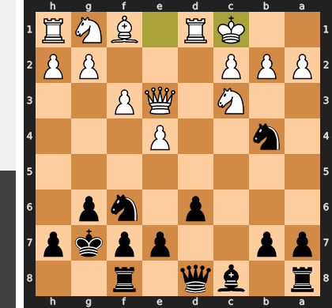

Played **O-O-O**.

### Move 11 (Black): Be6 - Good 👍

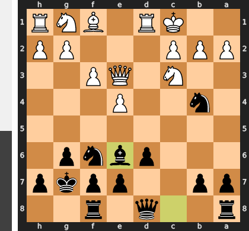

Played **Be6**. The engine recommended **Qa5**.

### Move 12 (White): h4 - Mistake ❓

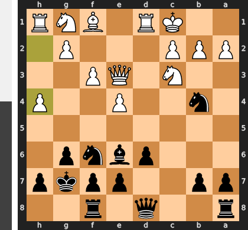

This is a classic strategic error of attacking on the wrong side of the board. The move h4 initiates a slow kingside attack while completely ignoring Black's immediate and dangerous counterplay against your exposed king, spearheaded by the knight on b4. By failing to play the necessary prophylactic move a3, you have given Black a free hand to develop a crushing queenside initiative with moves like ...Nxa2+ or ...Rc8, which will land much faster than your own threats.

### Move 12 (Black): Nxa2+ - Good 👍

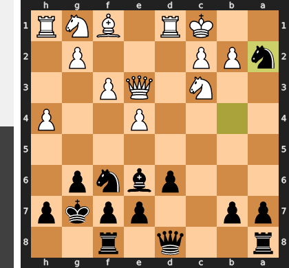

Played **Nxa2+**. The engine recommended **Bxa2**.

### Move 13 (White): Nxa2 - Best Move ✅

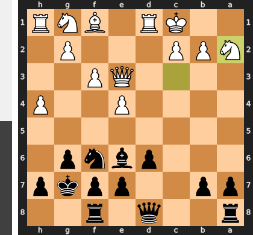

Played **Nxa2**.

### Move 13 (Black): Bxa2 - Best Move ✅

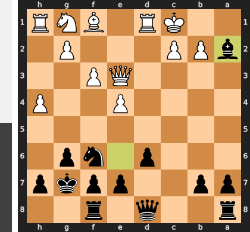

Played **Bxa2**.

### Move 14 (White): h5 - Inaccuracy ⁈

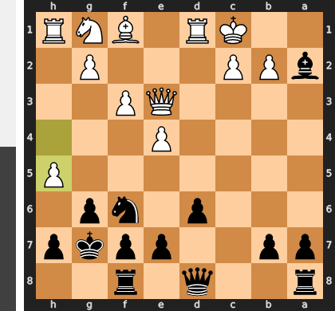

Played **h5**. The engine recommended **e5**.

### Move 14 (Black): Nxh5 - Mistake ❓

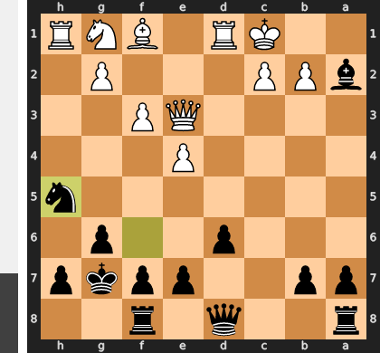

This move is a fatal miscalculation, trading the king's most crucial defender—the knight on g7—for a meaningless pawn. By moving the knight to the edge of the board, Black has abandoned his monarch and essentially invited White to launch a decisive attack with the simple pawn thrust g4. The game is not about the h-pawn; it's a race, and this slow, materialistic move allows White's kingside attack to arrive with crushing force while Black's queenside counterplay remains a distant dream.

### Move 15 (White): g4 - Best Move ✅

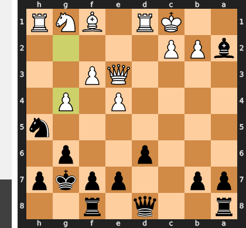

Played **g4**.

### Move 15 (Black): Nf6 - Good 👍

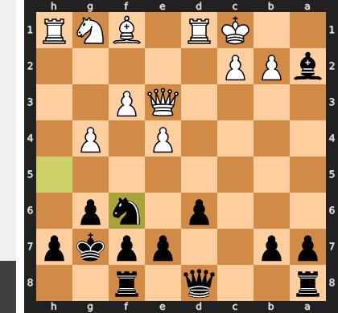

Played **Nf6**. The engine recommended **Qa5**.

### Move 16 (White): Qh6+ - Best Move ✅

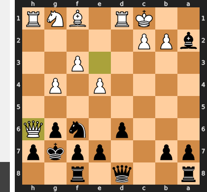

Played **Qh6+**.

### Move 16 (Black): Kg8 - Best Move ✅

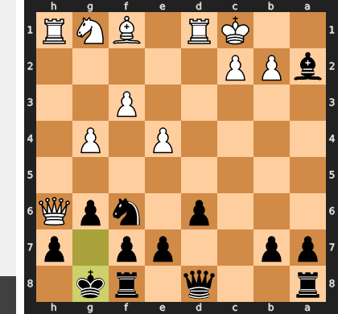

Played **Kg8**.

### Move 17 (White): g5 - Blunder ❌

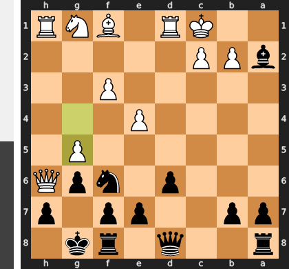

This move g5 is a classic case of launching a premature, one-dimensional flank attack while completely ignoring the opponent's resources in the center and on the queenside. By attacking the f6-knight, White thinks he is intensifying the pressure, but he critically overlooks that Black can now generate devastating counterplay with ...Rc8, creating an immediate and more potent threat against c2. The correct move, e5, would have instead used central superiority to systematically overload Black's key defensive pieces, leading to a decisive and unstoppable kingside assault.

### Move 17 (Black): Nh5 - Best Move ✅

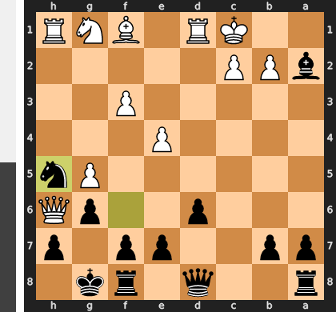

Played **Nh5**.

### Move 18 (White): Be2 - Mistake ❓

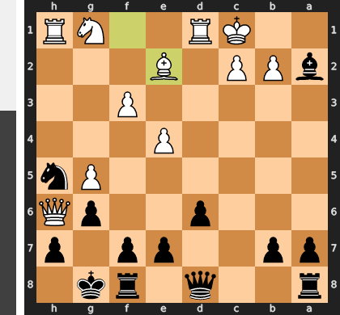

This bishop move is far too slow, fatally ignoring the urgent threat of a queenside counter-attack centered on the c-file. By failing to play the prophylactic Ne2, White allows Black to play ...Rc8, creating an overwhelming and often sacrificial assault against the now-defenseless c2-pawn. The position demanded immediate attention to the king's safety, not a passive developing move.

### Move 18 (Black): f6 - Blunder ❌

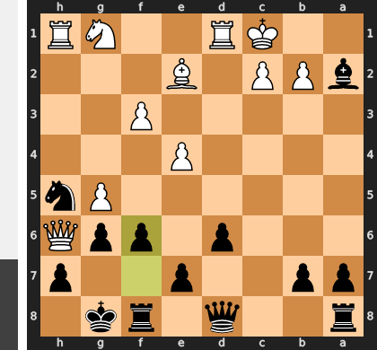

This move is a tragic, self-inflicted wound, as it fatally weakens the g6-pawn and the dark squares protecting your king. By playing `gxf6`, White can now rip open the g-file and, after first eliminating your key counter-attacking bishop on a2, use this newly opened file as an unstoppable highway for his queen and rook to deliver a decisive blow.

### Move 19 (White): f4 - Mistake ❓

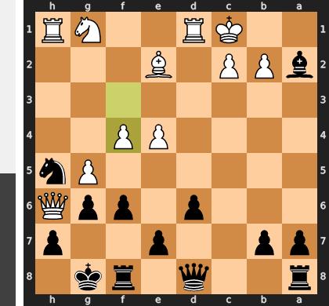

White squandered a golden opportunity for a decisive sacrificial blow with Rxh5, which would have immediately and irrevocably shattered Black's kingside defense. The slower f4, while thematically correct, fails to create a crisis and crucially grants Black a vital tempo to consolidate and begin a dangerous counter-attack against the White king with ...Rc8. By forgoing the kill, White allowed the nature of the position to change from a one-sided assault into a complex, double-edged fight.

### Move 19 (Black): fxg5 - Inaccuracy ⁈

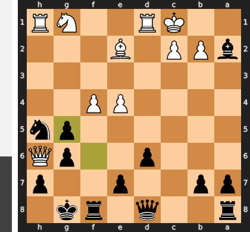

Played **fxg5**. The engine recommended **Qb6**.

### Move 20 (White): Bxh5 - Best Move ✅

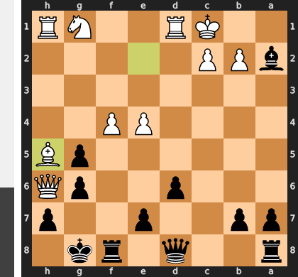

Played **Bxh5**.

### Move 20 (Black): gxh5 - Best Move ✅

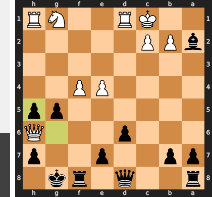

Played **gxh5**.

### Move 21 (White): Qxh5 - Inaccuracy ⁈

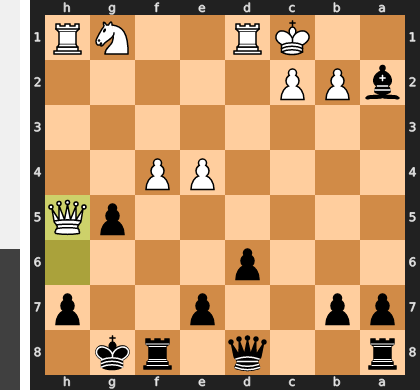

Played **Qxh5**. The engine recommended **Nf3**.

### Move 21 (Black): Rf7 - Best Move ✅

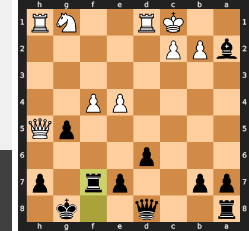

Played **Rf7**.

### Move 22 (White): Qxg5+ - Inaccuracy ⁈

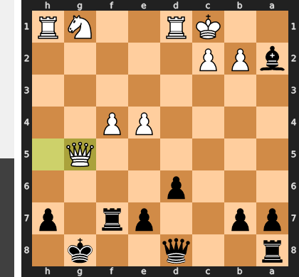

Played **Qxg5+**. The engine recommended **Nf3**.

### Move 22 (Black): Rg7 - Best Move ✅

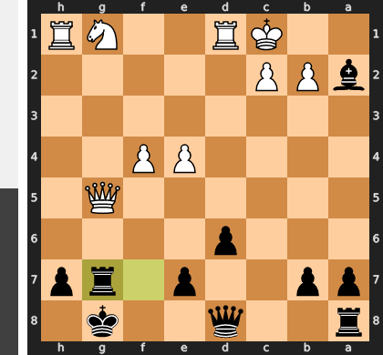

Played **Rg7**.

### Move 23 (White): Qd5+ - Blunder ❌

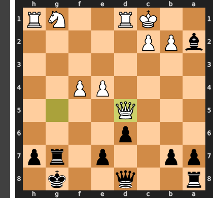

This check is a disastrous misplacement of the queen, achieving nothing of value while placing the most powerful piece on a vulnerable square. After the simple ...Kh8, Black will play ...e6, winning a crucial tempo by attacking your queen and simultaneously opening lines for his own queen and rook. You have single-handedly given away the initiative and activated Black's entire army for a decisive attack.

### Move 23 (Black): Kh8 - Blunder ❌

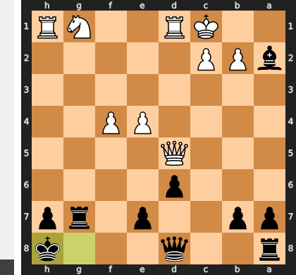

This move is a disastrously passive choice in a position demanding concrete action, fatally overlooking White's simple reply. By wasting a tempo on the king, Black allows the crushing move b3, which permanently traps the powerful a2-bishop—the very heart of Black's entire counter-attacking setup. Instead of neutralizing White's dominant queen with the winning ...Bxd5, Black has allowed their own best piece to be lost for a mere pawn, completely reversing the game's outcome.

### Move 24 (White): Nf3 - Blunder ❌

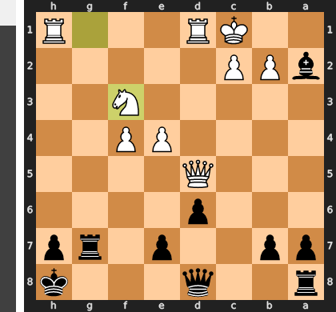

This blunder is a tragic case of "threat blindness." White was so focused on their own powerful attack, centered on the dominant d5-queen, that they completely ignored Black's simple and crushing counter-threat of ...Bxd5. By playing Nf3 instead of liquidating the dangerous bishop with the winning Qxa2, White allowed the exchange on d5, which not only removes White's best piece but also unleashes Black's rook for a devastating check on g2, fatally exposing the white king and turning a winning position into a lost one.

### Move 24 (Black): Bxd5 - Best Move ✅

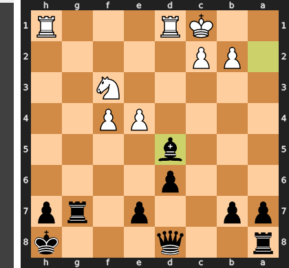

Played **Bxd5**.

### Move 25 (White): exd5 - Best Move ✅

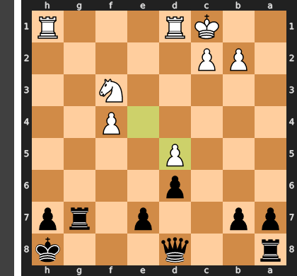

Played **exd5**.

### Move 25 (Black): Qf8 - Best Move ✅

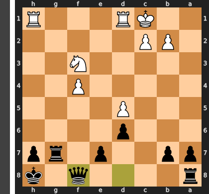

Played **Qf8**.

### Move 26 (White): Rh4 - Good 👍

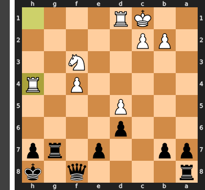

Played **Rh4**. The engine recommended **Nd4**.

### Move 26 (Black): Qf6 - Inaccuracy ⁈

Played **Qf6**. The engine recommended **Qf5**.

### Move 27 (White): Kb1 - Best Move ✅

Played **Kb1**.

### Move 27 (Black): Rc8 - Best Move ✅

Played **Rc8**.

### Move 28 (White): c3 - Mistake ❓

This move is a grave positional error because it is far too slow and fails to address Black's crushing control over the c-file. Instead of fighting for the only open file with Rc1, you have created a new, immediate target, fatally inviting a decisive sacrifice with ...Rxc3 which shatters your king's defense. This mistake hands the initiative entirely to Black when you desperately needed to find active defensive resources.

### Move 28 (Black): e5 - Mistake ❓

This move is a mistake because you've traded your excellent positional bind for unnecessary complications. By playing `...e5`, you allow White to capture en passant (`dxe6`), creating a dangerous passed e-pawn that serves as a major distraction and source of counterplay. The superior `...Qf5+` was a forcing move that would have further exposed White's king and prepared to eliminate the threatening f4-pawn, methodically strangling White's position rather than giving it new life.

### Move 29 (White): Ng5 - Inaccuracy ⁈

Played **Ng5**. The engine recommended **dxe6**.

### Move 29 (Black): exf4 - Best Move ✅

Played **exf4**.

### Move 30 (White): Ne4 - Mistake ❓

This move is a fatal miscalculation, abandoning the knight's critical defensive duties for a hollow, one-move threat. By vacating the kingside, White allows Black's queen to seize the e5-square, from which it attacks the h4-rook and prepares a decisive invasion. The knight was White's last essential guard for the weak squares around the king, and now it has become a target itself, accelerating the collapse.

### Move 30 (Black): Qxh4 - Best Move ✅

Played **Qxh4**.

### Move 31 (White): Nxd6 - Best Move ✅

Played **Nxd6**.

### Move 31 (Black): Rcg8 - Mistake ❓

While doubling rooks with `...Rcg8` is a natural and thematically correct attacking move, it is too slow and misses the decisive blow. The key to White's survival is the monster knight on d6, and the far superior `...f3!` would have immediately forced a crisis. This pawn push not only creates a direct mating threat on g2, but more importantly, it vacates the f4-square for the queen to attack and win that critical defensive knight, leading to a swift collapse.

### Move 32 (White): Nf5 - Mistake ❓

Nf5 creates a superficial threat against the g7 rook, a diversion White simply cannot afford while the king is under such a direct and overwhelming assault. By shifting the knight to a less relevant square, White has fatally removed a critical defender and now allows Black's queen to deliver the decisive blow without interference. The correct plan was to use the rook with Rd4, challenging the vital f4 pawn which supports Black's entire attacking structure.

### Move 32 (Black): Qg4 - Good 👍

Played **Qg4**. The engine recommended **Qh5**.

### Move 33 (White): Nxg7 - Blunder ❌

This move is a fatal miscalculation, completely misunderstanding the knight's role as your sole critical defender. By trading this vital piece for an irrelevant pawn, you not only remove the guard shielding your king but also fatally open the g-file for Black's rook. This transforms a difficult position into one with a forced and unstoppable mating attack.

### Move 33 (Black): Qxd1+ - Best Move ✅

Played **Qxd1+**.

### Move 34 (White): Ka2 - Best Move ✅

Played **Ka2**.

### Move 34 (Black): Rxg7 - Blunder ❌

This was a blunder of epic proportions because Black missed a forced mate-in-three, initiated by the decisive 1...Qa4+. The rook on the g-file was the indispensable second attacker, poised to deliver the final blow on g1 after the queen forced the white king onto the back rank. By needlessly capturing on g7, Black traded a critical attacking piece for a non-threatening pawn, completely dismantling the mating net and allowing the white king to escape.

### Move 35 (White): c4 - Good 👍

Played **c4**. The engine recommended **Ka3**.

### Move 35 (Black): Rg3 - Good 👍

Played **Rg3**. The engine recommended **Qa4+**.

### Move 36 (White): d6 - Good 👍

Played **d6**. The engine recommended **b3**.

### Move 36 (Black): Qxd6 - Good 👍

Played **Qxd6**. The engine recommended **Qb3+**.

### Move 37 (White): Kb1 - Good 👍

Played **Kb1**. The engine recommended **c5**.

### Move 37 (Black): Qd3+ - Good 👍

Played **Qd3+**. The engine recommended **Qd1+**.

### Move 38 (White): Ka2 - Good 👍

Played **Ka2**. The engine recommended **Ka1**.

### Move 38 (Black): Qxc4+ - Good 👍

Played **Qxc4+**. The engine recommended **Qb3+**.

### Move 39 (White): Kb1 - Good 👍

Played **Kb1**. The engine recommended **b3**.

### Move 39 (Black): Rg2 - Good 👍

Played **Rg2**. The engine recommended **Rg1#**.

### Move 40 (White): Ka1 - Good 👍

Played **Ka1**. The engine recommended **b3**.

### Move 40 (Black): Qb3 - Good 👍

Played **Qb3**. The engine recommended **Rg1#**.

### Move 41 (White): Kb1 - Best Move ✅

Played **Kb1**.

### Move 41 (Black): Qxb2# - Best Move ✅

Played **Qxb2#**.

