# Chess Game Analysis: itsokdontbefboy vs kar2on

- **Result:** 1-0
- **Date:** 2026.04.04
- **Opening:** Pirc Defense Main Line Byrne Variation 4...Bg7 5.Qd2

### Move 1 (White): e4 - Best Move ✅

Played **e4**.

### Move 1 (Black): d6 - Good 👍

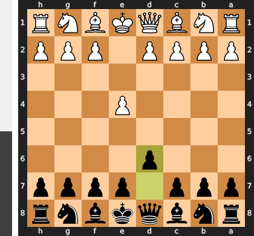

Played **d6**. The engine recommended **e5**.

### Move 2 (White): d4 - Best Move ✅

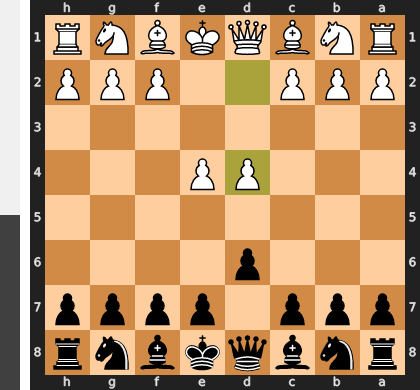

Played **d4**.

### Move 2 (Black): Nf6 - Best Move ✅

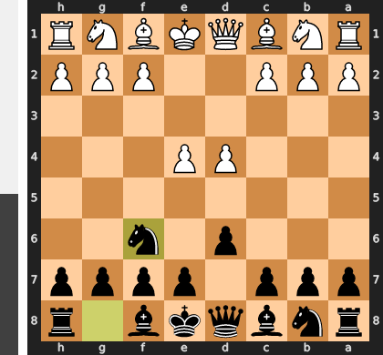

Played **Nf6**.

### Move 3 (White): Nc3 - Best Move ✅

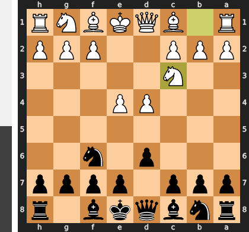

Played **Nc3**.

### Move 3 (Black): g6 - Good 👍

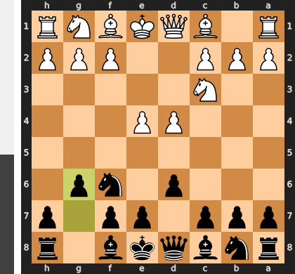

Played **g6**. The engine recommended **e5**.

### Move 4 (White): Bg5 - Good 👍

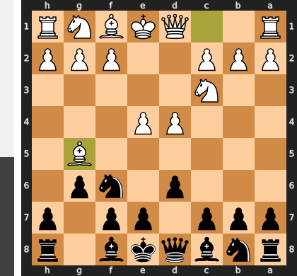

Played **Bg5**. The engine recommended **a4**.

### Move 4 (Black): Bg7 - Good 👍

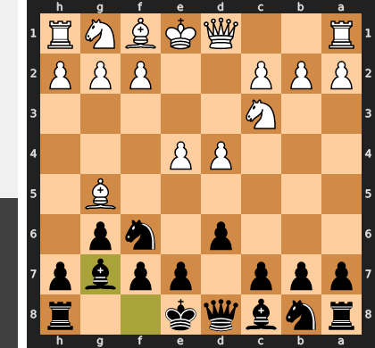

Played **Bg7**. The engine recommended **c6**.

### Move 5 (White): Qd2 - Best Move ✅

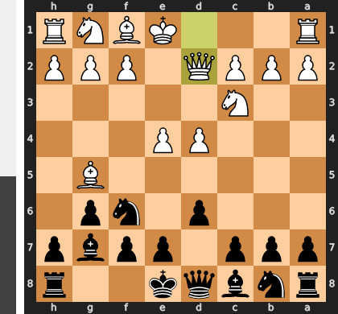

Played **Qd2**.

### Move 5 (Black): O-O - Good 👍

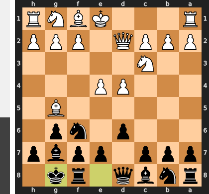

Played **O-O**. The engine recommended **h6**.

### Move 6 (White): Nf3 - Inaccuracy ⁈

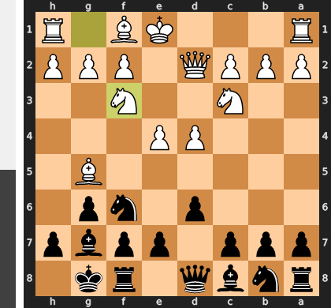

Played **Nf3**. The engine recommended **O-O-O**.

### Move 6 (Black): c5 - Good 👍

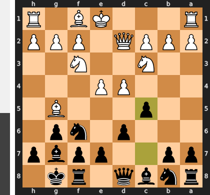

Played **c5**. The engine recommended **d5**.

### Move 7 (White): O-O-O - Inaccuracy ⁈

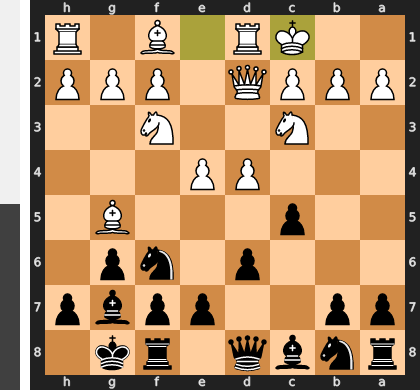

Played **O-O-O**. The engine recommended **dxc5**.

### Move 7 (Black): cxd4 - Best Move ✅

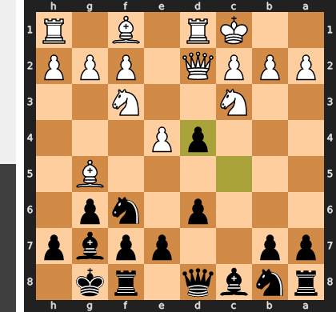

Played **cxd4**.

### Move 8 (White): Nxd4 - Best Move ✅

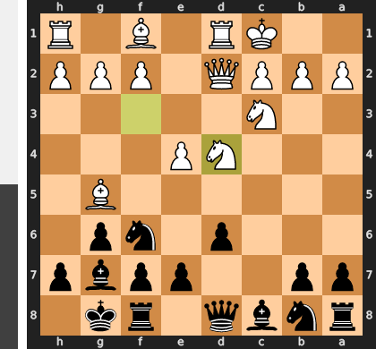

Played **Nxd4**.

### Move 8 (Black): Nc6 - Best Move ✅

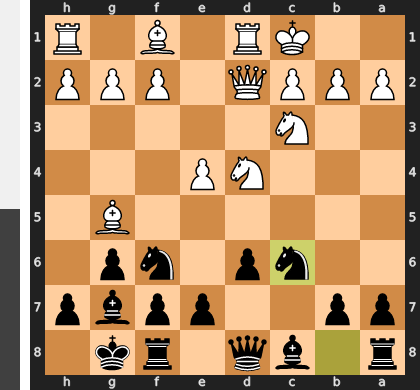

Played **Nc6**.

### Move 9 (White): Nf3 - Mistake ❓

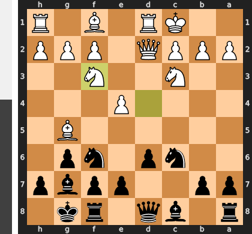

While Nf3 is a natural developing move, it is a strategic error because it passively cedes the initiative, doing nothing to address Black's primary plan of a queenside pawn storm beginning with ...a6 and ...b5. The far superior Nb3 is a key prophylactic maneuver that seizes control of the critical c5 square, directly preventing Black's counterplay before it starts. By failing to secure the queenside, White's own kingside attacking ambitions are now premature and he must react to Black's threats.

### Move 9 (Black): Qb6 - Best Move ✅

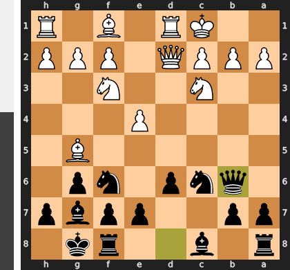

Played **Qb6**.

### Move 10 (White): h4 - Blunder ❌

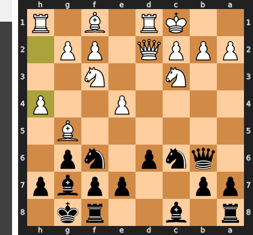

White's move h4 fundamentally misjudges the critical nature of the position, initiating a slow kingside pawn storm while completely ignoring the imminent danger to its own king on the queenside. This costly loss of tempo allows Black to immediately seize the initiative with the devastating tactical blow ...Nxe4! After White recaptures, ...Qxb2 follows, and the White king's pawn cover is ripped away, leading to a decisive and unstoppable attack.

### Move 10 (Black): h6 - Blunder ❌

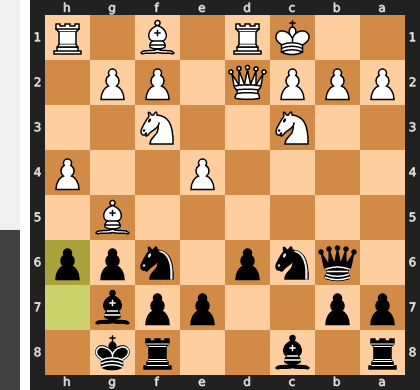

By playing ...h6, Black fatally weakens his own kingside pawn structure, creating a target instead of correctly counter-attacking in the center with the winning ...Nxe4. This move invites the crushing sacrifice Bxh6; after the forced ...gxh6 recapture, the Black king's defenses are annihilated, leaving him hopelessly exposed to a decisive attack from White's queen and knight.

### Move 11 (White): Bxh6 - Blunder ❌

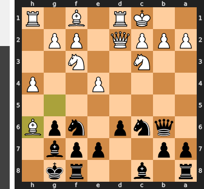

While the tempting Bxh6 hopes to rip open the black kingside, it is a critical miscalculation that opens the g-file for Black's rook, fatally exposing White's own king on c1. After the obligatory ...gxh6, Black's counter-attack with moves like ...Ng4 is simply much faster and more decisive than White's follow-up. Instead of breaking through, White has just handed Black the initiative and a winning attack against its own monarch.

### Move 11 (Black): Bxh6 - Blunder ❌

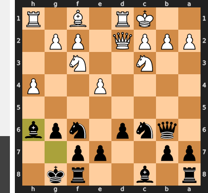

By playing Bxh6, Black has committed positional suicide, voluntarily trading the essential guardian of his king—the fianchettoed bishop—for a simple pawn. This fatal miscalculation not only deserts the light squares around the king but allows White's queen to immediately capture the bishop with Qxh6, launching a decisive and unstoppable attack. The correct plan was the classic counter-strike ...Nxe4, which correctly ignores the flank pressure to dismantle White's center and seize the initiative.

### Move 12 (White): Qxh6 - Best Move ✅

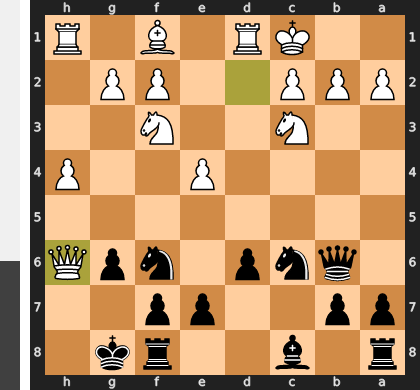

Played **Qxh6**.

### Move 12 (Black): Be6 - Mistake ❓

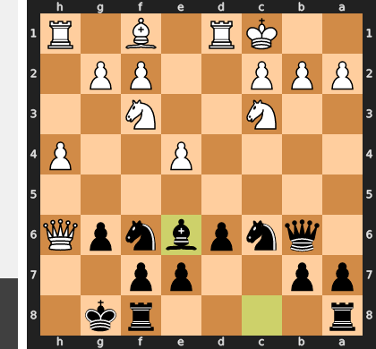

This move is a positional luxury in a position demanding tactical urgency. By playing ...Be6, you completely ignore the dagger of the white queen, allowing White to decisively ramp up the pressure with the h5 pawn push, which will now shatter your kingside defenses. The critical and necessary idea was the disruptive ...Ng4, which would have forced a response from the white queen and neutralized the most immediate threats to your king.

### Move 13 (White): h5 - Mistake ❓

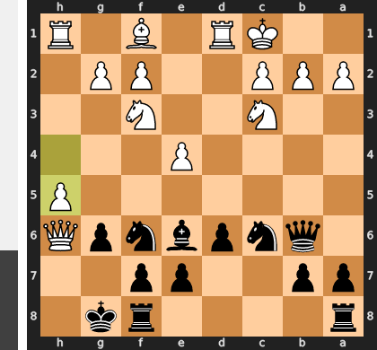

While h5 appears to press the attack, it's a mistake because it allows Black to clarify the situation and relieve the immense pressure with ...Nxh5. This exchange removes White's h-pawn battering ram and ultimately simplifies Black's defensive task, giving him time to launch a dangerous counter-attack against the exposed White king. The correct move, Ng5, would have added another piece to the assault, creating intolerable and decisive threats without giving Black any such easy way out.

