# Chess Game Analysis: Safalmagar vs kar2on

- **Result:** 1-0
- **Date:** 2026.04.03
- **Opening:** Pirc Defense 2.d4 Nf6

### Move 1 (White): e4 - Best Move ✅

Played **e4**.

### Move 1 (Black): d6 - Good 👍

Played **d6**. The engine recommended **e5**.

### Move 2 (White): d4 - Good 👍

Played **d4**. The engine recommended **Nf3**.

### Move 2 (Black): Nf6 - Best Move ✅

Played **Nf6**.

### Move 3 (White): Bg5 - Mistake ❓

While pinning the knight seems logical, this bishop sortie is premature and creates a tactical liability for White. Black can now systematically drive the bishop away with ...h6 followed by ...g5, creating the opportunity to win the crucial e4-pawn with the classic ...Nxe4! shot. Instead of solidifying the center with Nc3, White has created a target and handed Black a clear plan to seize the initiative.

### Move 3 (Black): Nxe4 - Best Move ✅

Played **Nxe4**.

### Move 4 (White): Be3 - Best Move ✅

Played **Be3**.

### Move 4 (Black): g6 - Best Move ✅

Played **g6**.

### Move 5 (White): Nd2 - Good 👍

Played **Nd2**. The engine recommended **f3**.

### Move 5 (Black): Nxd2 - Inaccuracy ⁈

Played **Nxd2**. The engine recommended **Nf6**.

### Move 6 (White): Qxd2 - Best Move ✅

Played **Qxd2**.

### Move 6 (Black): Bg7 - Good 👍

Played **Bg7**. The engine recommended **Nd7**.

### Move 7 (White): Bd3 - Good 👍

Played **Bd3**. The engine recommended **O-O-O**.

### Move 7 (Black): O-O - Good 👍

Played **O-O**. The engine recommended **Nd7**.

### Move 8 (White): Nf3 - Good 👍

Played **Nf3**. The engine recommended **h4**.

### Move 8 (Black): e5 - Good 👍

Played **e5**. The engine recommended **Nd7**.

### Move 9 (White): O-O-O - Best Move ✅

Played **O-O-O**.

### Move 9 (Black): exd4 - Good 👍

Played **exd4**. The engine recommended **Nc6**.

### Move 10 (White): Nxd4 - Good 👍

Played **Nxd4**. The engine recommended **Bxd4**.

### Move 10 (Black): Nc6 - Best Move ✅

Played **Nc6**.

### Move 11 (White): Nxc6 - Best Move ✅

Played **Nxc6**.

### Move 11 (Black): bxc6 - Best Move ✅

Played **bxc6**.

### Move 12 (White): h4 - Good 👍

Played **h4**. The engine recommended **Bg5**.

### Move 12 (Black): Qf6 - Best Move ✅

Played **Qf6**.

### Move 13 (White): c3 - Best Move ✅

Played **c3**.

### Move 13 (Black): Be6 - Mistake ❓

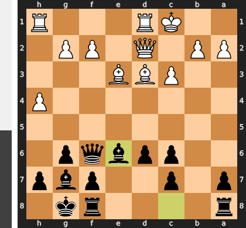

Black's move `...Be6` is a grave positional misjudgment because it completely ignores the urgency of White's kingside attack. This move, focused on the center and queenside, gives White a free tempo to play the decisive `h5`, which will shatter Black's pawn cover and launch an overwhelming assault against the exposed king. The correct approach was the prophylactic `...h5`, immediately neutralizing White's primary attacking plan and solidifying the king's fortress.

### Move 14 (White): h5 - Good 👍

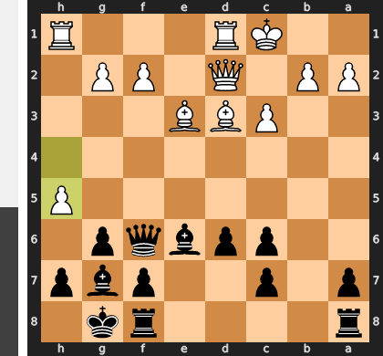

Played **h5**. The engine recommended **Bd4**.

### Move 14 (Black): Bxa2 - Mistake ❓

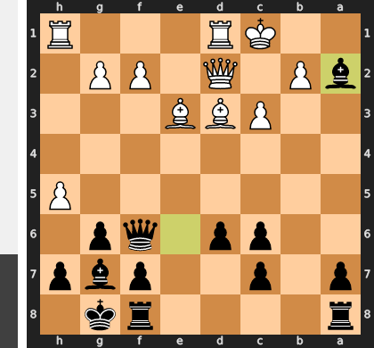

This move is a grave positional error, a classic case of chasing a meaningless pawn while your king's palace is on fire. By moving the bishop to a2, Black has effectively removed a vital defender from the decisive kingside sector, where White's h-pawn is poised to rip open the position. This self-inflicted loss of tempo grants White a free hand to launch a devastating attack with hxg6, rendering the bishop on a2 a mere spectator to the king's demise.

### Move 15 (White): Bd4 - Best Move ✅

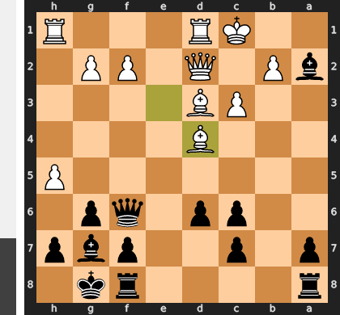

Played **Bd4**.

### Move 15 (Black): Qe6 - Good 👍

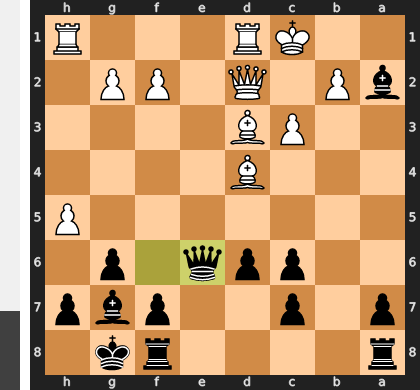

Played **Qe6**. The engine recommended **Qd8**.

### Move 16 (White): Bxg7 - Best Move ✅

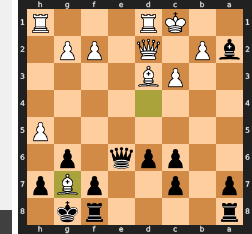

Played **Bxg7**.

### Move 16 (Black): Kxg7 - Best Move ✅

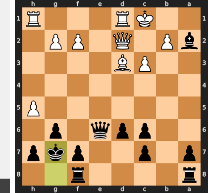

Played **Kxg7**.

### Move 17 (White): h6+ - Blunder ❌

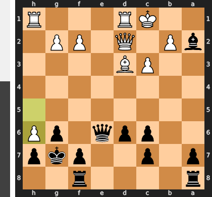

This check is a fundamental misunderstanding of the attack; its entire force relied on the h-pawn's potential to capture on g6, ripping open lines for the rooks and queen. By instead pushing the pawn for a harmless check, White voluntarily gives up this devastating sacrificial threat and allows the Black king to flee from the vulnerable g7-square to the relative safety of the h8-corner. The attack's momentum is completely squandered, and Black's own formidable counter-threats now seize the initiative.

### Move 17 (Black): Kg8 - Best Move ✅

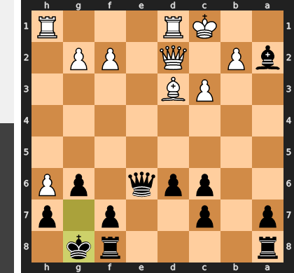

Played **Kg8**.

### Move 18 (White): Rde1 - Best Move ✅

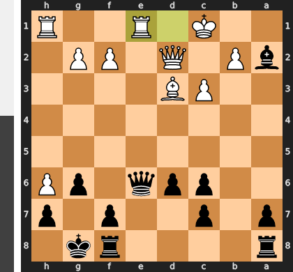

Played **Rde1**.

### Move 18 (Black): Qd7 - Mistake ❓

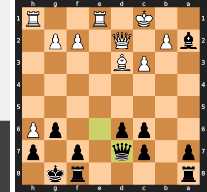

The move ...Qd7 is a grave positional error, moving the queen to a passive square and fatally abandoning the defense of the vulnerable kingside light squares. This allows White to seize a winning attack with the crushing Qf4, creating overwhelming threats against f7 and g6 that the distant black queen cannot parry. The correct ...Qf6 was essential, as it would have both reinforced these critical weak points and kept the queen active in the central struggle.

### Move 19 (White): Qf4 - Mistake ❓

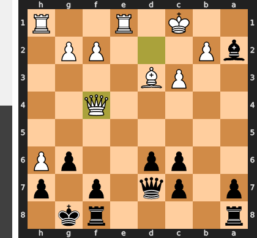

While Qf4 appears to build the kingside attack, it is a one-dimensional threat that fatally neglects the position's tactical reality. The move places the queen on a vulnerable square, inviting the powerful pawn thrust ...f5, which simultaneously attacks the queen, blunts the d3-bishop, and opens the f-file for a decisive counterattack. The correct approach was the positional move c4, which would have undermined Black's center and, crucially, neutralized the monster bishop on a2, cementing White's advantage.

### Move 19 (Black): a5 - Blunder ❌

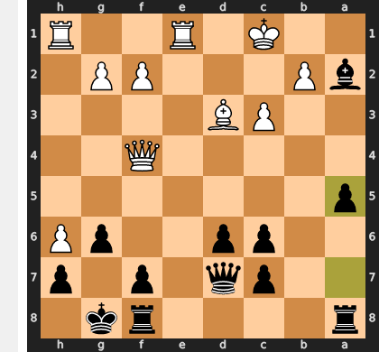

Black's move ...a5 is a fatal miscalculation, as it completely ignores the imminent and decisive kingside attack. This move does nothing to counter White's plan, allowing the crushing Qf6!, which forces Black to shatter his own kingside pawn structure to prevent immediate mate. After the forced ...gxf6, White's rooks will flood in on the now-open files, leading to an unstoppable checkmating net.

### Move 20 (White): Qd4 - Blunder ❌

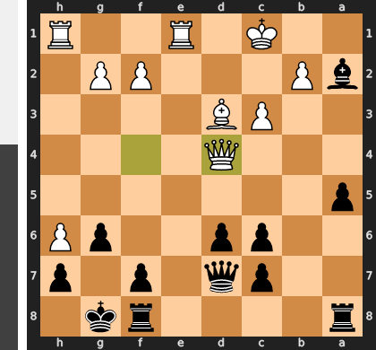

White missed the decisive blow Qf6, which would have immediately targeted the critical g6-pawn to shatter Black's entire defensive structure. The blunder Qd4 is positionally deaf to the urgency of the attack, fatally granting Black the single tempo needed to play the consolidating move ...f5! This simple pawn push completely neutralizes White's once-lethal h-pawn and forces the queen to retreat, single-handedly turning a winning position into one where Black is now safe and fighting for the advantage.

### Move 20 (Black): f6 - Best Move ✅

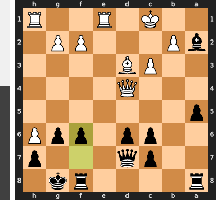

Played **f6**.

### Move 21 (White): Bxg6 - Mistake ❓

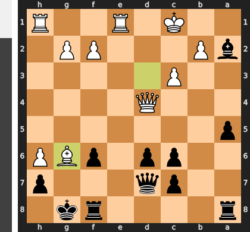

Bxg6 was a grave strategic error, trading White's most important attacking piece and critically opening the f-file for Black's rook. This exchange single-handedly resolves all the tension in Black's favor, turning a complex battle into a decisive and straightforward counterattack against White's exposed king.

### Move 21 (Black): f5 - Blunder ❌

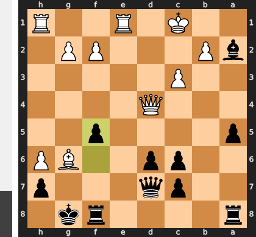

By playing ...f5, Black tragically ignores the suffocating g6-pawn, which is the root of all his problems. Instead of eliminating this immediate threat with ...hxg6, the move fatally opens the a2-g8 diagonal, inviting a decisive combination. White can now unleash the crushing sacrifice Bxf5!, which deflects the defenders and exposes Black's king to an unstoppable mating attack.

