# Chess Game Analysis: kar2on vs Mark-33

- **Result:** 0-1
- **Date:** 2026.04.03
- **Opening:** Giuoco Piano Game Giuoco Pianissimo Italian Four Knights Variation 5...h6

### Move 1 (White): e4 - Best Move ✅

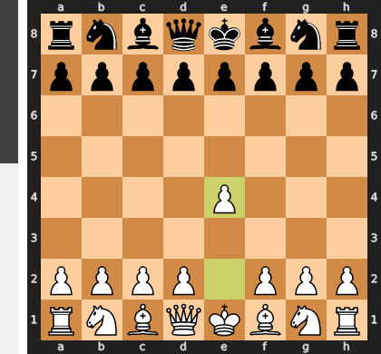

Played **e4**.

### Move 1 (Black): e5 - Best Move ✅

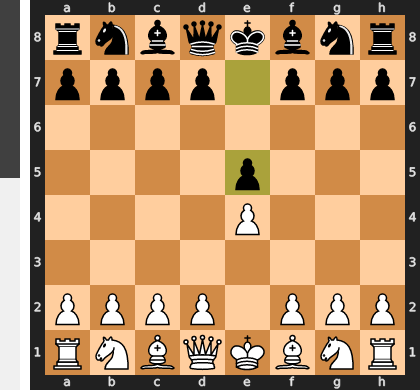

Played **e5**.

### Move 2 (White): Nf3 - Best Move ✅

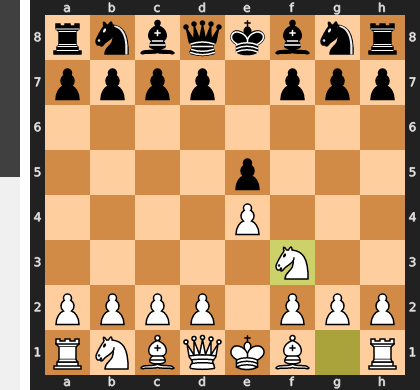

Played **Nf3**.

### Move 2 (Black): Nc6 - Good 👍

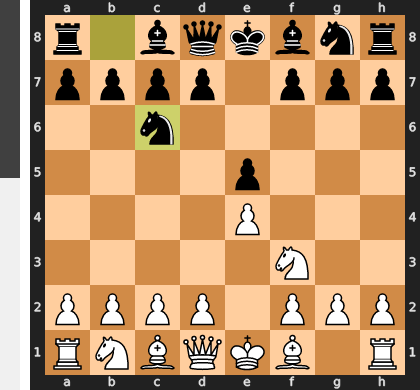

Played **Nc6**. The engine recommended **Nf6**.

### Move 3 (White): Bc4 - Good 👍

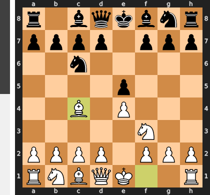

Played **Bc4**. The engine recommended **Bb5**.

### Move 3 (Black): Bc5 - Good 👍

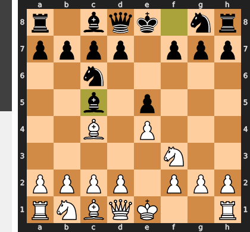

Played **Bc5**. The engine recommended **Nf6**.

### Move 4 (White): Nc3 - Good 👍

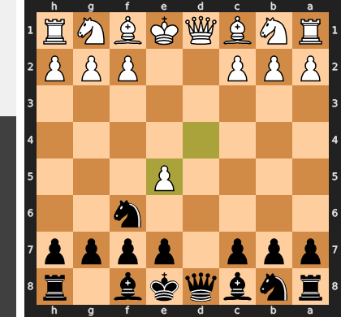

Played **Nc3**. The engine recommended **O-O**.

### Move 4 (Black): Nf6 - Best Move ✅

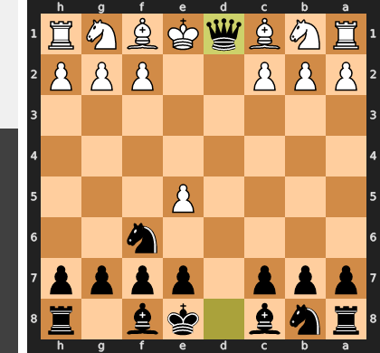

Played **Nf6**.

### Move 5 (White): d3 - Good 👍

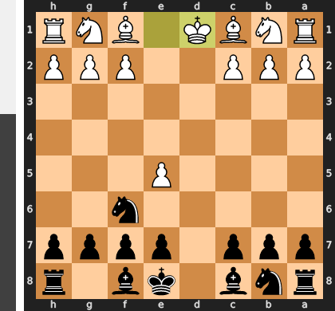

Played **d3**. The engine recommended **O-O**.

### Move 5 (Black): h6 - Good 👍

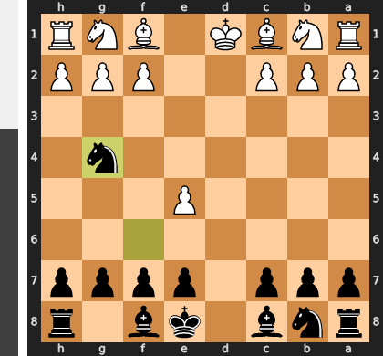

Played **h6**. The engine recommended **a6**.

### Move 6 (White): h3 - Good 👍

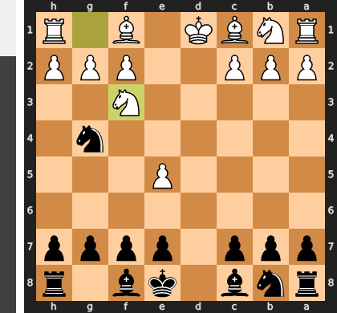

Played **h3**. The engine recommended **O-O**.

### Move 6 (Black): O-O - Inaccuracy ⁈

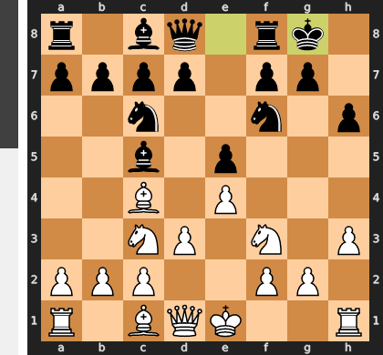

Played **O-O**. The engine recommended **a6**.

### Move 7 (White): Na4 - Mistake ❓

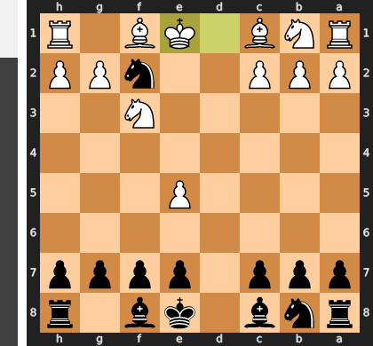

The move Na4 is a classic positional blunder, as it exchanges a fight for central control for a shallow threat on the flank. Black can simply retreat the bishop with ...Be7, leaving the white knight stranded on the rim of the board as a non-factor in the game. By misplacing this key piece, White has squandered the initiative and allowed Black to consolidate a superior central position.

### Move 7 (Black): Bb4+ - Best Move ✅

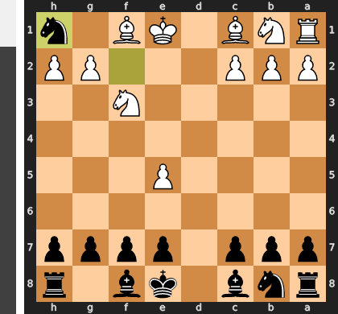

Played **Bb4+**.

### Move 8 (White): c3 - Good 👍

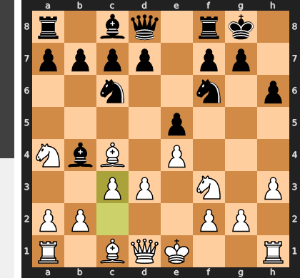

Played **c3**. The engine recommended **Bd2**.

### Move 8 (Black): Ba5 - Mistake ❓

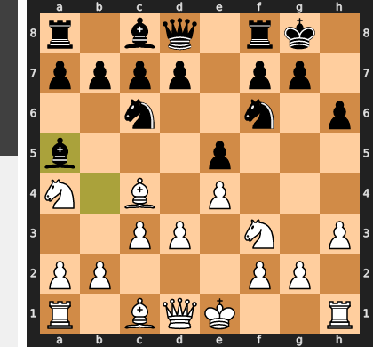

While `...Ba5` keeps the bishop active, it is a serious positional error that misunderstands the danger. White now gains a critical tempo with the simple `b4`, forcing the bishop to retreat anyway while White seizes queenside space and prepares a much stronger central break with `d4`. The quiet retreat `...Be7` was superior, as it would have neutralized the threat from the `Na4` without conceding time and initiative to White.

### Move 9 (White): b4 - Best Move ✅

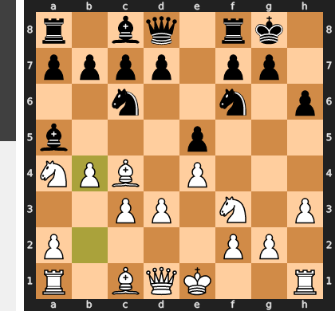

Played **b4**.

### Move 9 (Black): Bb6 - Best Move ✅

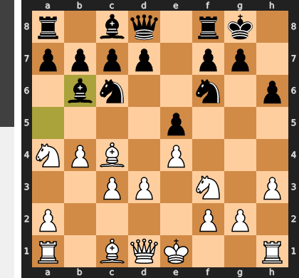

Played **Bb6**.

### Move 10 (White): Nxb6 - Good 👍

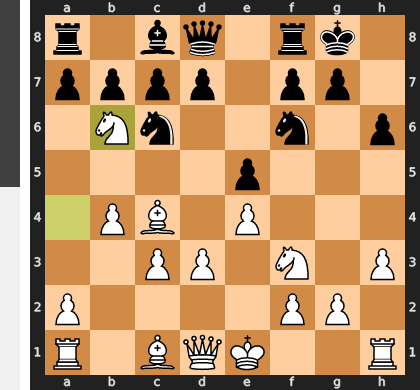

Played **Nxb6**. The engine recommended **Bb3**.

### Move 10 (Black): axb6 - Best Move ✅

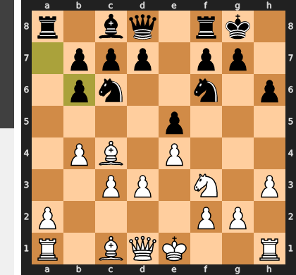

Played **axb6**.

### Move 11 (White): a4 - Good 👍

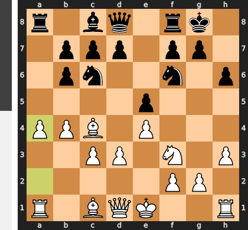

Played **a4**. The engine recommended **O-O**.

### Move 11 (Black): d6 - Good 👍

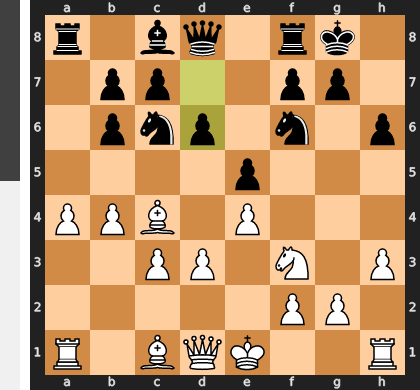

Played **d6**. The engine recommended **d5**.

### Move 12 (White): O-O - Best Move ✅

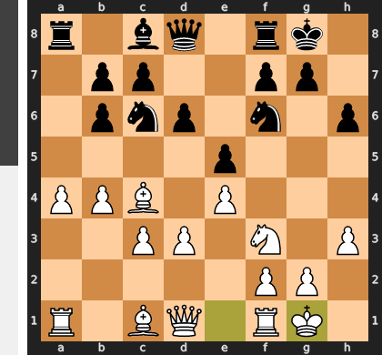

Played **O-O**.

### Move 12 (Black): Qe7 - Good 👍

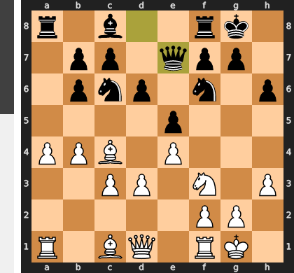

Played **Qe7**. The engine recommended **Ne7**.

### Move 13 (White): d4 - Mistake ❓

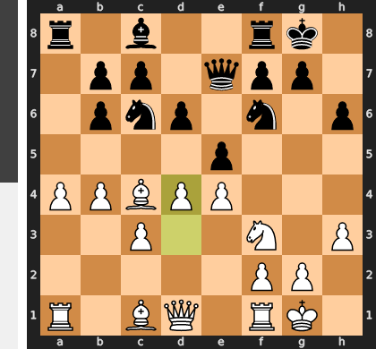

Pushing d4 is a positional mistake that completely misunderstands the tension in the center, as White is not prepared for the tactical consequences of opening the position. This move fatally opens the e-file, allowing Black's queen to create a devastating pin on the f3-knight and making the e4-pawn a sudden, indefensible target. Instead of creating this central crisis, White should have patiently increased their queenside pressure with b5, building on their existing space advantage.

### Move 13 (Black): exd4 - Best Move ✅

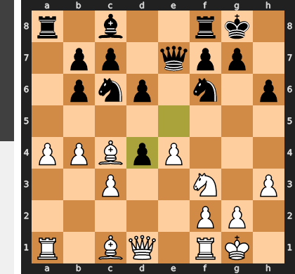

Played **exd4**.

### Move 14 (White): Nxd4 - Good 👍

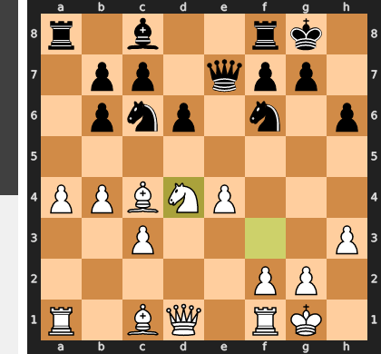

Played **Nxd4**. The engine recommended **cxd4**.

### Move 14 (Black): Nxd4 - Best Move ✅

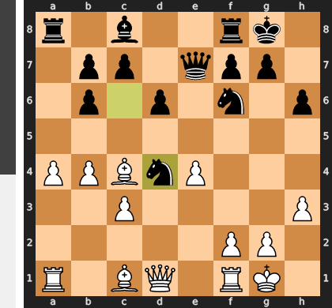

Played **Nxd4**.

### Move 15 (White): cxd4 - Best Move ✅

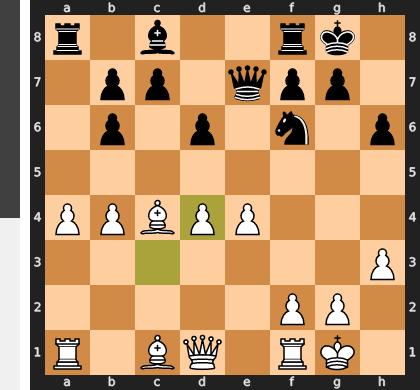

Played **cxd4**.

### Move 15 (Black): Nxe4 - Good 👍

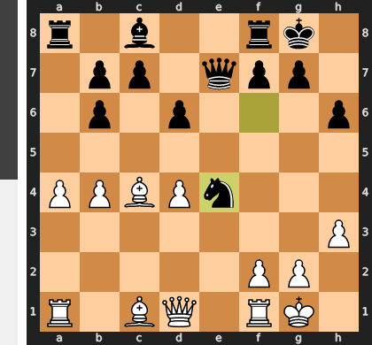

Played **Nxe4**. The engine recommended **Qxe4**.

### Move 16 (White): Re1 - Good 👍

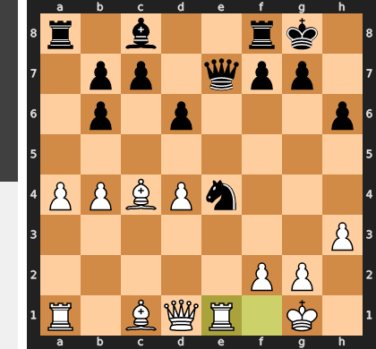

Played **Re1**. The engine recommended **Ra3**.

### Move 16 (Black): Bf5 - Blunder ❌

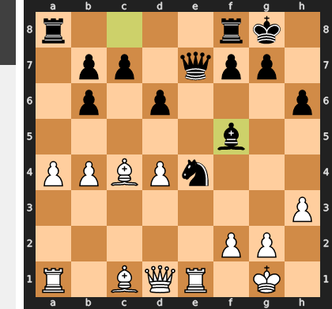

This move is a fatal miscalculation of the position's tactical demands, as ...Bf5 is a passive move in a razor-sharp position where tempo is everything. It allows White to immediately play the crushing f3, dislodging Black's magnificent e4-knight and causing their entire position to collapse. By contrast, the recommended ...Qh4 would have seized the initiative, creating a direct threat against f2 and making the f3 advance impossible, thereby preserving Black's central dominance.

### Move 17 (White): Bd3 - Mistake ❓

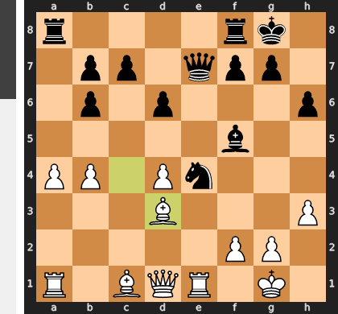

While Bd3 is a natural developing move, it is a critical mistake because it is too slow and completely misunderstands the urgency of the position. This move fails to challenge Black's monster knight on e4, ceding the initiative and allowing Black to solidify their central outpost with the powerful ...d5! thrust. The correct move, f3, would have immediately forced the issue against the e4-knight, dismantling Black's central control before it could be cemented and maintaining White's decisive advantage.

### Move 17 (Black): Rfe8 - Good 👍

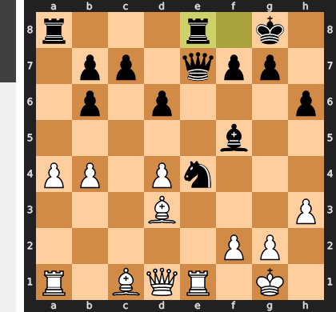

Played **Rfe8**. The engine recommended **Qh4**.

### Move 18 (White): f3 - Best Move ✅

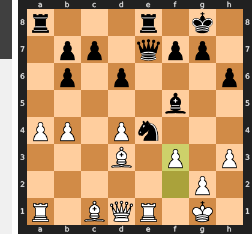

Played **f3**.

### Move 18 (Black): d5 - Best Move ✅

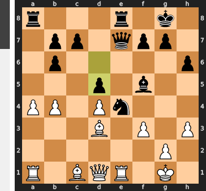

Played **d5**.

### Move 19 (White): fxe4 - Best Move ✅

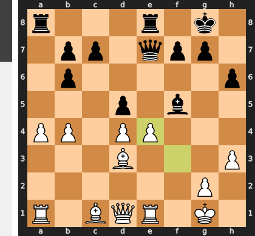

Played **fxe4**.

### Move 19 (Black): dxe4 - Best Move ✅

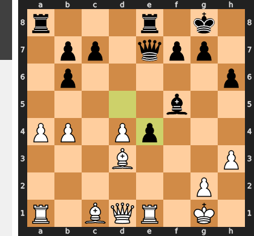

Played **dxe4**.

### Move 20 (White): Qe2 - Inaccuracy ⁈

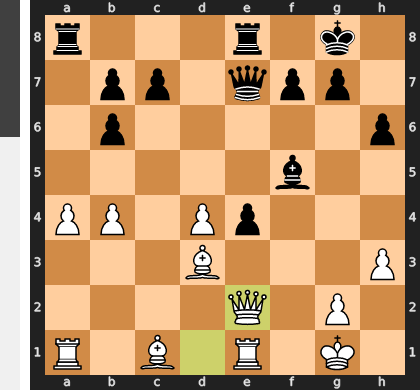

Played **Qe2**. The engine recommended **Bc2**.

### Move 20 (Black): Qxb4 - Best Move ✅

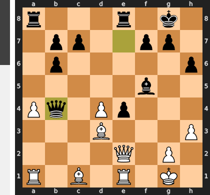

Played **Qxb4**.

### Move 21 (White): Bf4 - Blunder ❌

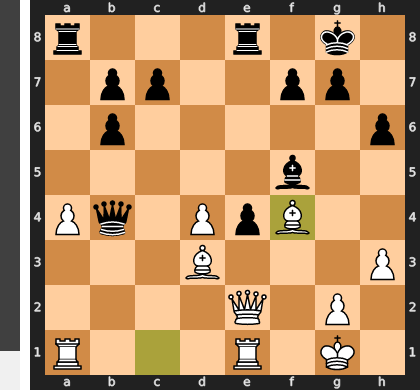

This is a tragic tactical oversight, as Bf4 completely ignores the looming threat of ...exd3. This simple pawn capture initiates a devastating discovered attack on the white queen by the e8-rook and simultaneously leaves the crucial d3-bishop hanging. White's entire central structure immediately collapses, as there is no way to save both the queen and the bishop, turning a promising advantage into a lost position.

### Move 21 (Black): exd3 - Best Move ✅

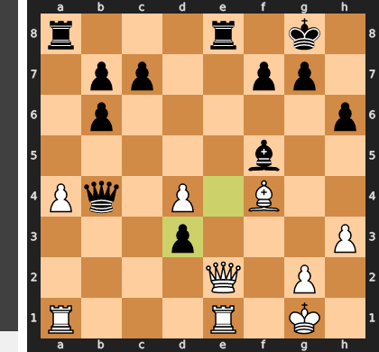

Played **exd3**.

### Move 22 (White): Qxe8+ - Good 👍

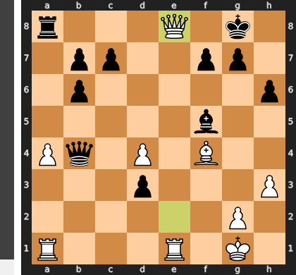

Played **Qxe8+**. The engine recommended **Qf2**.

### Move 22 (Black): Rxe8 - Best Move ✅

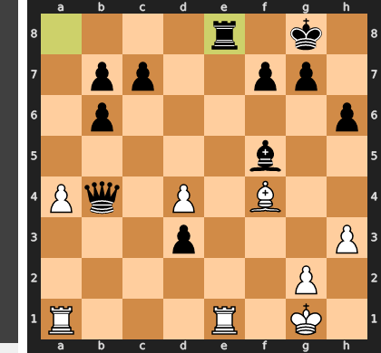

Played **Rxe8**.

### Move 23 (White): Rxe8+ - Best Move ✅

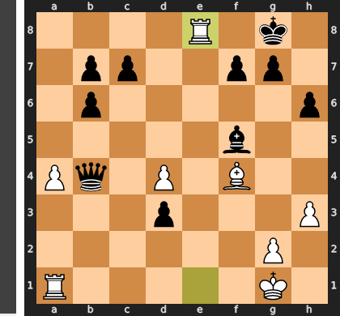

Played **Rxe8+**.

### Move 23 (Black): Kh7 - Best Move ✅

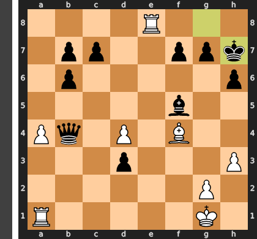

Played **Kh7**.

### Move 24 (White): Rb8 - Mistake ❓

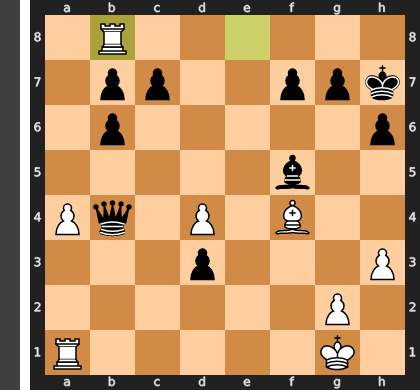

This move is a fatal misjudgment of priorities, seeking active counterplay while completely ignoring the game-deciding d3-pawn. By abandoning the first rank, the rook abdicates its critical defensive duties, allowing the crushing ...d2 advance to become unstoppable. The necessary move was the prophylactic Rf1, which prepares to meet ...d2 with Rd1 and keeps vital defensive resources near the vulnerable king.

### Move 24 (Black): Qxd4+ - Best Move ✅

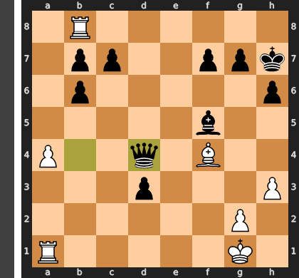

Played **Qxd4+**.

### Move 25 (White): Kh2 - Inaccuracy ⁈

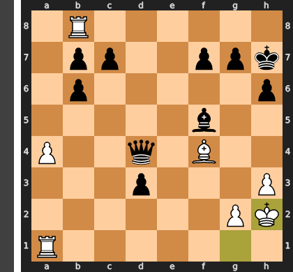

Played **Kh2**.

### Move 25 (Black): Qxf4+ - Best Move ✅

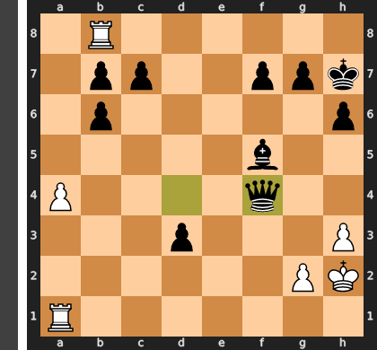

Played **Qxf4+**.

