# Chess Game Analysis: maximeblanchard vs kar2on

- **Result:** 1-0
- **Date:** 2026.04.03
- **Opening:** Pirc Defense Modern Defense Geller System 2...Nf6 3.Nc3 g6

### Move 1 (White): e4 - Best Move ✅

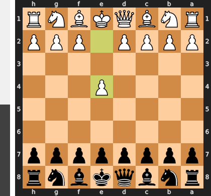

Played **e4**.

### Move 1 (Black): d6 - Good 👍

Played **d6**. The engine recommended **e5**.

### Move 2 (White): Nf3 - Good 👍

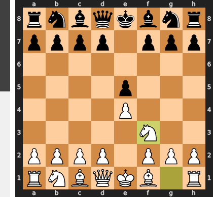

Played **Nf3**. The engine recommended **d4**.

### Move 2 (Black): Nf6 - Best Move ✅

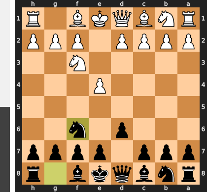

Played **Nf6**.

### Move 3 (White): Nc3 - Best Move ✅

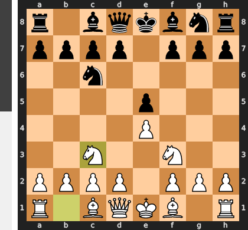

Played **Nc3**.

### Move 3 (Black): g6 - Good 👍

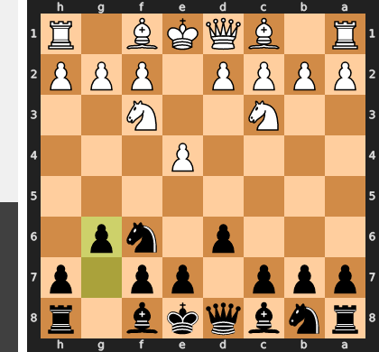

Played **g6**. The engine recommended **c5**.

### Move 4 (White): e5 - Inaccuracy ⁈

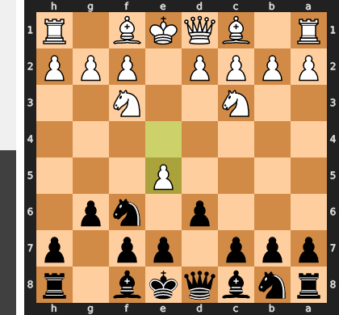

Played **e5**. The engine recommended **d4**.

### Move 4 (Black): dxe5 - Best Move ✅

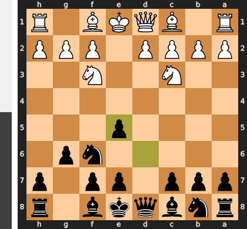

Played **dxe5**.

### Move 5 (White): Nxe5 - Best Move ✅

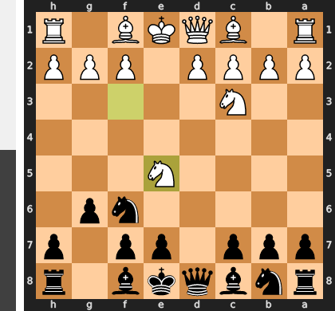

Played **Nxe5**.

### Move 5 (Black): Bg7 - Best Move ✅

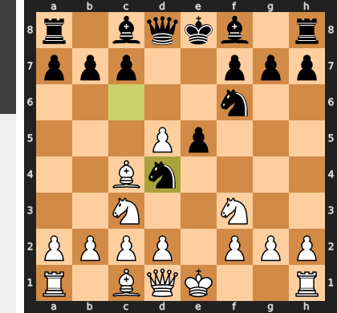

Played **Bg7**.

### Move 6 (White): d4 - Best Move ✅

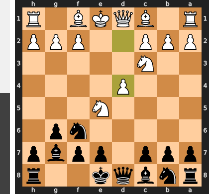

Played **d4**.

### Move 6 (Black): Nbd7 - Good 👍

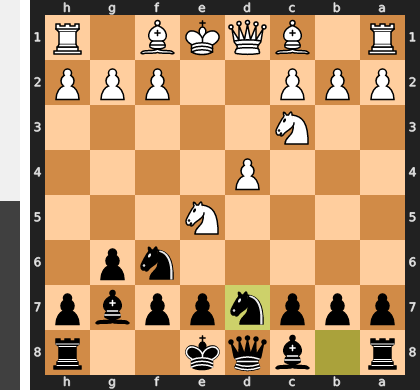

Played **Nbd7**. The engine recommended **O-O**.

### Move 7 (White): Nxd7 - Good 👍

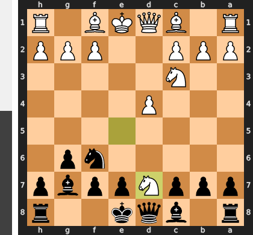

Played **Nxd7**. The engine recommended **Be2**.

### Move 7 (Black): Qxd7 - Good 👍

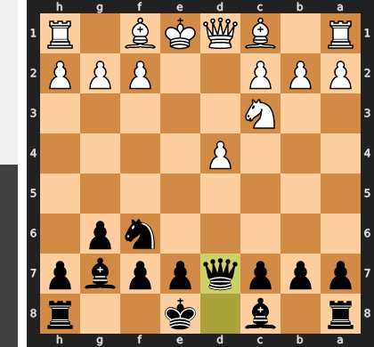

Played **Qxd7**. The engine recommended **Bxd7**.

### Move 8 (White): Be3 - Good 👍

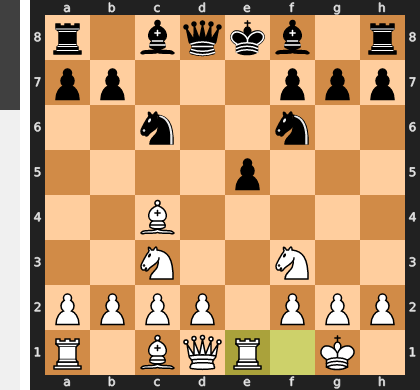

Played **Be3**. The engine recommended **Be2**.

### Move 8 (Black): O-O - Inaccuracy ⁈

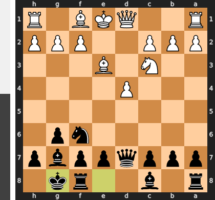

Played **O-O**. The engine recommended **Ng4**.

### Move 9 (White): Bd3 - Mistake ❓

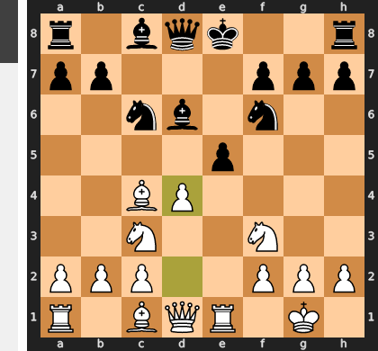

This move is a classic case of misplaced activity. By playing Bd3, White neglects the critical prophylactic move h3, which would have prevented Black's coming ...Ng4 idea to harass the key light-squared bishop. More importantly, Bd3 places the bishop on a vulnerable square and actively encourages Black to strike in the center with the now-powerful ...e5 pawn break, blowing the position open to the advantage of Black's better-developed pieces and safer king.

### Move 9 (Black): Nd5 - Mistake ❓

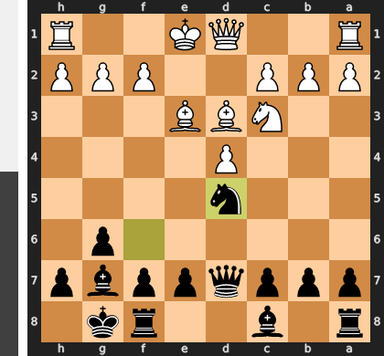

This move is a positional error because it releases all the central tension on White's terms; after the simple exchange Nxd5, you are permanently saddled with a weak and isolated d-pawn which becomes an easy target. This trade solves all of White's problems and squanders the initiative that the superior Ng4 would have created. That move would have forced a major concession by attacking the critical e3-bishop, creating decisive threats against White's uncastled king and compromised structure.

### Move 10 (White): O-O - Mistake ❓

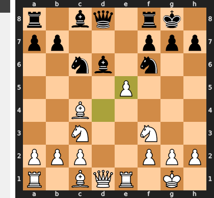

This standard developing move was a mistake because it critically misjudges the priority of dealing with Black's dominant knight on d5. By castling, you not only cede control of the center but you also walk your king into a tactical storm after the simple ...Nxe3. This exchange shatters your kingside pawn structure and opens the f-file for Black's rook, creating a decisive attack against your newly exposed king.

### Move 10 (Black): Nxc3 - Inaccuracy ⁈

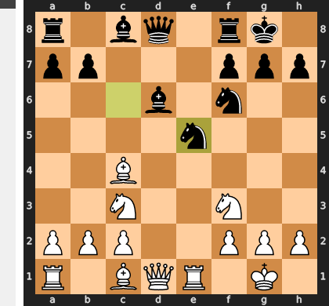

Played **Nxc3**. The engine recommended **Nxe3**.

### Move 11 (White): bxc3 - Best Move ✅

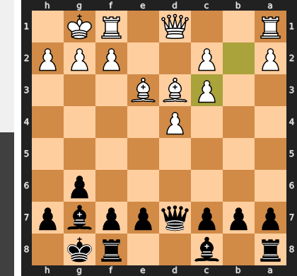

Played **bxc3**.

### Move 11 (Black): Qc6 - Good 👍

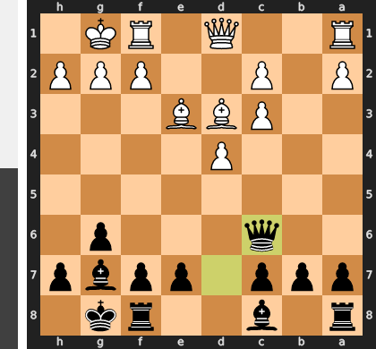

Played **Qc6**. The engine recommended **e5**.

### Move 12 (White): Bd2 - Good 👍

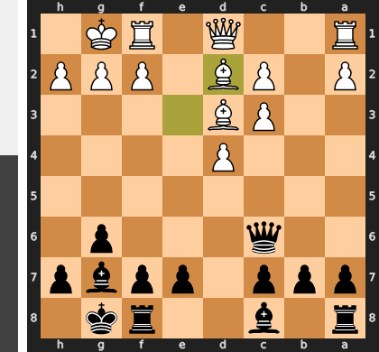

Played **Bd2**. The engine recommended **Qd2**.

### Move 12 (Black): Kh8 - Mistake ❓

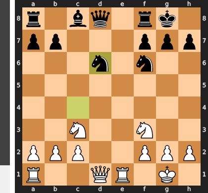

Black has fundamentally misjudged the position's urgency, playing a slow prophylactic move (...Kh8) when the moment demanded a decisive central strike. The correct move, ...e5, would have immediately shattered White's central control and unleashed the g7-bishop, but now White has a free tempo to consolidate their spatial advantage and seize the initiative.

### Move 13 (White): Rb1 - Inaccuracy ⁈

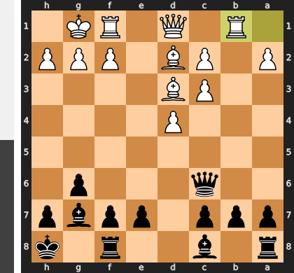

Played **Rb1**. The engine recommended **Re1**.

### Move 13 (Black): Rb8 - Good 👍

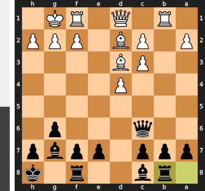

Played **Rb8**. The engine recommended **Be6**.

### Move 14 (White): Bb5 - Good 👍

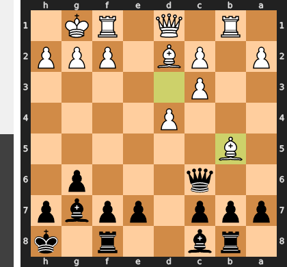

Played **Bb5**. The engine recommended **Qe2**.

### Move 14 (Black): Qd5 - Good 👍

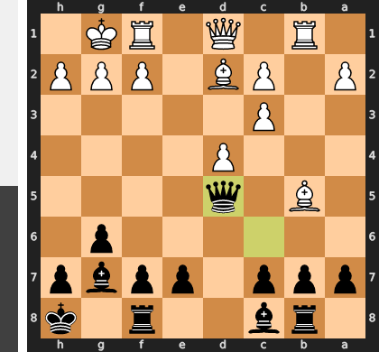

Played **Qd5**. The engine recommended **Qd6**.

### Move 15 (White): Be3 - Good 👍

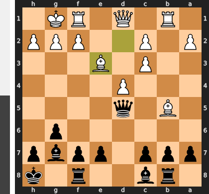

Played **Be3**. The engine recommended **Re1**.

### Move 15 (Black): c6 - Good 👍

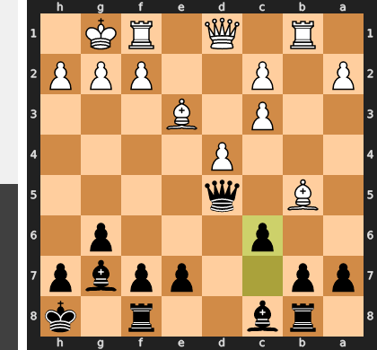

Played **c6**. The engine recommended **Qxa2**.

### Move 16 (White): c4 - Good 👍

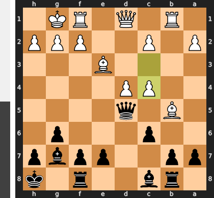

Played **c4**. The engine recommended **Bd3**.

### Move 16 (Black): Qf5 - Mistake ❓

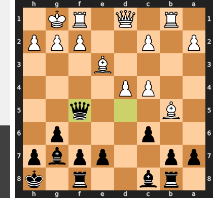

This move was a serious positional mistake because it moves the queen to a seemingly active, but ultimately irrelevant, square. It allows White to play the brilliant retreating move `Ba4!`, which not only saves the critical bishop but also prepares to redeploy it to `b3` to attack the weak f7-pawn. Black's queen is now tragically misplaced and becomes a spectator as White's pieces coordinate perfectly to take complete control of the queenside and center.

### Move 17 (White): Ba4 - Mistake ❓

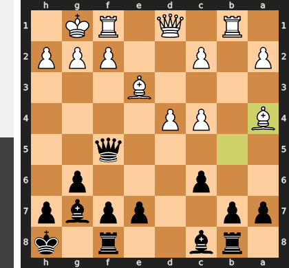

Excellent question. The move Ba4 is a serious positional error because it voluntarily moves your most active bishop from its dominant post controlling the center to a passive square on the wing. This move releases all pressure on Black's position, whereas the superior Bxc6 would have permanently damaged Black's pawn structure and secured White's control of the critical d5-square. Having been let off the hook, Black is now free to regroup and challenge for the initiative, completely squandering what was a clear advantage.

### Move 17 (Black): Rd8 - Inaccuracy ⁈

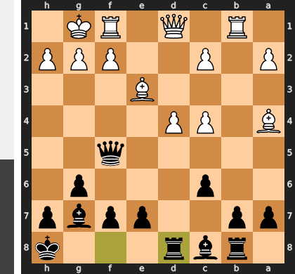

Played **Rd8**. The engine recommended **Be6**.

### Move 18 (White): c3 - Inaccuracy ⁈

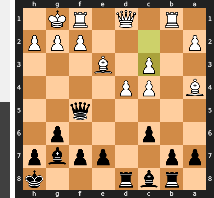

Played **c3**. The engine recommended **Bxc6**.

### Move 18 (Black): Be6 - Best Move ✅

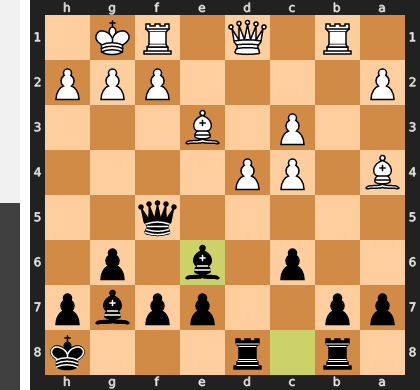

Played **Be6**.

### Move 19 (White): Bc2 - Good 👍

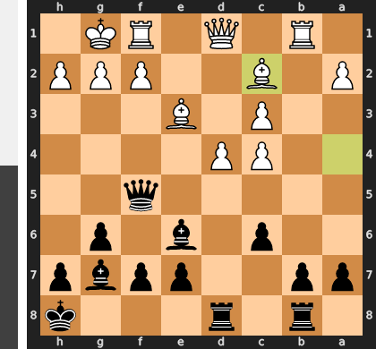

Played **Bc2**. The engine recommended **Bb3**.

### Move 19 (Black): Qa5 - Best Move ✅

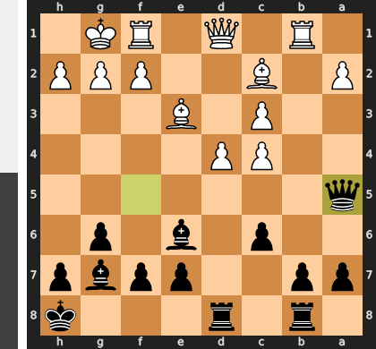

Played **Qa5**.

### Move 20 (White): Bb3 - Best Move ✅

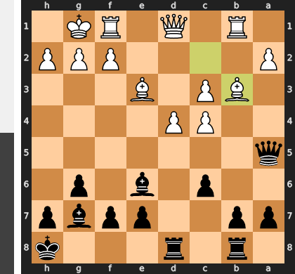

Played **Bb3**.

### Move 20 (Black): Qc7 - Inaccuracy ⁈

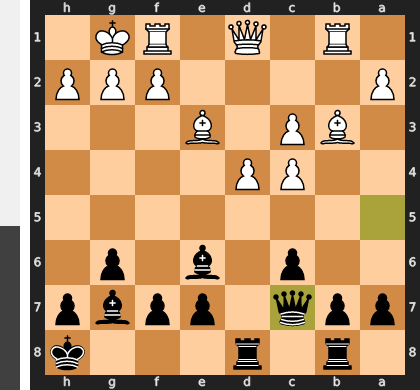

Played **Qc7**. The engine recommended **Qxc3**.

### Move 21 (White): Re1 - Good 👍

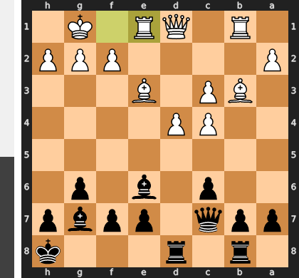

Played **Re1**. The engine recommended **Qf3**.

### Move 21 (Black): c5 - Good 👍

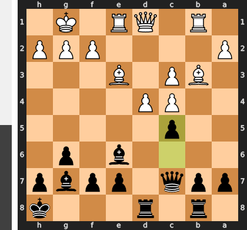

Played **c5**. The engine recommended **b5**.

### Move 22 (White): g3 - Good 👍

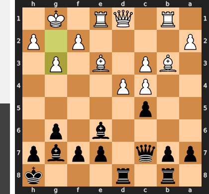

Played **g3**. The engine recommended **Rc1**.

### Move 22 (Black): Bh3 - Good 👍

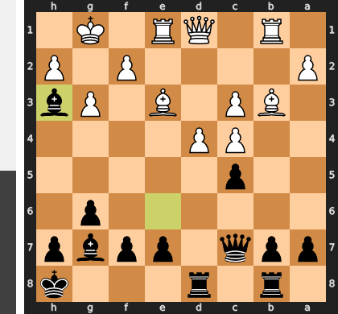

Played **Bh3**. The engine recommended **cxd4**.

### Move 23 (White): Bf4 - Good 👍

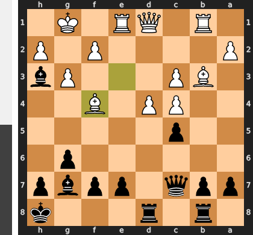

Played **Bf4**. The engine recommended **Qf3**.

### Move 23 (Black): Qc6 - Mistake ❓

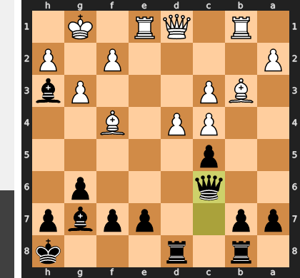

Black fatally misunderstands the position's central tension, wasting a critical tempo with the slow `...Qc6`. This passive move invites the crushing `d5`, which not only attacks the queen but more importantly entombs the powerful g7-bishop, rendering it a mere spectator. Instead of fighting for the center with `...e5` to create counterplay, Black has allowed White to seize complete control and is now left positionally paralyzed to face a decisive attack against the d6-square.

### Move 24 (White): f3 - Mistake ❓

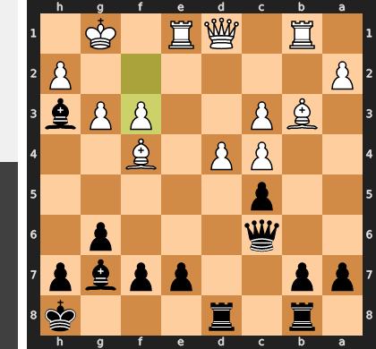

This move f3 is a grave positional error because it addresses the annoying h3-bishop at the cost of permanently shattering the light-square defenses around your own king, especially creating a fatal hole on e3. This allows Black to immediately rip open the center with ...cxd4, and your king, once safe, suddenly becomes the primary target of the attack. The correct d5 would have done the opposite, seizing the center and suffocating Black's pieces before they could find any counterplay.

### Move 24 (Black): Rbc8 - Inaccuracy ⁈

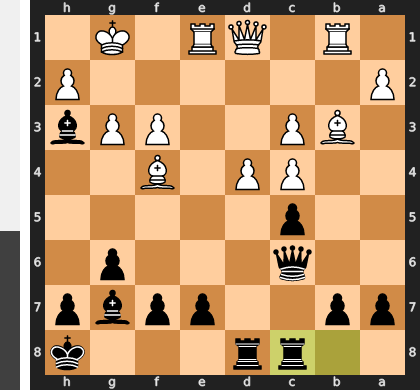

Played **Rbc8**. The engine recommended **cxd4**.

### Move 25 (White): d5 - Best Move ✅

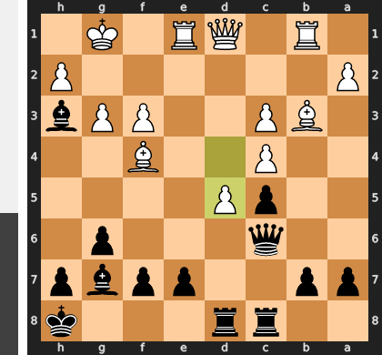

Played **d5**.

### Move 25 (Black): Qf6 - Best Move ✅

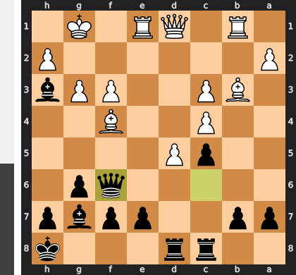

Played **Qf6**.

### Move 26 (White): Rc1 - Good 👍

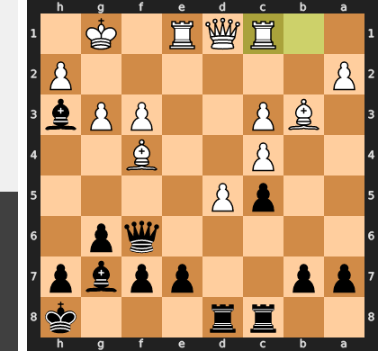

Played **Rc1**. The engine recommended **Re3**.

### Move 26 (Black): e6 - Good 👍

Played **e6**. The engine recommended **Bd7**.

### Move 27 (White): Be5 - Inaccuracy ⁈

Played **Be5**. The engine recommended **d6**.

### Move 27 (Black): Qf5 - Best Move ✅

Played **Qf5**.

### Move 28 (White): Bxg7+ - Good 👍

Played **Bxg7+**. The engine recommended **Bf4**.

### Move 28 (Black): Kxg7 - Best Move ✅

Played **Kxg7**.

### Move 29 (White): dxe6 - Blunder ❌

The move `dxe6` is a catastrophic strategic misjudgment, as it liquidates White's single greatest asset—the paralyzing passed pawn—for a meaningless capture. More devastatingly, the obligatory recapture `...fxe6` tears open the f-file, giving Black's queen a decisive, unimpeded attacking route against the fatally weakened king. White has single-handedly dismantled his own position while activating Black's most dangerous piece for the final assault.

### Move 29 (Black): Rxd1 - Best Move ✅

Played **Rxd1**.

### Move 30 (White): Rcxd1 - Inaccuracy ⁈

Played **Rcxd1**. The engine recommended **Bxd1**.

### Move 30 (Black): Qxf3 - Best Move ✅

Played **Qxf3**.

### Move 31 (White): Rd2 - Best Move ✅

Played **Rd2**.

### Move 31 (Black): Qe3+ - Blunder ❌

This check initiates a catastrophic queen trade, fundamentally misjudging that Black's queen was the essential piece holding back White's decisive threats. After the forced sequence `Rxe3 fxe3`, Black has not only traded away their best attacker but has also fatally altered their own pawn structure, giving White's monstrous e6-pawn a clear and unstoppable path to decide the game.

### Move 32 (White): Rf2 - Blunder ❌

This is a catastrophic case of threat blindness, as moving the rook to f2 fatally vacates the f1-square and allows a simple, forced back-rank mate starting with ...Qxe1+. The winning plan required proactively liquidating Black's attack with the exchange sacrifice Rxe3, which would have eliminated the dangerous queen and ensured the e6-pawn's advance was decisive. Instead, this passive defensive attempt removed a critical defender and handed Black the game on the spot.

### Move 32 (Black): Qxe1+ - Best Move ✅

Played **Qxe1+**.

### Move 33 (White): Rf1 - Best Move ✅

Played **Rf1**.

