# Chess Game Analysis: KILLER17566 vs kar2on

- **Result:** 1-0
- **Date:** 2026.04.03
- **Opening:** Pirc Defense Classical Variation 4...Bg7 5.Bg5 O O

### Move 1 (White): e4 - Best Move ✅

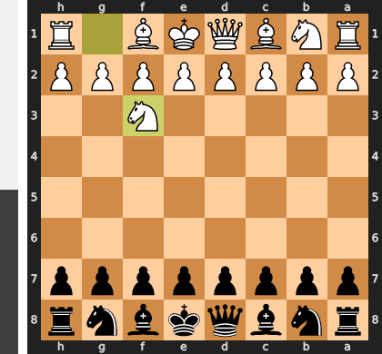

Played **e4**.

### Move 1 (Black): d6 - Good 👍

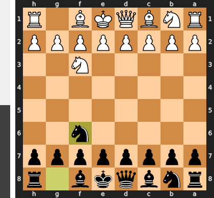

Played **d6**. The engine recommended **e5**.

### Move 2 (White): d4 - Best Move ✅

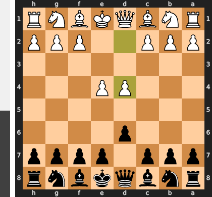

Played **d4**.

### Move 2 (Black): Nf6 - Best Move ✅

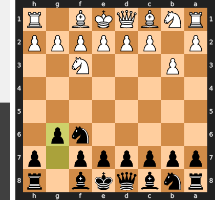

Played **Nf6**.

### Move 3 (White): Nc3 - Best Move ✅

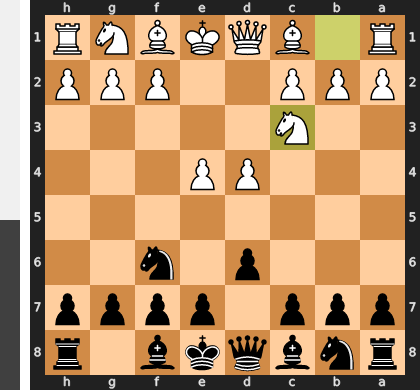

Played **Nc3**.

### Move 3 (Black): g6 - Good 👍

Played **g6**. The engine recommended **e5**.

### Move 4 (White): Nf3 - Good 👍

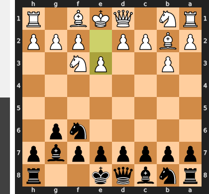

Played **Nf3**. The engine recommended **f4**.

### Move 4 (Black): Bg7 - Best Move ✅

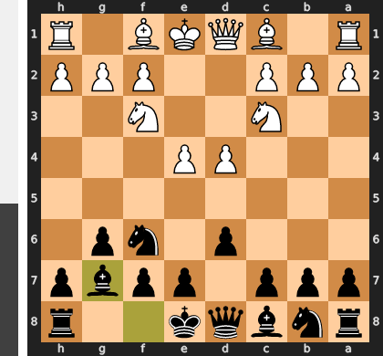

Played **Bg7**.

### Move 5 (White): Bg5 - Good 👍

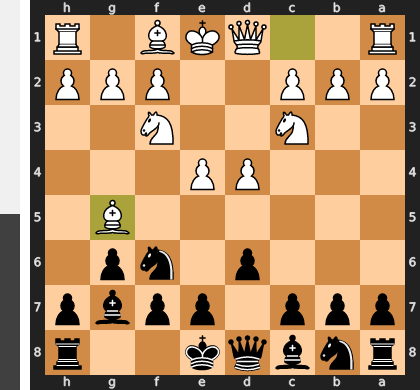

Played **Bg5**. The engine recommended **Be3**.

### Move 5 (Black): O-O - Good 👍

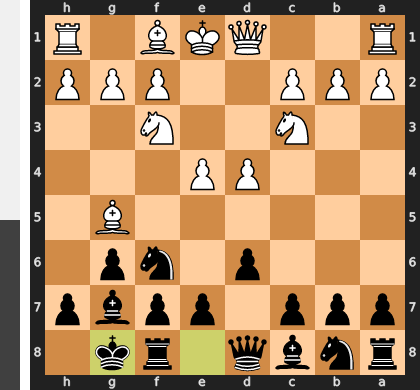

Played **O-O**. The engine recommended **d5**.

### Move 6 (White): Bc4 - Inaccuracy ⁈

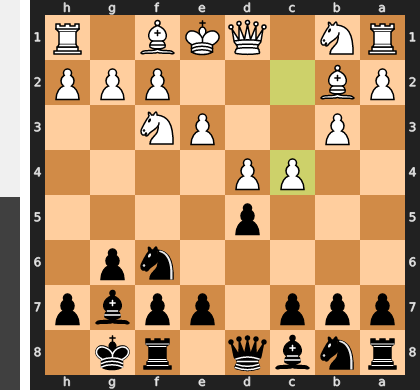

Played **Bc4**. The engine recommended **Qd2**.

### Move 6 (Black): c5 - Inaccuracy ⁈

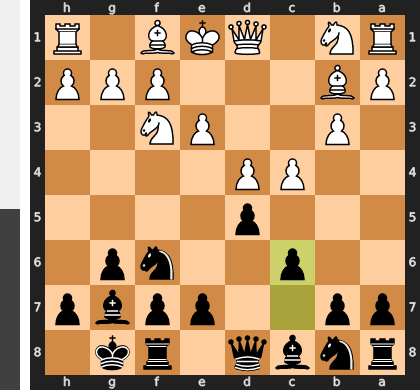

Played **c5**. The engine recommended **Nxe4**.

### Move 7 (White): O-O - Inaccuracy ⁈

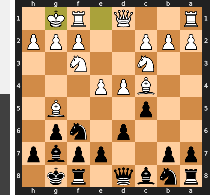

Played **O-O**. The engine recommended **dxc5**.

### Move 7 (Black): cxd4 - Best Move ✅

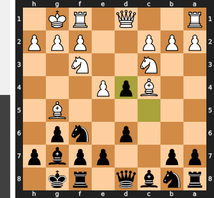

Played **cxd4**.

### Move 8 (White): Nxd4 - Best Move ✅

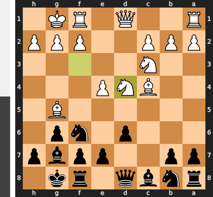

Played **Nxd4**.

### Move 8 (Black): Nc6 - Best Move ✅

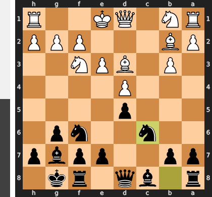

Played **Nc6**.

### Move 9 (White): Re1 - Good 👍

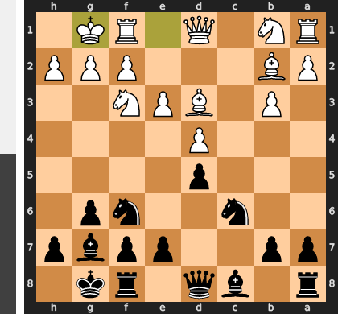

Played **Re1**. The engine recommended **h3**.

### Move 9 (Black): Nxd4 - Best Move ✅

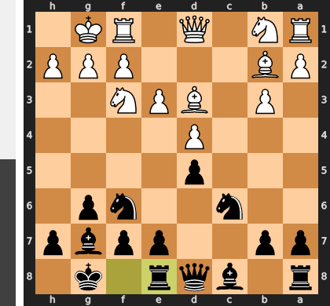

Played **Nxd4**.

### Move 10 (White): Qxd4 - Best Move ✅

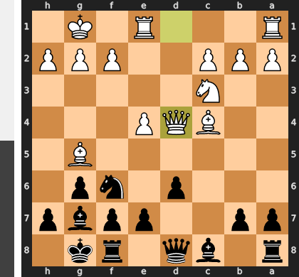

Played **Qxd4**.

### Move 10 (Black): Qc7 - Inaccuracy ⁈

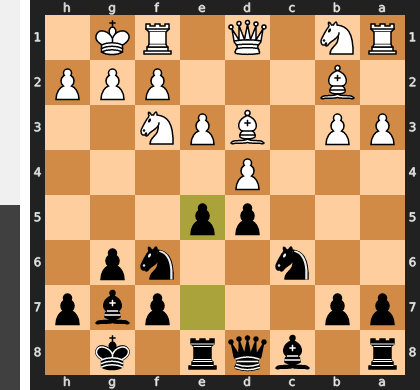

Played **Qc7**. The engine recommended **h6**.

### Move 11 (White): Nb5 - Good 👍

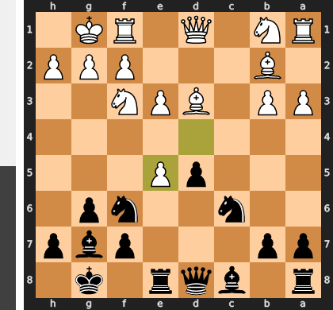

Played **Nb5**. The engine recommended **Qd3**.

### Move 11 (Black): Qd7 - Inaccuracy ⁈

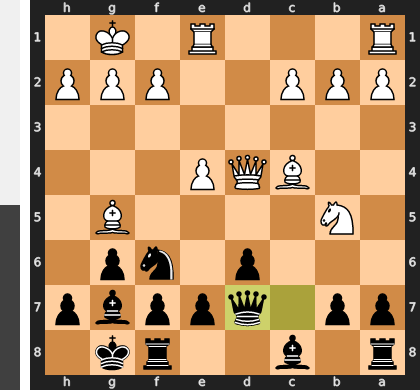

Played **Qd7**. The engine recommended **Qc6**.

### Move 12 (White): Rad1 - Best Move ✅

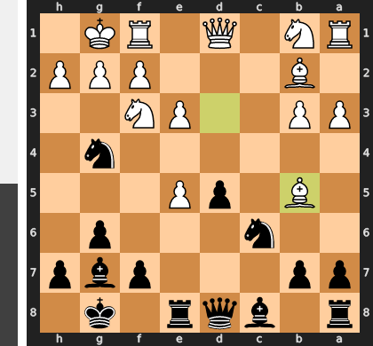

Played **Rad1**.

### Move 12 (Black): a6 - Best Move ✅

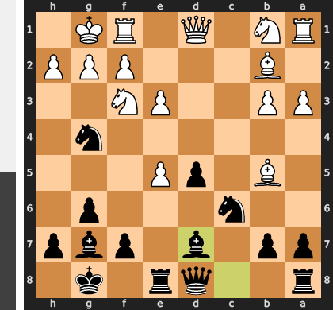

Played **a6**.

### Move 13 (White): Bxf6 - Blunder ❌

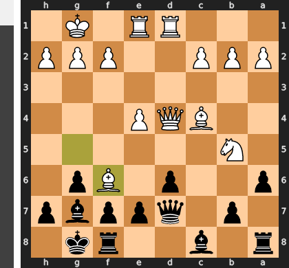

This move is a strategic catastrophe because it completely overlooks the crushing intermediate move, ...axb5!. By allowing Black this free tempo to eliminate the powerful knight, White voluntarily trades away his two most active attacking pieces (the bishop and the b5-knight) for just one of Black's defenders. This tactical oversight single-handedly dissolves White's entire initiative, leaving Black with a decisive positional advantage and complete control of the game.

### Move 13 (Black): Bxf6 - Best Move ✅

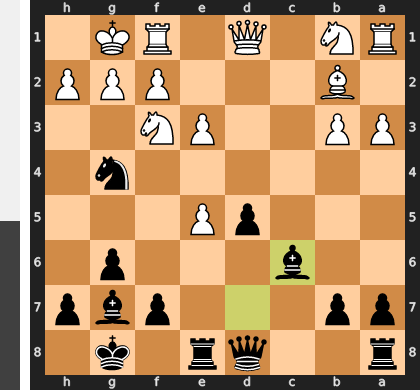

Played **Bxf6**.

### Move 14 (White): e5 - Best Move ✅

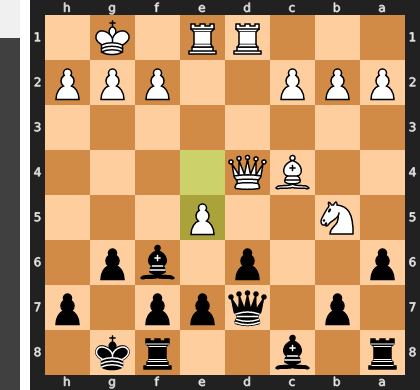

Played **e5**.

### Move 14 (Black): Bg7 - Blunder ❌

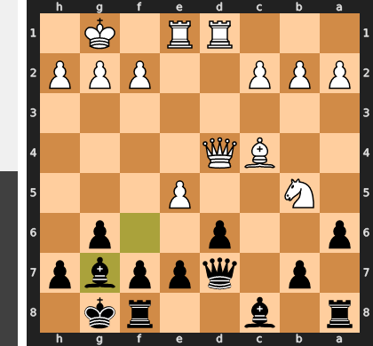

By playing the routine developing move ...Bg7, Black completely misunderstood the tactical urgency of the position. This move fatally ignores White's central pressure and allows the crushing sacrifice Nxd6!, which shatters Black's central pawn structure and exposes the queen to a devastating attack. The correct move, ...Bxe5, was essential to immediately eliminate the critical e5-pawn, the cornerstone of White's attack, thereby neutralizing the pressure and consolidating a winning advantage.

### Move 15 (White): Nxd6 - Mistake ❓

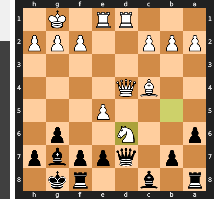

This move is a classic case of a "looks good, is bad" tactical oversight, stemming from a miscalculation of a trading sequence. While Nxd6 appears to plant a monster knight deep in Black's territory, it actually invites a forced liquidation that cripples White's attack via the sequence ...Qxd6, and after exd6, the crushing intermezzo ...Bxd4!. This clever reply removes White's two most dangerous attacking pieces—the queen and the c4 bishop—at a stroke, leaving Black's fianchettoed bishop on g7 utterly dominant in the resulting endgame.

### Move 15 (Black): exd6 - Best Move ✅

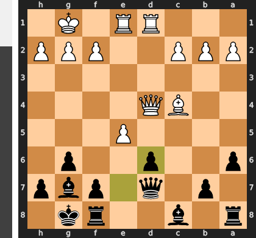

Played **exd6**.

### Move 16 (White): Qxd6 - Good 👍

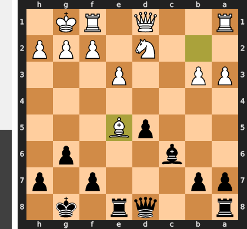

Played **Qxd6**. The engine recommended **Qb6**.

### Move 16 (Black): Qxd6 - Best Move ✅

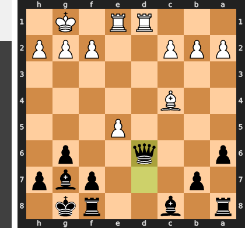

Played **Qxd6**.

### Move 17 (White): exd6 - Best Move ✅

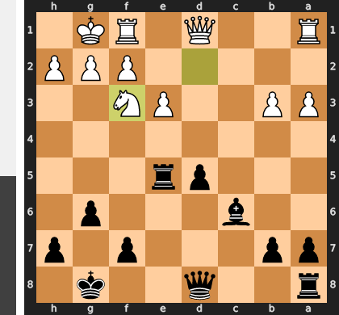

Played **exd6**.

### Move 17 (Black): Bf5 - Good 👍

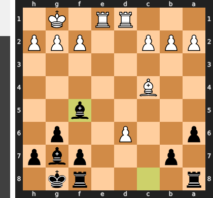

Played **Bf5**. The engine recommended **Bg4**.

### Move 18 (White): Bd3 - Good 👍

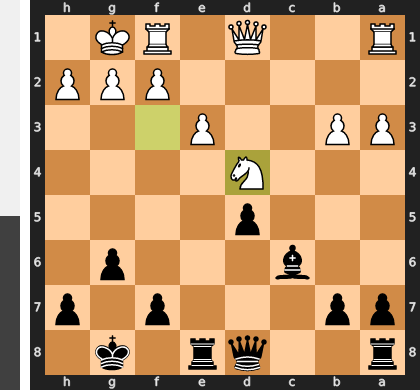

Played **Bd3**. The engine recommended **Bd5**.

### Move 18 (Black): Bd7 - Best Move ✅

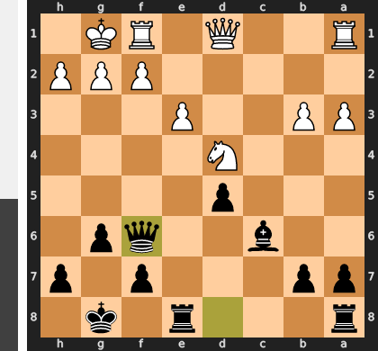

Played **Bd7**.

### Move 19 (White): Kf1 - Inaccuracy ⁈

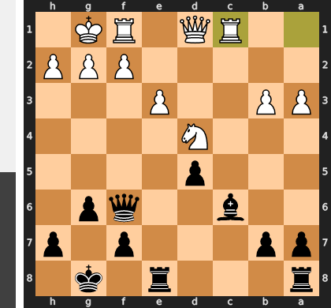

Played **Kf1**. The engine recommended **b3**.

### Move 19 (Black): Rfe8 - Good 👍

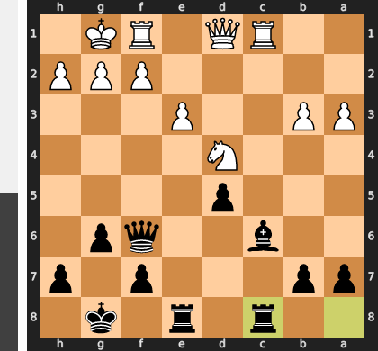

Played **Rfe8**. The engine recommended **Bxb2**.

### Move 20 (White): c4 - Inaccuracy ⁈

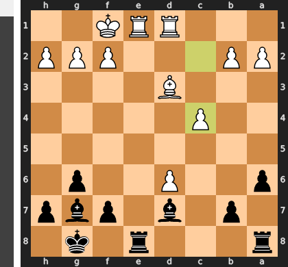

Played **c4**. The engine recommended **Re7**.

### Move 20 (Black): b6 - Inaccuracy ⁈

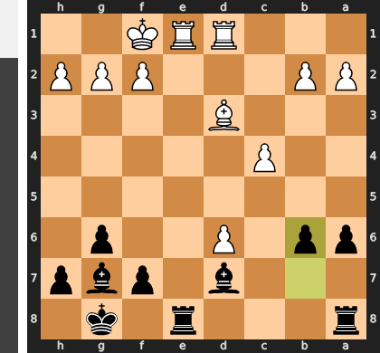

Played **b6**. The engine recommended **Bxb2**.

### Move 21 (White): b4 - Good 👍

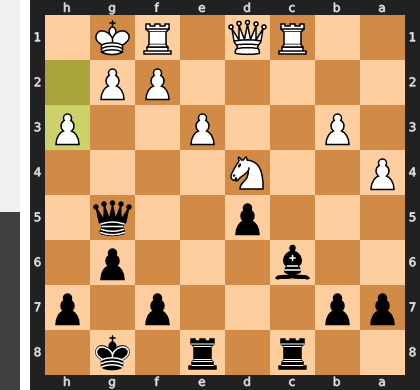

Played **b4**. The engine recommended **Rxe8+**.

### Move 21 (Black): Be5 - Inaccuracy ⁈

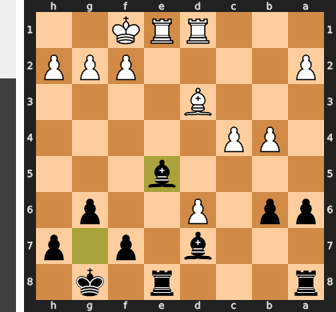

Played **Be5**. The engine recommended **Red8**.

### Move 22 (White): h3 - Inaccuracy ⁈

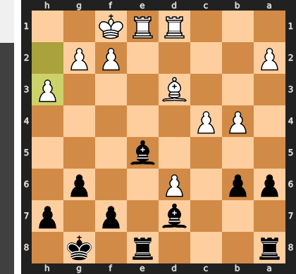

Played **h3**. The engine recommended **Be4**.

### Move 22 (Black): Bxd6 - Good 👍

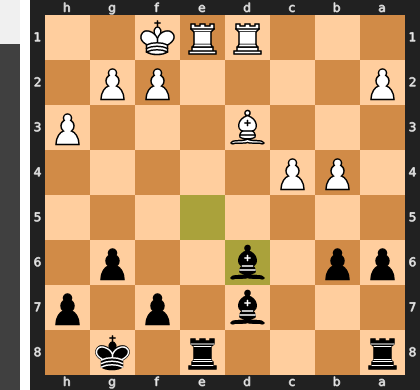

Played **Bxd6**. The engine recommended **Rad8**.

### Move 23 (White): Bxg6 - Mistake ❓

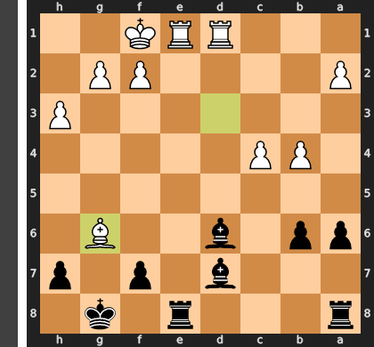

This capture is a grave positional error, as it trades away White's best minor piece while voluntarily opening the h-file for a decisive attack against the exposed white king after ...hxg6. Instead of assisting Black's primary plan, the correct approach was c5, which creates immediate counterplay by challenging Black's monster bishop on d6 and forcing them to divert resources away from their kingside assault.

### Move 23 (Black): hxg6 - Mistake ❓

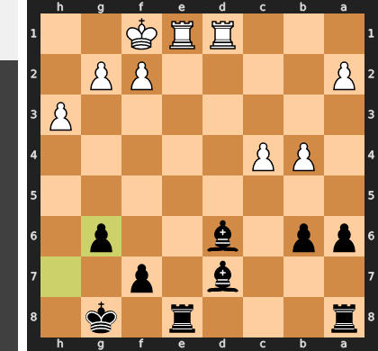

This capture is a positional luxury that tragically overlooks the decisive tactical blow available on the e-file. By failing to play the immediate `Rxe1+`, which would be followed by the crushing `...Bf4` to trap White's remaining rook, Black gave White a critical tempo to escape. With the move `Rxd7`, White is now able to dismantle the suffocating pin and liquidate into a much more manageable, albeit still difficult, endgame.

### Move 24 (White): Rxd6 - Inaccuracy ⁈

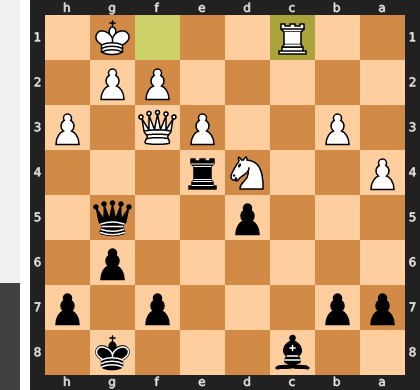

Played **Rxd6**. The engine recommended **Rxe8+**.

### Move 24 (Black): Be6 - Best Move ✅

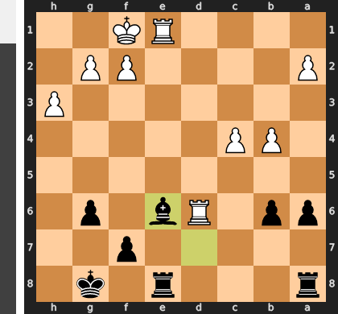

Played **Be6**.

### Move 25 (White): c5 - Mistake ❓

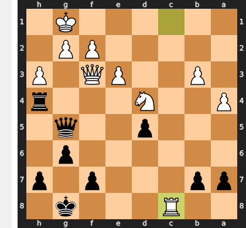

This impulsive push was a grave positional error, as it liquidates White's strong b4-c4 pawn structure after the inevitable ...bxc5. By doing so, White voluntarily opens the a-file and invites Black's previously passive a8-rook to create powerful counterplay against the now-vulnerable a2-pawn. The superior Rc1 would have maintained the suffocating pawn chain and improved coordination, forcing Black to remain on the defensive.

### Move 25 (Black): bxc5 - Mistake ❓

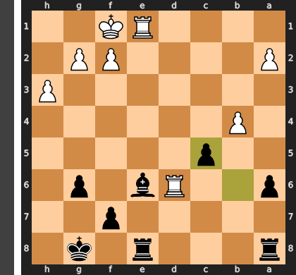

Black chose a slow, material-oriented plan by capturing on c5, which unfortunately squanders the initiative and gives White precious time to consolidate his position. The critical mistake was overlooking the tactical urgency; an immediate check like ...Bc4+ would have relentlessly pressured the exposed white king, shattering White's defensive coordination and preventing the rook on d6 from becoming a stable defensive piece.

### Move 26 (White): bxc5 - Mistake ❓

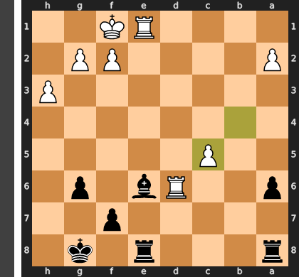

This move is a grave positional error, as it greedily focuses on a pawn while completely ignoring Black's crushing initiative. By playing the slow bxc5, you allow Black's rooks to immediately swarm the c-file with ...Rec8, turning the very pawn you sought to protect into a fatal, indefensible weakness. The correct path was the active Re4, which would have challenged Black's rook activity and created desperately needed counterplay, the only viable plan in such a difficult position.

### Move 26 (Black): Bc4+ - Best Move ✅

Played **Bc4+**.

### Move 27 (White): Kg1 - Best Move ✅

Played **Kg1**.

### Move 27 (Black): Rxe1+ - Best Move ✅

Played **Rxe1+**.

### Move 28 (White): Kh2 - Best Move ✅

Played **Kh2**.

### Move 28 (Black): Rc8 - Good 👍

Played **Rc8**. The engine recommended **Re5**.

### Move 29 (White): c6 - Inaccuracy ⁈

Played **c6**. The engine recommended **f4**.

### Move 29 (Black): Bb5 - Good 👍

Played **Bb5**. The engine recommended **Re6**.

### Move 30 (White): c7 - Good 👍

Played **c7**. The engine recommended **g4**.

### Move 30 (Black): Rxc7 - Best Move ✅

Played **Rxc7**.

### Move 31 (White): Rd8+ - Good 👍

Played **Rd8+**. The engine recommended **a4**.

### Move 31 (Black): Kg7 - Good 👍

Played **Kg7**. The engine recommended **Re8**.

### Move 32 (White): Rb8 - Good 👍

Played **Rb8**. The engine recommended **a4**.

### Move 32 (Black): Rc2 - Good 👍

Played **Rc2**. The engine recommended **Re8**.

### Move 33 (White): a4 - Best Move ✅

Played **a4**.

### Move 33 (Black): Bxa4 - Good 👍

Played **Bxa4**. The engine recommended **Bc6**.

### Move 34 (White): Rb7 - Good 👍

Played **Rb7**. The engine recommended **Kg3**.

### Move 34 (Black): Bb5 - Good 👍

Played **Bb5**. The engine recommended **Ree2**.

### Move 35 (White): Rb6 - Good 👍

Played **Rb6**. The engine recommended **Kg3**.

### Move 35 (Black): Ree2 - Good 👍

Played **Ree2**. The engine recommended **Rxf2**.

### Move 36 (White): Kg3 - Inaccuracy ⁈

Played **Kg3**.

### Move 36 (Black): Rxf2 - Best Move ✅

Played **Rxf2**.

### Move 37 (White): Rb8 - Good 👍

Played **Rb8**. The engine recommended **h4**.

### Move 37 (Black): Rxg2+ - Good 👍

Played **Rxg2+**. The engine recommended **Bc6**.

### Move 38 (White): Kf3 - Best Move ✅

Played **Kf3**.

### Move 38 (Black): Rcf2+ - Blunder ❌

This was a tragic blunder of impatience, turning a forced mate into a difficult technical win. The winning move, Rge2, would have completed a perfect cage around the king, leaving White in a fatal zugzwang with no escape from a subsequent Re3 mate. Instead, Rcf2+ is a pointless check that forces the king to the active e4-square, shattering the mating net and allowing the monarch to flee the danger zone.

### Move 39 (White): Ke3 - Good 👍

Played **Ke3**. The engine recommended **Ke4**.

### Move 39 (Black): Re2+ - Good 👍

Played **Re2+**. The engine recommended **Rc2**.

### Move 40 (White): Kf3 - Good 👍

Played **Kf3**. The engine recommended **Kd4**.

### Move 40 (Black): Bc6+ - Best Move ✅

Played **Bc6+**.

### Move 41 (White): Kf4 - Best Move ✅

Played **Kf4**.

### Move 41 (Black): g5+ - Best Move ✅

Played **g5+**.

### Move 42 (White): Kf5 - Best Move ✅

Played **Kf5**.

### Move 42 (Black): Be4+ - Blunder ❌

Black was blinded by the allure of a direct, forcing check with Be4+, but this move fatally fails to control the key f4 escape square for the white king. This single oversight allows the king to slip out of the mating net, unnecessarily prolonging the game. The missed opportunity was the far more decisive Bd7#, a "quiet" move that perfectly coordinated with the rooks to trap the king and deliver an immediate checkmate.

### Move 43 (White): Ke5 - Blunder ❌

While the position was already beyond saving, the move Ke5 is a blunder because it actively walks the king into a fatal crossfire from Black's perfectly coordinated pieces. By stepping onto the light-squared e5, the king places itself on the same diagonal as the lethal e4-bishop and closer to the suffocating rook battery on the g- and e-files. This fatal exposure allows Black to immediately begin a decisive and unstoppable mating attack, for instance with ...f5+, whereas other king moves would have prolonged the resistance.

### Move 43 (Black): Bc2+ - Blunder ❌

This premature check was a classic case of chasing the king rather than caging it. While ...Bc2+ forces a response, it critically allows the White king an escape route to d4, releasing the immediate pressure and dissolving the forced mate. The correct path was the quiet, suffocating move ...Rg3, which would have perfected the mating net by taking away all flight squares in advance of a decisive and unstoppable ...Re4# threat.

### Move 44 (White): Kd5 - Good 👍

Played **Kd5**. The engine recommended **Kd4**.

### Move 44 (Black): Rd2+ - Inaccuracy ⁈

Played **Rd2+**. The engine recommended **Bg6**.

### Move 45 (White): Kc4 - Good 👍

Played **Kc4**. The engine recommended **Kc5**.

### Move 45 (Black): Rge2 - Good 👍

Played **Rge2**. The engine recommended **Bd3+**.

### Move 46 (White): h4 - Inaccuracy ⁈

Played **h4**. The engine recommended **Kb4**.

### Move 46 (Black): Bd3+ - Inaccuracy ⁈

Played **Bd3+**. The engine recommended **gxh4**.

### Move 47 (White): Kc3 - Good 👍

Played **Kc3**. The engine recommended **Kb4**.

