# Chess Game Analysis: Finwhale28 vs kar2on

- **Result:** 0-1
- **Date:** 2026.04.04
- **Opening:** Pirc Defense 2.d4 Nf6

### Move 1 (White): e4 - Best Move ✅

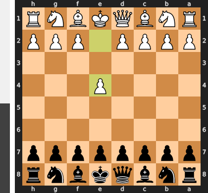

Played **e4**.

### Move 1 (Black): d6 - Good 👍

Played **d6**. The engine recommended **e5**.

### Move 2 (White): d4 - Best Move ✅

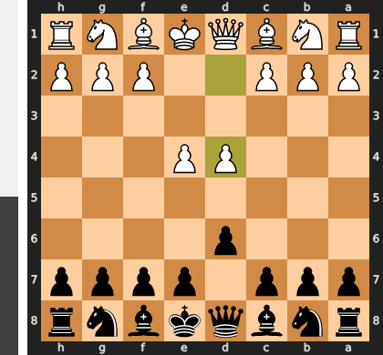

Played **d4**.

### Move 2 (Black): Nf6 - Best Move ✅

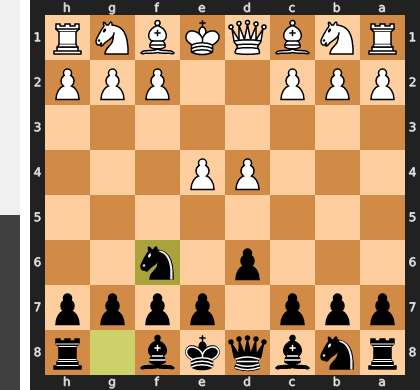

Played **Nf6**.

### Move 3 (White): e5 - Mistake ❓

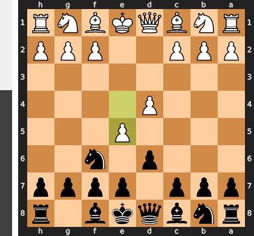

This premature pawn push is a grave strategic error, as it resolves the central tension in a way that benefits Black. After the simple response ...dxe5, the ensuing queen trade on d1 will permanently strand your king in the center, forfeiting your right to castle and creating a long-term weakness. Instead of fighting for an advantage, you are now fighting for equality from a positionally compromised situation.

### Move 3 (Black): dxe5 - Best Move ✅

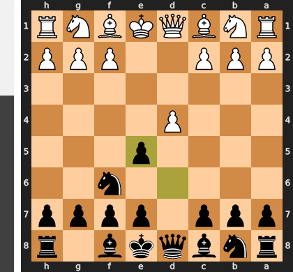

Played **dxe5**.

### Move 4 (White): dxe5 - Best Move ✅

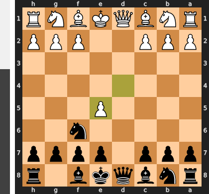

Played **dxe5**.

### Move 4 (Black): Qxd1+ - Best Move ✅

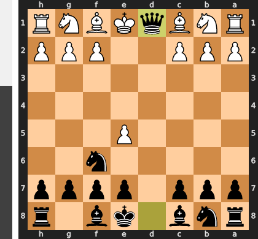

Played **Qxd1+**.

### Move 5 (White): Kxd1 - Best Move ✅

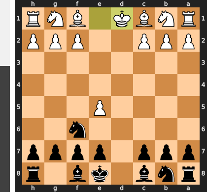

Played **Kxd1**.

### Move 5 (Black): Ng4 - Best Move ✅

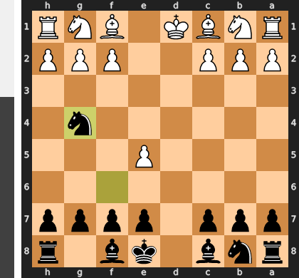

Played **Ng4**.

### Move 6 (White): f4 - Mistake ❓

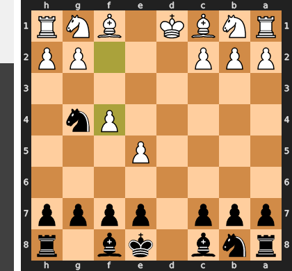

This move rashly addresses the annoying knight on g4 while ignoring the far more critical problem of the exposed king on d1. By pushing the f-pawn, White has created a permanent and fatal weakness on the e3-square, which Black will now use as a decisive outpost. The simple Ke1 was essential, as it would have solved the root cause of White's problems—king safety—without making such a ruinous structural concession.

### Move 6 (Black): Nf2+ - Best Move ✅

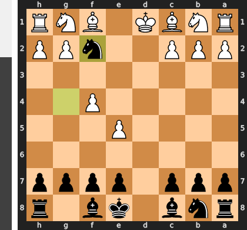

Played **Nf2+**.

