# Chess Game Analysis: MrSmurf3 vs kar2on

- **Result:** 0-1
- **Date:** 2026.04.03
- **Opening:** Pirc Defense Classical Variation 4...Bg7 5.Bc4 O O

### Move 1 (White): d4 - Good 👍

Played **d4**. The engine recommended **e4**.

### Move 1 (Black): Nf6 - Best Move ✅

Played **Nf6**.

### Move 2 (White): Nc3 - Good 👍

Played **Nc3**. The engine recommended **c4**.

### Move 2 (Black): g6 - Inaccuracy ⁈

Played **g6**. The engine recommended **d5**.

### Move 3 (White): e4 - Best Move ✅

Played **e4**.

### Move 3 (Black): d6 - Best Move ✅

Played **d6**.

### Move 4 (White): Nf3 - Good 👍

Played **Nf3**. The engine recommended **Be3**.

### Move 4 (Black): Bg7 - Best Move ✅

Played **Bg7**.

### Move 5 (White): Bc4 - Good 👍

Played **Bc4**. The engine recommended **Be3**.

### Move 5 (Black): O-O - Best Move ✅

Played **O-O**.

### Move 6 (White): Bf4 - Inaccuracy ⁈

Played **Bf4**. The engine recommended **O-O**.

### Move 6 (Black): c5 - Inaccuracy ⁈

Played **c5**. The engine recommended **Nxe4**.

### Move 7 (White): d5 - Inaccuracy ⁈

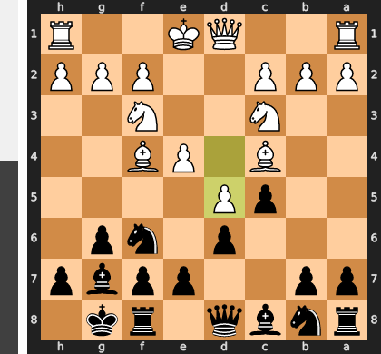

Played **d5**. The engine recommended **dxc5**.

### Move 7 (Black): Nh5 - Mistake ❓

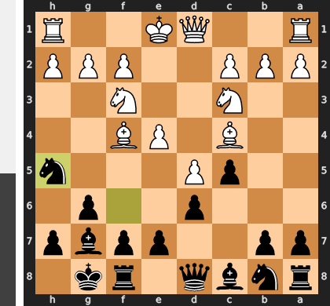

Black's move Nh5 is a classic positional mistake, as it attempts to solve the problem of the active f4-bishop by moving a critical kingside defender. After the simple and best reply Bg3, Black is faced with a terrible choice: either exchange on g3 and open the h-file for a devastating White attack, or leave the knight stranded on the rim where it becomes a target for a future g4 pawn push. Black has effectively abandoned the proper plan of creating queenside counterplay with ...b5 and has instead invited White to attack exactly where they are strongest.

### Move 8 (White): Qd2 - Mistake ❓

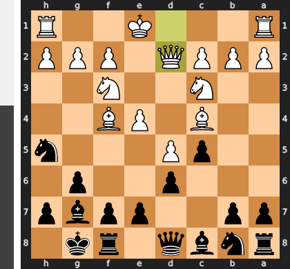

Qd2 is a grave positional misjudgment, as it completely ignores Black's simple but powerful threat of ...Nxf4. After the forced recapture with gxf4, White's kingside is permanently shattered, creating a glaring long-term weakness for Black to attack and leaving the white king dangerously exposed. The correct Bd2 would have preserved the vital light-squared bishop and kept the kingside structure intact, correctly prioritizing the defensive reality of the position over a routine developing move.

### Move 8 (Black): Nxf4 - Best Move ✅

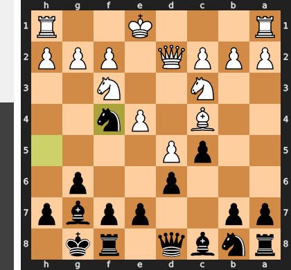

Played **Nxf4**.

### Move 9 (White): Qxf4 - Best Move ✅

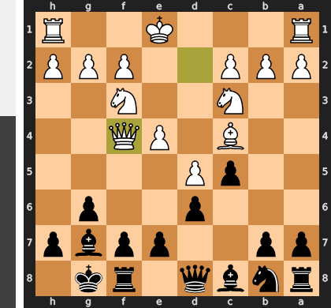

Played **Qxf4**.

### Move 9 (Black): e6 - Mistake ❓

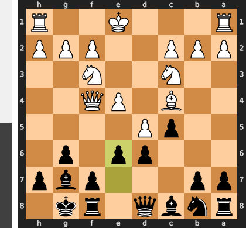

The move ...e6 is a grave positional mistake, as it permanently weakens the critical d6-square and tragically entombs your powerful fianchettoed bishop, turning your best minor piece into a mere pawn. By renouncing the chance for immediate counterplay against White's center with ...Qa5, you have voluntarily traded activity for a passive, cramped position, allowing White's pieces to dominate the newly created weak squares.

### Move 10 (White): O-O - Good 👍

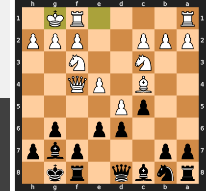

Played **O-O**. The engine recommended **h4**.

### Move 10 (Black): exd5 - Good 👍

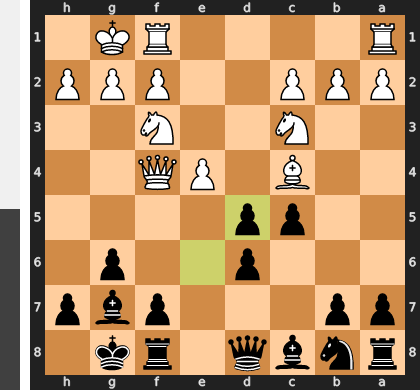

Played **exd5**. The engine recommended **e5**.

### Move 11 (White): Bxd5 - Best Move ✅

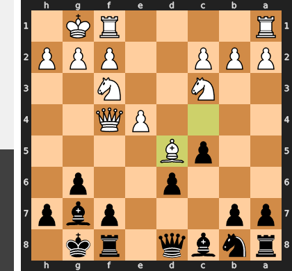

Played **Bxd5**.

### Move 11 (Black): Nc6 - Good 👍

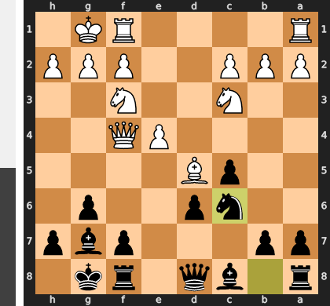

Played **Nc6**. The engine recommended **Qe7**.

### Move 12 (White): Nb5 - Inaccuracy ⁈

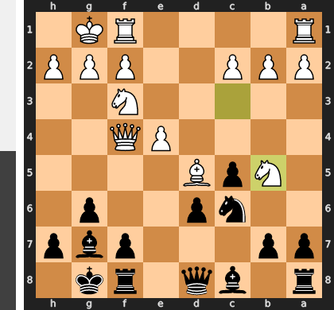

Played **Nb5**. The engine recommended **Rad1**.

### Move 12 (Black): Ne5 - Best Move ✅

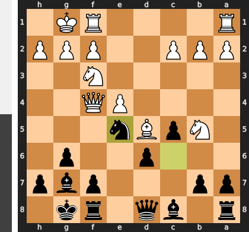

Played **Ne5**.

