# Chess Game Analysis: YMTTMT vs kar2on

- **Result:** 0-1
- **Date:** 2026.04.03
- **Opening:** English Opening Anglo Indian Defense...3.Bg2 Bg7 4.Nc3 O O 5.d3

### Move 1 (White): c4 - Good 👍

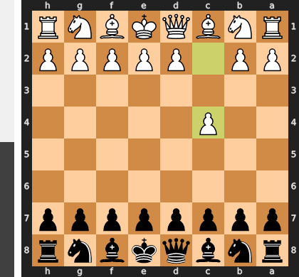

Played **c4**. The engine recommended **e4**.

### Move 1 (Black): Nf6 - Good 👍

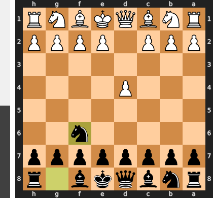

Played **Nf6**. The engine recommended **e5**.

### Move 2 (White): Nc3 - Good 👍

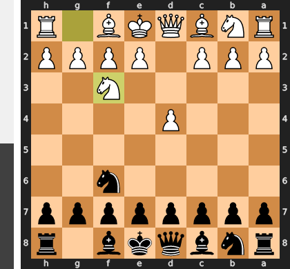

Played **Nc3**. The engine recommended **Nf3**.

### Move 2 (Black): g6 - Good 👍

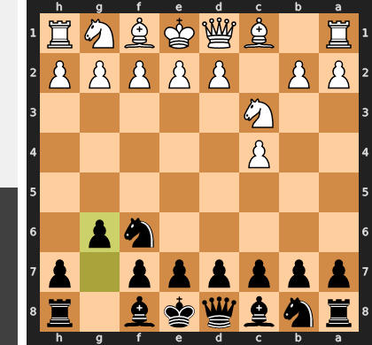

Played **g6**. The engine recommended **e5**.

### Move 3 (White): g3 - Good 👍

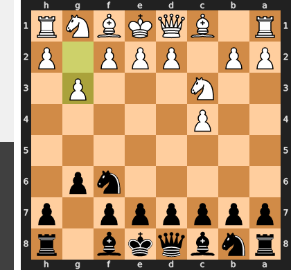

Played **g3**. The engine recommended **e4**.

### Move 3 (Black): Bg7 - Best Move ✅

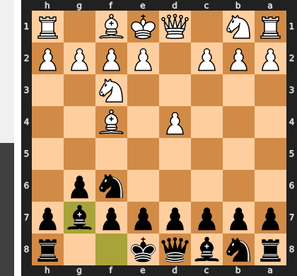

Played **Bg7**.

### Move 4 (White): d3 - Good 👍

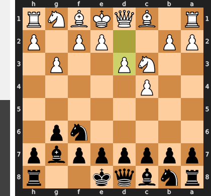

Played **d3**. The engine recommended **Bg2**.

### Move 4 (Black): O-O - Good 👍

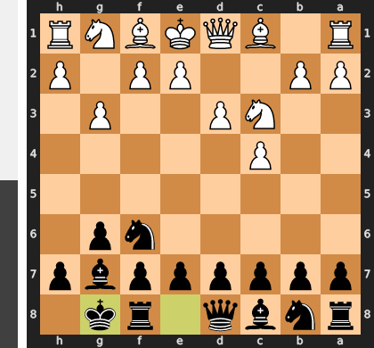

Played **O-O**. The engine recommended **c5**.

### Move 5 (White): Bg2 - Best Move ✅

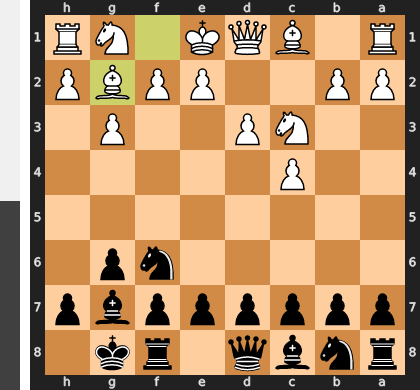

Played **Bg2**.

### Move 5 (Black): e6 - Good 👍

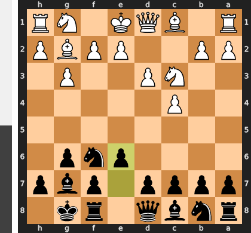

Played **e6**. The engine recommended **d6**.

### Move 6 (White): b4 - Inaccuracy ⁈

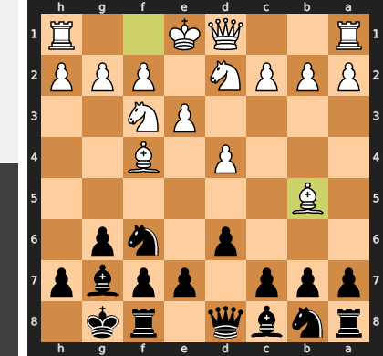

Played **b4**. The engine recommended **e4**.

### Move 6 (Black): a6 - Inaccuracy ⁈

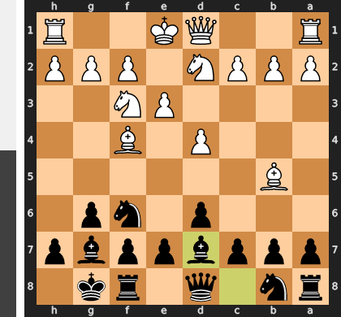

Played **a6**. The engine recommended **d5**.

### Move 7 (White): e3 - Mistake ❓

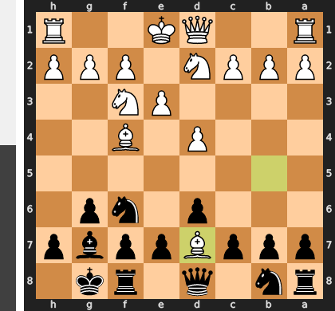

This move is a grave positional mistake as it fatally weakens the critical d4-square by removing its pawn defender. Black can now immediately seize the initiative with the thematic break ...c5!, challenging White's entire queenside structure and preparing to occupy the center. Instead of developing and maintaining flexibility with Nf3, White has created a permanent central weakness and handed the momentum completely to Black.

### Move 7 (Black): d5 - Good 👍

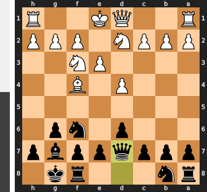

Played **d5**. The engine recommended **Ne4**.

### Move 8 (White): cxd5 - Mistake ❓

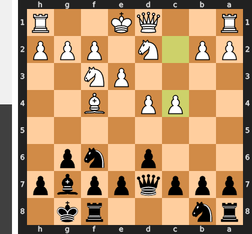

This is a grave positional mistake because it prematurely resolves the central tension entirely in Black's favor. By recapturing with ...exd5, Black opens the e-file directly against White's uncastled king and, more importantly, unleashes the g7-bishop's full power down the long diagonal. White has voluntarily handed Black a clear plan of attack based on these two key strategic assets, transforming a complex position into one with a simple and powerful path forward for the opponent.

### Move 8 (Black): exd5 - Mistake ❓

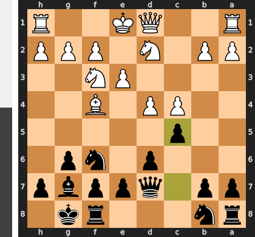

This move is a significant positional error as it voluntarily releases all the central tension that constituted your entire advantage. This allows White to force exchanges on d5, liquidating into a simple, equal position where their light-squared bishop will completely neutralize your most powerful piece, the g7-bishop. The superior `Nxd5` would have maintained the complex struggle, forcing White to contend with their weak pawn structure and Black's superior piece activity.

### Move 9 (White): Nge2 - Good 👍

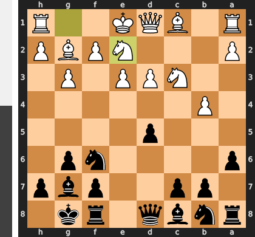

Played **Nge2**. The engine recommended **Nce2**.

### Move 9 (Black): Bg4 - Inaccuracy ⁈

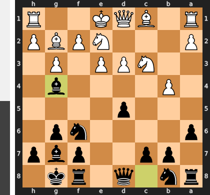

Played **Bg4**. The engine recommended **Nc6**.

### Move 10 (White): Rb1 - Best Move ✅

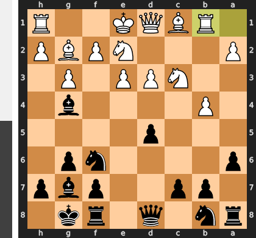

Played **Rb1**.

### Move 10 (Black): Re8 - Good 👍

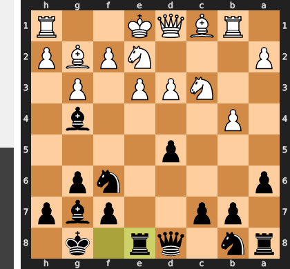

Played **Re8**. The engine recommended **Nc6**.

### Move 11 (White): d4 - Mistake ❓

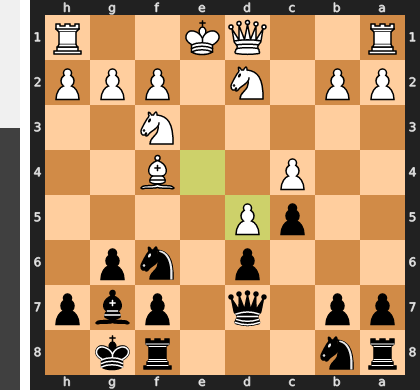

This central thrust with d4 is premature, as it creates a permanent, backward weakness on the e3-pawn and opens the e-file for Black's well-posted rook. By engaging in this fight before dealing with the disruptive g4-bishop (via the correct move h3), White has simply handed his opponent a clear target and the long-term initiative.

### Move 11 (Black): Ne4 - Good 👍

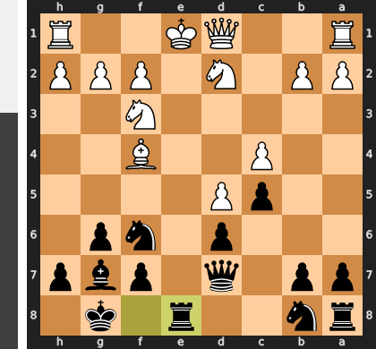

Played **Ne4**. The engine recommended **c6**.

### Move 12 (White): Nxe4 - Best Move ✅

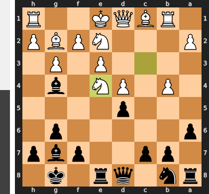

Played **Nxe4**.

### Move 12 (Black): dxe4 - Best Move ✅

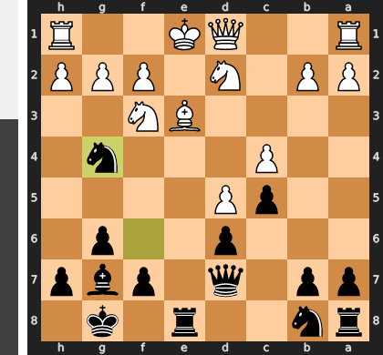

Played **dxe4**.

### Move 13 (White): Bxe4 - Blunder ❌

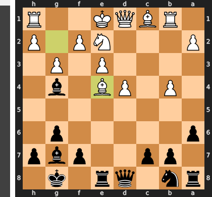

By capturing on e4, White commits to a greedy pawn grab while the king remains dangerously exposed in the center. This allows Black to land the thunderous blow ...Rxe4!, which is not a simple trade but a brilliant deflection that sets up the devastating follow-up ...Rxe2+. This tactic shatters White's position, winning decisive material by exploiting the undefended queen and fatally exposed king.

### Move 13 (Black): Rxe4 - Best Move ✅

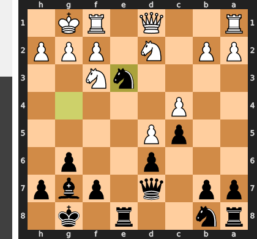

Played **Rxe4**.

### Move 14 (White): O-O - Good 👍

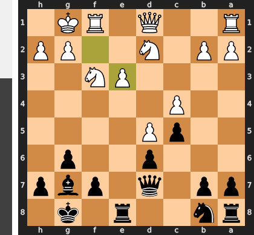

Played **O-O**. The engine recommended **f3**.

