# Chess Game Analysis: Cal-Yesac vs kar2on

- **Result:** 1-0
- **Date:** 2026.04.04
- **Opening:** Indian Game East Indian London System...4.e3 O O 5.Nbd2 d6

### Move 1 (White): d4 - Good 👍

Played **d4**. The engine recommended **e4**.

### Move 1 (Black): Nf6 - Best Move ✅

Played **Nf6**.

### Move 2 (White): Nf3 - Good 👍

Played **Nf3**. The engine recommended **c4**.

### Move 2 (Black): g6 - Good 👍

Played **g6**. The engine recommended **d5**.

### Move 3 (White): Bf4 - Good 👍

Played **Bf4**. The engine recommended **c4**.

### Move 3 (Black): Bg7 - Best Move ✅

Played **Bg7**.

### Move 4 (White): Nbd2 - Good 👍

Played **Nbd2**. The engine recommended **c4**.

### Move 4 (Black): O-O - Good 👍

Played **O-O**. The engine recommended **c5**.

### Move 5 (White): e3 - Good 👍

Played **e3**. The engine recommended **e4**.

### Move 5 (Black): d6 - Best Move ✅

Played **d6**.

### Move 6 (White): Bb5 - Good 👍

Played **Bb5**. The engine recommended **c3**.

### Move 6 (Black): Bd7 - Good 👍

Played **Bd7**. The engine recommended **c5**.

### Move 7 (White): Bxd7 - Good 👍

Played **Bxd7**. The engine recommended **Be2**.

### Move 7 (Black): Qxd7 - Good 👍

Played **Qxd7**. The engine recommended **Nbxd7**.

### Move 8 (White): c4 - Good 👍

Played **c4**. The engine recommended **c3**.

### Move 8 (Black): c5 - Good 👍

Played **c5**. The engine recommended **Nh5**.

### Move 9 (White): d5 - Good 👍

Played **d5**. The engine recommended **O-O**.

### Move 9 (Black): e6 - Good 👍

Played **e6**. The engine recommended **b5**.

### Move 10 (White): e4 - Mistake ❓

By playing e4, White fatally transforms his central d5-pawn from a cramping asset into a chronic, isolated weakness. Black will now seize the initiative by ripping the center open with ...exd5, followed by the crushing ...Re8, creating a deadly pin on the e-file that paralyzes White's uncoordinated pieces and leaves his position on the brink of collapse.

### Move 10 (Black): exd5 - Best Move ✅

Played **exd5**.

### Move 11 (White): exd5 - Best Move ✅

Played **exd5**.

### Move 11 (Black): Re8+ - Best Move ✅

Played **Re8+**.

### Move 12 (White): Be3 - Good 👍

Played **Be3**. The engine recommended **Kf1**.

### Move 12 (Black): Ng4 - Best Move ✅

Played **Ng4**.

### Move 13 (White): O-O - Best Move ✅

Played **O-O**.

### Move 13 (Black): Nxe3 - Best Move ✅

Played **Nxe3**.

### Move 14 (White): fxe3 - Best Move ✅

Played **fxe3**.

### Move 14 (Black): Rxe3 - Best Move ✅

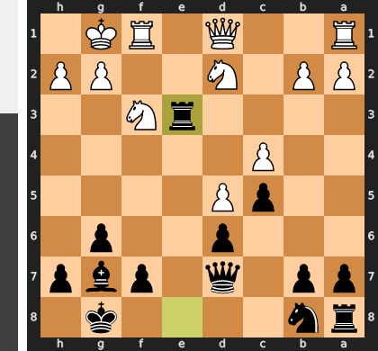

Played **Rxe3**.

### Move 15 (White): Rb1 - Inaccuracy ⁈

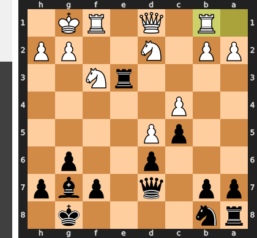

Played **Rb1**. The engine recommended **Re1**.

### Move 15 (Black): Na6 - Best Move ✅

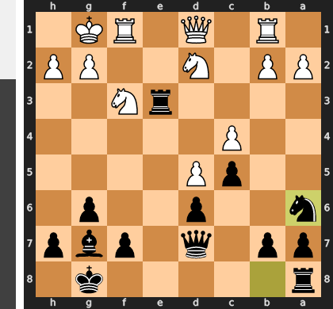

Played **Na6**.

### Move 16 (White): Re1 - Best Move ✅

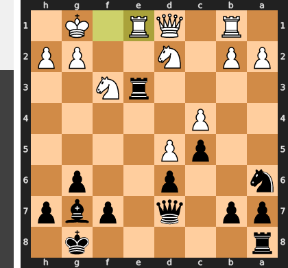

Played **Re1**.

### Move 16 (Black): Rae8 - Good 👍

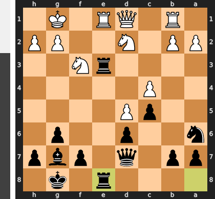

Played **Rae8**. The engine recommended **Rxe1+**.

### Move 17 (White): Rxe3 - Best Move ✅

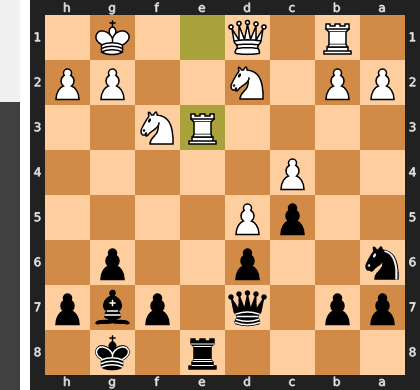

Played **Rxe3**.

### Move 17 (Black): Rxe3 - Best Move ✅

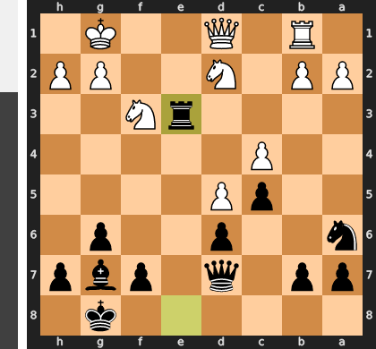

Played **Rxe3**.

### Move 18 (White): a3 - Good 👍

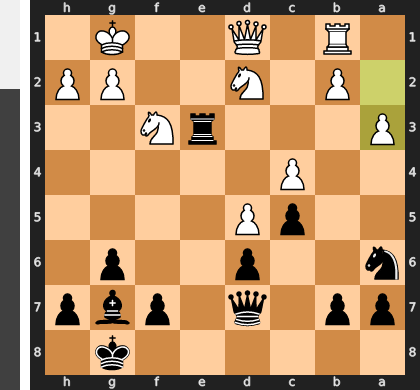

Played **a3**. The engine recommended **Nf1**.

### Move 18 (Black): Qf5 - Good 👍

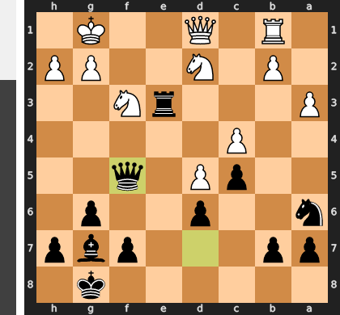

Played **Qf5**. The engine recommended **Nc7**.

### Move 19 (White): Qa4 - Good 👍

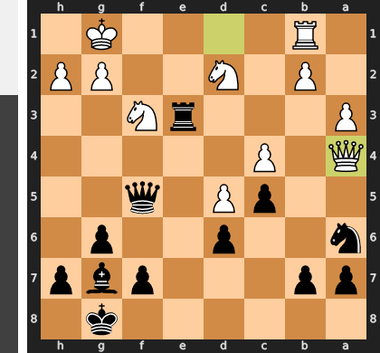

Played **Qa4**. The engine recommended **Kh1**.

### Move 19 (Black): g5 - Inaccuracy ⁈

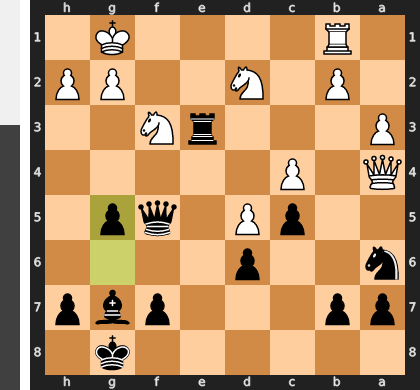

Played **g5**. The engine recommended **Bh6**.

### Move 20 (White): Re1 - Mistake ❓

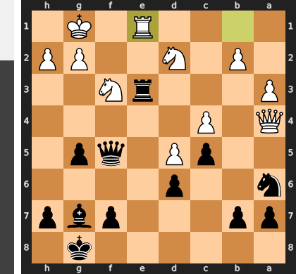

Re1 is a critical defensive error because it invites the ...Rxe1+ trade, which tragically removes the vital f3-knight as a defender of the king. After the recapture, Black delivers the crushing ...Bd4+ followed by ...Qf2, creating an unstoppable attack against the now-defenseless f2 pawn and threatening mate. The correct move, Rf1, was essential to overprotect the critical f2-square, solidifying the king's position and preventing this entire tactical collapse.

### Move 20 (Black): Rxe1+ - Best Move ✅

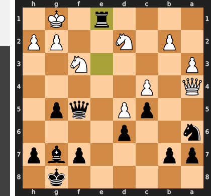

Played **Rxe1+**.

### Move 21 (White): Nxe1 - Best Move ✅

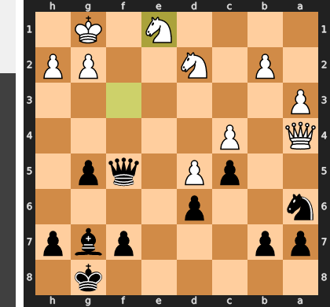

Played **Nxe1**.

### Move 21 (Black): Bd4+ - Good 👍

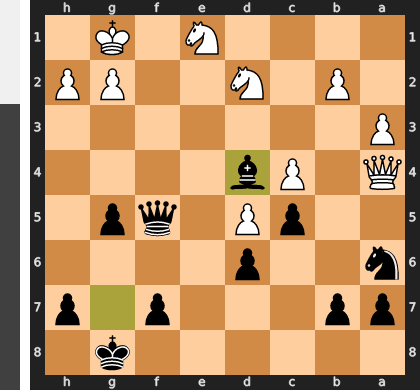

Played **Bd4+**. The engine recommended **Bxb2**.

### Move 22 (White): Kh1 - Best Move ✅

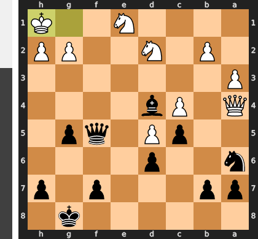

Played **Kh1**.

### Move 22 (Black): Qf2 - Best Move ✅

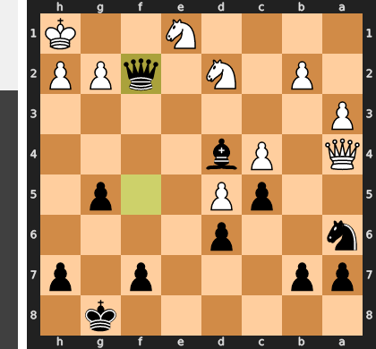

Played **Qf2**.

### Move 23 (White): Qe8+ - Mistake ❓

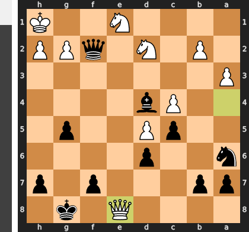

This check is a fatal misunderstanding of the position, as it's a futile gesture that wastes a critical tempo without addressing the crushing pressure from Black's f2-queen. The correct approach was the pragmatic Nef3, forcing a queen trade to liquidate the mating attack at its source, as survival is far more important than keeping the queens on the board. Now, White's king remains helpless while its own queen is stranded as a distant, useless observer.

### Move 23 (Black): Kg7 - Best Move ✅

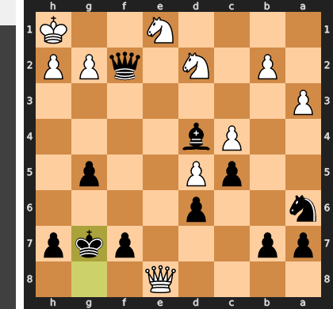

Played **Kg7**.

### Move 24 (White): h3 - Blunder ❌

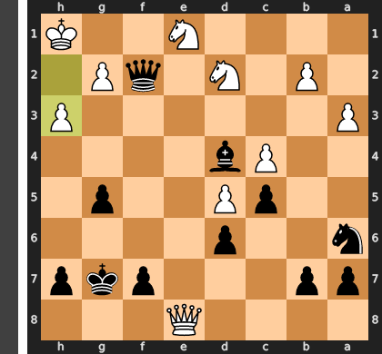

The move h3 is a catastrophic blunder because it completely ignores the decisive threat against the king on the back rank. Black's queen on f2, supported by the monster bishop on d4, now delivers a forced checkmate beginning with the simple ...Qf1+. Instead of addressing this terminal threat, White makes a pointless pawn move, wasting the single tempo that could have been used to survive with Nef3, which would have defended the critical f1-square.

### Move 24 (Black): Qxd2 - Blunder ❌

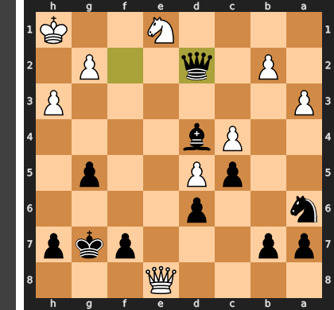

This was a tragic case of tactical blindness, overlooking a beautiful and decisive checkmate in one move. The bishop on d4 is the star of the show, pinning the knight on e1 and rendering it a useless spectator, which would have made ...Qg1 an immediate checkmate. By choosing to capture on d2, Black simply went material grabbing, unnecessarily releasing the fatal tension and allowing White's desperate king a chance to fight on.

### Move 25 (White): Nf3 - Good 👍

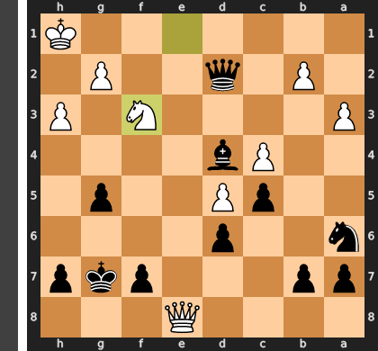

Played **Nf3**. The engine recommended **Qe4**.

### Move 25 (Black): Qd1+ - Inaccuracy ⁈

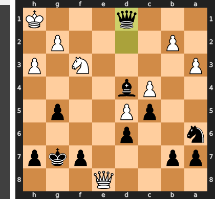

Played **Qd1+**. The engine recommended **Qc1+**.

### Move 26 (White): Kh2 - Best Move ✅

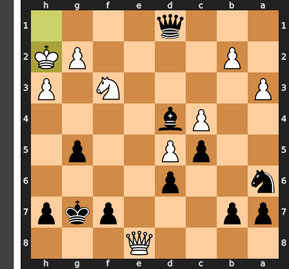

Played **Kh2**.

### Move 26 (Black): Qd3 - Good 👍

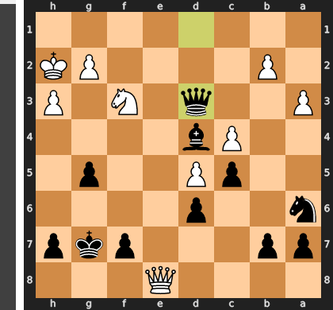

Played **Qd3**. The engine recommended **Qc1**.

### Move 27 (White): Nxg5 - Mistake ❓

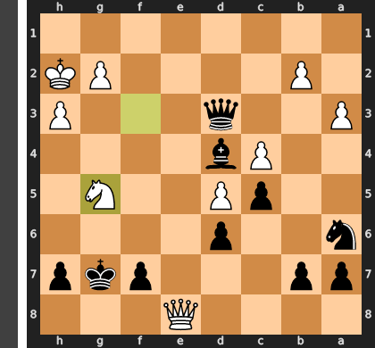

This move launches a hollow attack and fatally neglects king safety, directly enabling Black's decisive counter-blow. The knight on g5 is merely a spectator as Black begins the hunt with ...Qf1+, forcing the white king into the open where it cannot escape the perfectly coordinated queen and bishop. The correct plan, b3, was essential to challenge Black's monster bishop on d4, which is the true source of White's problems.

### Move 27 (Black): Qg6 - Blunder ❌

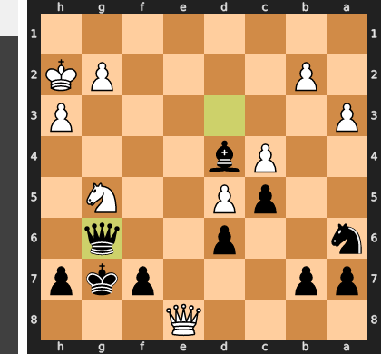

This blunder lies in its passivity, squandering a winning position by failing to execute the decisive blow. The move ...Qg6 is too slow, giving White a critical tempo to consolidate his defenses and keep his own powerful threats alive. The winning continuation was the forcing check ...Be5+, which immediately paves the way for a queen infiltration to f4, creating an unstoppable dual attack against the f2-pawn and g5-knight that would have ended the game swiftly.

### Move 28 (White): Nf3 - Best Move ✅

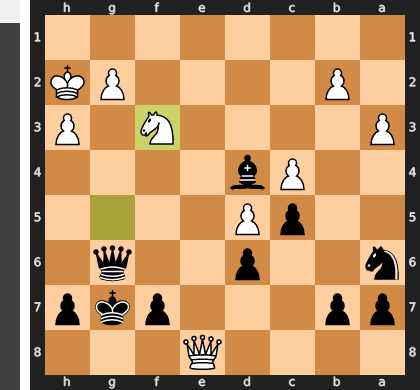

Played **Nf3**.

### Move 28 (Black): Nc7 - Inaccuracy ⁈

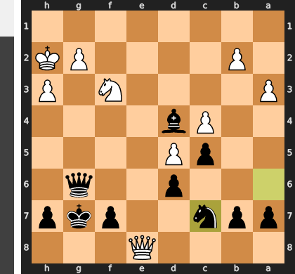

Played **Nc7**. The engine recommended **h5**.

### Move 29 (White): Qd7 - Good 👍

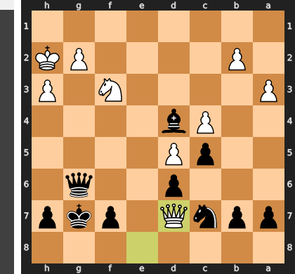

Played **Qd7**. The engine recommended **Qe7**.

### Move 29 (Black): Na6 - Good 👍

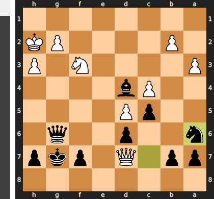

Played **Na6**. The engine recommended **Bf2**.

### Move 30 (White): Qxb7 - Good 👍

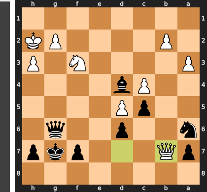

Played **Qxb7**. The engine recommended **Qe7**.

### Move 30 (Black): Be5+ - Mistake ❓

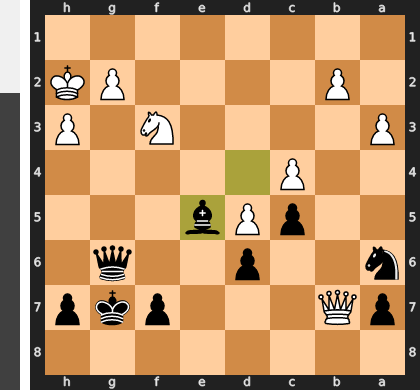

This check is a critical strategic error because it voluntarily allows White's king to escape the dangerous h2-square, where it was the subject of a crippling pin on the f3-knight. By moving the king to g1 for free, White dissolves the immediate mating threats and is no longer paralyzed. The correct ...Bf2 would have maintained this pin, creating the decisive threat of ...Qxf3 and forcing White to shed material or collapse under the pressure.

### Move 31 (White): Nxe5 - Best Move ✅

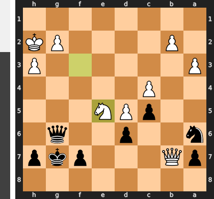

Played **Nxe5**.

### Move 31 (Black): dxe5 - Best Move ✅

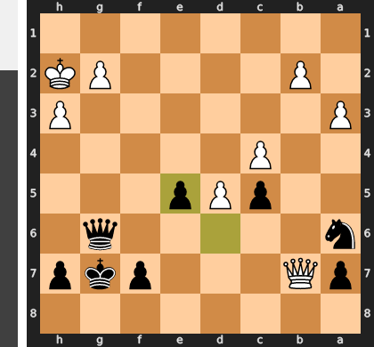

Played **dxe5**.

