# Chess Game Analysis: kar2on vs Viv_1137

- **Result:** 1-0
- **Date:** 2026.03.23
- **Opening:** French Defense Knight Variation

### Move 1 (White): e4
**Engine recommendation:** The engine recommends `e4` to immediately seize the center, open lines for the queen and bishop, and prepare for castling.
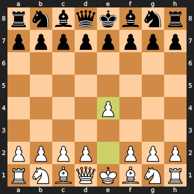

### Move 1 (Black): e6
**Engine recommendation:** The engine suggests `e5` to directly challenge White's central pawn and open lines for Black's pieces. This would lead to open game positions.

Black chose to play `e6`, initiating the French Defense. This move prepares to challenge White's center with `d5` and offers a more solid, yet often cramped, position for Black. It is a valid and popular opening choice, but leads to a different strategic battle than `e5`.
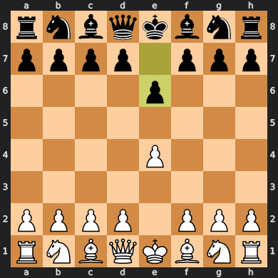

### Move 2 (White): Nf3
**Engine recommendation:** The engine prefers `d4` to immediately claim a large share of the center and create a strong pawn duo with `e4`.

White played `Nf3`, a solid developing move. This move develops the knight to a good square, controls the central squares `e5` and `d4`, and prepares for kingside castling. While `d4` would be more aggressive, `Nf3` is a perfectly sound and common alternative, often leading to a setup where White maintains flexibility.
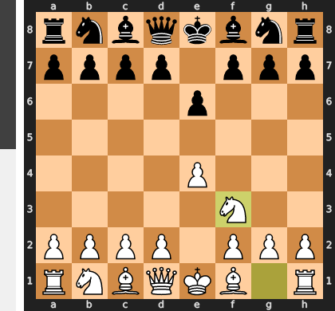

### Move 2 (Black): d6
**Engine recommendation:** The engine strongly recommends `d5` to immediately strike at White's central pawn on `e4`, the most common and active way to play the French Defense.

Black opted for `d6` instead. This move is more passive, supporting the `e5` square but not actively contesting White's central control. While not a blunder, it allows White to maintain a more comfortable central presence for longer. It can lead to a more solid but also potentially more cramped position for Black.
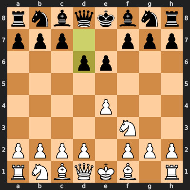

### Move 3 (White): Bc4
**Engine recommendation:** The engine continues to recommend `d4` to solidify central control and open lines for White's pieces. This would give White a powerful central pawn duo.

White played `Bc4`, developing the bishop to a very active square. This move eyes Black's weak `f7` pawn and prepares for kingside castling. While a good developing move, `d4` would have been more ambitious in terms of central control. This choice by White signals a preference for quick development and attacking chances rather than immediate central domination.
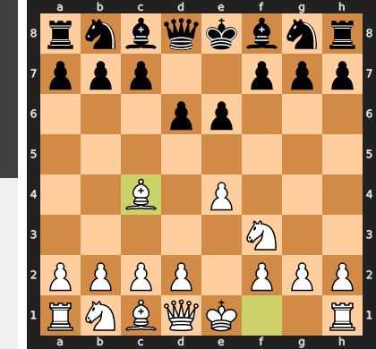

### Move 3 (Black): c6
**Engine recommendation:** The engine again suggests `d5`, as it's the most direct and effective way to challenge White's central control in the French Defense setup.

Black played `c6`, which is a common preparatory move in the French Defense, aiming to support a future `d5` push. However, it delays the central challenge. While it creates a solid pawn structure, it doesn't immediately address White's growing central influence and allows White to continue developing with less pressure.
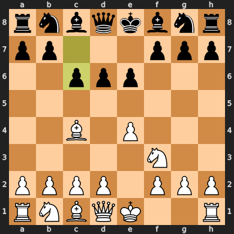

### Move 4 (White): Nc3
**Engine recommendation:** The engine, for the third time, recommends `d4` to take full control of the center. This would give White a commanding presence in the middle of the board.

White played `Nc3`, developing the knight to a natural square. This move strengthens White's control over the `e4` and `d5` squares and prepares for further central expansion. While a perfectly sound developing move, White still defers the `d4` push that the engine favors, opting for a more gradual build-up in the center.
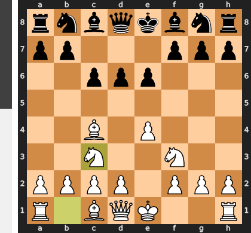

### Move 4 (Black): a6
**Engine recommendation:** The engine suggests `b5` to directly challenge White's active bishop on `c4` and gain space on the queenside.

Black played `a6`, a prophylactic move that prepares for `b5` or prevents `Bb5`. While it serves a purpose, it is a somewhat slow and passive move that doesn't contribute to central development or immediate counterplay. Black continues to play defensively, allowing White to dictate the pace of the game.
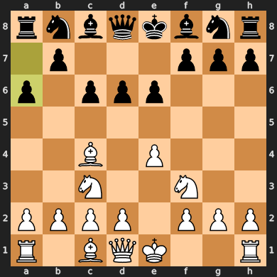

### Move 5 (White): O-O
**Engine recommendation:** The engine stubbornly recommends `d4` to establish a central pawn majority and create attacking chances.

White castled kingside, securing the king and bringing the rook into the game. This is a vital developing move that improves king safety and prepares for future attacks. While `d4` was an option, prioritizing king safety is always a good strategy, especially in the early stages of the game.
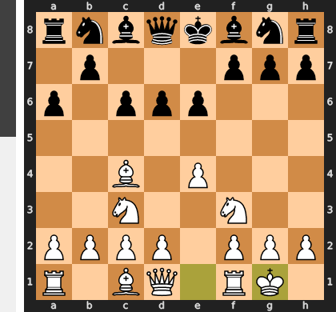

### Move 5 (Black): a5
**Engine recommendation:** The engine continues to suggest `b5` to directly challenge White's bishop and gain space on the queenside, creating some counterplay.

Black played `a5`, a continuation of Black's queenside strategy, aiming to support a future `b5` push. This move is slow and doesn't address the central tension or White's development. Black's passive approach allows White to continue developing and building up their position without significant pressure.
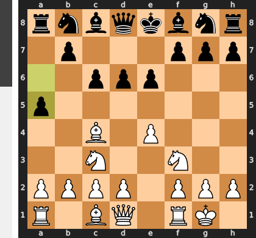

### Move 6 (White): d4
**Engine recommendation:** The engine's consistent recommendation of `d4` is finally played by White. This move is crucial for establishing central control and creating a strong pawn center.

White played `d4`, a strong and thematic move that seizes control of the center, opens lines for the queen and the light-squared bishop, and creates a powerful pawn duo on `e4` and `d4`. This move gives White a significant space advantage and a strong initiative in the center.
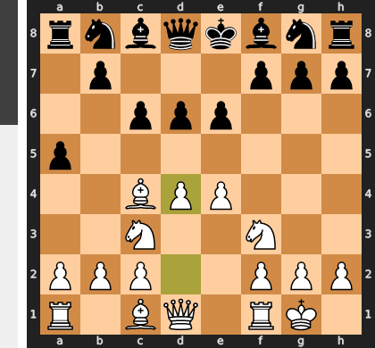

### Move 6 (Black): b5
**Engine recommendation:** The engine suggests `Nf6` to develop a piece, control central squares, and prepare for kingside castling. This would put more pressure on White's central pawn on `e4`.

Black played `b5`, finally challenging White's bishop on `c4` and gaining space on the queenside. While this move creates some tactical possibilities and forces the bishop to move, it doesn't address the central imbalance. Black continues to prioritize queenside expansion over central development and control.
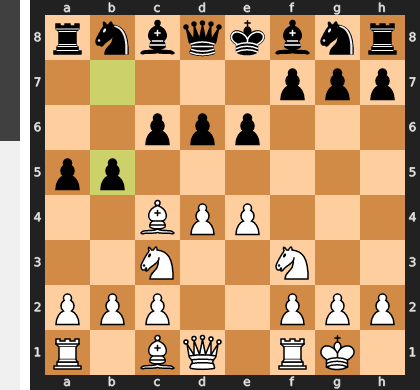

### Move 7 (White): Be2
**Engine recommendation:** The engine suggests `Bd3` for the bishop, which would keep it more actively placed, eyeing Black's kingside and potential central squares.

White played `Be2`, a solid and safe developing move for the bishop. While `Bd3` might have been more active, `Be2` places the bishop on a good defensive square, prepares for potential king-side action, and connects the rooks. It's a pragmatic choice, prioritizing solidity and flexibility.
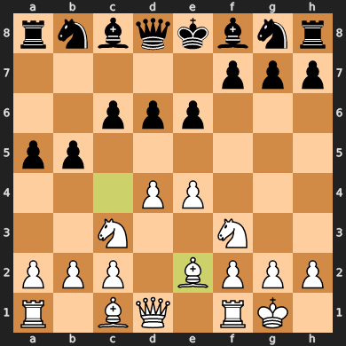

### Move 7 (Black): a4
**Engine recommendation:** The engine suggests `b4` to continue the attack on White's bishop, forcing it to retreat and gaining a tempo.

Black played `a4`, pushing the pawn further down the board. While this move aims to create space on the queenside, it also creates a backward pawn on `b5` and does not directly challenge White's pieces. This seems to be a slight inaccuracy as it doesn't put immediate pressure on White's position and could leave Black's queenside somewhat exposed.
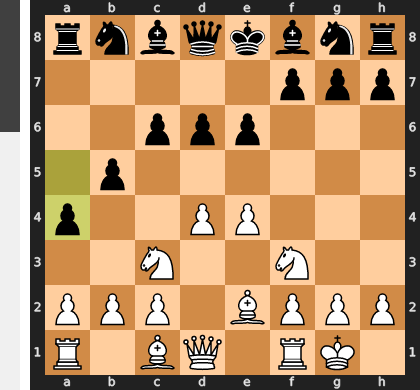

### Move 8 (White): b3
**Engine recommendation:** The engine suggests `a3` to prevent Black's `b4` pawn push and to maintain the solidity of White's queenside pawn structure.

White played `b3`, a solid prophylactic move. This move supports the `c4` square and restricts Black's queenside pawn advances. While `a3` was also a viable option, both moves aim to strengthen White's queenside and prevent Black from gaining further space on that flank. White prioritizes a secure position.
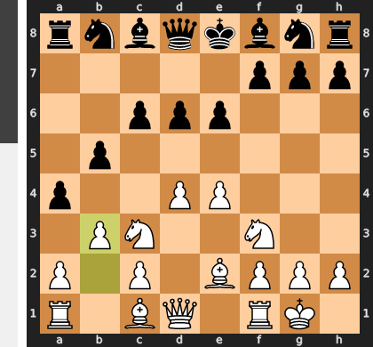

### Move 8 (Black): Bb7
**Engine recommendation:** The engine suggests `axb3` to capture White's pawn and open the `a` file for Black's rook, which would create counterplay on the queenside.

Black played `Bb7`, developing the bishop to a diagonal where it exerts some pressure on the center. However, Black missed the opportunity to capture the `b3` pawn with `axb3`. This would have opened the `a` file and given Black an active rook. Instead, Black plays a more passive developing move, allowing White to maintain their advantage.
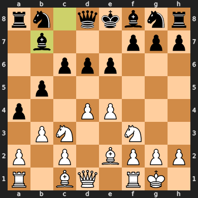

### Move 9 (White): d5
**Engine recommendation:** The engine accurately identifies `d5` as the strongest move, as it pushes the central pawn, gains significant space, and creates a powerful passed pawn.

White played the excellent move `d5`, gaining even more space in the center and creating a strong passed pawn. This move cramps Black's position, limits the movement of Black's pieces, and opens lines for White's rooks. This is a very strong positional move that increases White's advantage.
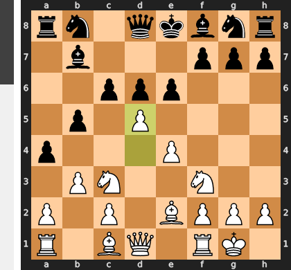

### Move 9 (Black): Ba6
**Engine recommendation:** The engine still recommends `axb3` to capture White's pawn and activate the rook on the `a` file, which would be Black's best chance for counterplay.

Black played `Ba6`, developing the bishop but continuing to ignore the pawn on `b3` and White's strong central presence. This move doesn't create any immediate threats or challenge White's advantage. Black's passive play is allowing White to consolidate their position and build up a decisive lead.
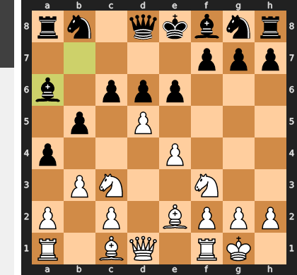

### Move 10 (White): dxc6
**Engine recommendation:** The engine suggests `Nd4` to place a knight on a powerful central outpost, putting pressure on Black's position.

White played `dxc6`, capturing Black's pawn and opening the `d` file for White's rook. This move simplifies the position and removes a defender of Black's `d6` pawn. While `Nd4` was also a strong option, `dxc6` is a good move that continues to build White's advantage by opening lines and exploiting Black's passive play.
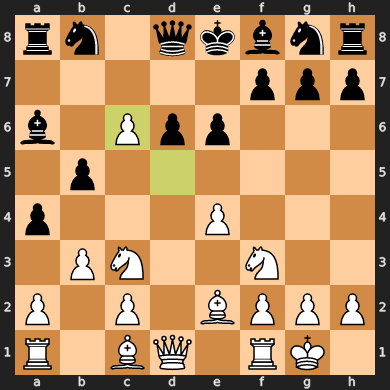

### Move 10 (Black): Nxc6
**Engine recommendation:** The engine accurately recommends `Nxc6` to recapture the pawn and develop the knight. This is the most logical and necessary move for Black.

Black played `Nxc6`, recapturing the pawn and developing the knight to a central square. This move is forced and helps to regain some balance in the position, although White still maintains a significant advantage.
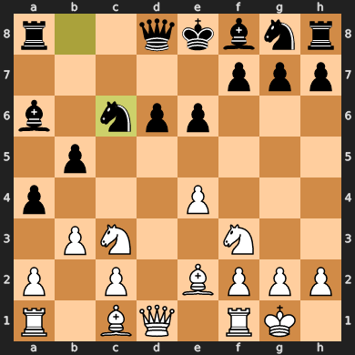

### Move 11 (White): Nxb5
**Engine recommendation:** The engine suggests `Bxb5` to capture the pawn, develop the bishop to an active square, and put pressure on Black's queenside.

White played `Nxb5`, capturing the pawn on `b5` with the knight. While this move wins a pawn and continues to advance White's position, the engine's recommendation of `Bxb5` would have been slightly stronger as it develops the bishop to a more active square and creates more immediate threats.
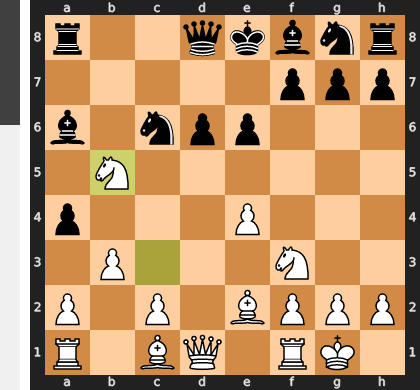

### Move 11 (Black): Bxb5
**Engine recommendation:** The engine suggests `Nf6` to develop the knight, control the central squares, and prepare for castling.

Black played `Bxb5`, recapturing the knight on `b5` with the bishop. This is a natural and necessary move to equalize the material. While the engine preferred `Nf6`, recapturing with the bishop is perfectly acceptable and develops a piece. Black is trying to consolidate their position after White's strong central play.
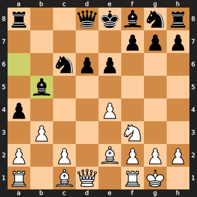

### Move 12 (White): Bxb5
**Engine recommendation:** The engine correctly identifies `Bxb5` as the best move to recapture the bishop and maintain the material advantage.

White played `Bxb5`, recapturing the bishop on `b5`. This move simplifies the position and maintains White's material advantage. White is now up a pawn and has a strong central position.
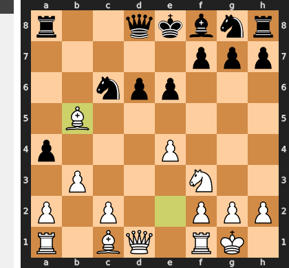

### Move 12 (Black): Qc7
**Engine recommendation:** The engine suggests `Ne7` to develop the knight to a good square, prepare for kingside castling, and maintain central control.

Black played `Qc7`, developing the queen and eyeing the long diagonal. This move is reasonable, but `Ne7` would have been more active, connecting the pieces and preparing for castling. Black is still trying to find a way to develop their pieces and create some counterplay, but White's strong central presence makes it difficult.
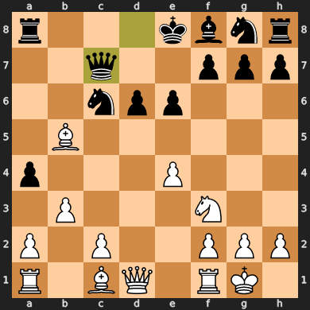

### Move 13 (White): Nd4
**Engine recommendation:** The engine accurately identifies `Nd4` as the best move, placing the knight on a powerful central outpost and creating threats against Black's queen and `c6` knight.

White played `Nd4`, a very strong move that places the knight on a central outpost. This knight controls key squares, creates threats against Black's queen and knight, and further restricts Black's pieces. This move significantly increases White's advantage and makes it difficult for Black to develop effectively.
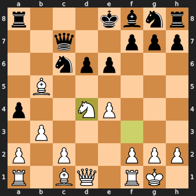

### Move 13 (Black): Kd8
**Engine recommendation:** The engine suggests `Ne7` to develop the knight, protect the `c6` knight, and prepare for kingside castling. This would help Black to consolidate their position.

Black played `Kd8`, a desperate and highly passive move to try and get the king to safety. This move, however, leaves the king in the center, disconnects the rooks, and hinders Black's development. This is a significant inaccuracy that further exacerbates Black's already difficult position and allows White to increase their advantage. Black is struggling to find a coherent plan.
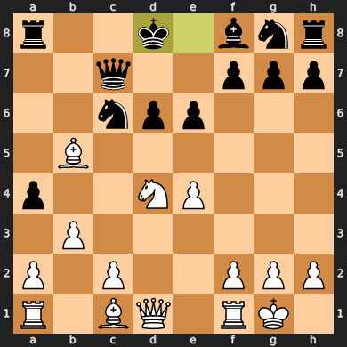

### Move 14 (White): Nxc6+
**Engine recommendation:** The engine suggests `Bxc6` to capture Black's knight, further simplifying the position and removing a key defender.

White played `Nxc6+`, capturing Black's knight with check. This is an excellent move that continues to simplify the position and exploit Black's exposed king. White gains material and further restricts Black's ability to develop their pieces. Black is now in a very difficult position.
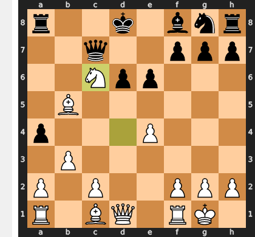

### Move 14 (Black): Kc8
**Engine recommendation:** The engine accurately identifies `Kc8` as the only legal move to get the king out of check. This is a forced move for Black.

Black played `Kc8`, getting the king out of check. While this move solves the immediate threat, Black's king remains in an exposed position, and White's pieces are actively developed. Black is still struggling to develop and defend their position.
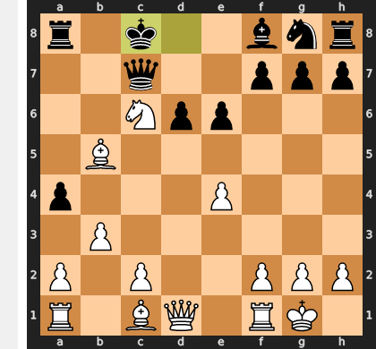

### Move 15 (White): Nd4
**Engine recommendation:** The engine suggests `e5` to open lines, attack Black's knight on `c6`, and further exploit Black's exposed king. This would create immediate tactical threats.

White played `Nd4`, developing the knight to a powerful central outpost. This move creates new threats, attacks Black's queen, and further restricts Black's pieces. While `e5` would have been even more aggressive, `Nd4` maintains White's strong position and continues to put pressure on Black.
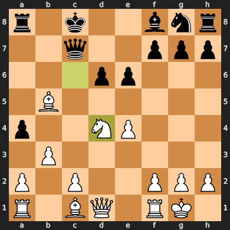

### Move 15 (Black): Rb8
**Engine recommendation:** The engine suggests `Nf6` to develop the knight, contest White's central influence, and provide some defense to the kingside.

Black played `Rb8`, activating the rook on the open `b` file. While this move is a logical developing move, it doesn't address the immediate threats created by White's `Nd4`. Black is still struggling to develop their pieces and consolidate their position, allowing White to continue building their advantage.
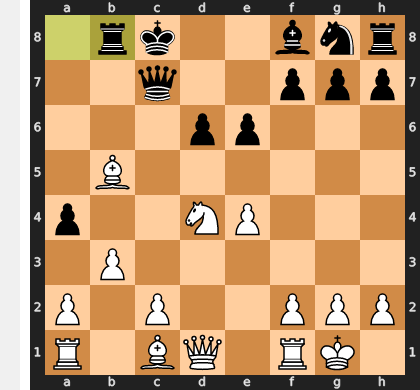

### Move 16 (White): Bxa4
**Engine recommendation:** The engine suggests `bxa4` to recapture the pawn and maintain the pawn structure. This would also open the `b` file for White's rook.

White played `Bxa4`, capturing Black's pawn on `a4` with the bishop. This move gains material and further increases White's advantage. While `bxa4` would have maintained the pawn structure, `Bxa4` is a perfectly good move that continues to put pressure on Black and maintain White's strong position.
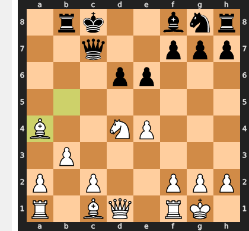

### Move 16 (Black): e5
**Engine recommendation:** The engine suggests `Nf6` to develop the knight, contest White's central influence, and provide some defense to the kingside. This would help Black to consolidate their position.

Black played `e5`, attempting to break White's central pawn chain. However, this move creates a new weakness on `d5` and gives White a strong outpost on `e4` for their knight. This is a significant inaccuracy that further weakens Black's position and opens lines for White's attack. Black is now in a very difficult and possibly losing position.
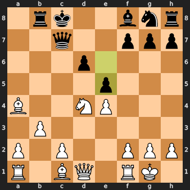

### Move 17 (White): Nb5
**Engine recommendation:** The engine accurately identifies `Nb5` as the strongest move, placing the knight on a powerful outpost, attacking Black's queen, and creating immediate threats on `c7`.

White played `Nb5`, a very strong tactical move that places the knight on a dominant outpost. This move attacks Black's queen, creates threats against `c7`, and further restricts Black's pieces. Black is now under immense pressure and is struggling to find a way to defend their position.
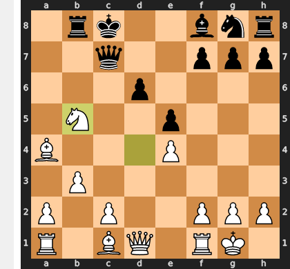

### Move 17 (Black): Qe7
**Engine recommendation:** The engine suggests `Rxb5` to capture White's knight and relieve some of the pressure on Black's position. This would be the best way to maintain material equality.

Black played `Qe7`, moving the queen to safety but overlooking the unprotected knight on `c6`. This is a significant blunder that leads to a material loss for Black. White will now be able to capture the knight and further increase their advantage. Black's position is now collapsing.
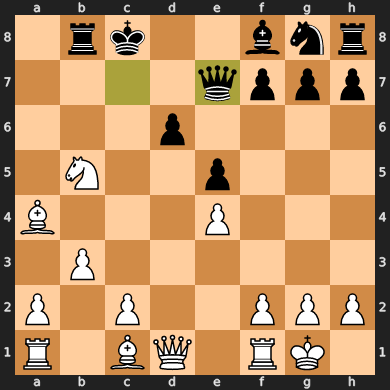

### Move 18 (White): Nxd6+
**Engine recommendation:** The engine suggests `Qd5` to attack Black's knight and put more pressure on Black's kingside. This would create further tactical threats.

White played `Nxd6+`, capturing the pawn and delivering a crushing check to Black's king. This is a very strong tactical move that wins a pawn, exposes Black's king even further, and creates a series of tactical opportunities for White. Black is now in a completely lost position.
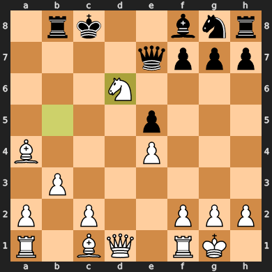

### Move 18 (Black): Qxd6
**Engine recommendation:** The engine accurately identifies `Qxd6` as the only legal move to recapture the knight and get the king out of check. This is a forced move for Black.

Black played `Qxd6`, recapturing the knight and getting the king out of check. However, Black is now down a significant amount of material and their king is still exposed. White's attack is relentless, and Black has no good way to defend.
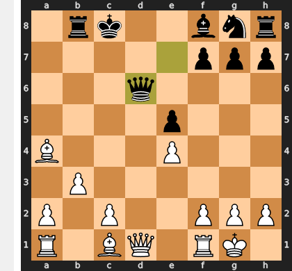

### Move 19 (White): Qxd6
**Engine recommendation:** The engine suggests `Qe2` to develop the queen, centralize it, and prepare for further attacks against Black's exposed king.

White played `Qxd6`, recapturing the queen and simplifying the position. This move maintains White's significant material advantage and makes the win much easier. While `Qe2` was a valid alternative, `Qxd6` is a practical and strong move that leads to a clear winning endgame for White.
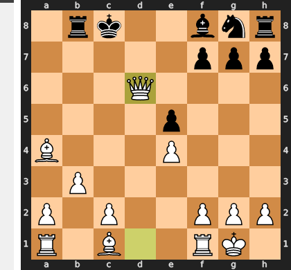

### Move 19 (Black): Bxd6
**Engine recommendation:** The engine accurately identifies `Bxd6` as the only legal move to recapture the queen. This is a forced move for Black.

Black played `Bxd6`, recapturing the queen. The position is now simplified, but White still has a significant material advantage and a much better pawn structure. Black is in a losing endgame.
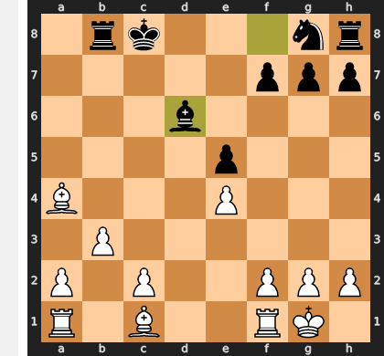

### Move 20 (White): Be3
**Engine recommendation:** The engine accurately identifies `Be3` as the best move to develop the bishop, control important central squares, and defend the pawn on `d4`.

White played `Be3`, developing the bishop to an active square. This move controls the `f4` and `d4` squares and prepares for further attacks. White's pieces are now well-coordinated, and they have a clear plan to convert their material advantage into a win.
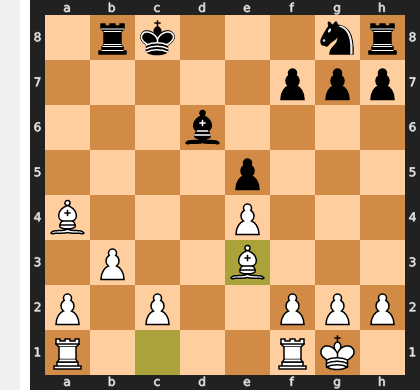

### Move 20 (Black): Nf6
**Engine recommendation:** The engine suggests `Ba3` to exchange bishops and relieve some pressure on Black's position. This would simplify the position and make it harder for White to attack.

Black played `Nf6`, developing the knight to a central square. While this is a reasonable developing move, `Ba3` would have been a better choice to exchange bishops and simplify the position. Black is still struggling to find a way to create counterplay and defend against White's relentless attack.
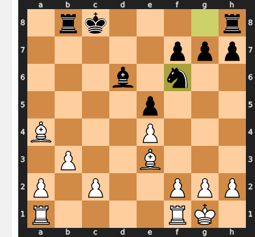

### Move 21 (White): f3
**Engine recommendation:** The engine suggests `Rfd1` to activate the rook on the open `d` file and put more pressure on Black's king.

White played `f3`, solidifying the pawn structure and preventing any potential `Ng4` ideas from Black. While `Rfd1` would have been more active, `f3` is a solid and safe move that maintains White's advantage. White is playing carefully and preparing for the final assault.
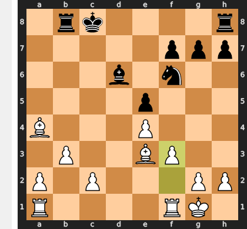

### Move 21 (Black): g6
**Engine recommendation:** The engine suggests `Kd8` to move the king to a safer square and connect the rooks. This would offer some resistance to White's attack.

Black played `g6`, a move that weakens the kingside and creates a new target for White's attack. This is a significant inaccuracy that further exacerbates Black's already difficult position. Black is trying to create some breathing room for their king, but in doing so, they are creating more weaknesses.
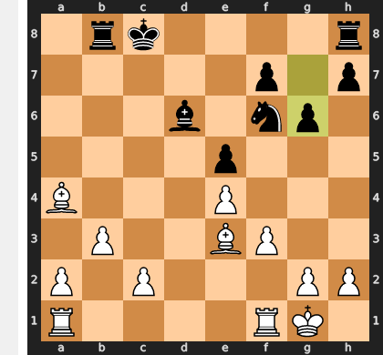

### Move 22 (White): Rfd1
**Engine recommendation:** The engine accurately identifies `Rfd1` as the best move to activate the rook on the open `d` file and put more pressure on Black's king. This move prepares for a decisive attack.

White played `Rfd1`, bringing the rook to the open `d` file. This move further activates White's pieces and prepares for a decisive attack against Black's exposed king. White's advantage is now overwhelming, and Black has no good way to defend. The game is quickly coming to an end.
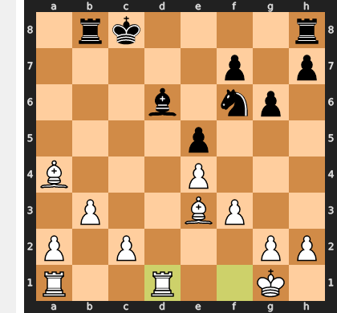

### Move 22 (Black): Rb6
**Engine recommendation:** The engine suggests `Be7` to develop the bishop, provide some defense to the kingside, and prepare for castling. This would help Black to consolidate their position.

Black played `Rb6`, trying to defend against White's attack on the queenside. However, this move is too passive and doesn't address the immediate threats against Black's king. White's attack is now overwhelming, and Black has no good way to defend. The game is quickly coming to an end.
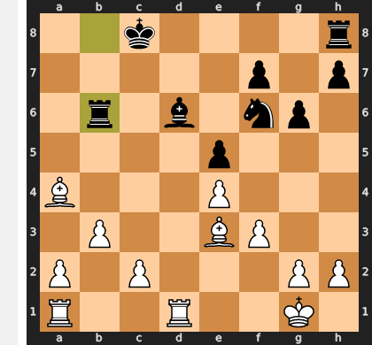

### Move 23 (White): Bxb6
**Engine recommendation:** The engine accurately identifies `Bxb6` as the best move to capture the rook and further increase White's material advantage. This move leads to a decisive advantage for White.

White played `Bxb6`, capturing Black's rook on `b6`. This decisive move further increases White's material advantage and leads to a completely winning endgame. Black has no way to defend against White's overwhelming attack, and the game is effectively over.
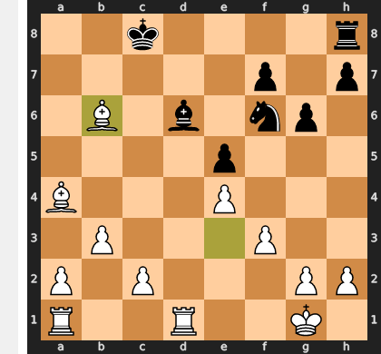

