# Chess Game Analysis: kar2on vs AlPinzio

- **Result:** 1/2-1/2
- **Date:** 2025.10.07
- **Opening:** Caro Kann Defense Exchange Variation 3...cxd5 4.Nf3 Nc6

### Move 1 (White): e4 - Best Move ✅

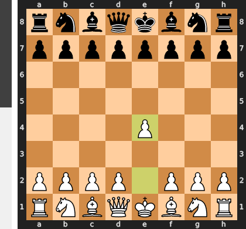

Played **e4**.

### Move 1 (Black): c6 - Good 👍

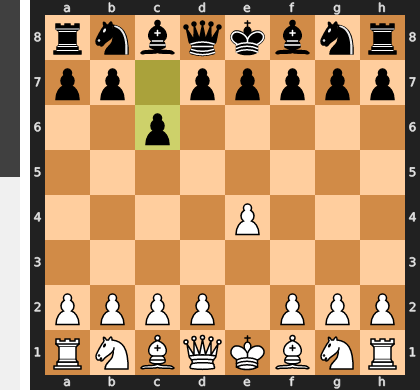

Played **c6**. The engine recommended **e5**.

### Move 2 (White): Nf3 - Good 👍

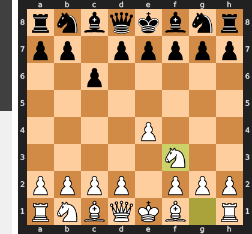

Played **Nf3**. The engine recommended **d4**.

### Move 2 (Black): d5 - Best Move ✅

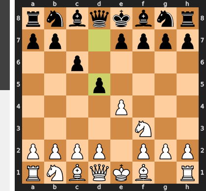

Played **d5**.

### Move 3 (White): exd5 - Good 👍

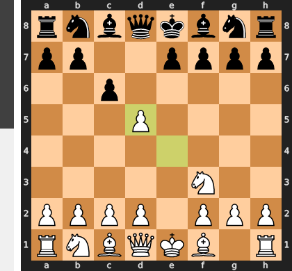

Played **exd5**. The engine recommended **Nc3**.

### Move 3 (Black): cxd5 - Best Move ✅

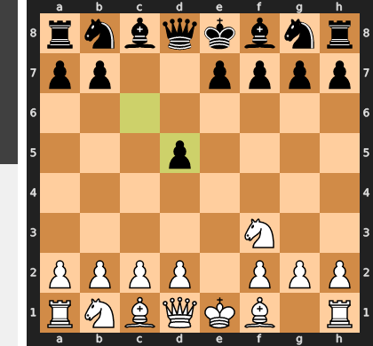

Played **cxd5**.

### Move 4 (White): d4 - Best Move ✅

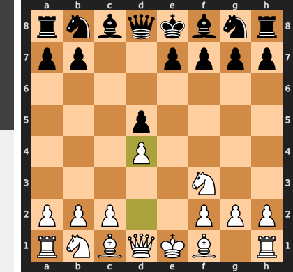

Played **d4**.

### Move 4 (Black): Nc6 - Good 👍

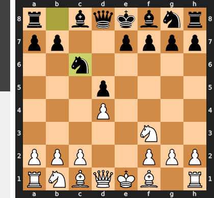

Played **Nc6**. The engine recommended **e6**.

### Move 5 (White): Nc3 - Good 👍

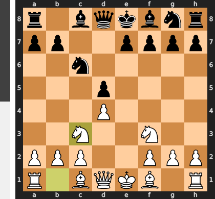

Played **Nc3**. The engine recommended **c4**.

### Move 5 (Black): Bg4 - Good 👍

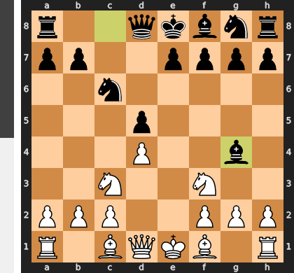

Played **Bg4**. The engine recommended **a6**.

### Move 6 (White): Be2 - Good 👍

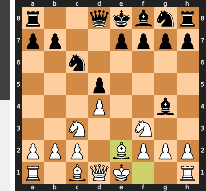

Played **Be2**. The engine recommended **h3**.

### Move 6 (Black): e6 - Best Move ✅

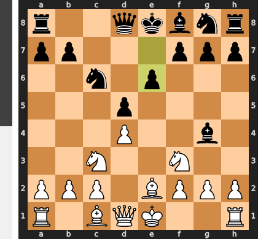

Played **e6**.

### Move 7 (White): O-O - Best Move ✅

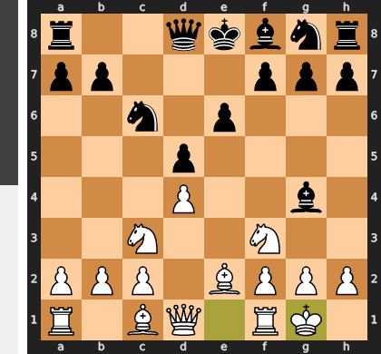

Played **O-O**.

### Move 7 (Black): Nf6 - Good 👍

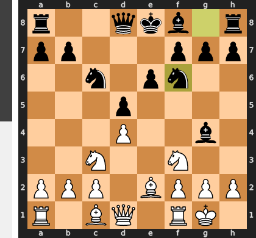

Played **Nf6**. The engine recommended **Bd6**.

### Move 8 (White): h3 - Best Move ✅

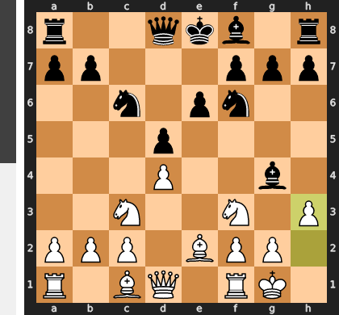

Played **h3**.

### Move 8 (Black): Bxf3 - Good 👍

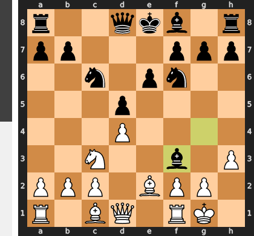

Played **Bxf3**. The engine recommended **Bf5**.

### Move 9 (White): Bxf3 - Best Move ✅

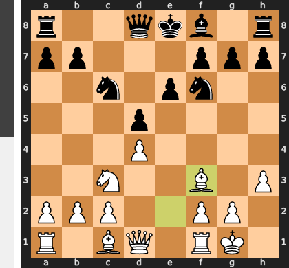

Played **Bxf3**.

### Move 9 (Black): Bd6 - Best Move ✅

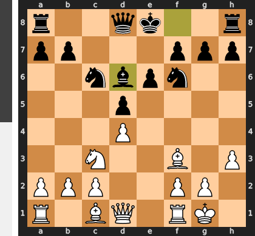

Played **Bd6**.

### Move 10 (White): Be3 - Good 👍

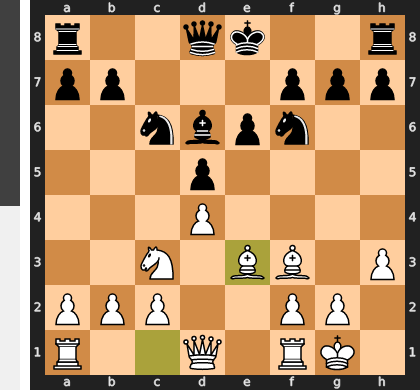

Played **Be3**. The engine recommended **Nb5**.

### Move 10 (Black): O-O - Best Move ✅

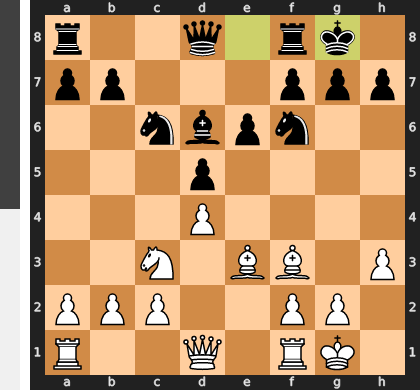

Played **O-O**.

### Move 11 (White): Bg5 - Good 👍

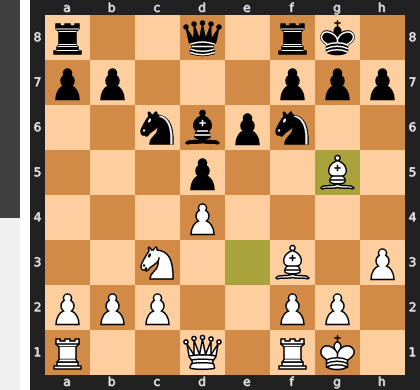

Played **Bg5**. The engine recommended **a4**.

### Move 11 (Black): h6 - Good 👍

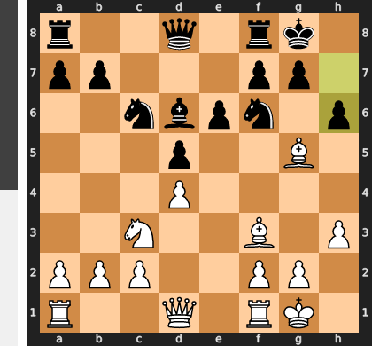

Played **h6**. The engine recommended **Qb6**.

### Move 12 (White): Bh4 - Inaccuracy ⁈

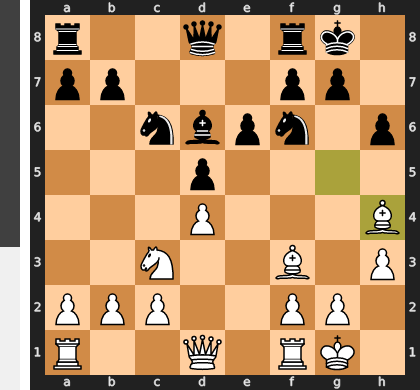

Played **Bh4**. The engine recommended **Bc1**.

### Move 12 (Black): g5 - Best Move ✅

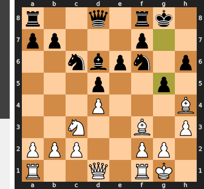

Played **g5**.

### Move 13 (White): Bg3 - Best Move ✅

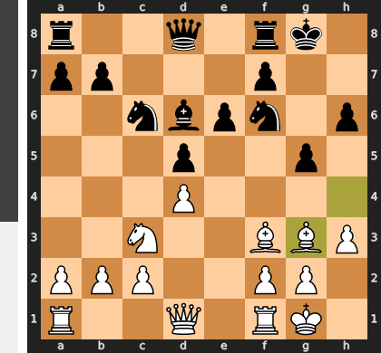

Played **Bg3**.

### Move 13 (Black): Bxg3 - Best Move ✅

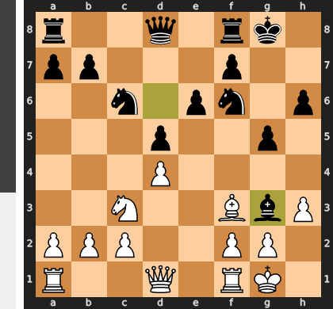

Played **Bxg3**.

### Move 14 (White): fxg3 - Best Move ✅

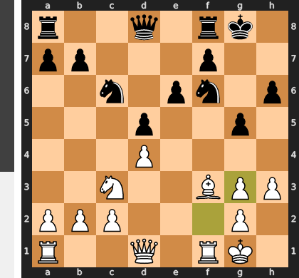

Played **fxg3**.

### Move 14 (Black): Qd6 - Inaccuracy ⁈

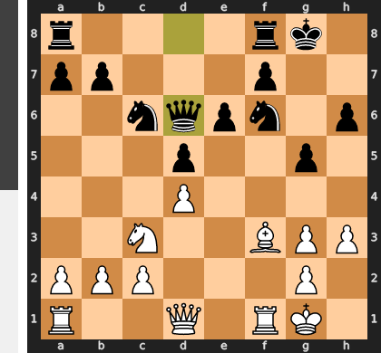

Played **Qd6**. The engine recommended **Qb6**.

### Move 15 (White): Ne2 - Best Move ✅

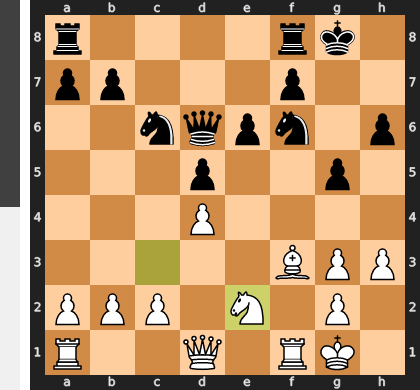

Played **Ne2**.

### Move 15 (Black): Ne4 - Good 👍

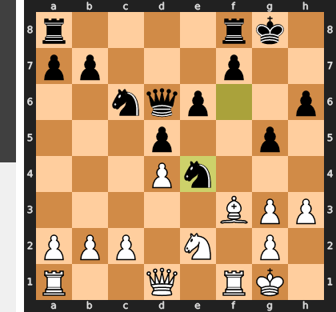

Played **Ne4**. The engine recommended **Ne7**.

### Move 16 (White): g4 - Best Move ✅

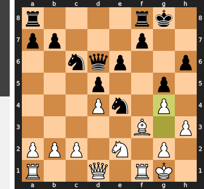

Played **g4**.

### Move 16 (Black): Rac8 - Good 👍

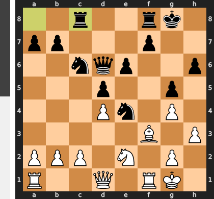

Played **Rac8**. The engine recommended **Rad8**.

### Move 17 (White): Qe1 - Mistake ❓

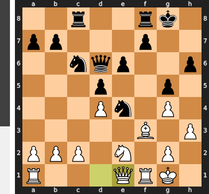

Qe1 is a grave positional mistake as it is a passive shuffle that completely fails to challenge Black's suffocating central control, which is the defining feature of the position. The entire struggle revolves around the powerful e4-knight, and by neglecting to immediately undermine its d5-pawn support with the active pawn break c4, White cedes the initiative. This gives Black a free hand to consolidate and prepare a decisive attack, likely starting with the crippling ...f5 pawn push.

### Move 17 (Black): Nb4 - Best Move ✅

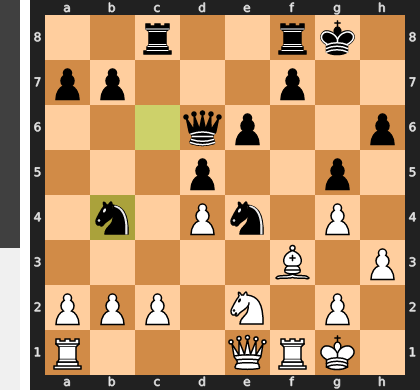

Played **Nb4**.

### Move 18 (White): Bxe4 - Best Move ✅

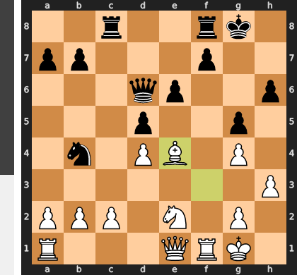

Played **Bxe4**.

### Move 18 (Black): dxe4 - Best Move ✅

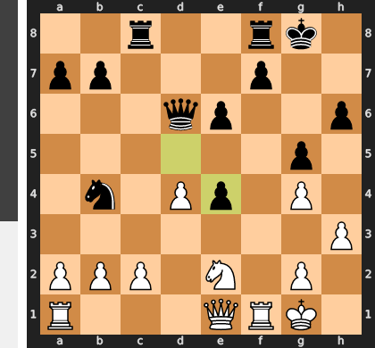

Played **dxe4**.

### Move 19 (White): Qd2 - Inaccuracy ⁈

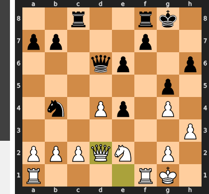

Played **Qd2**. The engine recommended **Rc1**.

### Move 19 (Black): Rxc2 - Good 👍

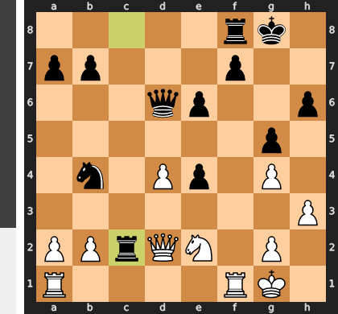

Played **Rxc2**. The engine recommended **e3**.

### Move 20 (White): Qd1 - Mistake ❓

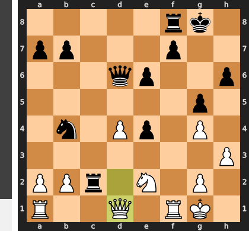

The move Qd1 is a grave positional mistake because it is a purely passive retreat, surrendering critical central squares and doing nothing to challenge Black's overwhelming initiative. This move effectively invites Black's simple and crushing plan of ...Rfc8, which will completely dominate the c-file and leave White's position paralyzed. The far superior Qe3 was required to keep the queen active, fighting for central control and providing crucial defensive support to the vulnerable kingside.

### Move 20 (Black): Rfc8 - Best Move ✅

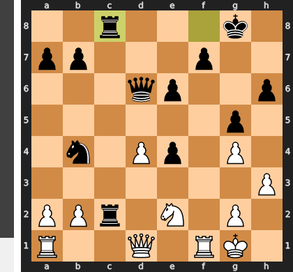

Played **Rfc8**.

### Move 21 (White): Rc1 - Good 👍

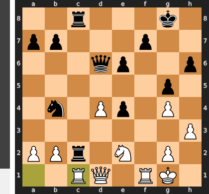

Played **Rc1**. The engine recommended **Kh1**.

### Move 21 (Black): Rxc1 - Best Move ✅

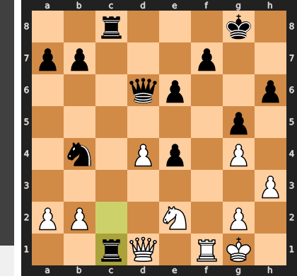

Played **Rxc1**.

### Move 22 (White): Nxc1 - Best Move ✅

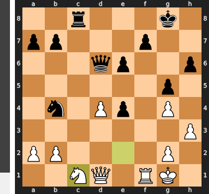

Played **Nxc1**.

### Move 22 (Black): Rc4 - Mistake ❓

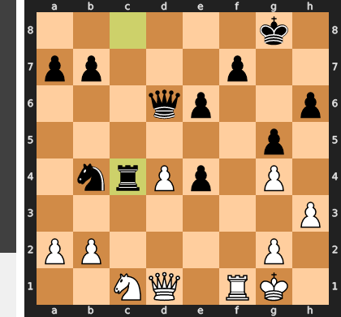

While attacking the d4-pawn is a sound idea, the move `...Rc4` tragically allows White's key defensive resource, `a3`. This one pawn move simultaneously challenges both your rook and the all-important b4-knight, forcing a retreat and allowing White to consolidate his beleaguered position. The decisive blow was the immediate `...Nc2`, which would have used your powerful knight to paralyze White's defenses and create overwhelming threats, rather than allowing this key attacker to become a target itself.

### Move 23 (White): a3 - Good 👍

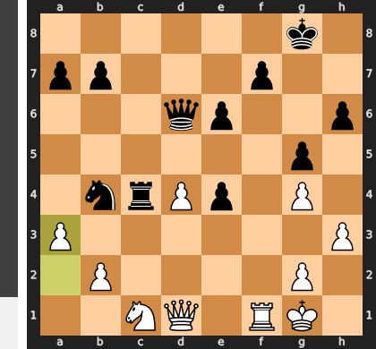

Played **a3**. The engine recommended **Ne2**.

### Move 23 (Black): Nc2 - Good 👍

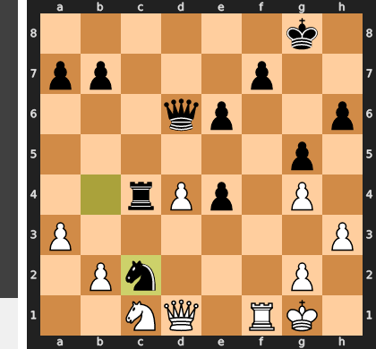

Played **Nc2**. The engine recommended **Rxd4**.

### Move 24 (White): Qe2 - Good 👍

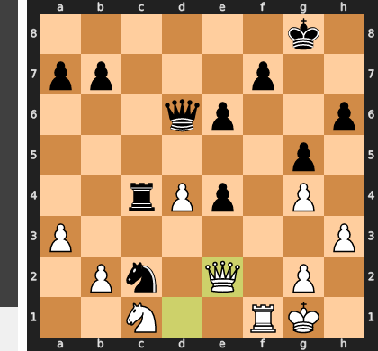

Played **Qe2**. The engine recommended **Ne2**.

### Move 24 (Black): Qxd4+ - Best Move ✅

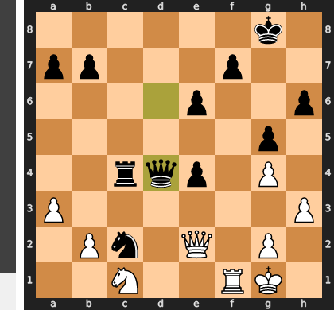

Played **Qxd4+**.

### Move 25 (White): Kh1 - Good 👍

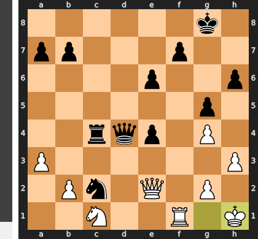

Played **Kh1**. The engine recommended **Qf2**.

### Move 25 (Black): Ne3 - Best Move ✅

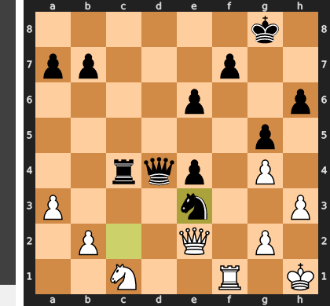

Played **Ne3**.

### Move 26 (White): Re1 - Best Move ✅

Played **Re1**.

### Move 26 (Black): b5 - Blunder ❌

Black's entire advantage stemmed from the monstrous knight on e3, which paralyzed White's king and created overwhelming threats. The slow positional move `...b5` is a tragic miscalculation, as it completely ignores the tactical reality and grants White the critical tempo to play the saving `Qxe3`. By exchanging off Black's key attacker, White instantly neutralizes all decisive threats and transforms a hopelessly lost position into a highly playable endgame.

### Move 27 (White): Nb3 - Best Move ✅

Played **Nb3**.

### Move 27 (Black): Qb6 - Inaccuracy ⁈

Played **Qb6**. The engine recommended **Qg7**.

### Move 28 (White): Qxe3 - Best Move ✅

Played **Qxe3**.

### Move 28 (Black): Qxe3 - Best Move ✅

Played **Qxe3**.

### Move 29 (White): Rxe3 - Best Move ✅

Played **Rxe3**.

### Move 29 (Black): Rc2 - Mistake ❓

While activating the rook on the second rank is a tempting idea, ...Rc2 is a positional mistake because it allows White to eliminate your greatest strategic asset. With the simple reply 1. Rxe4, White permanently liquidates your dangerous e4-pawn, which was the main source of your counterplay and a constant headache for him. After this exchange, White's magnificent knight on b3 is completely unleashed, and he can proceed with his own winning plan of creating a passed pawn on the queenside without any distractions.

### Move 30 (White): Rxe4 - Best Move ✅

Played **Rxe4**.

### Move 30 (Black): Rxb2 - Best Move ✅

Played **Rxb2**.

### Move 31 (White): Nd4 - Good 👍

Played **Nd4**. The engine recommended **Rb4**.

### Move 31 (Black): a6 - Best Move ✅

Played **a6**.

### Move 32 (White): Nf3 - Good 👍

Played **Nf3**. The engine recommended **Kh2**.

### Move 32 (Black): Rb3 - Good 👍

Played **Rb3**. The engine recommended **Kf8**.

### Move 33 (White): a4 - Best Move ✅

Played **a4**.

### Move 33 (Black): Rb1+ - Good 👍

Played **Rb1+**. The engine recommended **Kf8**.

### Move 34 (White): Kh2 - Best Move ✅

Played **Kh2**.

### Move 34 (Black): b4 - Good 👍

Played **b4**. The engine recommended **Kg7**.

### Move 35 (White): Nd2 - Good 👍

Played **Nd2**. The engine recommended **Rd4**.

### Move 35 (Black): Rb2 - Best Move ✅

Played **Rb2**.

### Move 36 (White): Nc4 - Good 👍

Played **Nc4**. The engine recommended **Nf3**.

### Move 36 (Black): Ra2 - Best Move ✅

Played **Ra2**.

### Move 37 (White): Nb6 - Best Move ✅

Played **Nb6**.

### Move 37 (Black): b3 - Best Move ✅

Played **b3**.

### Move 38 (White): Rb4 - Best Move ✅

Played **Rb4**.

### Move 38 (Black): a5 - Inaccuracy ⁈

Played **a5**. The engine recommended **b2**.

### Move 39 (White): Rb5 - Mistake ❓

This move is a profound strategic misjudgment, as it attacks an irrelevant pawn on g5 while ignoring Black's critical passed b-pawn. By failing to play the decisive Rxb3, White allows Black's only source of counterplay to survive and thrive. Now, after the inevitable ...b2, Black's rook becomes active against the a4-pawn, paralyzing White's winning plan and giving Black excellent drawing chances.

### Move 39 (Black): b2 - Best Move ✅

Played **b2**.

### Move 40 (White): Nc4 - Best Move ✅

Played **Nc4**.

### Move 40 (Black): Rxa4 - Best Move ✅

Played **Rxa4**.

### Move 41 (White): Nxb2 - Best Move ✅

Played **Nxb2**.

### Move 41 (Black): Rb4 - Best Move ✅

Played **Rb4**.

### Move 42 (White): Rxb4 - Best Move ✅

Played **Rxb4**.

### Move 42 (Black): axb4 - Best Move ✅

Played **axb4**.

### Move 43 (White): Kg3 - Best Move ✅

Played **Kg3**.

### Move 43 (Black): Kg7 - Good 👍

Played **Kg7**. The engine recommended **f5**.

### Move 44 (White): Kf3 - Best Move ✅

Played **Kf3**.

### Move 44 (Black): Kf6 - Good 👍

Played **Kf6**. The engine recommended **f5**.

### Move 45 (White): Ke3 - Good 👍

Played **Ke3**. The engine recommended **Ke4**.

### Move 45 (Black): Ke5 - Good 👍

Played **Ke5**. The engine recommended **Ke7**.

### Move 46 (White): Kd3 - Blunder ❌

This move was a fatal misunderstanding of the division of labor between your pieces. By playing Kd3, you incorrectly assigned the king to the defensive task of stopping the b-pawn, a job the knight was perfectly suited for. This slow approach tragically allows Black to launch a decisive kingside counter-attack with ...f5, which your king is now too far away to prevent.

### Move 46 (Black): Kd5 - Inaccuracy ⁈

Played **Kd5**. The engine recommended **Kf4**.

### Move 47 (White): Na4 - Good 👍

Played **Na4**. The engine recommended **Nc4**.

### Move 47 (Black): e5 - Mistake ❓

By playing ...e5, you have created a permanent, static weakness that White's king can now attack with decisive effect after the simple Ke3. This move surrenders the initiative and hands White a clear target, whereas the superior ...f5 would have immediately attacked White's own kingside pawn structure, creating counterplay and forcing White to react to your threats.

### Move 48 (White): Nb6+ - Best Move ✅

Played **Nb6+**.

### Move 48 (Black): Kc5 - Best Move ✅

Played **Kc5**.

### Move 49 (White): Nd7+ - Best Move ✅

Played **Nd7+**.

### Move 49 (Black): Kd5 - Good 👍

Played **Kd5**. The engine recommended **Kd6**.

### Move 50 (White): Nb6+ - Good 👍

Played **Nb6+**. The engine recommended **Nf6+**.

### Move 50 (Black): Kc6 - Good 👍

Played **Kc6**. The engine recommended **Ke6**.

### Move 51 (White): Na4 - Mistake ❓

This move is a serious positional mistake because it places the knight on the rim and, most critically, invites the black king to become an active participant with ...Kb5. By allowing this harassment, White loses a critical tempo to reposition the knight, giving Black time to consolidate his otherwise dire position. The correct Nc4 would have immediately created decisive threats against the e5-pawn while keeping Black's king completely passive and tied down to defensive duties.

### Move 51 (Black): Kb5 - Inaccuracy ⁈

Played **Kb5**. The engine recommended **Kd5**.

### Move 52 (White): Nb2 - Best Move ✅

Played **Nb2**.

### Move 52 (Black): b3 - Mistake ❓

The move ...b3 is a grave error as it transforms the passed pawn from a potential strength into a fixed, attackable weakness for White's king. The correct path was the patient ...Kc5, activating the king to a central post where it could both support the b-pawn's future advance and defend the critical e5 pawn. By committing the pawn now, Black's king is relegated to a passive defensive role, allowing White to easily consolidate and target Black's weaknesses.

### Move 53 (White): Ke4 - Mistake ❓

This move Ke4 fundamentally misunderstands where the decisive battle lies; the struggle is not for the center, but against the menacing b3-pawn. By moving away, the king abandons its vital duty of supporting the knight, allowing Black's king to freely escort its passed pawn and create serious winning chances of its own. The correct Kc3 would have formed an ironclad blockade on the queenside, completely neutralizing Black's only counterplay and ensuring a straightforward technical win.

### Move 53 (Black): Kb4 - Best Move ✅

Played **Kb4**.

### Move 54 (White): Kxe5 - Blunder ❌

By capturing a harmless pawn, the white king fatally abandoned its crucial duty of containing the black king and the menacing b-pawn. This allows Black to force a drawn king-and-pawn endgame with the ...Ka3-b2 sequence, as the white king is now merely a distant spectator on the wrong side of the board. The correct Kd3 would have kept Black's king completely boxed in, neutralizing all counterplay and allowing White to win at leisure.

### Move 54 (Black): Kc3 - Best Move ✅

Played **Kc3**.

### Move 55 (White): Na4+ - Best Move ✅

Played **Na4+**.

### Move 55 (Black): Kb4 - Best Move ✅

Played **Kb4**.

### Move 56 (White): Nb2 - Best Move ✅

Played **Nb2**.

### Move 56 (Black): Ka3 - Blunder ❌

This is a fatal miscalculation, as moving the king to the edge of the board allows White to execute a decisive knight maneuver starting with Nd1. The knight will now reposition to c3, where it simultaneously traps the Black king and attacks the vital b3-pawn, leading to a winning material advantage. The correct ...Kc3 would have kept the king active and centralized, preventing this entire sequence and maintaining the balance.

### Move 57 (White): Nc4+ - Mistake ❓

While the check on c4 seems active, it is a mistake because it is a "helpful check," allowing Black's king to use its forced move to reposition to a2, where it perfectly supports the passed pawn. The superior Nd3 is a quiet, prophylactic move that seizes control of the crucial b2-square, completely restricting the enemy king and preparing a more efficient and decisive blockade. This suffocates Black's counterplay, whereas the check unnecessarily gives the opponent a vital tempo to consolidate.

### Move 57 (Black): Kb4 - Good 👍

Played **Kb4**. The engine recommended **Ka2**.

### Move 58 (White): Nb2 - Blunder ❌

This is a tragic misunderstanding of which piece should perform which task; the dominant king was the perfect blockader for the b-pawn (via the winning Kd4-c3), while the knight was the ideal attacker. Instead, Nb2 forces the knight into a clumsy defensive role it is ill-suited for, fatally abandoning control of the queenside and allowing Black to force a drawn king and pawn endgame.

