# Chess Game Analysis: jumpshot2525 vs kar2on

- **Result:** 0-1
- **Date:** 2026.07.28
- **Opening:** Pirc Defense Classical Variation 4...Bg7 5.Bc4 O O 6.O O
- **Type:** Rated

### Move 1 (White): e4 - Best Move ✅

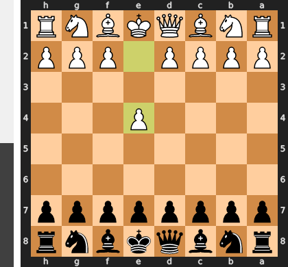

Played **e4**.

### Move 1 (Black): d6 - Good 👍

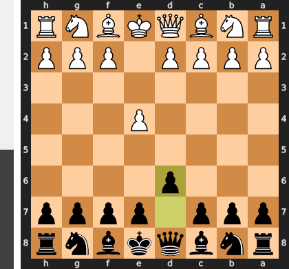

Played **d6**. The engine recommended **e5**.

### Move 2 (White): d4 - Best Move ✅

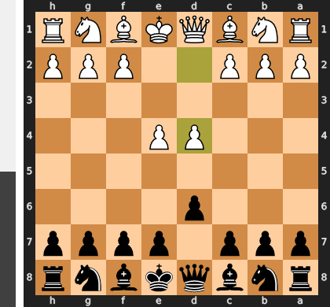

Played **d4**.

### Move 2 (Black): Nf6 - Best Move ✅

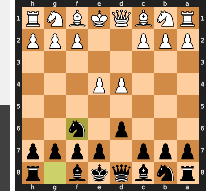

Played **Nf6**.

### Move 3 (White): Nc3 - Best Move ✅

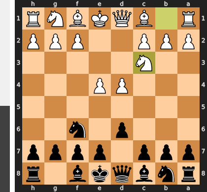

Played **Nc3**.

### Move 3 (Black): g6 - Good 👍

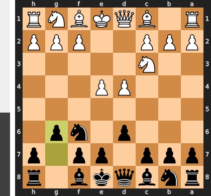

Played **g6**. The engine recommended **e5**.

### Move 4 (White): Bc4 - Good 👍

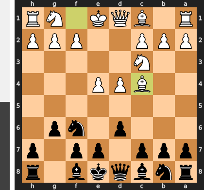

Played **Bc4**. The engine recommended **h3**.

### Move 4 (Black): Bg7 - Best Move ✅

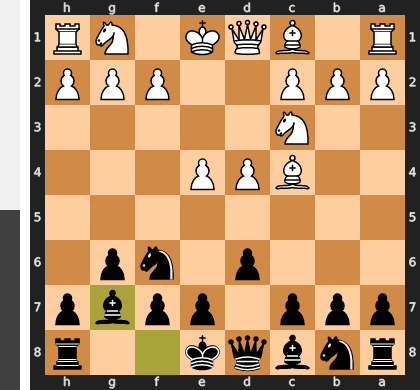

Played **Bg7**.

### Move 5 (White): Nf3 - Best Move ✅

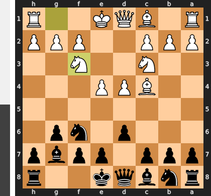

Played **Nf3**.

### Move 5 (Black): O-O - Best Move ✅

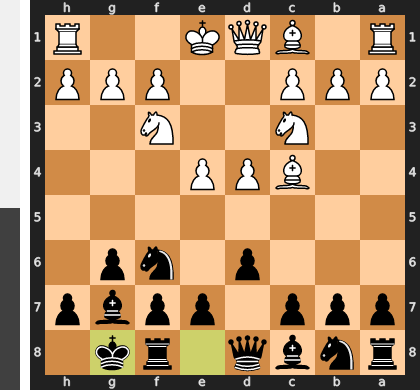

Played **O-O**.

### Move 6 (White): O-O - Good 👍

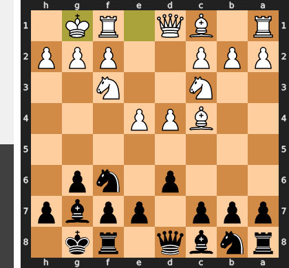

Played **O-O**. The engine recommended **Bb3**.

### Move 6 (Black): c5 - Good 👍

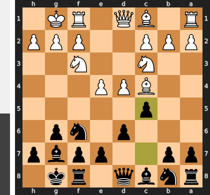

Played **c5**. The engine recommended **Nxe4**.

### Move 7 (White): Bg5 - Inaccuracy ⁈

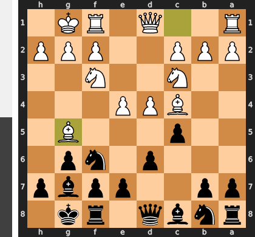

Played **Bg5**. The engine recommended **d5**.

### Move 7 (Black): cxd4 - Best Move ✅

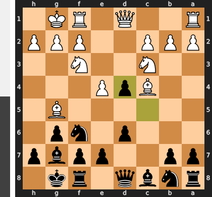

Played **cxd4**.

### Move 8 (White): Nd5 - Mistake ❓

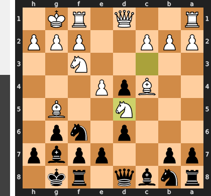

White's Nd5 is a tactical mistake because the knight is immediately vulnerable and unsupported, allowing Black to play the strong `...e6`. This move simultaneously attacks the exposed knight and bolsters Black's central pawn structure, forcing White's knight to retreat and effectively wasting two tempi while Black gains a crucial tempo and improved position. White's aggressive attempt to exploit the Nf6 pin is thus nullified, leaving Black with a clear advantage.

### Move 8 (Black): Nc6 - Inaccuracy ⁈

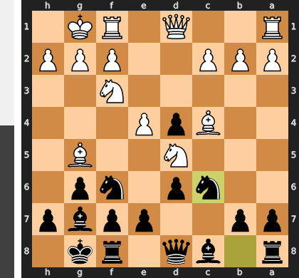

Played **Nc6**. The engine recommended **Nxd5**.

### Move 9 (White): Qd2 - Blunder ❌

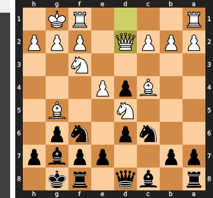

The blunder Qd2 immediately squanders White's critical tactical opportunity to capture Black's hanging d4 pawn, which was attacked by three white pieces (Bc4, Nf3, Nd5) and defended by only two (Nc6, Qd8). Furthermore, this passive queen move creates a severe weakness on f3, enabling Black's devastating ...Bg4 pin, which subsequently wins White's Nf3 Knight for a pawn.

### Move 9 (Black): Nxd5 - Blunder ❌

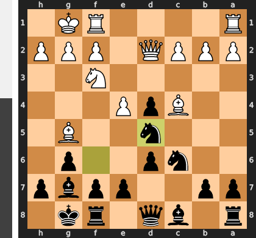

Black's `Nxd5` is a blunder primarily due to a missed tactical opportunity: the engine's recommended `Nxe4` would have won White's central `e4` pawn and established a dominant, permanent knight outpost. Instead, the `Nd5` move allows White to recapture with `Bxd5`, trading an active bishop for Black's knight and weakening Black's pawn structure with an isolated `d5` pawn after `exd5`, thereby squandering a previously significant advantage.

### Move 10 (White): Bxd5 - Best Move ✅

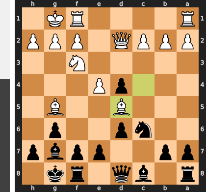

Played **Bxd5**.

### Move 10 (Black): Ne5 - Mistake ❓

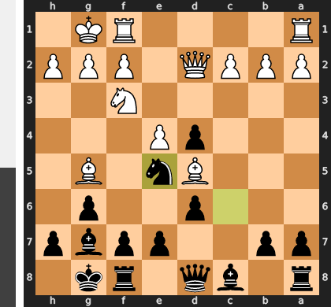

Black's Ne5 is a mistake as it allows White to immediately challenge the central knight with `Nxe5`. This forces Black into an unpleasant choice: recapturing with `dxe5` leads to a losing material disadvantage, while the seemingly equal `Qxe5` allows White to activate their bishop to c4, gaining control of the crucial a2-g8 diagonal and creating threats against f7. Instead of improving Black's position, Ne5 hands the initiative to White, leaving Black with a structurally inferior position and defensive worries.

### Move 11 (White): Bh6 - Mistake ❓

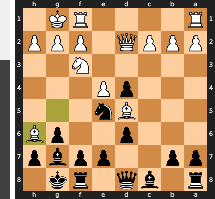

The move Bh6 immediately blunders White's bishop by placing it on a square with no escape routes. Black can play the simple ...h5, trapping the bishop and winning a full piece, granting a decisive material advantage and completely unraveling White's position.

### Move 11 (Black): Nxf3+ - Best Move ✅

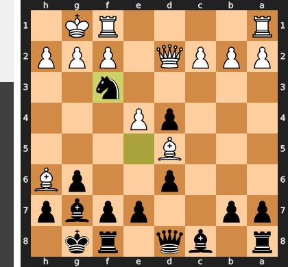

Played **Nxf3+**.

### Move 12 (White): gxf3 - Best Move ✅

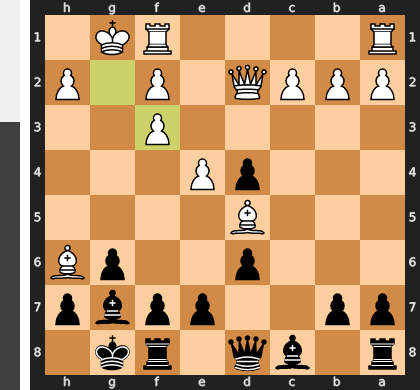

Played **gxf3**.

### Move 12 (Black): e6 - Inaccuracy ⁈

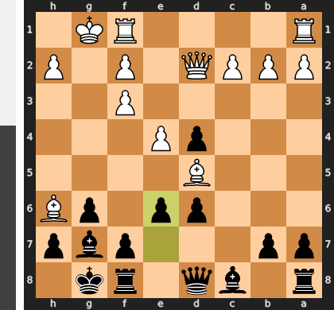

Played **e6**. The engine recommended **Bh3**.

### Move 13 (White): Bg5 - Blunder ❌

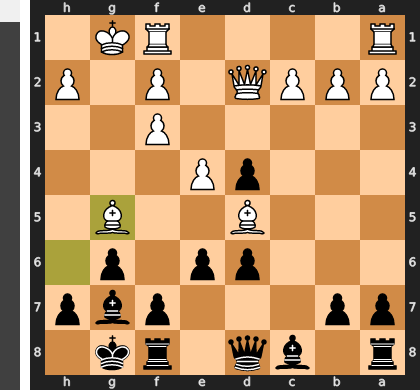

White's Bg5 is a severe blunder because it squanders a decisive tactical opportunity to critically compromise Black's kingside. The engine's recommended Bxg7 would have immediately eliminated a key defender, exposed Black's king to a dangerous attack by opening lines for White's rooks, and forced a disruptive king move. In stark contrast, Bg5 is a passive move that fails to generate any immediate threats or capitalize on Black's vulnerable king, allowing Black to consolidate and seize the initiative.

### Move 13 (Black): Bf6 - Mistake ❓

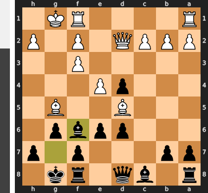

Bf6 is a critical mistake because it invites the powerful exchange Bg5xf6. Upon recapture with gxf6, Black's kingside pawn structure is shattered, creating an open g-file for White's rook and leaving permanent dark-square weaknesses around the exposed king. This grants White a significant, lasting advantage and clear attacking prospects.

### Move 14 (White): Bxf6 - Best Move ✅

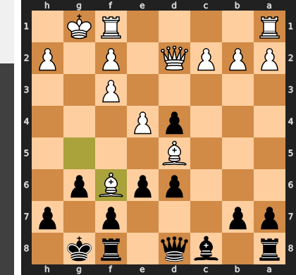

Played **Bxf6**.

### Move 14 (Black): Qxf6 - Best Move ✅

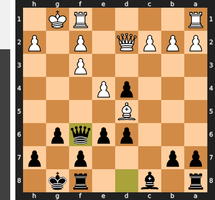

Played **Qxf6**.

### Move 15 (White): e5 - Inaccuracy ⁈

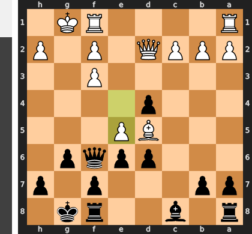

Played **e5**. The engine recommended **Bb3**.

### Move 15 (Black): Qh4 - Good 👍

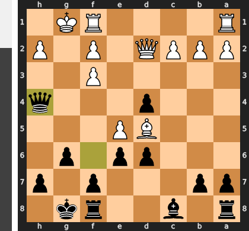

Played **Qh4**. The engine recommended **dxe5**.

### Move 16 (White): Be4 - Best Move ✅

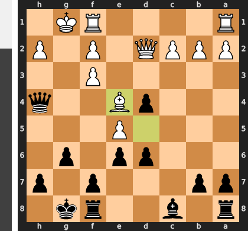

Played **Be4**.

### Move 16 (Black): d5 - Good 👍

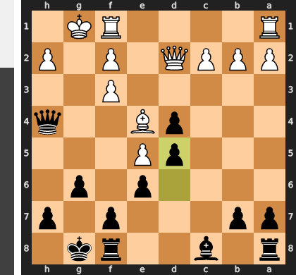

Played **d5**. The engine recommended **dxe5**.

### Move 17 (White): Bxg6 - Mistake ❓

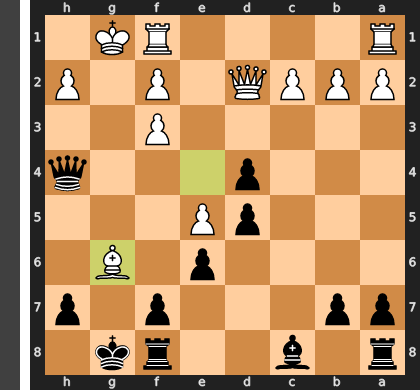

White's `Bxg6` is a grave tactical miscalculation, sacrificing a full bishop for a mere pawn without any lasting attack or sufficient positional compensation. Black's forced recapture `...hxg6` immediately closes the kingside, negating any potential for White to exploit the g-file and leaving White down a piece. This leaves White's king exposed and their pieces depleted, unable to contend with Black's active queen on h4 and developing initiative.

### Move 17 (Black): fxg6 - Best Move ✅

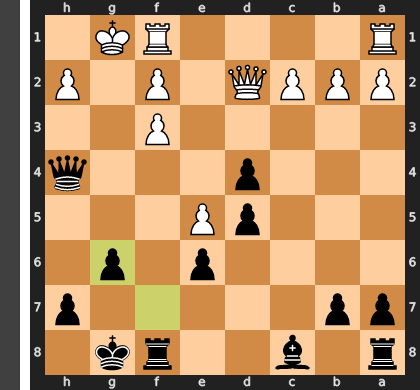

Played **fxg6**.

### Move 18 (White): Kh1 - Good 👍

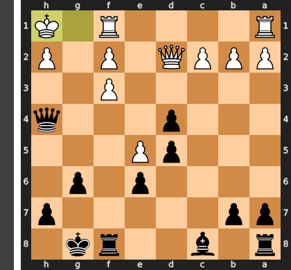

Played **Kh1**. The engine recommended **Qb4**.

### Move 18 (Black): Rxf3 - Good 👍

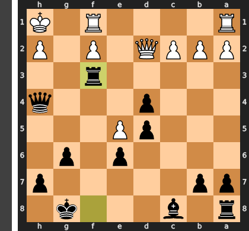

Played **Rxf3**. The engine recommended **Bd7**.

### Move 19 (White): Rg1 - Best Move ✅

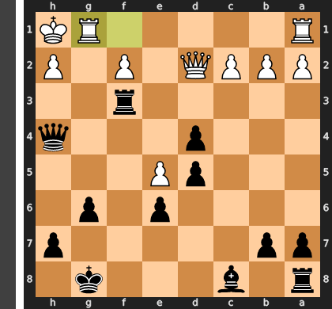

Played **Rg1**.

### Move 19 (Black): Qe4 - Good 👍

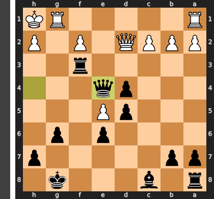

Played **Qe4**. The engine recommended **Bd7**.

### Move 20 (White): Rg2 - Best Move ✅

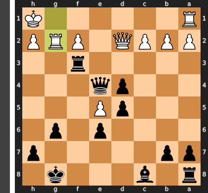

Played **Rg2**.

### Move 20 (Black): Qxe5 - Good 👍

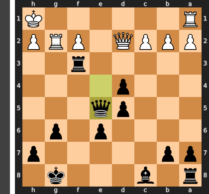

Played **Qxe5**. The engine recommended **Bd7**.

### Move 21 (White): Rag1 - Good 👍

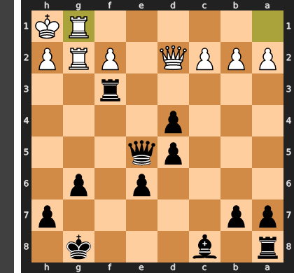

Played **Rag1**. The engine recommended **Re1**.

### Move 21 (Black): Kg7 - Good 👍

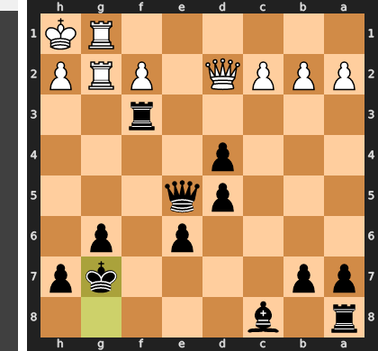

Played **Kg7**. The engine recommended **Qe4**.

### Move 22 (White): Qg5 - Mistake ❓

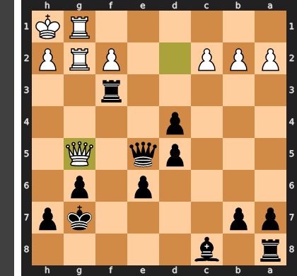

White's `Qg5` is a critical tactical blunder because it exposes the queen to a forced, decisive exchange. Black can initiate the sequence with `...Rf2+`, forcing the White king to move. After the king retreats (e.g., `Kh1`), Black plays `...Rxg2`, forcing White's queen to recapture on `g2`, where it is then lost to `...Qxg2`, resulting in White losing their queen for a rook and solidifying Black's already substantial material advantage.

### Move 22 (Black): Qxg5 - Best Move ✅

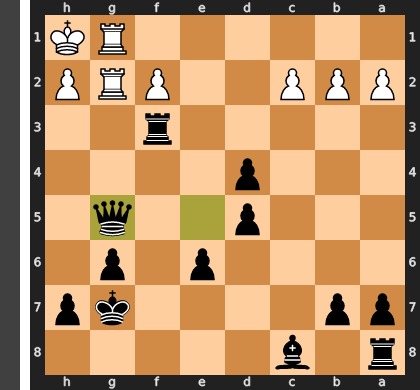

Played **Qxg5**.

### Move 23 (White): Rxg5 - Best Move ✅

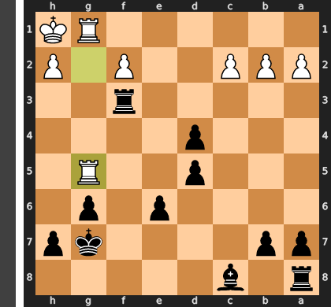

Played **Rxg5**.

### Move 23 (Black): Rxf2 - Good 👍

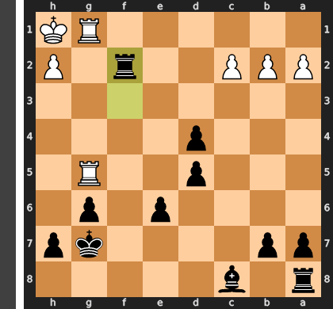

Played **Rxf2**. The engine recommended **Kf6**.

### Move 24 (White): R5g4 - Inaccuracy ⁈

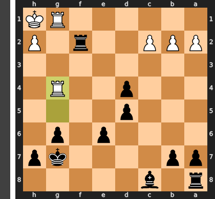

Played **R5g4**. The engine recommended **Re1**.

### Move 24 (Black): e5 - Best Move ✅

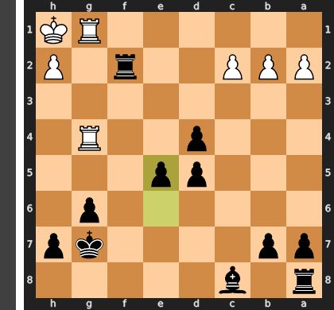

Played **e5**.

### Move 25 (White): Rg5 - Good 👍

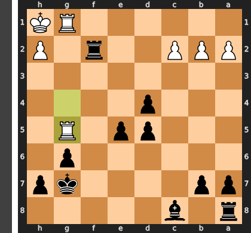

Played **Rg5**. The engine recommended **R4g2**.

### Move 25 (Black): Bf5 - Best Move ✅

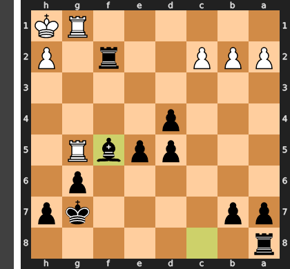

Played **Bf5**.

### Move 26 (White): h4 - Inaccuracy ⁈

Played **h4**. The engine recommended **Re1**.

### Move 26 (Black): Be4+ - Best Move ✅

Played **Be4+**.

