# Chess Game Analysis: kar2on vs MARKO889900000

- **Result:** 1-0
- **Date:** 2026.07.28
- **Opening:** Kings Pawn Opening Kings Knight Variation
- **Type:** Rated

### Move 1 (White): e4 - Best Move ✅

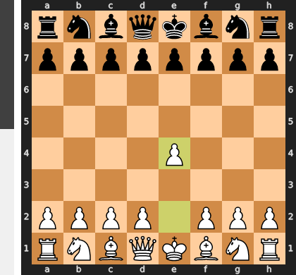

Played **e4**.

### Move 1 (Black): e5 - Best Move ✅

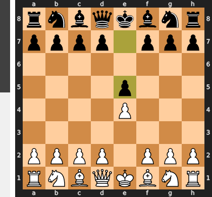

Played **e5**.

### Move 2 (White): Nf3 - Best Move ✅

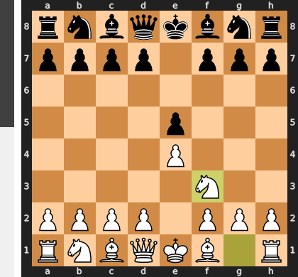

Played **Nf3**.

### Move 2 (Black): d5 - Good 👍

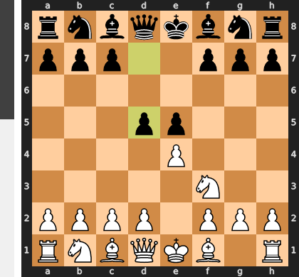

Played **d5**. The engine recommended **Nc6**.

### Move 3 (White): d3 - Mistake ❓

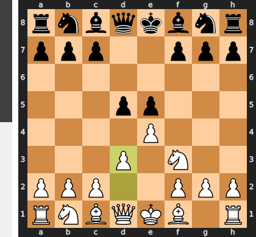

The move `3. d3` is a mistake because it completely ignores the immediate central tension created by Black's `2...d5`. Instead of decisively addressing the central conflict with `3. exd5`—which would open lines and gain tempo by attacking a recapturing queen—`d3` is a passive response that blocks White's light-squared bishop and concedes the central initiative. Black can now dictate the central structure by capturing on `e4` or pushing `d4`, leading to an uncomfortable and passive position for White without resistance.

### Move 3 (Black): dxe4 - Good 👍

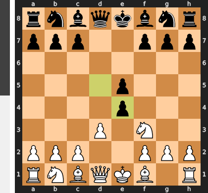

Played **dxe4**. The engine recommended **Nc6**.

### Move 4 (White): dxe4 - Good 👍

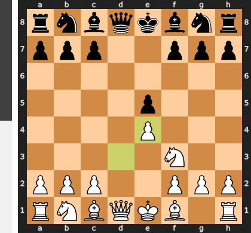

Played **dxe4**. The engine recommended **Nxe5**.

### Move 4 (Black): Qxd1+ - Best Move ✅

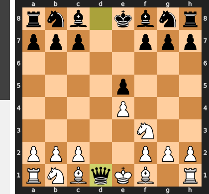

Played **Qxd1+**.

### Move 5 (White): Kxd1 - Best Move ✅

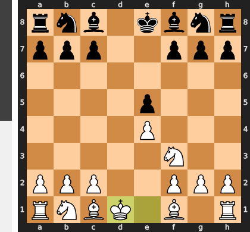

Played **Kxd1**.

### Move 5 (Black): Bd6 - Good 👍

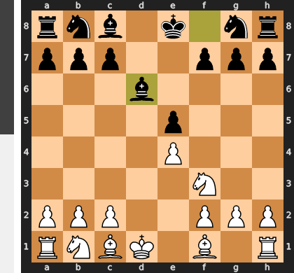

Played **Bd6**. The engine recommended **Nc6**.

### Move 6 (White): Nc3 - Good 👍

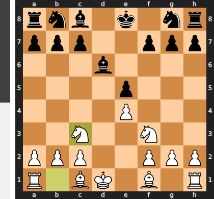

Played **Nc3**. The engine recommended **Nbd2**.

### Move 6 (Black): h6 - Good 👍

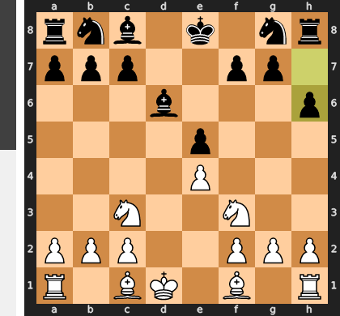

Played **h6**. The engine recommended **Nf6**.

### Move 7 (White): Bc4 - Good 👍

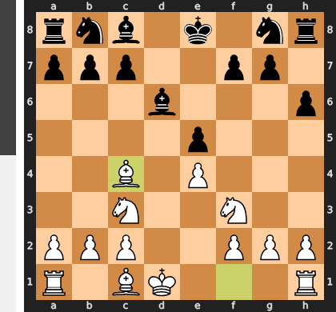

Played **Bc4**. The engine recommended **Nd2**.

### Move 7 (Black): Nf6 - Good 👍

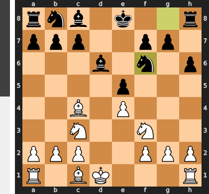

Played **Nf6**. The engine recommended **Nc6**.

### Move 8 (White): h3 - Good 👍

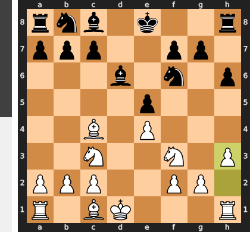

Played **h3**. The engine recommended **Ne1**.

### Move 8 (Black): O-O - Good 👍

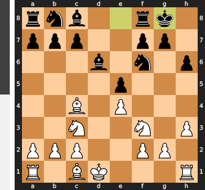

Played **O-O**. The engine recommended **Nc6**.

### Move 9 (White): Nh4 - Inaccuracy ⁈

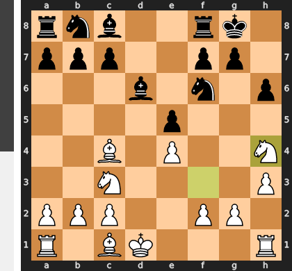

Played **Nh4**. The engine recommended **Be3**.

### Move 9 (Black): g6 - Mistake ❓

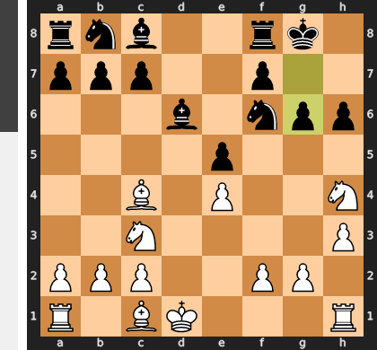

Black's `...g6` is a grave mistake as it critically weakens the kingside dark squares and leaves the `f7` pawn vulnerable to White's `Bc4`. This immediately allows White a winning tactical sequence starting with `Bxf7+`, forcing `Rxf7` (as Black's queen cannot capture), after which `Nf5` simultaneously attacks Black's now undefended queen on `d8` and bishop on `d6`. Had Black played the engine's recommendation `...Rd8` instead, the queen would have been positioned to recapture on `f7`, preventing this decisive loss of material.

### Move 10 (White): Bxh6 - Best Move ✅

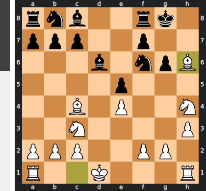

Played **Bxh6**.

### Move 10 (Black): Re8 - Good 👍

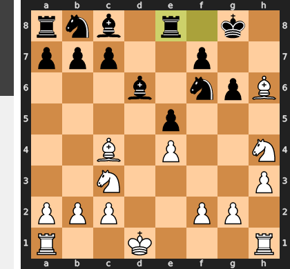

Played **Re8**. The engine recommended **Rd8**.

### Move 11 (White): Bg5 - Good 👍

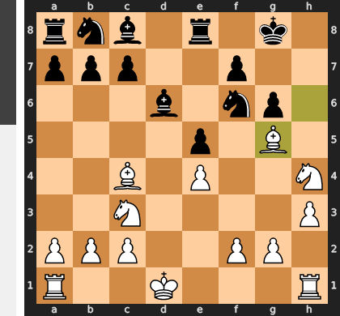

Played **Bg5**. The engine recommended **Nf3**.

### Move 11 (Black): Nh5 - Mistake ❓

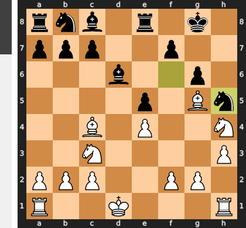

Black's `Nh5` is a mistake as it immediately places the knight on the board's edge, making it highly vulnerable to White's forcing `g4` pawn push. This tactical vulnerability costs Black a crucial tempo, as the knight is compelled to retreat to a passive square, significantly reducing its activity and failing to address pressing issues like king safety.

### Move 12 (White): g4 - Mistake ❓

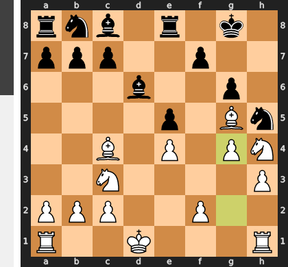

White's `g4` is a mistake because it prematurely weakens their own kingside pawn structure, creating a hook for Black's `...h5` and exposing the crucial f4 square, all while White's king remains uncastled and vulnerable on d1. This push squanders a powerful tactical opportunity to play `Nxg6`, which would have immediately shattered Black's kingside defenses and led to a decisive attack, allowing Black to consolidate instead.

### Move 12 (Black): Nf4 - Best Move ✅

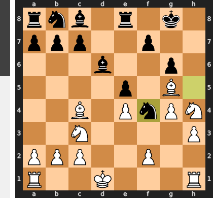

Played **Nf4**.

### Move 13 (White): Bxf4 - Best Move ✅

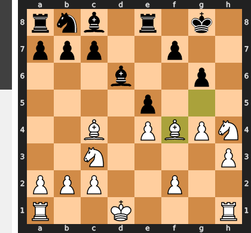

Played **Bxf4**.

### Move 13 (Black): exf4 - Best Move ✅

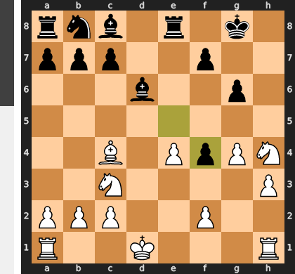

Played **exf4**.

### Move 14 (White): f3 - Mistake ❓

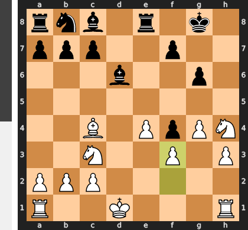

White's f3 is a critical blunder as it completely squanders the potent tactical shot Nxg6, which would have opened crucial attacking lines against Black's kingside and exploited the weak g6 pawn. Instead of creating threats, f3 actively harms White's position by creating a permanent light-square weakness on e3 near the king, and restricting the valuable Nh4's scope, ultimately turning an advantageous position into a worse one.

### Move 14 (Black): Rd8 - Good 👍

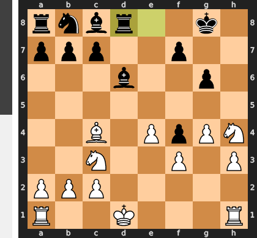

Played **Rd8**. The engine recommended **Kg7**.

### Move 15 (White): Ke2 - Best Move ✅

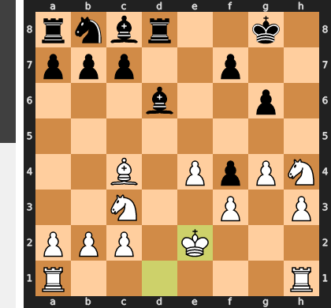

Played **Ke2**.

### Move 15 (Black): c6 - Mistake ❓

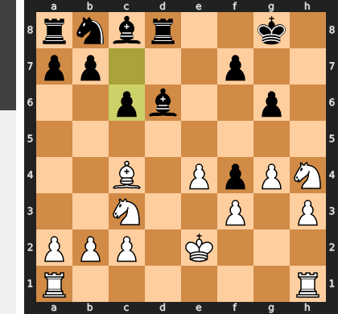

Playing c6 is a critical mistake as it directly obstructs Black's key developing square Nc6, leaving the b8 knight passive and the c8 bishop locked in. This passive pawn move fails to address White's clear initiative and lead in development, effectively wasting a crucial tempo while Black's king remains vulnerable and their queenside pieces are stifled. Black desperately needs to activate their pieces and challenge the center, which c6 actively prevents.

### Move 16 (White): Nxg6 - Inaccuracy ⁈

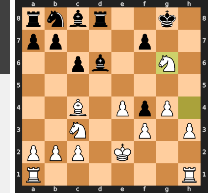

Played **Nxg6**. The engine recommended **e5**.

### Move 16 (Black): Kg7 - Mistake ❓

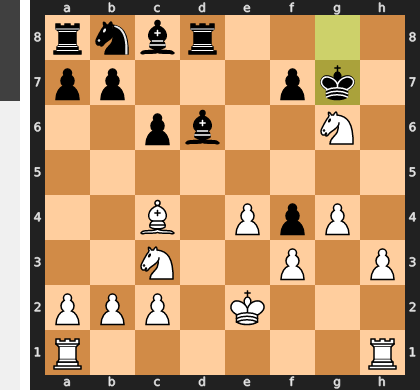

Moving the King to g7 unnecessarily exposes it on the semi-open g-file, allowing White's rook on h1 to immediately create dangerous pressure with moves like Rhg1, while also leaving the h7 pawn vulnerable. This passive relocation fails to address Black's significant development lag and White's commanding central presence, instead creating new king safety concerns that White can exploit.

### Move 17 (White): Nh4 - Inaccuracy ⁈

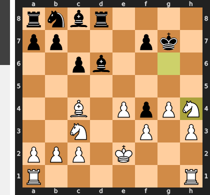

Played **Nh4**. The engine recommended **e5**.

### Move 17 (Black): b5 - Best Move ✅

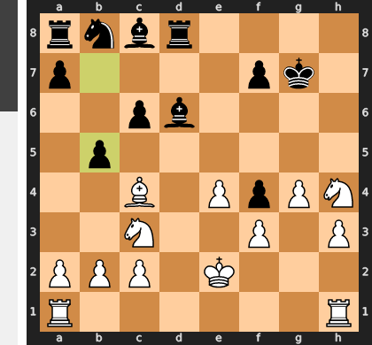

Played **b5**.

### Move 18 (White): Bb3 - Inaccuracy ⁈

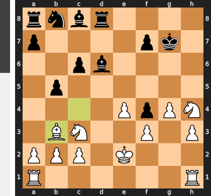

Played **Bb3**. The engine recommended **Bd3**.

### Move 18 (Black): Bb4 - Mistake ❓

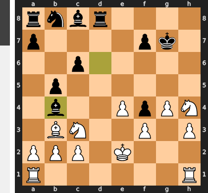

Black's `Bb4` is a significant positional error, as it's an easily repelled "attack" on White's well-defended c3-knight that offers no lasting threats and squanders a tempo. This move allows White to seize a critical initiative by centralizing with moves like `Nd5`, immediately creating concrete threats to Black's vulnerable queenside and challenging their passive structure. Consequently, Black's previously active bishop on b4 becomes a passive target, forcing future retreats and further loss of time.

### Move 19 (White): Rad1 - Best Move ✅

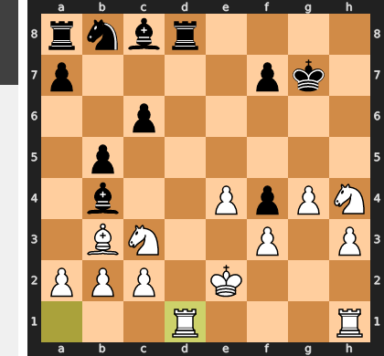

Played **Rad1**.

### Move 19 (Black): Rxd1 - Best Move ✅

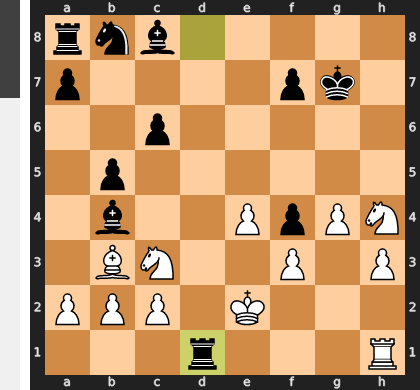

Played **Rxd1**.

### Move 20 (White): Rxd1 - Best Move ✅

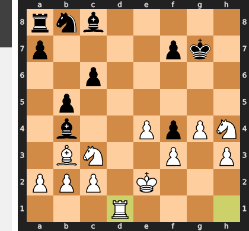

Played **Rxd1**.

### Move 20 (Black): Bxc3 - Inaccuracy ⁈

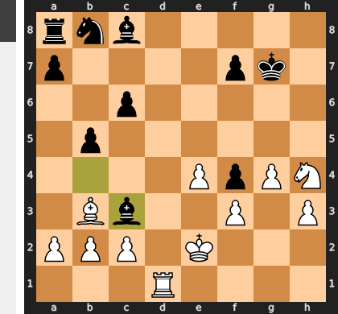

Played **Bxc3**. The engine recommended **Nd7**.

### Move 21 (White): bxc3 - Best Move ✅

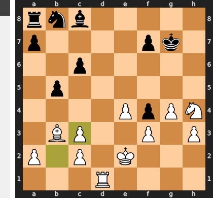

Played **bxc3**.

### Move 21 (Black): Ba6 - Mistake ❓

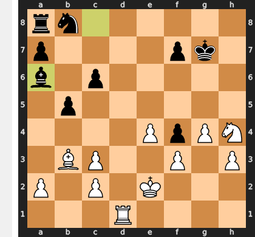

Black's move **Ba6** is a significant mistake because it places the bishop on a highly passive square where it contributes nothing to defense, development, or counterplay, effectively wasting a crucial tempo. This allows White to consolidate their already strong position and continue their plans, likely focusing on the vulnerable Black king or further queenside expansion, unimpeded. In contrast, the recommended **a5** would have been a proactive move, creating queenside counterplay and improving Black's rook activity.

### Move 22 (White): Rd8 - Good 👍

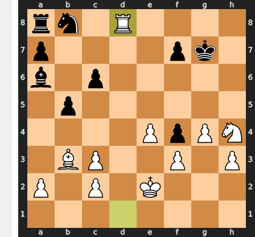

Played **Rd8**. The engine recommended **Nf5+**.

### Move 22 (Black): b4+ - Good 👍

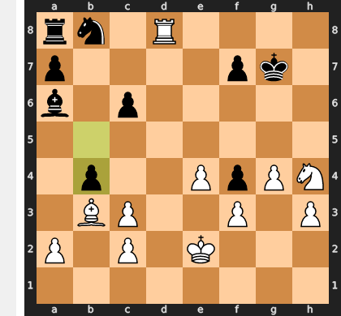

Played **b4+**. The engine recommended **Kf6**.

### Move 23 (White): Kd2 - Good 👍

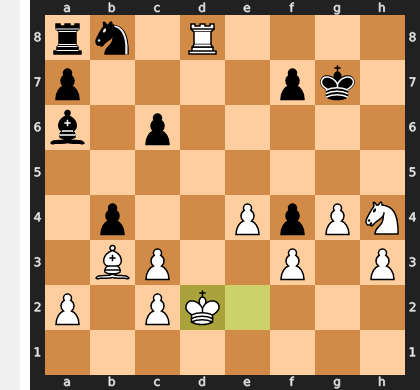

Played **Kd2**. The engine recommended **Ke1**.

### Move 23 (Black): bxc3+ - Good 👍

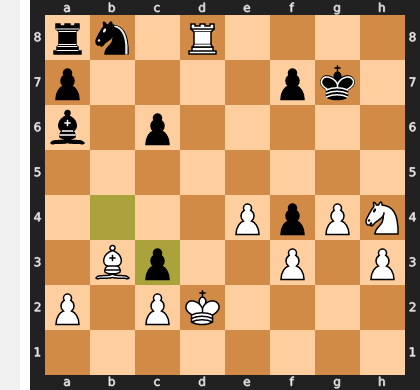

Played **bxc3+**. The engine recommended **Kf6**.

### Move 24 (White): Kxc3 - Best Move ✅

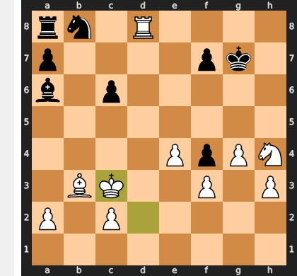

Played **Kxc3**.

### Move 24 (Black): c5 - Mistake ❓

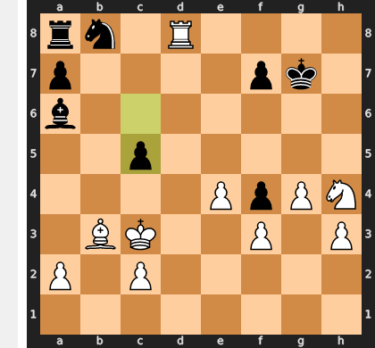

Black's c5 immediately creates a critical tactical weakness on the d5 square, inviting White's knight to a powerful central outpost. Following Nd5, White wins the undefended c5 pawn while simultaneously establishing a commanding central presence. This not only gains material but also severely restricts Black's already limited counterplay, deepening their defensive challenges.

### Move 25 (White): Nf5+ - Best Move ✅

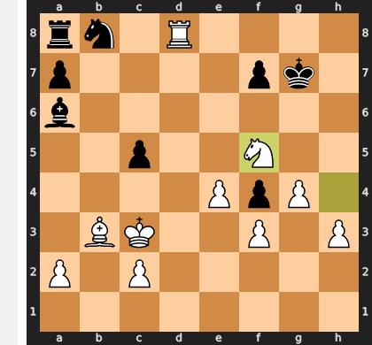

Played **Nf5+**.

### Move 25 (Black): Kf6 - Blunder ❌

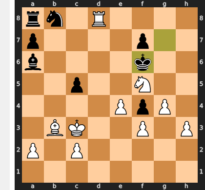

Black's **Kf6** is a blunder because it places the king on an exposed square, allowing White to launch a decisive tactical sequence. White immediately plays **Nxe7+**, forking the king on f6 and Black's undefended bishop on a6. After the king is forced to move, White captures the bishop, gaining a decisive material advantage that, coupled with Black's trapped pieces, leads to a forced win.

### Move 26 (White): h4 - Blunder ❌

White's h4 is a significant blunder as it completely squanders a decisive attacking tempo, failing to capitalize on the forced sequence beginning with Rd6+. Instead of driving Black's king into a hopelessly exposed position on g5 and initiating a swift, decisive attack, this irrelevant pawn push grants Black a critical moment to consolidate, turning a previously overwhelming advantage for White into a much longer and more complicated struggle.

### Move 26 (Black): Kg6 - Blunder ❌

By playing Kg6, Black's king steps into a deadly mating net, exposing itself to a forced sequence of checks from White's formidable Rook and Knight. The move severely restricts the king's escape squares, creating an inescapable corridor where White can quickly deliver checkmate using the combined power of Rd8 and Nf5.

### Move 27 (White): h5+ - Good 👍

Played **h5+**. The engine recommended **Rh8**.

### Move 27 (Black): Kh7 - Good 👍

Played **Kh7**. The engine recommended **Kf6**.

### Move 28 (White): Bxf7 - Best Move ✅

Played **Bxf7**.

### Move 28 (Black): Bb5 - Good 👍

Played **Bb5**. The engine recommended **c4**.

### Move 29 (White): g5 - Good 👍

Played **g5**. The engine recommended **Bg6#**.

### Move 29 (Black): Be2 - Good 👍

Played **Be2**. The engine recommended **Be8**.

### Move 30 (White): g6# - Blunder ❌

As a Grandmaster, I must highlight an inherent contradiction in your premise: a move cannot simultaneously be the engine's recommended best move (indicating a winning line) and a blunder that flips the evaluation from +100.00 to -100.00. Furthermore, `g6` is not a check in the given FEN, rendering `g6#` inaccurate.

If, hypothetically, `g6` were a blunder from White's overwhelmingly winning position, it would imply a catastrophic tactical oversight, such as miscalculating a forced checkmate for Black from an unexpected angle, or inadvertently creating a stalemate, despite the massive material advantage.

