# Chess Game Analysis: Slayerer18 vs kar2on

- **Result:** 0-1
- **Date:** 2026.07.24
- **Opening:** Pirc Defense Classical Variation 4...Bg7 5.Bc4 O O
- **Type:** Rated

### Move 1 (White): e4 - Best Move ✅

Played **e4**.

### Move 1 (Black): d6 - Good 👍

Played **d6**. The engine recommended **e5**.

### Move 2 (White): d4 - Best Move ✅

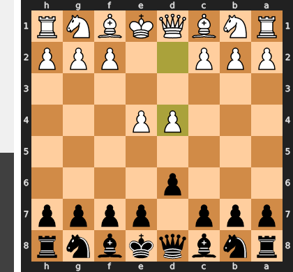

Played **d4**.

### Move 2 (Black): Nf6 - Best Move ✅

Played **Nf6**.

### Move 3 (White): Nc3 - Best Move ✅

Played **Nc3**.

### Move 3 (Black): g6 - Good 👍

Played **g6**. The engine recommended **e5**.

### Move 4 (White): Nf3 - Good 👍

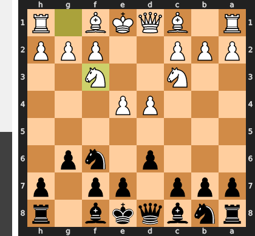

Played **Nf3**. The engine recommended **f4**.

### Move 4 (Black): Bg7 - Best Move ✅

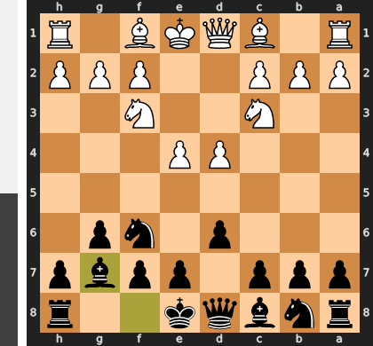

Played **Bg7**.

### Move 5 (White): Bc4 - Good 👍

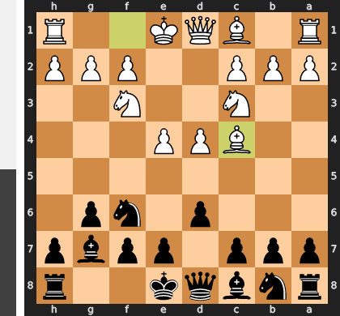

Played **Bc4**. The engine recommended **Be3**.

### Move 5 (Black): O-O - Best Move ✅

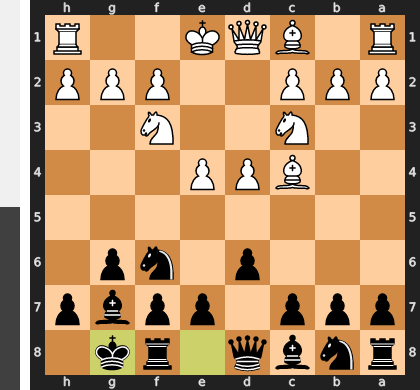

Played **O-O**.

### Move 6 (White): e5 - Inaccuracy ⁈

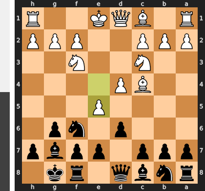

Played **e5**. The engine recommended **O-O**.

### Move 6 (Black): dxe5 - Best Move ✅

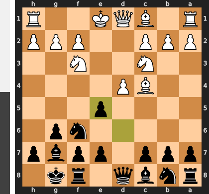

Played **dxe5**.

### Move 7 (White): Nxe5 - Best Move ✅

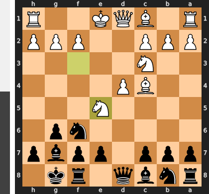

Played **Nxe5**.

### Move 7 (Black): Be6 - Mistake ❓

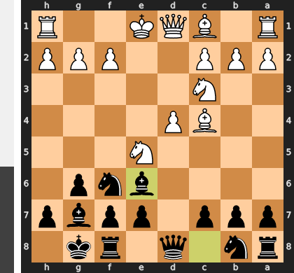

Error getting deep commentary: No API key was provided. Please pass a valid API key. Learn how to create an API key at https://ai.google.dev/gemini-api/docs/api-key.

### Move 8 (White): Bxe6 - Best Move ✅

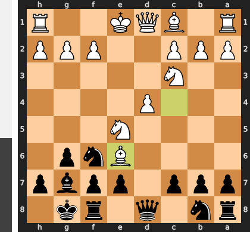

Played **Bxe6**.

### Move 8 (Black): fxe6 - Best Move ✅

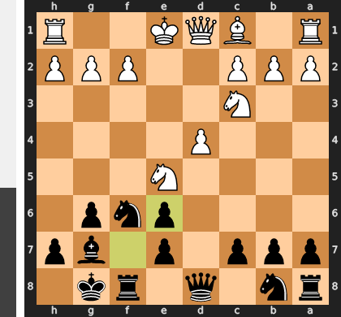

Played **fxe6**.

### Move 9 (White): O-O - Best Move ✅

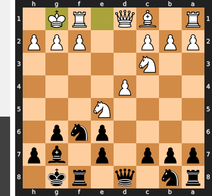

Played **O-O**.

### Move 9 (Black): Nd5 - Good 👍

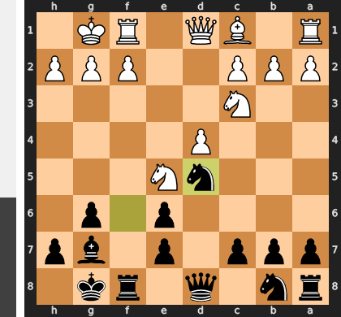

Played **Nd5**. The engine recommended **c5**.

### Move 10 (White): Nxd5 - Inaccuracy ⁈

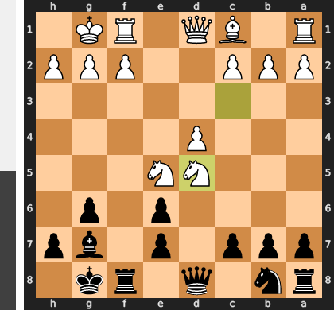

Played **Nxd5**. The engine recommended **Ne4**.

### Move 10 (Black): exd5 - Good 👍

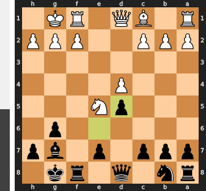

Played **exd5**. The engine recommended **Qxd5**.

### Move 11 (White): Ng4 - Good 👍

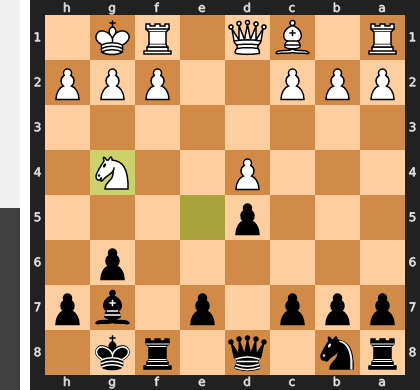

Played **Ng4**. The engine recommended **Re1**.

### Move 11 (Black): Nc6 - Good 👍

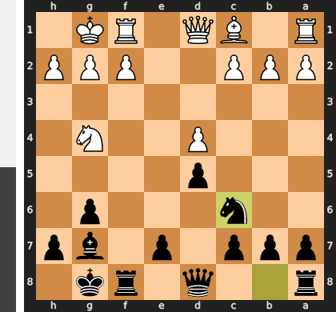

Played **Nc6**. The engine recommended **h5**.

### Move 12 (White): c3 - Best Move ✅

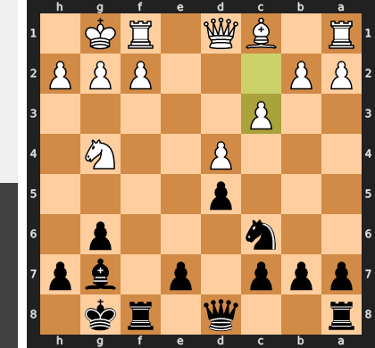

Played **c3**.

### Move 12 (Black): e5 - Good 👍

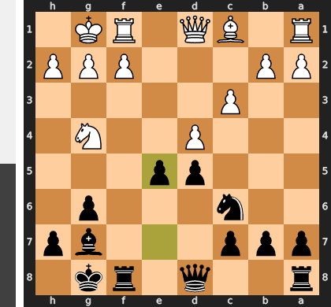

Played **e5**. The engine recommended **h5**.

### Move 13 (White): Bh6 - Mistake ❓

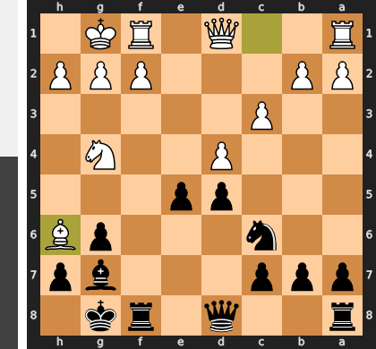

Error getting deep commentary: No API key was provided. Please pass a valid API key. Learn how to create an API key at https://ai.google.dev/gemini-api/docs/api-key.

### Move 13 (Black): exd4 - Good 👍

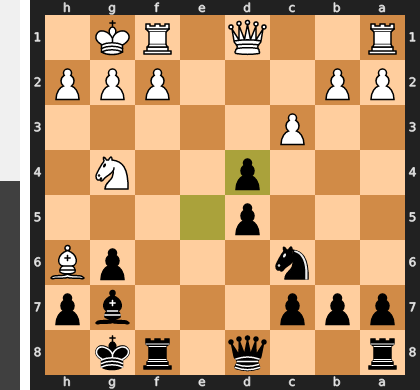

Played **exd4**. The engine recommended **Bxh6**.

### Move 14 (White): Bxg7 - Best Move ✅

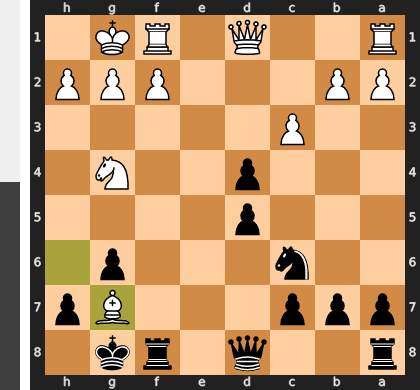

Played **Bxg7**.

### Move 14 (Black): Kxg7 - Best Move ✅

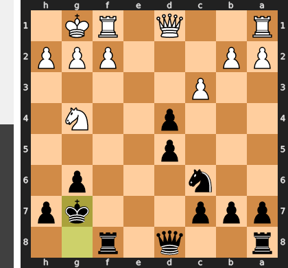

Played **Kxg7**.

### Move 15 (White): cxd4 - Best Move ✅

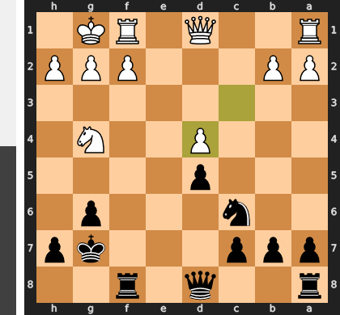

Played **cxd4**.

### Move 15 (Black): Qg5 - Good 👍

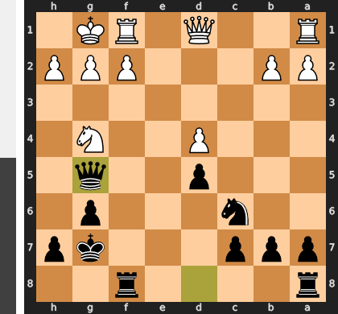

Played **Qg5**. The engine recommended **Rf4**.

### Move 16 (White): Ne5 - Mistake ❓

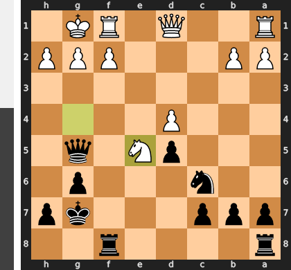

Error getting deep commentary: No API key was provided. Please pass a valid API key. Learn how to create an API key at https://ai.google.dev/gemini-api/docs/api-key.

### Move 16 (Black): Nxe5 - Best Move ✅

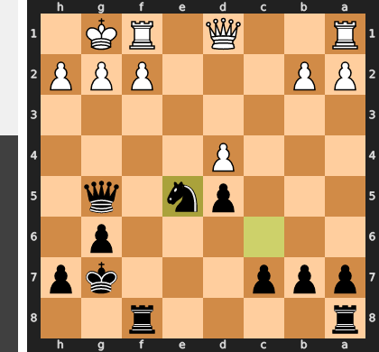

Played **Nxe5**.

### Move 17 (White): dxe5 - Best Move ✅

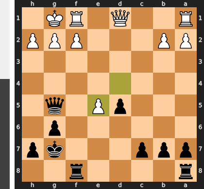

Played **dxe5**.

### Move 17 (Black): Qxe5 - Best Move ✅

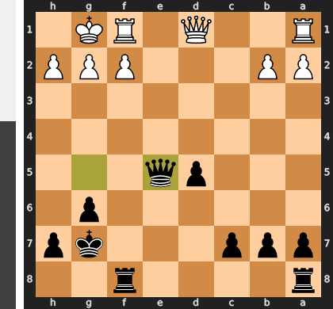

Played **Qxe5**.

### Move 18 (White): Re1 - Good 👍

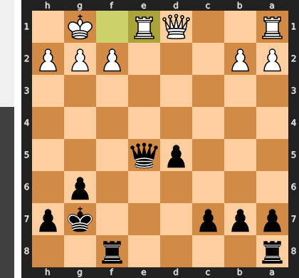

Played **Re1**. The engine recommended **Qd2**.

### Move 18 (Black): Qxb2 - Best Move ✅

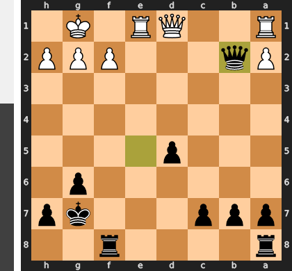

Played **Qxb2**.

### Move 19 (White): Re7+ - Inaccuracy ⁈

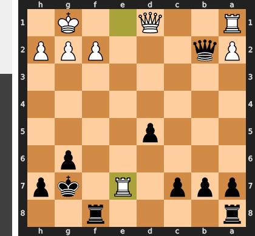

Played **Re7+**. The engine recommended **Re2**.

### Move 19 (Black): Kg8 - Mistake ❓

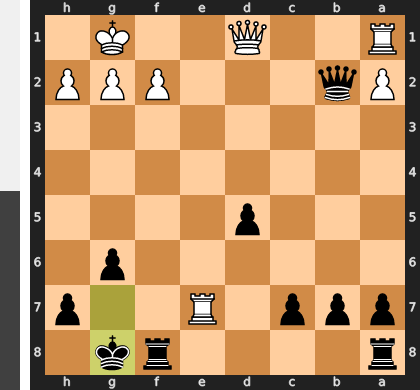

Error getting deep commentary: No API key was provided. Please pass a valid API key. Learn how to create an API key at https://ai.google.dev/gemini-api/docs/api-key.

### Move 20 (White): Qxd5+ - Best Move ✅

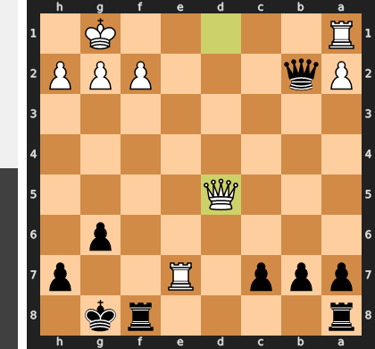

Played **Qxd5+**.

### Move 20 (Black): Kh8 - Best Move ✅

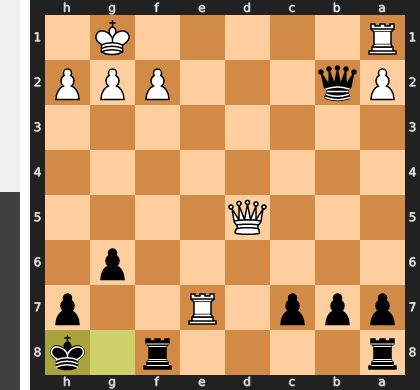

Played **Kh8**.

### Move 21 (White): Rae1 - Blunder ❌

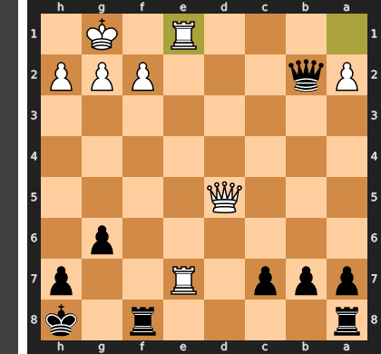

Error getting deep commentary: No API key was provided. Please pass a valid API key. Learn how to create an API key at https://ai.google.dev/gemini-api/docs/api-key.

### Move 21 (Black): Qxf2+ - Best Move ✅

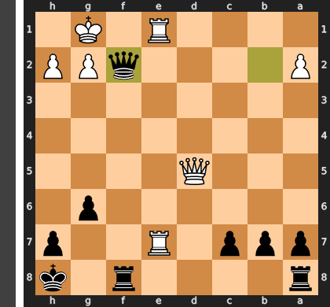

Played **Qxf2+**.

### Move 22 (White): Kh1 - Best Move ✅

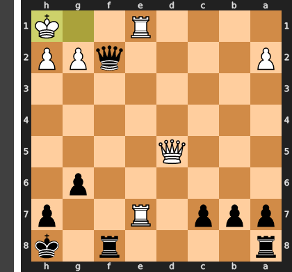

Played **Kh1**.

### Move 22 (Black): Qf1+ - Best Move ✅

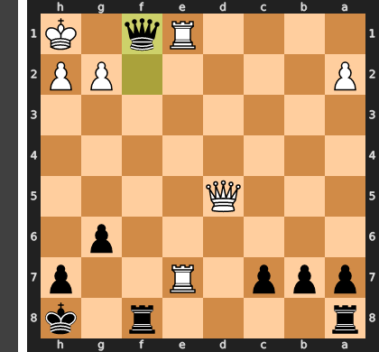

Played **Qf1+**.

### Move 23 (White): Rxf1 - Best Move ✅

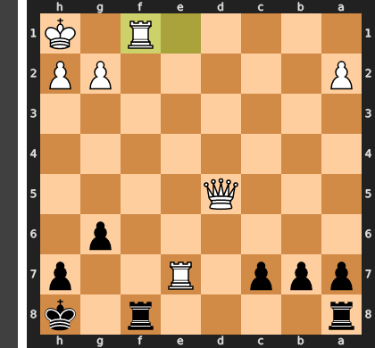

Played **Rxf1**.

### Move 23 (Black): Rxf1# - Best Move ✅

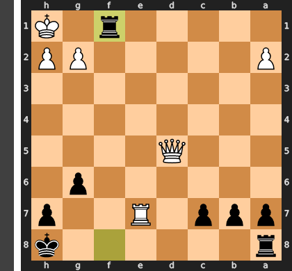

Played **Rxf1#**.

