# Chess Game Analysis: kar2on vs Chandrakumar2

- **Result:** 1-0
- **Date:** 2026.07.24
- **Opening:** Giuoco Piano Game Giuoco Pianissimo Italian Four Knights Variation 5...h6
- **Type:** Rated

### Move 1 (White): e4 - Best Move ✅

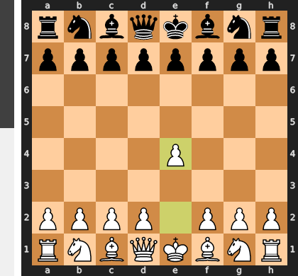

Played **e4**.

### Move 1 (Black): e5 - Best Move ✅

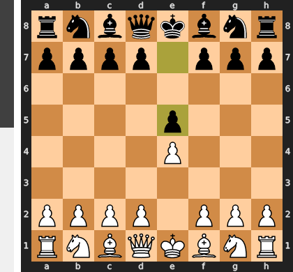

Played **e5**.

### Move 2 (White): Nf3 - Best Move ✅

Played **Nf3**.

### Move 2 (Black): Nf6 - Good 👍

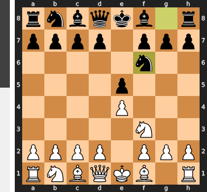

Played **Nf6**. The engine recommended **Nc6**.

### Move 3 (White): Nc3 - Good 👍

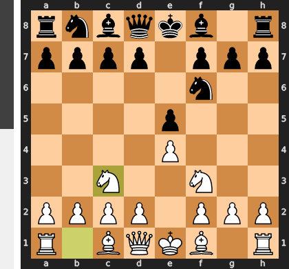

Played **Nc3**. The engine recommended **Nxe5**.

### Move 3 (Black): Nc6 - Best Move ✅

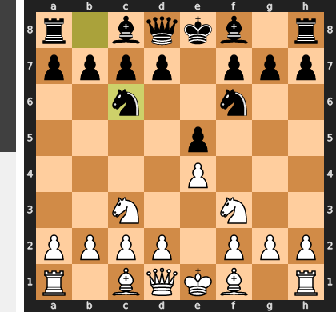

Played **Nc6**.

### Move 4 (White): Bc4 - Good 👍

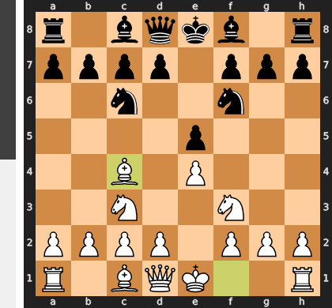

Played **Bc4**. The engine recommended **Bb5**.

### Move 4 (Black): h6 - Inaccuracy ⁈

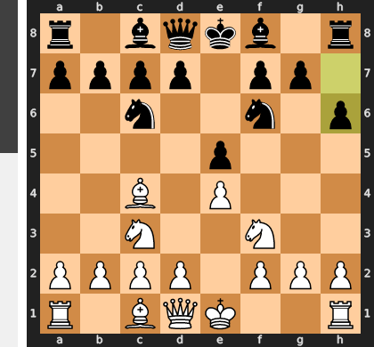

Played **h6**. The engine recommended **Nxe4**.

### Move 5 (White): d3 - Good 👍

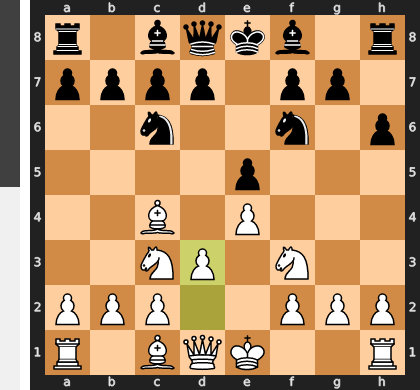

Played **d3**. The engine recommended **d4**.

### Move 5 (Black): Bc5 - Best Move ✅

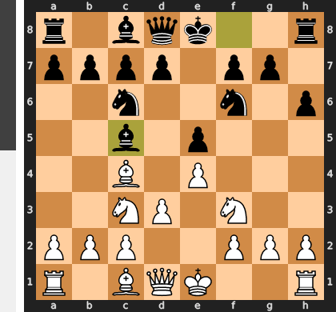

Played **Bc5**.

### Move 6 (White): O-O - Good 👍

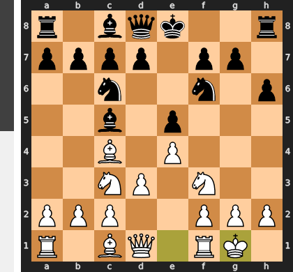

Played **O-O**. The engine recommended **Be3**.

### Move 6 (Black): d6 - Good 👍

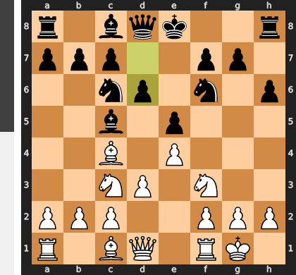

Played **d6**. The engine recommended **O-O**.

### Move 7 (White): Na4 - Best Move ✅

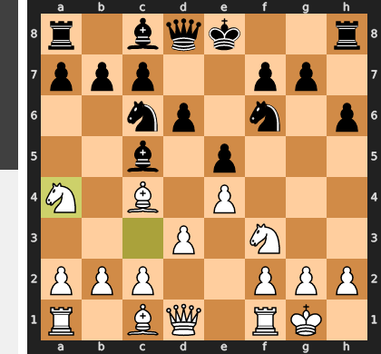

Played **Na4**.

### Move 7 (Black): Bb6 - Best Move ✅

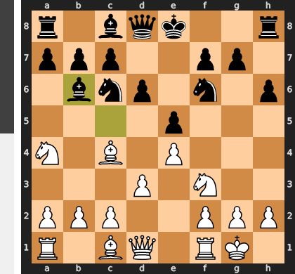

Played **Bb6**.

### Move 8 (White): Nxb6 - Good 👍

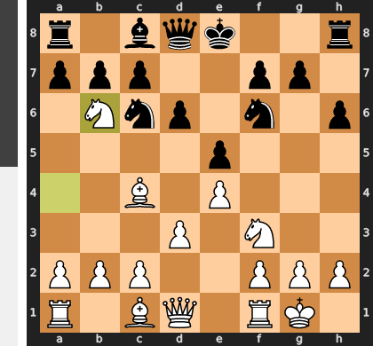

Played **Nxb6**. The engine recommended **c3**.

### Move 8 (Black): axb6 - Best Move ✅

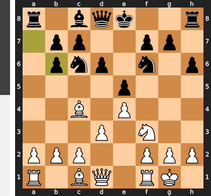

Played **axb6**.

### Move 9 (White): a3 - Good 👍

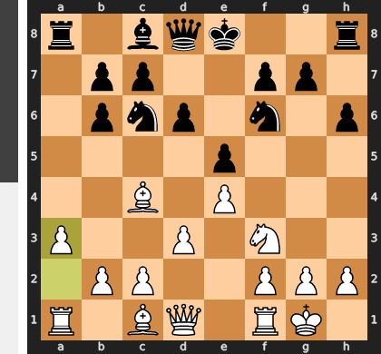

Played **a3**. The engine recommended **c3**.

### Move 9 (Black): Ng4 - Inaccuracy ⁈

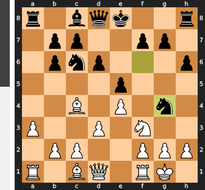

Played **Ng4**. The engine recommended **Bg4**.

### Move 10 (White): h3 - Best Move ✅

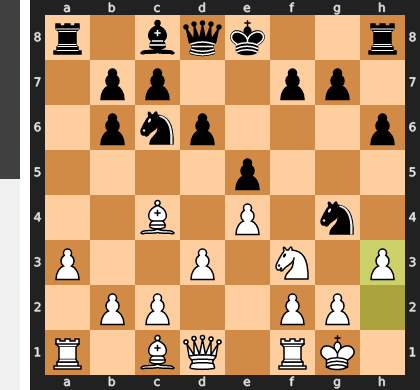

Played **h3**.

### Move 10 (Black): Nf6 - Best Move ✅

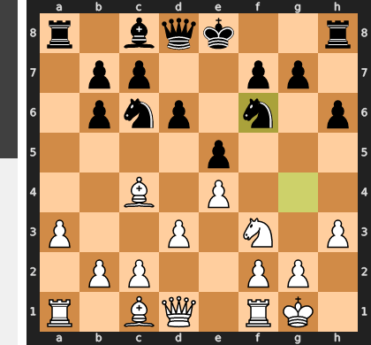

Played **Nf6**.

### Move 11 (White): d4 - Best Move ✅

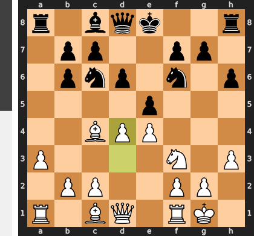

Played **d4**.

### Move 11 (Black): Nxd4 - Good 👍

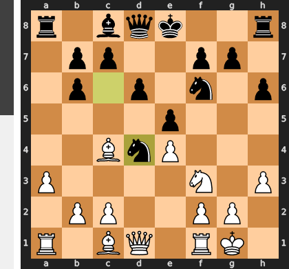

Played **Nxd4**. The engine recommended **O-O**.

### Move 12 (White): Nxd4 - Best Move ✅

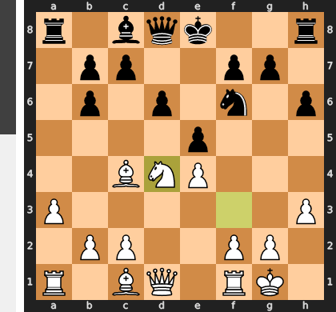

Played **Nxd4**.

### Move 12 (Black): exd4 - Best Move ✅

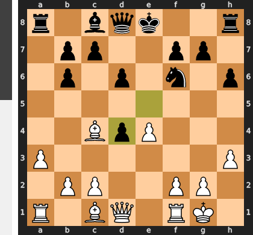

Played **exd4**.

### Move 13 (White): Qxd4 - Best Move ✅

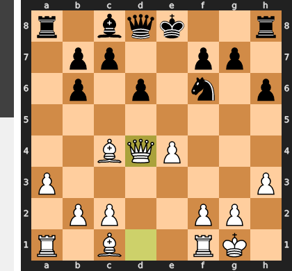

Played **Qxd4**.

### Move 13 (Black): h5 - Mistake ❓

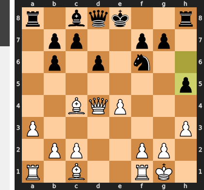

Black's h5 is a critical mistake as it dangerously weakens the kingside pawns around the still-uncastled king, creating potential targets and opening lines without any compensatory development. This move squanders a crucial tempo that should have been spent on securing the king with O-O or developing the remaining major pieces, leaving Black's king highly exposed to White's already active queen and bishop.

### Move 14 (White): Bg5 - Best Move ✅

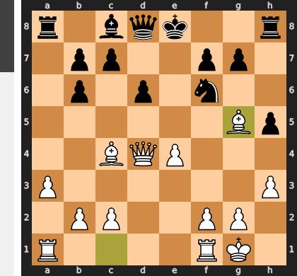

Played **Bg5**.

