# Chess Game Analysis: ShadowborN_R vs kar2on

- **Result:** 1-0
- **Date:** 2026.07.24
- **Opening:** Pirc Defense Modern Defense Geller System 2...Nf6
- **Type:** Rated

### Move 1 (White): e4 - Best Move ✅

Played **e4**.

### Move 1 (Black): d6 - Good 👍

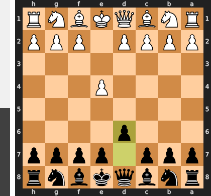

Played **d6**. The engine recommended **e5**.

### Move 2 (White): Nf3 - Good 👍

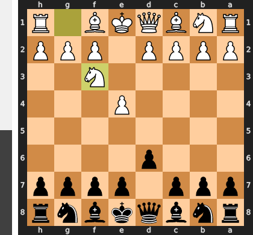

Played **Nf3**. The engine recommended **d4**.

### Move 2 (Black): Nf6 - Best Move ✅

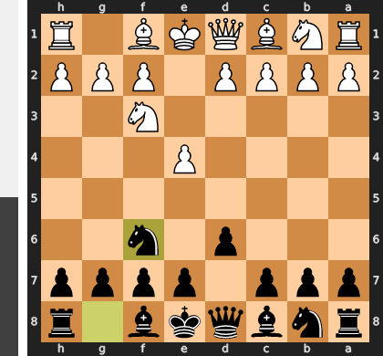

Played **Nf6**.

### Move 3 (White): Bc4 - Mistake ❓

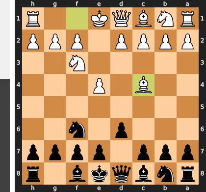

Error getting deep commentary: 404 NOT_FOUND. {'error': {'code': 404, 'message': 'This model models/gemini-2.5-pro is no longer available to new users. Please update your code to use a newer model for the latest features and improvements.', 'status': 'NOT_FOUND'}}

### Move 3 (Black): g6 - Mistake ❓

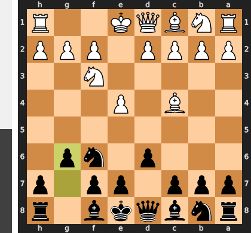

Error getting deep commentary: 404 NOT_FOUND. {'error': {'code': 404, 'message': 'This model models/gemini-2.5-pro is no longer available to new users. Please update your code to use a newer model for the latest features and improvements.', 'status': 'NOT_FOUND'}}

### Move 4 (White): Nc3 - Good 👍

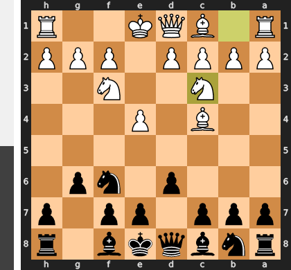

Played **Nc3**. The engine recommended **e5**.

### Move 4 (Black): Bg7 - Best Move ✅

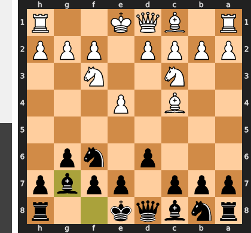

Played **Bg7**.

### Move 5 (White): e5 - Inaccuracy ⁈

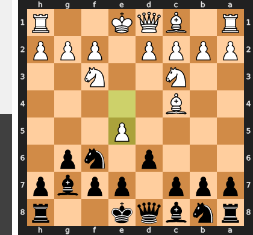

Played **e5**. The engine recommended **d4**.

### Move 5 (Black): dxe5 - Best Move ✅

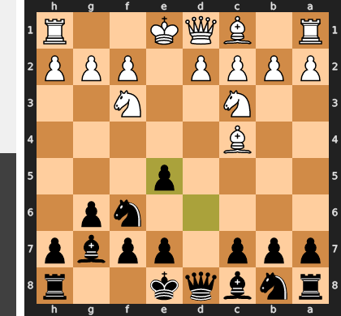

Played **dxe5**.

### Move 6 (White): Nxe5 - Best Move ✅

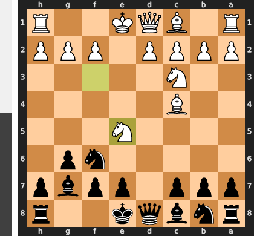

Played **Nxe5**.

### Move 6 (Black): O-O - Best Move ✅

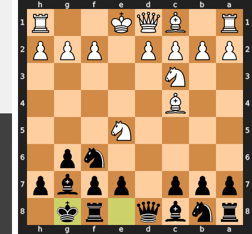

Played **O-O**.

### Move 7 (White): d4 - Best Move ✅

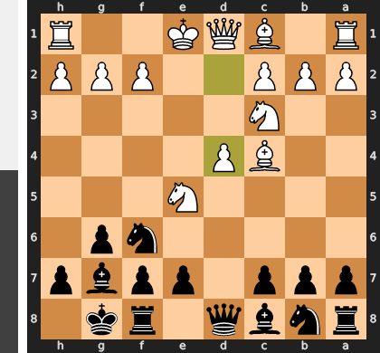

Played **d4**.

### Move 7 (Black): Nbd7 - Good 👍

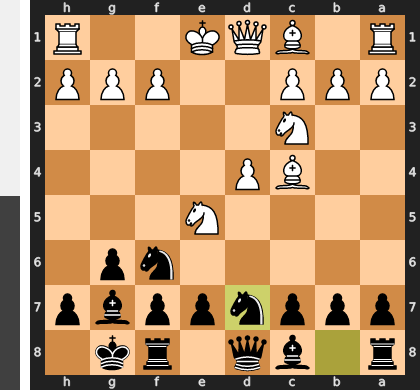

Played **Nbd7**. The engine recommended **Nfd7**.

### Move 8 (White): Nxf7 - Mistake ❓

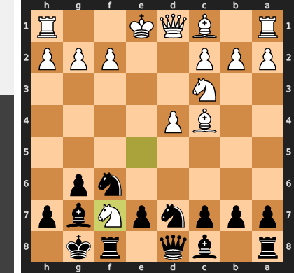

Error getting deep commentary: 404 NOT_FOUND. {'error': {'code': 404, 'message': 'This model models/gemini-2.5-pro is no longer available to new users. Please update your code to use a newer model for the latest features and improvements.', 'status': 'NOT_FOUND'}}

### Move 8 (Black): Rxf7 - Best Move ✅

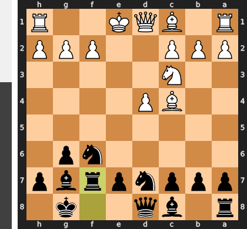

Played **Rxf7**.

### Move 9 (White): Bxf7+ - Best Move ✅

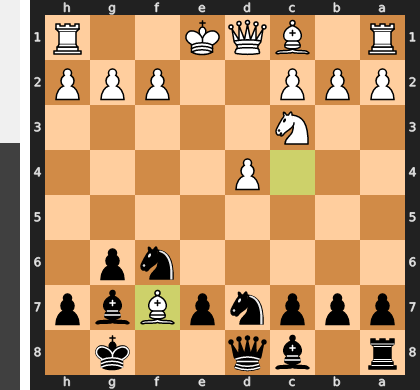

Played **Bxf7+**.

### Move 9 (Black): Kxf7 - Best Move ✅

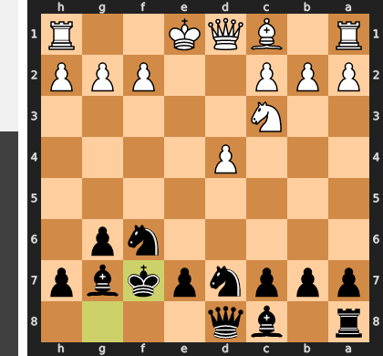

Played **Kxf7**.

### Move 10 (White): O-O - Best Move ✅

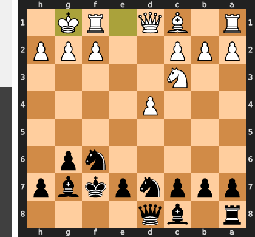

Played **O-O**.

### Move 10 (Black): b6 - Good 👍

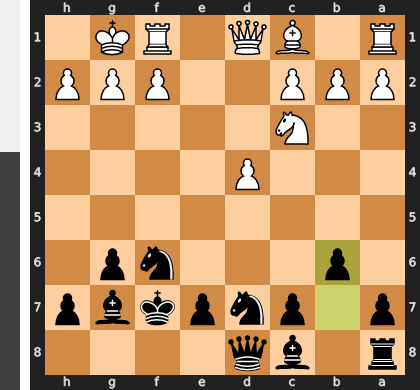

Played **b6**. The engine recommended **Nf8**.

### Move 11 (White): Qe2 - Good 👍

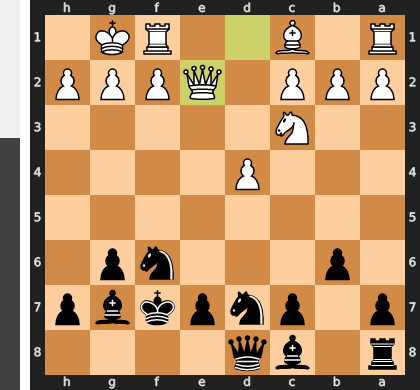

Played **Qe2**. The engine recommended **Qf3**.

### Move 11 (Black): Bb7 - Good 👍

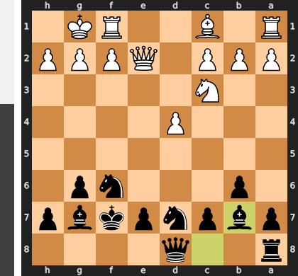

Played **Bb7**. The engine recommended **Nf8**.

### Move 12 (White): Bg5 - Good 👍

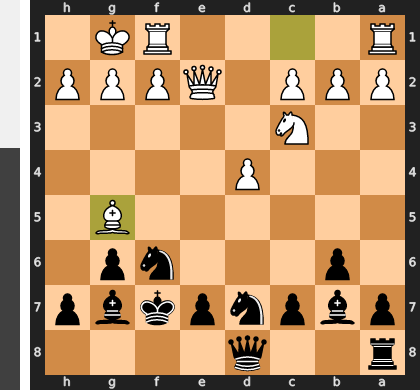

Played **Bg5**. The engine recommended **Re1**.

### Move 12 (Black): c5 - Inaccuracy ⁈

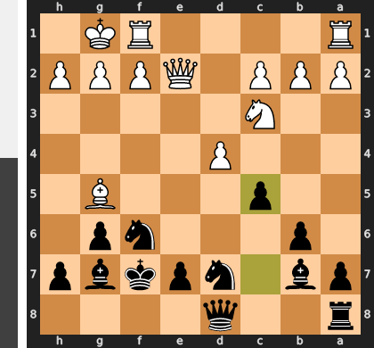

Played **c5**. The engine recommended **Nf8**.

### Move 13 (White): d5 - Good 👍

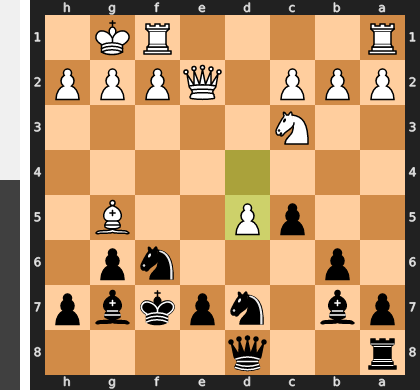

Played **d5**. The engine recommended **Rad1**.

### Move 13 (Black): Nxd5 - Mistake ❓

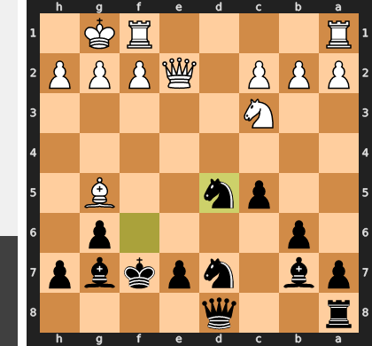

Error getting deep commentary: 404 NOT_FOUND. {'error': {'code': 404, 'message': 'This model models/gemini-2.5-pro is no longer available to new users. Please update your code to use a newer model for the latest features and improvements.', 'status': 'NOT_FOUND'}}

### Move 14 (White): Qf3+ - Blunder ❌

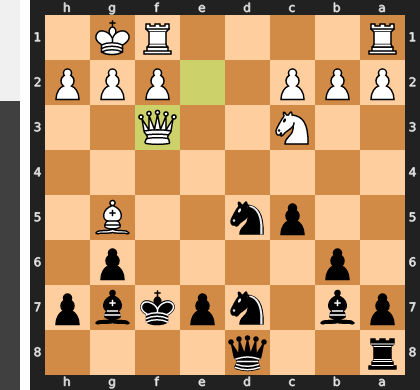

Error getting deep commentary: 404 NOT_FOUND. {'error': {'code': 404, 'message': 'This model models/gemini-2.5-pro is no longer available to new users. Please update your code to use a newer model for the latest features and improvements.', 'status': 'NOT_FOUND'}}

### Move 14 (Black): N7f6 - Best Move ✅

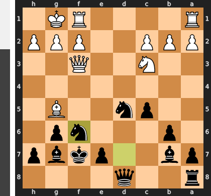

Played **N7f6**.

### Move 15 (White): Rad1 - Good 👍

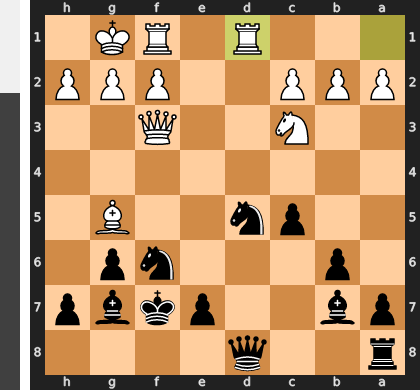

Played **Rad1**. The engine recommended **Bxf6**.

### Move 15 (Black): e6 - Mistake ❓

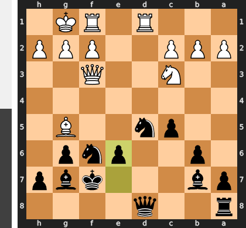

Error getting deep commentary: 404 NOT_FOUND. {'error': {'code': 404, 'message': 'This model models/gemini-2.5-pro is no longer available to new users. Please update your code to use a newer model for the latest features and improvements.', 'status': 'NOT_FOUND'}}

### Move 16 (White): Bxf6 - Mistake ❓

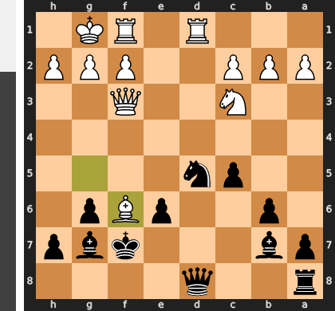

Error getting deep commentary: 404 NOT_FOUND. {'error': {'code': 404, 'message': 'This model models/gemini-2.5-pro is no longer available to new users. Please update your code to use a newer model for the latest features and improvements.', 'status': 'NOT_FOUND'}}

### Move 16 (Black): Bxf6 - Mistake ❓

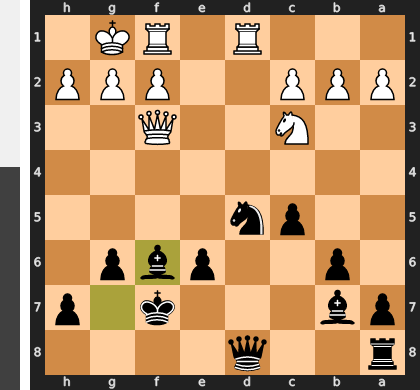

Error getting deep commentary: 404 NOT_FOUND. {'error': {'code': 404, 'message': 'This model models/gemini-2.5-pro is no longer available to new users. Please update your code to use a newer model for the latest features and improvements.', 'status': 'NOT_FOUND'}}

### Move 17 (White): Nxd5 - Mistake ❓

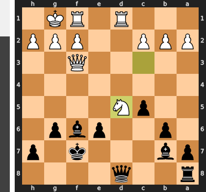

Error getting deep commentary: 404 NOT_FOUND. {'error': {'code': 404, 'message': 'This model models/gemini-2.5-pro is no longer available to new users. Please update your code to use a newer model for the latest features and improvements.', 'status': 'NOT_FOUND'}}

### Move 17 (Black): Bxd5 - Good 👍

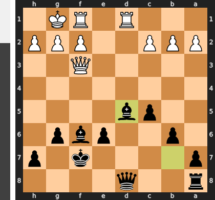

Played **Bxd5**. The engine recommended **exd5**.

### Move 18 (White): Qh3 - Best Move ✅

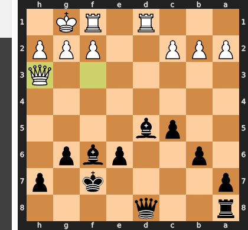

Played **Qh3**.

### Move 18 (Black): Kg7 - Blunder ❌

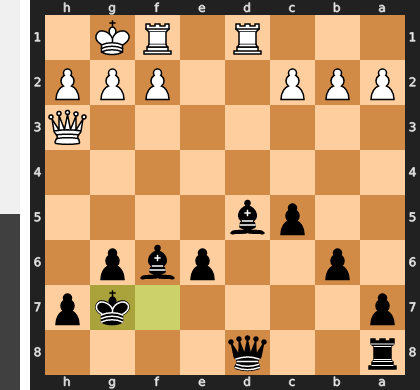

Error getting deep commentary: 404 NOT_FOUND. {'error': {'code': 404, 'message': 'This model models/gemini-2.5-pro is no longer available to new users. Please update your code to use a newer model for the latest features and improvements.', 'status': 'NOT_FOUND'}}

### Move 19 (White): c4 - Best Move ✅

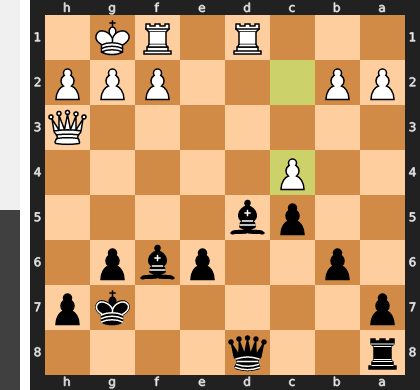

Played **c4**.

