# Chess Game Analysis: kar2on vs PKRAO1975

- **Result:** 0-1
- **Date:** 2026.07.31
- **Opening:** Kings Pawn Opening
- **Type:** Casual (Unrated)

### Move 1 (White): e4 - Best Move ✅

Played **e4**.

### Move 1 (Black): f6 - Mistake ❓

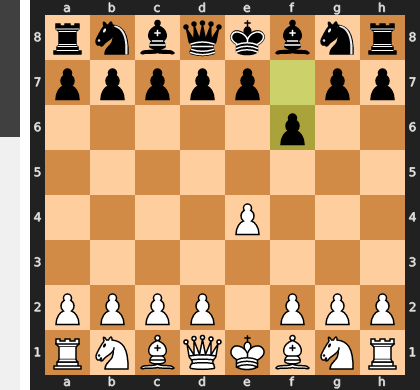

Playing 1...f6 is a serious positional concession because it deprives the king's knight of its most natural developing square while failing to contest White's imminent central expansion with d4. Furthermore, this move permanently weakens the critical h5-e8 diagonal, creating early tactical vulnerabilities around the black king that will severely hinder development and castling safety for the rest of the opening.

### Move 2 (White): Nf3 - Good 👍

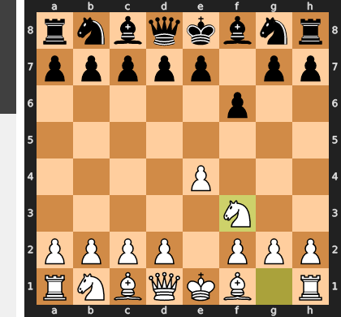

Played **Nf3**. The engine recommended **d4**.

### Move 2 (Black): c6 - Good 👍

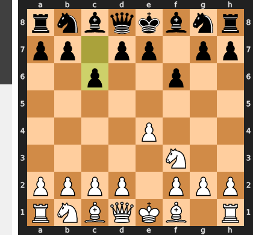

Played **c6**. The engine recommended **Nh6**.

### Move 3 (White): Bc4 - Inaccuracy ⁈

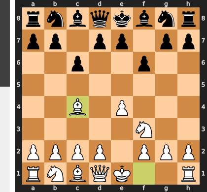

Played **Bc4**. The engine recommended **d4**.

### Move 3 (Black): e6 - Inaccuracy ⁈

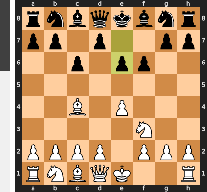

Played **e6**. The engine recommended **d5**.

### Move 4 (White): Nc3 - Inaccuracy ⁈

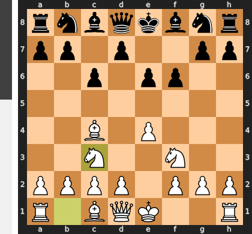

Played **Nc3**. The engine recommended **d4**.

### Move 4 (Black): Bd6 - Inaccuracy ⁈

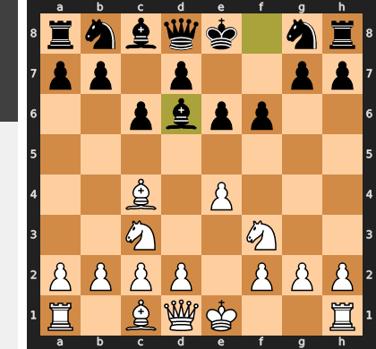

Played **Bd6**. The engine recommended **d5**.

### Move 5 (White): d3 - Inaccuracy ⁈

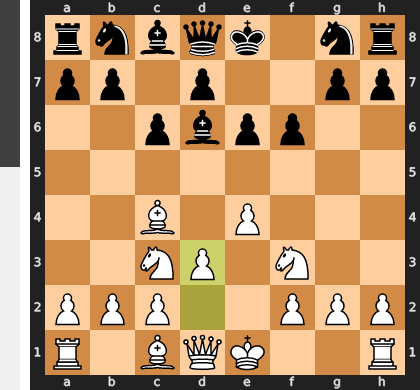

Played **d3**. The engine recommended **d4**.

### Move 5 (Black): Bc7 - Best Move ✅

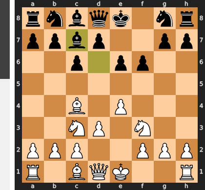

Played **Bc7**.

### Move 6 (White): O-O - Good 👍

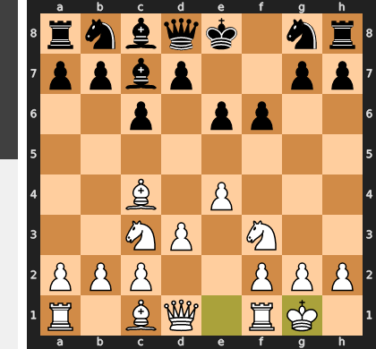

Played **O-O**. The engine recommended **d4**.

### Move 6 (Black): d5 - Best Move ✅

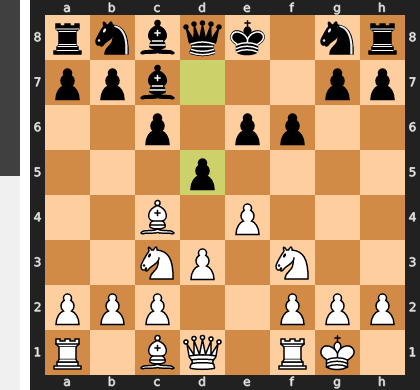

Played **d5**.

### Move 7 (White): exd5 - Good 👍

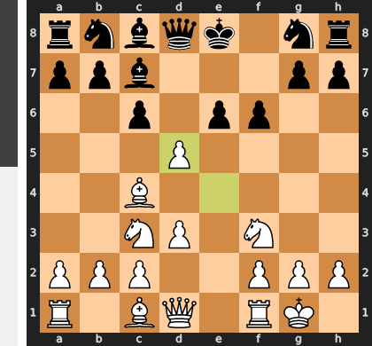

Played **exd5**. The engine recommended **Bb3**.

### Move 7 (Black): Qd6 - Blunder ❌

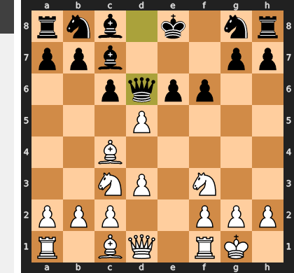

By playing ...Qd6 instead of neutralizing the central pressure with the necessary ...exd5, Black leaves the e6-pawn terminally weak and fails to address the vulnerability of their uncastled king. After the straightforward dxe6, recapturing with ...Bxe6 immediately runs into Re1, exploiting a fatal pin along the newly opened e-file, while ignoring the pawn leaves a crippling white wedge that suffocates Black's entire development.

### Move 8 (White): g3 - Blunder ❌

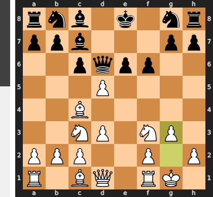

Instead of violently opening the center with `dxe6` to exploit Black’s uncastled king and fragile pawn structure, `g3` is a fatally passive move that completely misreads the dynamic urgency of the position. This quiet pawn push releases all the central tension, giving Black a vital tempo to stabilize their center—likely resolving the crisis with ...exd5—and safely castle their king out of danger. In sharp middlegames with a stranded enemy king, hesitating with slow defensive moves is a cardinal sin that instantly squanders a winning initiative.

### Move 8 (Black): exd5 - Inaccuracy ⁈

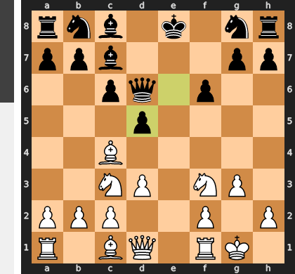

Played **exd5**. The engine recommended **cxd5**.

### Move 9 (White): Bb3 - Inaccuracy ⁈

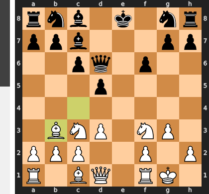

Played **Bb3**. The engine recommended **Re1+**.

### Move 9 (Black): Bg4 - Inaccuracy ⁈

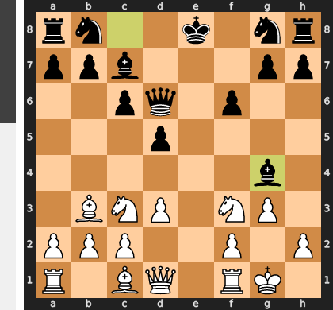

Played **Bg4**. The engine recommended **Ne7**.

### Move 10 (White): Bf4 - Best Move ✅

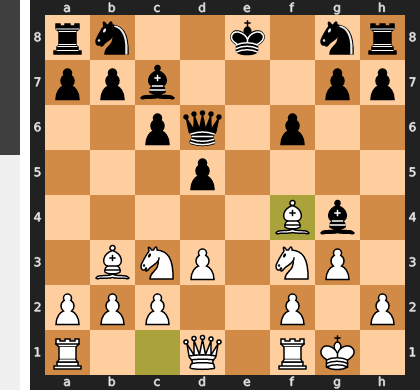

Played **Bf4**.

### Move 10 (Black): Qd7 - Best Move ✅

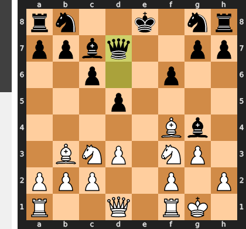

Played **Qd7**.

### Move 11 (White): Qe2+ - Inaccuracy ⁈

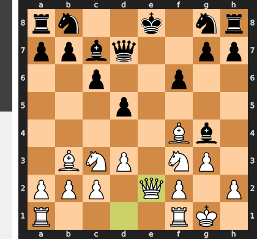

Played **Qe2+**. The engine recommended **Bxc7**.

### Move 11 (Black): Ne7 - Best Move ✅

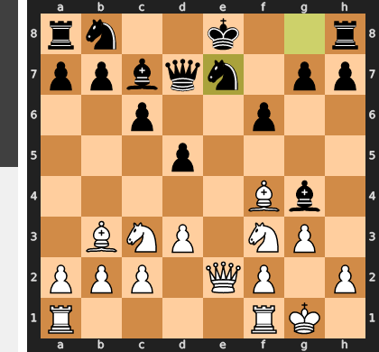

Played **Ne7**.

### Move 12 (White): Bxc7 - Best Move ✅

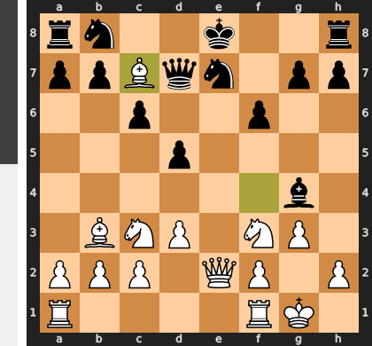

Played **Bxc7**.

### Move 12 (Black): Qxc7 - Best Move ✅

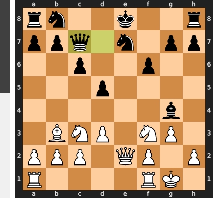

Played **Qxc7**.

### Move 13 (White): Rae1 - Good 👍

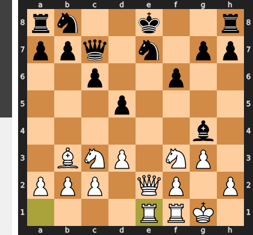

Played **Rae1**. The engine recommended **Rfe1**.

### Move 13 (Black): O-O - Mistake ❓

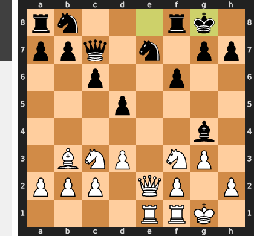

By castling, Black walked directly into a devastating self-pin along the a2–g8 diagonal, turning the d5-pawn into a tactical liability against White's powerful light-squared bishop. This allows White to liquidate with `Qxe7!`, where after the trade of queens, `Re3` traps the black bishop because any retreat is met by the crushing `Nxd5!` breakthrough. Guarding the vulnerable knight with `Qd7` was essential to keep Black's position unified and the king safely off this fatal diagonal.

### Move 14 (White): Kg2 - Mistake ❓

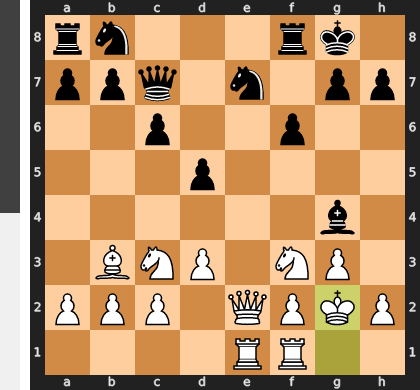

By playing `Kg2`, you missed a glaring tactical oversight by Black: the e7-knight was critically overloaded and attacked twice along the e-file, meaning `Qxe7` would have immediately netted a clean piece and a winning endgame. Instead, this passive king safety move completely lets Black off the hook and leaves your own f3-knight uncomfortably pinned. By failing to cash in on the material, you have allowed Black to untangle their pieces and seize the positional initiative.

### Move 14 (Black): Nf5 - Good 👍

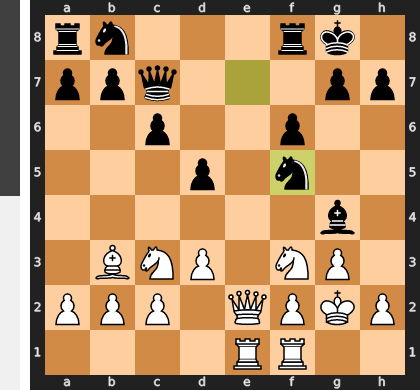

Played **Nf5**. The engine recommended **Re8**.

### Move 15 (White): h3 - Mistake ❓

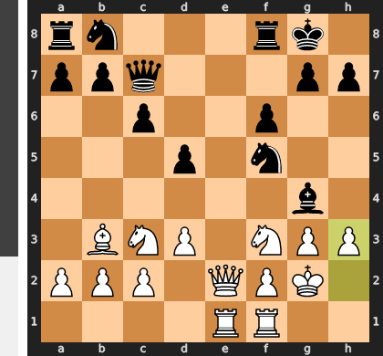

The move `h3` is a severe tactical oversight because it actively provokes the devastating reply `...Bxf3+`, which White cannot safely recapture. Taking with the king loses the queen immediately to the royal fork on `d4`, while recapturing with the queen allows `...Nd4` with a winning tempo, forcing the trade of White's key defensive light-squared bishop. This sequence completely dismantles White's minor piece coordination, leaving their king terminally exposed on the weakened light squares.

### Move 15 (Black): Bh5 - Blunder ❌

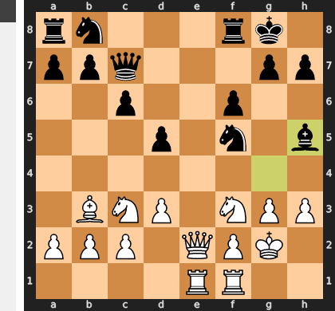

By moving the bishop to h5, Black fatally abandons the defense of the f5-knight, allowing White to immediately win a piece with the devastating intermediate check **1. Qe6+ Bf7 2. Qxf5**. 

Instead of this self-destructive retreat, the recommended **...Nd4** would have seized the initiative by centralizing the knight with a tempo on White's queen, maintaining Black's dominant positional grip.

### Move 16 (White): g4 - Mistake ❓

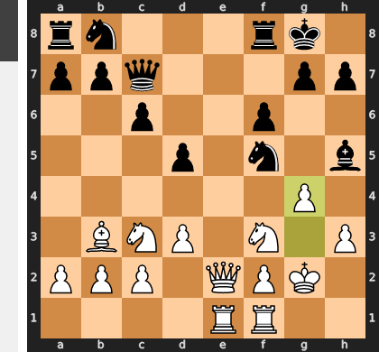

Instead of the clinical `Qe6+`—which cleanly nets the f5-knight while maintaining absolute positional control—`g4` is an impatient pawn thrust that seriously compromises your own king safety. By creating permanent light-square weaknesses around your king, you hand Black active counterplay, specifically allowing them to disrupt your coordination and seize the e-file with tempo via `...Re8`. In winning positions, always prioritize safety and restriction over hasty pawn storms that only grant a dying opponent tactical oxygen.

### Move 16 (Black): Bxg4 - Inaccuracy ⁈

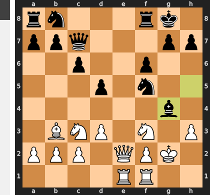

Played **Bxg4**. The engine recommended **Nd7**.

### Move 17 (White): hxg4 - Best Move ✅

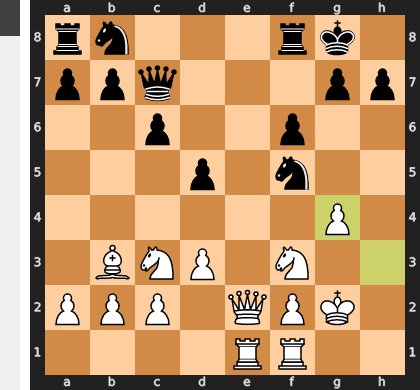

Played **hxg4**.

### Move 17 (Black): Nh6 - Best Move ✅

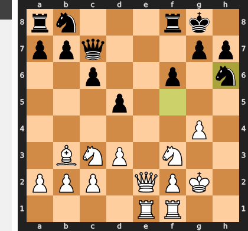

Played **Nh6**.

### Move 18 (White): Qe6+ - Inaccuracy ⁈

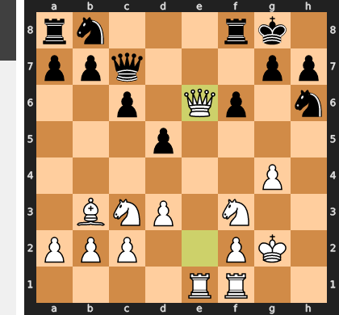

Played **Qe6+**. The engine recommended **Nd4**.

### Move 18 (Black): Kh8 - Best Move ✅

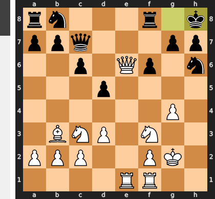

Played **Kh8**.

### Move 19 (White): Qe7 - Good 👍

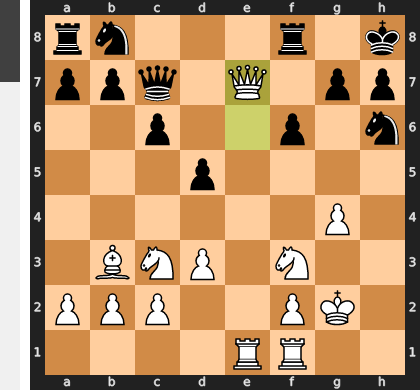

Played **Qe7**. The engine recommended **Rh1**.

### Move 19 (Black): Nd7 - Best Move ✅

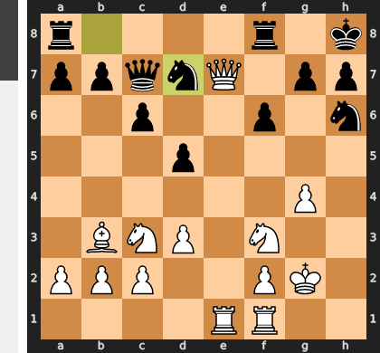

Played **Nd7**.

### Move 20 (White): Na4 - Inaccuracy ⁈

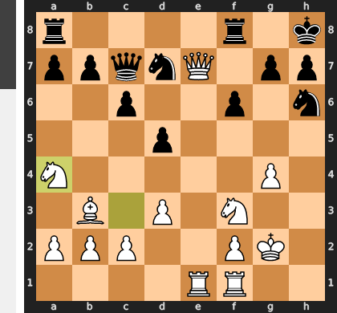

Played **Na4**. The engine recommended **Nh2**.

### Move 20 (Black): Rae8 - Good 👍

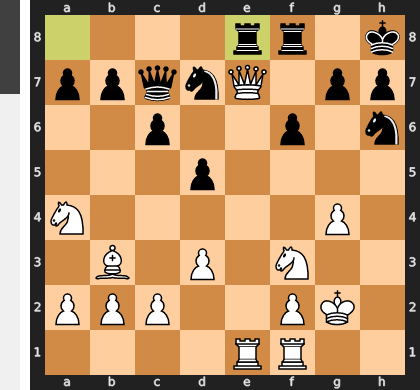

Played **Rae8**. The engine recommended **Rf7**.

### Move 21 (White): Qb4 - Mistake ❓

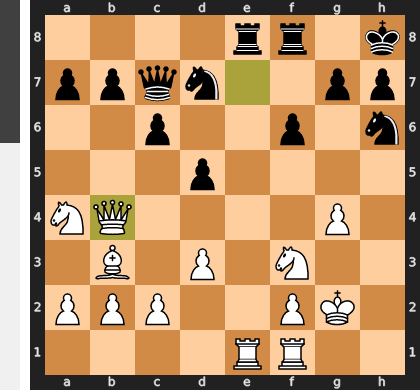

Instead of seizing a decisive advantage, **Qb4** misplaces the queen on the queenside periphery, allowing Black to consolidate their double-rook pressure on the e-file and exploit your loosened kingside structure. 

The recommended **Qxe8** was a winning tactical liquidation that nets two rooks for the queen (via *1.Qxe8 Rxe8 2.Rxe8+ Ng8*), completely dismantling Black's defense. Without this trade, Black's active rooks remain on the board, and your dominant position evaporates into a complicated struggle where Black's passive minor pieces suddenly find room to breathe.

### Move 21 (Black): a5 - Best Move ✅

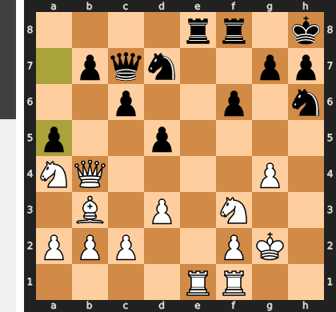

Played **a5**.

### Move 22 (White): Qd2 - Good 👍

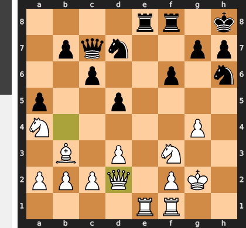

Played **Qd2**. The engine recommended **Qd4**.

### Move 22 (Black): Rd8 - Mistake ❓

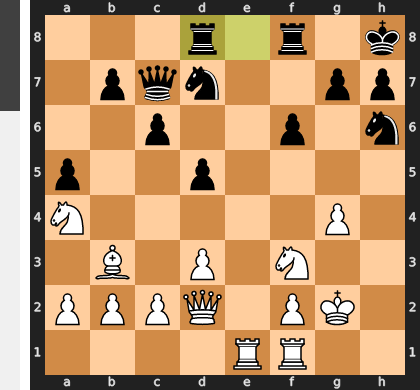

Instead of seizing the initiative with the energetic ...b5—which exploits White's awkward queenside coordination by targeting the a4-knight and threatening to trap the b3-bishop with a subsequent ...a4—Black opted for a passive centralizing move. This hesitation relieves all pressure on White’s pieces, giving them a free hand to safely consolidate and launch a dangerous kingside pawn storm with the impending g4-g5 thrust.

### Move 23 (White): Rh1 - Inaccuracy ⁈

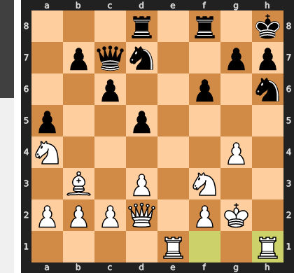

Played **Rh1**. The engine recommended **Nd4**.

### Move 23 (Black): Nxg4 - Good 👍

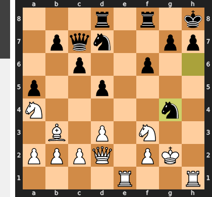

Played **Nxg4**. The engine recommended **b5**.

### Move 24 (White): d4 - Good 👍

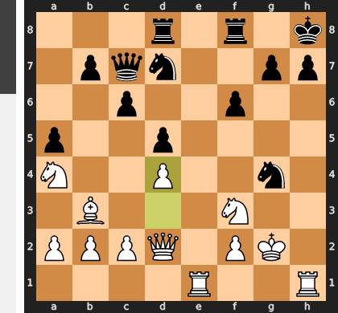

Played **d4**. The engine recommended **Nd4**.

### Move 24 (Black): h6 - Inaccuracy ⁈

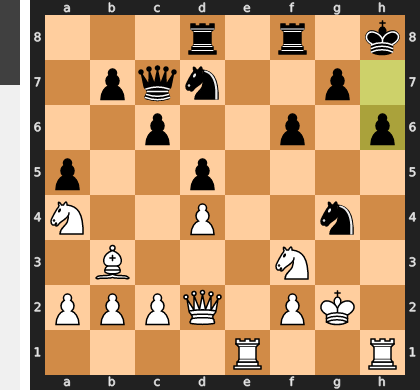

Played **h6**. The engine recommended **b5**.

### Move 25 (White): c3 - Good 👍

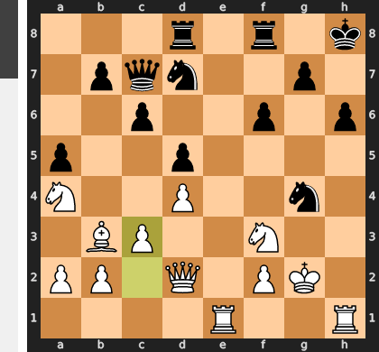

Played **c3**. The engine recommended **Nh4**.

### Move 25 (Black): g5 - Inaccuracy ⁈

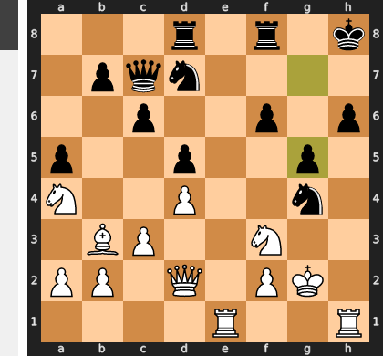

Played **g5**. The engine recommended **f5**.

### Move 26 (White): Bc2 - Good 👍

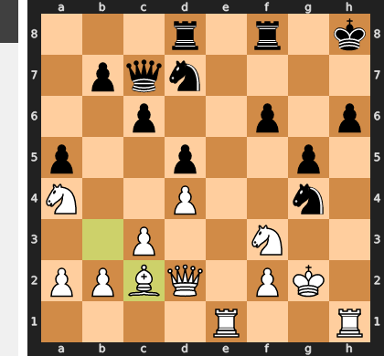

Played **Bc2**. The engine recommended **Nc5**.

### Move 26 (Black): Qd6 - Mistake ❓

By playing `...Qd6` instead of the proactive `...f5`, Black fails to secure the critical b1-h7 diagonal, leaving their airy king catastrophically exposed to White's attacking battery. Additionally, this passive move completely relinquishes control of the e-file, allowing White to comfortably double rooks with Re2 and Rfe1 to penetrate the back rank. Proactively erecting a pawn barrier with `...f5` was Black's only hope of keeping the kingside closed and maintaining defensive coordination.

### Move 27 (White): Bf5 - Best Move ✅

Played **Bf5**.

### Move 27 (Black): Nge5 - Mistake ❓

Under the crushing pressure on the h-file, **...Nge5** is a severe tactical miscalculation that completely underestimates the urgency of Black's king safety. By stepping directly into `dxe5`, Black allows White to effortlessly dismantle the central pawn structure with tempo, while failing to address the imminent and devastating rook sacrifice on h6. The recommended **...Rde8** was vital to maintain central stability and, crucially, to prepare a potential escape route for the king via f8 and e7 before the mating net tightened.

### Move 28 (White): Rxh6+ - Best Move ✅

Played **Rxh6+**.

### Move 28 (Black): Kg7 - Best Move ✅

Played **Kg7**.

### Move 29 (White): Reh1 - Mistake ❓

While doubling on the h-file looks visually crushing, $Reh1$ is a slow, one-dimensional approach that gives Black the vital tempo to contest the file with ...Rh8, trading off White's premier attacking rook and diffusing the immediate mating net. Instead, the immediate central breakthrough $dxe5$ is a devastating tactical blow that exploits Black's overloaded pieces and vulnerable king. Opening the center with tempo forces immediate, ruinous material concessions, as recapturing on e5 completely collapses Black's defense to a decisive major-piece invasion.

### Move 29 (Black): Kf7 - Inaccuracy ⁈

Played **Kf7**. The engine recommended **Rh8**.

### Move 30 (White): Rh7+ - Good 👍

Played **Rh7+**. The engine recommended **dxe5**.

### Move 30 (Black): Ke8 - Best Move ✅

Played **Ke8**.

### Move 31 (White): Bg6+ - Blunder ❌

By delivering the premature check with `Bg6+`, you voluntarily liquidate your most potent attacking piece, allowing Black to ease the pressure through `...Nxg6` and exchange off a key defender. Instead, the patient `Qe2` would have kept your dominant light-squared bishop on the board to paralyze Black’s kingside while creating a lethal pin on the e5-knight, setting up an immediate and irresistible breakthrough.

### Move 31 (Black): Nf7 - Blunder ❌

By failing to eliminate White’s monster bishop with ...Nxg6, you allowed the light-squared bishop to remain a permanent dominant force, keeping your king fatally pinned in the center. The self-pin on f7 completely paralyzes your defensive coordination, leaving you helpless against White's imminent rook penetration via the e-file. Instead of breaking the suffocating bind, this move voluntarily steps into a tactical straitjacket from which there is no escape.

### Move 32 (White): Qe2+ - Mistake ❓

By delivering check with the queen instead of the rook, you allow Black the defensive resource of `...Qe7`, which invites a queen trade and offers their suffocating king a crucial lifeline. In contrast, `Re1+` seizes the open e-file with the rook, meaning any blocking move like `...Qe7` results in an absolute pin rather than an equal exchange. This keeps your queen on the board as a lethal, unrestricted attacking piece to coordinate with the h7-rook and g6-bishop for a swift finish.

### Move 32 (Black): Ne5 - Mistake ❓

While `...Ne5` desperately attempts to clog the center and shield the exposed king, it fails tactically as `dxe5` simply wins a piece while further opening lines for White's attack. Rather than offering any real defensive coordination, this self-blockade leaves the f7-knight fatally pinned and allows White's heavy pieces to effortlessly breach the remaining barriers around your king.

### Move 33 (White): Nxe5 - Mistake ❓

Capturing with the pawn via **dxe5** is vastly superior because it gains a decisive tempo by immediately attacking the black queen, forcing it to abandon its crucial defensive post. By opting for **Nxe5** instead, White needlessly blocks the e-file with their own piece, shielding the vulnerable black king and giving Black a vital tempo to attempt to untangle their paralyzed position. Maintaining the knight's flexibility while using the d-pawn as a spearhead would have kept Black completely suffocated without any defensive resource.

### Move 33 (Black): fxe5 - Best Move ✅

Played **fxe5**.

### Move 34 (White): Qh5 - Inaccuracy ⁈

Played **Qh5**. The engine recommended **Bxf7+**.

### Move 34 (Black): Qf6 - Inaccuracy ⁈

Played **Qf6**. The engine recommended **Kd7**.

