# Chess Game Analysis: kar2on vs Crushed38

- **Result:** 0-1
- **Date:** 2026.07.31
- **Opening:** Philidor Defense 3.Bc4
- **Type:** Casual (Unrated)

### Move 1 (White): e4 - Best Move ✅

Played **e4**.

### Move 1 (Black): e5 - Best Move ✅

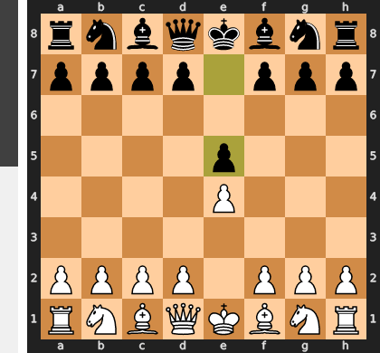

Played **e5**.

### Move 2 (White): Nf3 - Best Move ✅

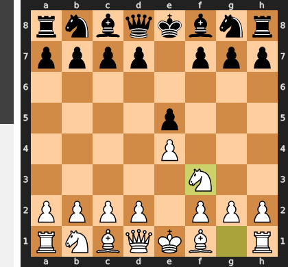

Played **Nf3**.

### Move 2 (Black): d6 - Good 👍

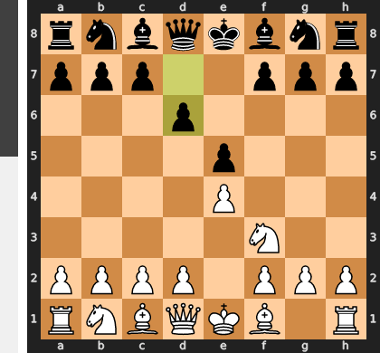

Played **d6**. The engine recommended **Nc6**.

### Move 3 (White): Bc4 - Good 👍

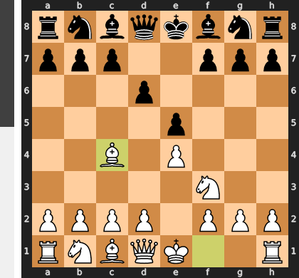

Played **Bc4**. The engine recommended **d4**.

### Move 3 (Black): Be6 - Good 👍

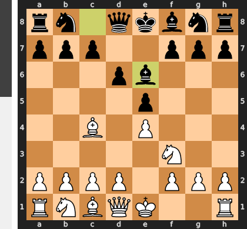

Played **Be6**. The engine recommended **Nf6**.

### Move 4 (White): Bxe6 - Best Move ✅

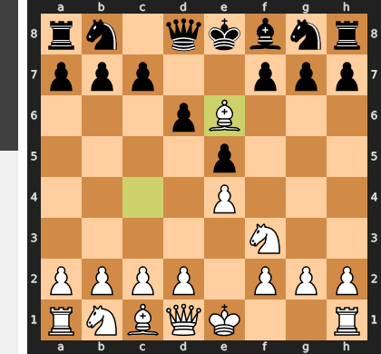

Played **Bxe6**.

### Move 4 (Black): fxe6 - Best Move ✅

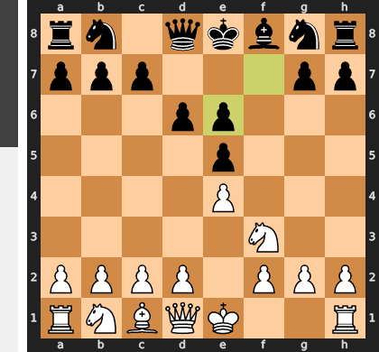

Played **fxe6**.

### Move 5 (White): Nc3 - Inaccuracy ⁈

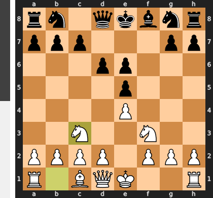

Played **Nc3**. The engine recommended **d4**.

### Move 5 (Black): d5 - Mistake ❓

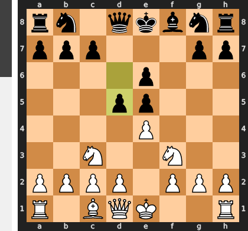

Error getting deep commentary: 404 NOT_FOUND. {'error': {'code': 404, 'message': 'This model models/gemini-2.5-pro is no longer available to new users. Please update your code to use a newer model for the latest features and improvements.', 'status': 'NOT_FOUND'}}

### Move 6 (White): exd5 - Good 👍

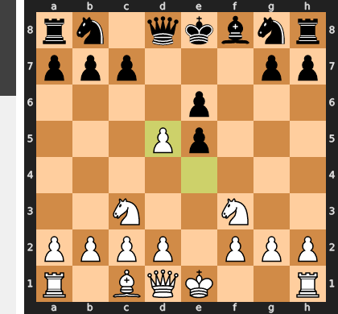

Played **exd5**. The engine recommended **d4**.

### Move 6 (Black): exd5 - Best Move ✅

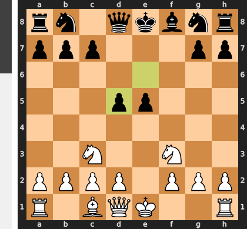

Played **exd5**.

### Move 7 (White): Nxe5 - Best Move ✅

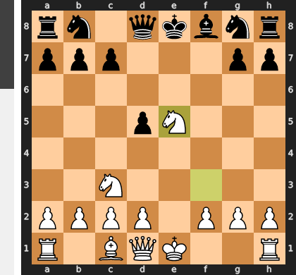

Played **Nxe5**.

### Move 7 (Black): Nf6 - Best Move ✅

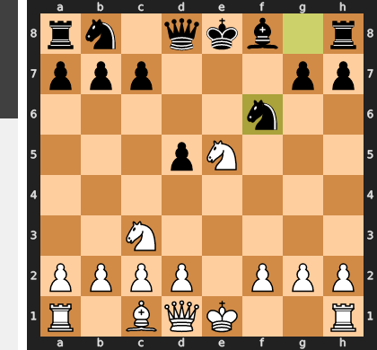

Played **Nf6**.

### Move 8 (White): d4 - Good 👍

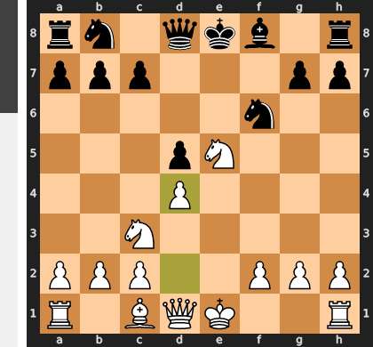

Played **d4**. The engine recommended **Qe2**.

### Move 8 (Black): Nbd7 - Good 👍

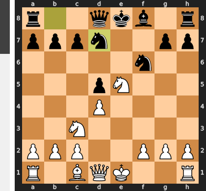

Played **Nbd7**. The engine recommended **Bd6**.

### Move 9 (White): Qe2 - Best Move ✅

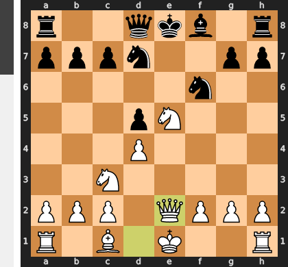

Played **Qe2**.

### Move 9 (Black): Bd6 - Blunder ❌

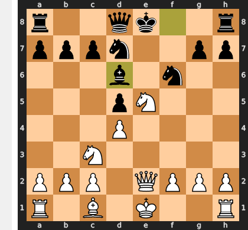

Error getting deep commentary: 404 NOT_FOUND. {'error': {'code': 404, 'message': 'This model models/gemini-2.5-pro is no longer available to new users. Please update your code to use a newer model for the latest features and improvements.', 'status': 'NOT_FOUND'}}

### Move 10 (White): Nf7+ - Blunder ❌

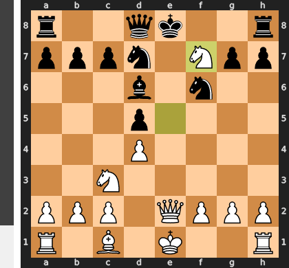

Error getting deep commentary: 404 NOT_FOUND. {'error': {'code': 404, 'message': 'This model models/gemini-2.5-pro is no longer available to new users. Please update your code to use a newer model for the latest features and improvements.', 'status': 'NOT_FOUND'}}

### Move 10 (Black): Kxf7 - Best Move ✅

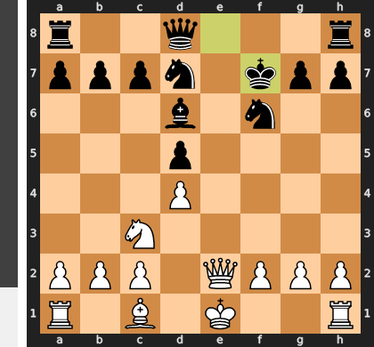

Played **Kxf7**.

### Move 11 (White): O-O - Inaccuracy ⁈

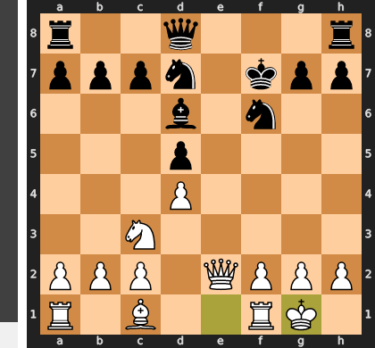

Played **O-O**. The engine recommended **Nxd5**.

### Move 11 (Black): Re8 - Best Move ✅

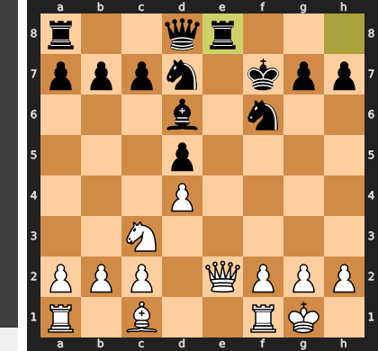

Played **Re8**.

### Move 12 (White): Qf3 - Best Move ✅

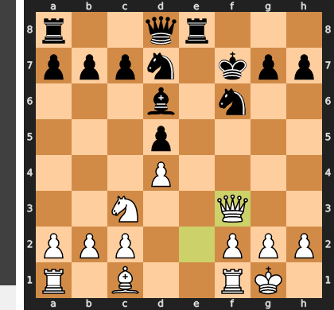

Played **Qf3**.

### Move 12 (Black): Qe7 - Good 👍

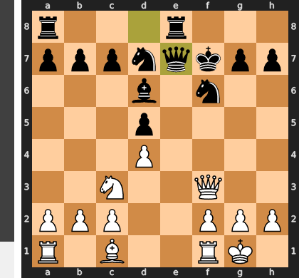

Played **Qe7**. The engine recommended **c6**.

### Move 13 (White): Nxd5 - Best Move ✅

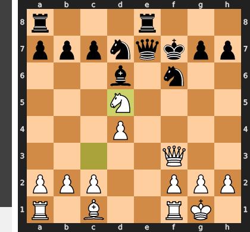

Played **Nxd5**.

### Move 13 (Black): Qe4 - Best Move ✅

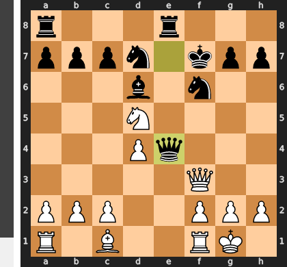

Played **Qe4**.

### Move 14 (White): Qxe4 - Good 👍

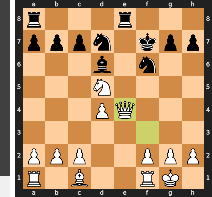

Played **Qxe4**. The engine recommended **Ne3**.

### Move 14 (Black): Nxe4 - Inaccuracy ⁈

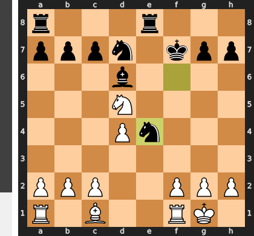

Played **Nxe4**. The engine recommended **Rxe4**.

### Move 15 (White): Nf6 - Mistake ❓

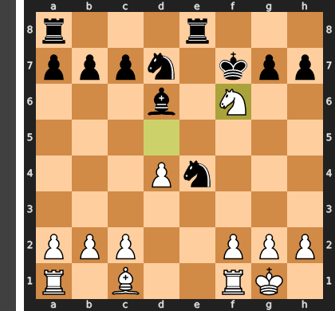

Error getting deep commentary: 404 NOT_FOUND. {'error': {'code': 404, 'message': 'This model models/gemini-2.5-pro is no longer available to new users. Please update your code to use a newer model for the latest features and improvements.', 'status': 'NOT_FOUND'}}

### Move 15 (Black): Nexf6 - Best Move ✅

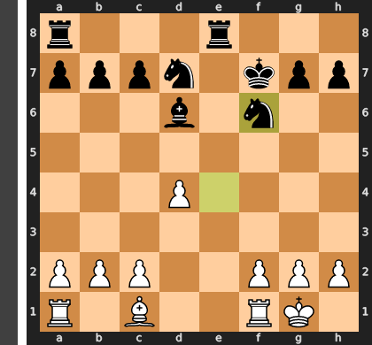

Played **Nexf6**.

