# Chess Game Analysis: ZzcaqirzZ vs kar2on

- **Result:** 1-0
- **Date:** 2026.07.31
- **Opening:** Pirc Defense Main Line Byrne Variation 4...Bg7 5.e5 dxe5 6.dxe5
- **Type:** Casual (Unrated)

### Move 1 (White): e4 - Best Move ✅

Played **e4**.

### Move 1 (Black): d6 - Good 👍

Played **d6**. The engine recommended **e5**.

### Move 2 (White): d4 - Best Move ✅

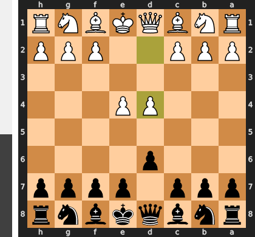

Played **d4**.

### Move 2 (Black): Nf6 - Best Move ✅

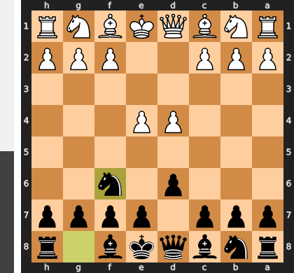

Played **Nf6**.

### Move 3 (White): Nc3 - Best Move ✅

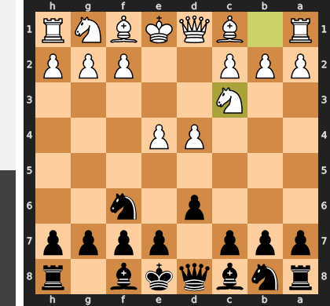

Played **Nc3**.

### Move 3 (Black): g6 - Good 👍

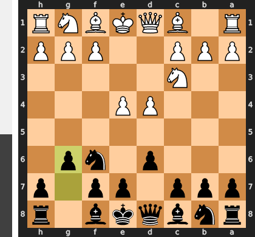

Played **g6**. The engine recommended **e5**.

### Move 4 (White): Bg5 - Good 👍

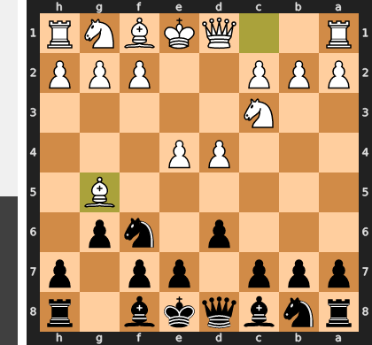

Played **Bg5**. The engine recommended **Be3**.

### Move 4 (Black): Bg7 - Best Move ✅

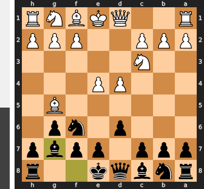

Played **Bg7**.

### Move 5 (White): e5 - Inaccuracy ⁈

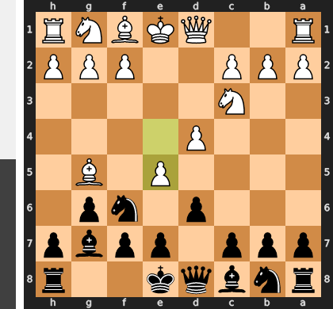

Played **e5**. The engine recommended **Qd2**.

### Move 5 (Black): dxe5 - Best Move ✅

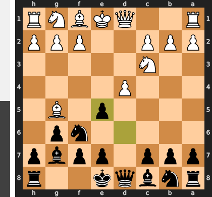

Played **dxe5**.

### Move 6 (White): dxe5 - Best Move ✅

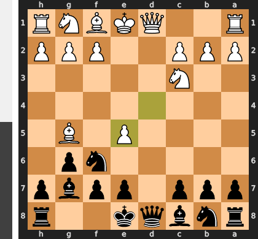

Played **dxe5**.

### Move 6 (Black): Qxd1+ - Good 👍

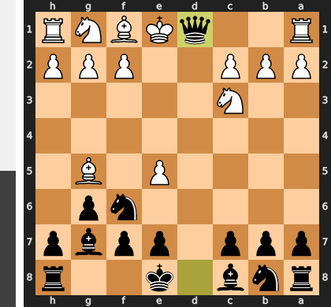

Played **Qxd1+**. The engine recommended **Ng4**.

### Move 7 (White): Rxd1 - Best Move ✅

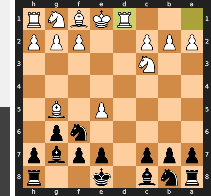

Played **Rxd1**.

### Move 7 (Black): Ng4 - Mistake ❓

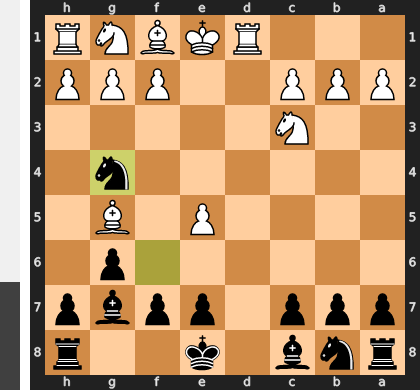

By leaping to g4, the knight abandons control over the critical d5-square, allowing White to immediately unleash the powerful **Nd5!** which creates an overwhelming double-threat against the vulnerable c7 and e7 pawns. Had Black opted for the patient **...Nfd7**, they would have kept their position compact, ready to blunt any central aggression with a timely ...f6 or ...c6. Instead, the g4-knight is left positionally stranded on the kingside flank while Black's center and queenside rapidly collapse.

### Move 8 (White): h3 - Best Move ✅

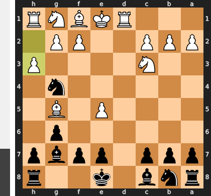

Played **h3**.

### Move 8 (Black): Nxe5 - Best Move ✅

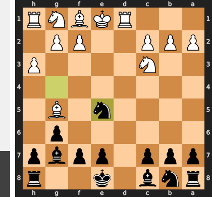

Played **Nxe5**.

### Move 9 (White): Nd5 - Best Move ✅

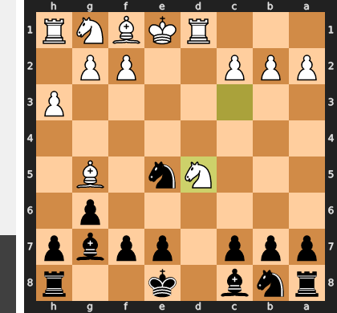

Played **Nd5**.

### Move 9 (Black): Na6 - Mistake ❓

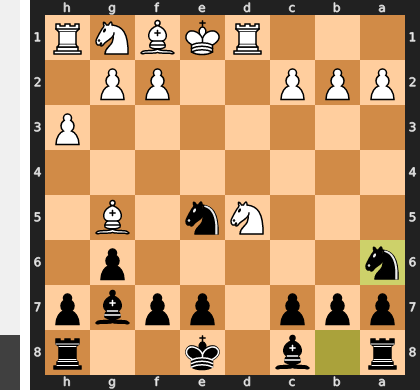

By placing the knight on the rim with `...Na6`, you fall directly into a tactical disaster, as White can immediately play `Bxa6` to liquidate the only defender of the c7-square and unleash a decisive royal fork. Instead, the engine's recommended `...Kd8` was a vital prophylactic defense, stepping off the dangerous e-file to protect the weak e7-pawn while rendering White's central pressure harmless.

### Move 10 (White): f4 - Mistake ❓

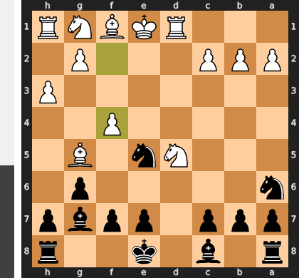

By playing **f4**, you missed the opportunity to execute the decisive deflection **Bxa6**, which would have eliminated the sole defender of the critical c7-square and forced an immediate collapse of Black's position. Instead, this premature pawn thrust allows Black to comfortably untangle with **...Nc6**, relocating their centralized knight to perfectly reinforce both the e7 and c7 weaknesses. Consequently, the immediate tactical pressure evaporates, allowing Black to consolidate and neutralize your space advantage.

### Move 10 (Black): Nc6 - Mistake ❓

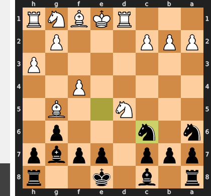

By playing ...Nc6 instead of evicting the powerful d5-knight with ...c6, Black fails to realize that their knight on a6 was the sole, fragile defender of the critical c7-fork. This blunder allows the crushing tactical shot **Bxa6!**, exploiting the fact that recapturing with ...bxa6 fails immediately to **Nxc7+**, winning the a8-rook. By neglecting this defensive priority, Black’s queenside structure completely implodes, leaving them facing both decisive material loss and a strategically ruined position.

### Move 11 (White): Bxa6 - Best Move ✅

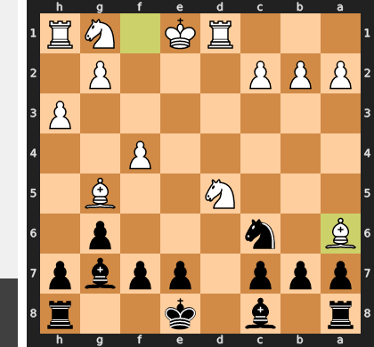

Played **Bxa6**.

### Move 11 (Black): bxa6 - Good 👍

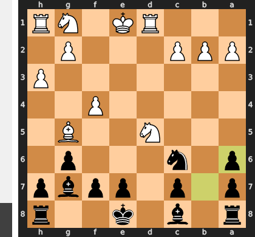

Played **bxa6**. The engine recommended **O-O**.

### Move 12 (White): Nxc7+ - Best Move ✅

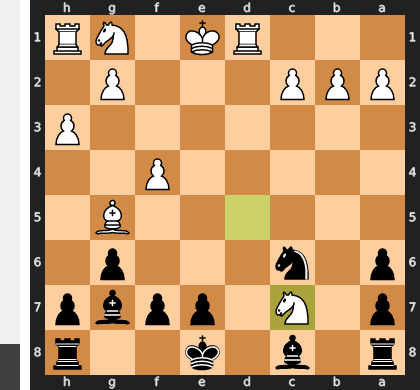

Played **Nxc7+**.

### Move 12 (Black): Kf8 - Best Move ✅

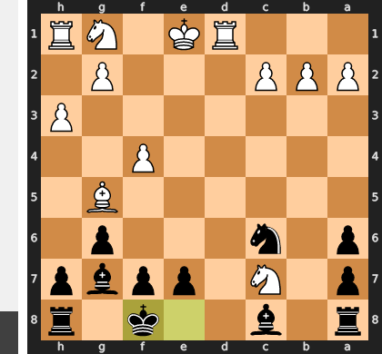

Played **Kf8**.

### Move 13 (White): Nxa8 - Best Move ✅

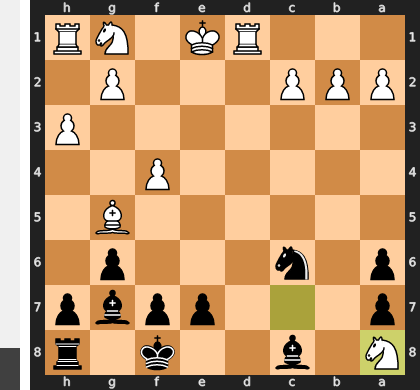

Played **Nxa8**.

