# Chess Game Analysis: PrimePrimus vs kar2on

- **Result:** 0-1
- **Date:** 2026.07.31
- **Opening:** Pirc Defense 2.d4 Nf6 3.Nd2 g6
- **Type:** Casual (Unrated)

### Move 1 (White): e4 - Best Move ✅

Played **e4**.

### Move 1 (Black): d6 - Good 👍

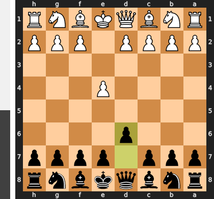

Played **d6**. The engine recommended **e5**.

### Move 2 (White): d4 - Best Move ✅

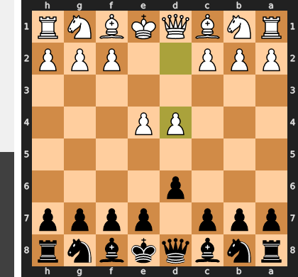

Played **d4**.

### Move 2 (Black): Nf6 - Good 👍

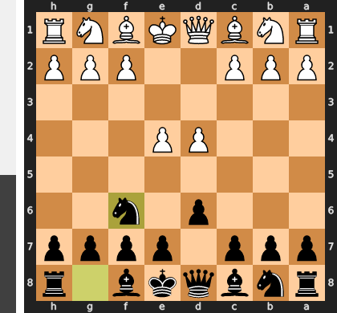

Played **Nf6**. The engine recommended **e5**.

### Move 3 (White): Nd2 - Good 👍

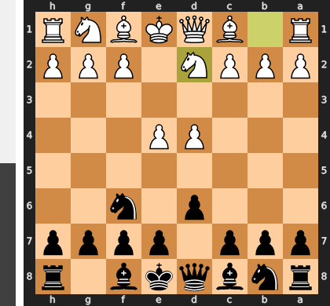

Played **Nd2**. The engine recommended **Nc3**.

### Move 3 (Black): g6 - Good 👍

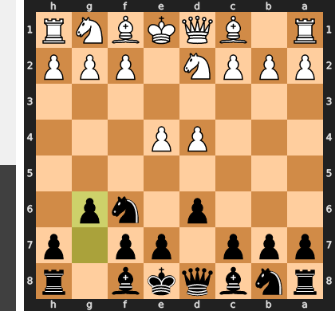

Played **g6**. The engine recommended **e5**.

### Move 4 (White): e5 - Inaccuracy ⁈

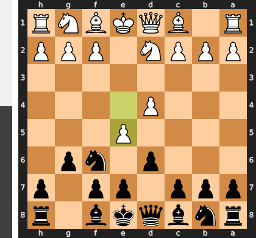

Played **e5**. The engine recommended **Ngf3**.

### Move 4 (Black): dxe5 - Best Move ✅

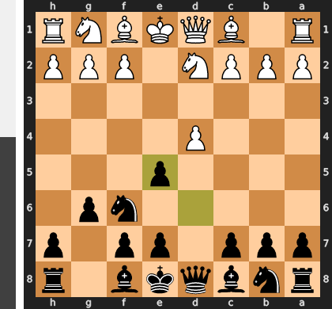

Played **dxe5**.

### Move 5 (White): dxe5 - Best Move ✅

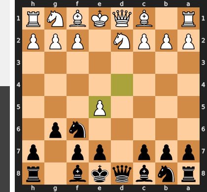

Played **dxe5**.

### Move 5 (Black): Ng4 - Best Move ✅

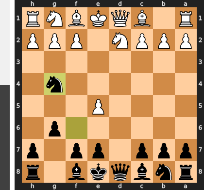

Played **Ng4**.

### Move 6 (White): h3 - Inaccuracy ⁈

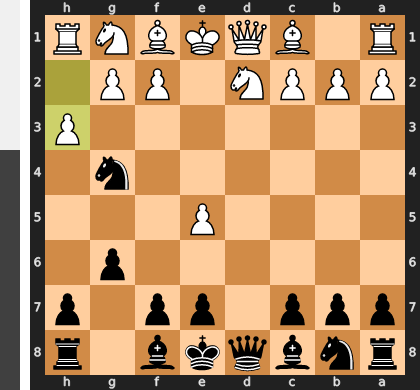

Played **h3**. The engine recommended **Ngf3**.

### Move 6 (Black): Nxe5 - Best Move ✅

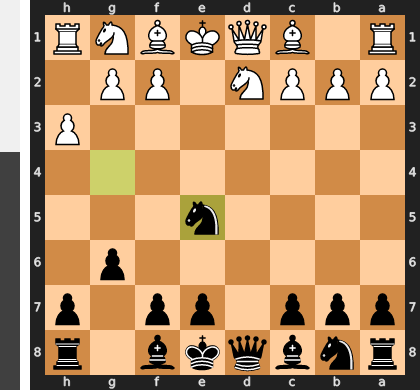

Played **Nxe5**.

### Move 7 (White): Ngf3 - Best Move ✅

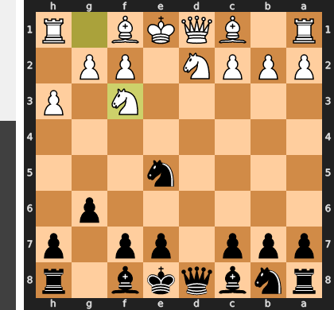

Played **Ngf3**.

### Move 7 (Black): Bg7 - Good 👍

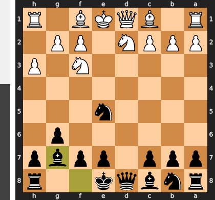

Played **Bg7**. The engine recommended **Nbc6**.

### Move 8 (White): Nxe5 - Best Move ✅

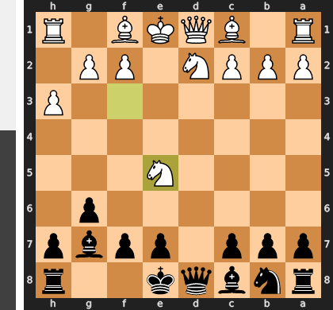

Played **Nxe5**.

### Move 8 (Black): Bxe5 - Best Move ✅

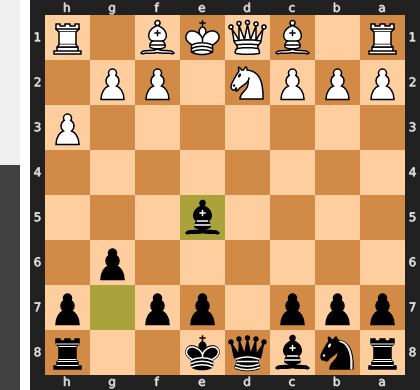

Played **Bxe5**.

### Move 9 (White): Bc4 - Good 👍

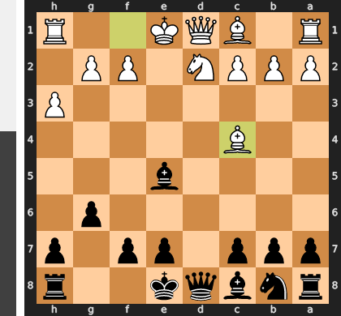

Played **Bc4**. The engine recommended **Bb5+**.

### Move 9 (Black): O-O - Good 👍

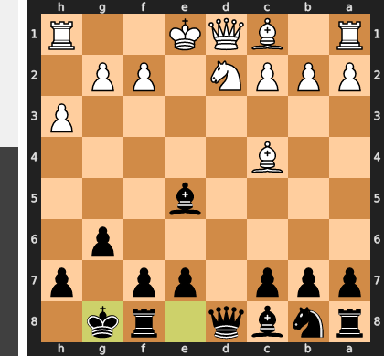

Played **O-O**. The engine recommended **Bg7**.

### Move 10 (White): O-O - Good 👍

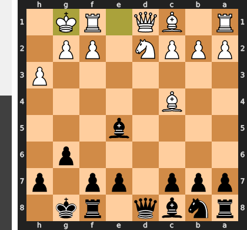

Played **O-O**. The engine recommended **c3**.

### Move 10 (Black): Be6 - Mistake ❓

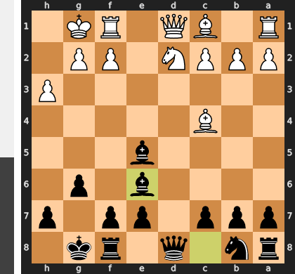

By playing **...Be6**, Black voluntarily invites **Bxe6**, which permanently shatters their own pawn structure and leaves a chronically weak, doubled pawn on the e-file. Instead of completing development harmoniously with the engine's recommended **...Nc6**, this move hands White a clear static target and severely compromises Black's long-term king safety. White can now easily reposition their pieces—such as bringing the knight to f3 or the queen to e2—to ruthlessly exploit the newly created dark-square weaknesses.

### Move 11 (White): Bxe6 - Best Move ✅

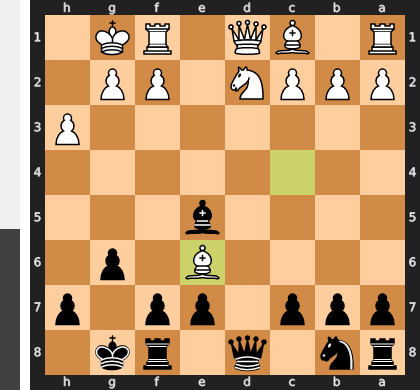

Played **Bxe6**.

### Move 11 (Black): fxe6 - Best Move ✅

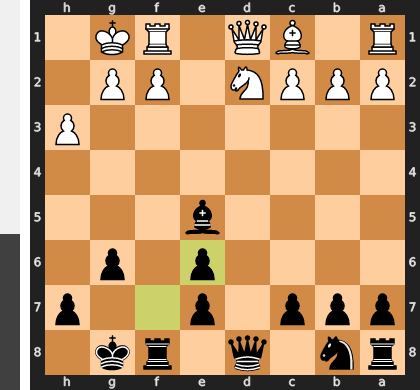

Played **fxe6**.

### Move 12 (White): Qf3 - Blunder ❌

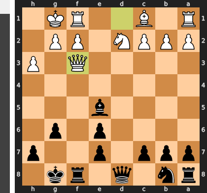

White's move is a severe tactical oversight that completely ignores the open f-file, placing the queen directly into the line of fire of the f8-rook. After the simple capture ...Rxf3, White is forced to surrender the queen for a mere rook, instantly throwing away a promising position that could have been safely maintained with the prophylactic Qe2.

