# Chess Game Analysis: filippo0814 vs kar2on

- **Result:** 0-1
- **Date:** 2026.07.31
- **Opening:** Indian Game 2.Bf4 d6 3.e3 g6
- **Type:** Casual (Unrated)

### Move 1 (White): d4 - Good 👍

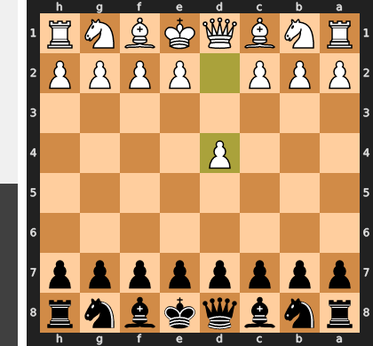

Played **d4**. The engine recommended **e4**.

### Move 1 (Black): Nf6 - Best Move ✅

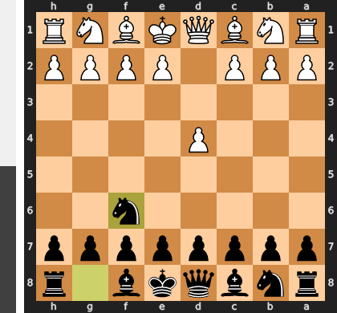

Played **Nf6**.

### Move 2 (White): Bf4 - Good 👍

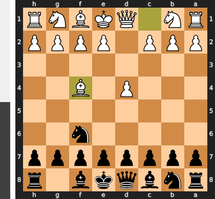

Played **Bf4**. The engine recommended **c4**.

### Move 2 (Black): d6 - Good 👍

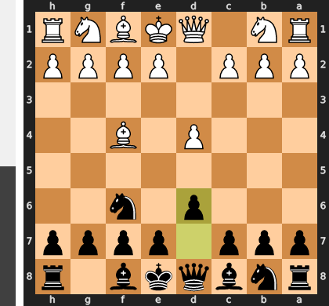

Played **d6**. The engine recommended **d5**.

### Move 3 (White): e3 - Good 👍

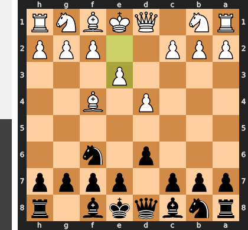

Played **e3**. The engine recommended **Nc3**.

### Move 3 (Black): g6 - Best Move ✅

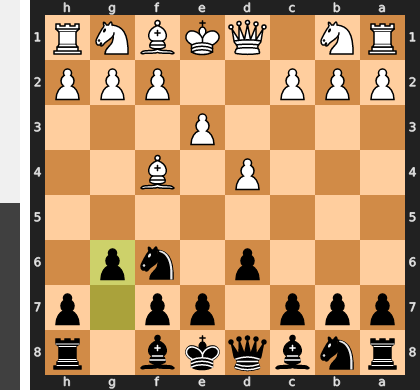

Played **g6**.

### Move 4 (White): Bd3 - Good 👍

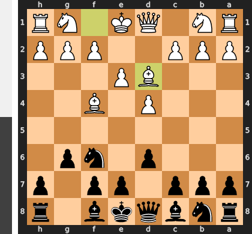

Played **Bd3**. The engine recommended **h3**.

### Move 4 (Black): Bg7 - Best Move ✅

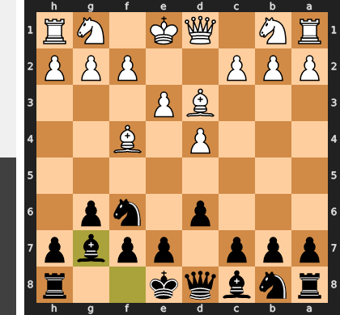

Played **Bg7**.

### Move 5 (White): h4 - Inaccuracy ⁈

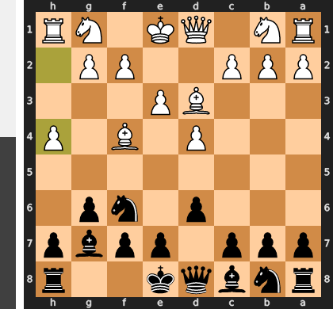

Played **h4**. The engine recommended **Nf3**.

### Move 5 (Black): Nc6 - Good 👍

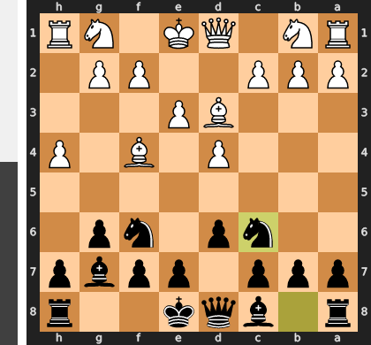

Played **Nc6**. The engine recommended **c5**.

### Move 6 (White): Nf3 - Good 👍

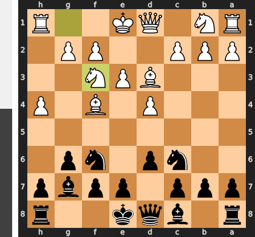

Played **Nf3**. The engine recommended **Nc3**.

### Move 6 (Black): b6 - Inaccuracy ⁈

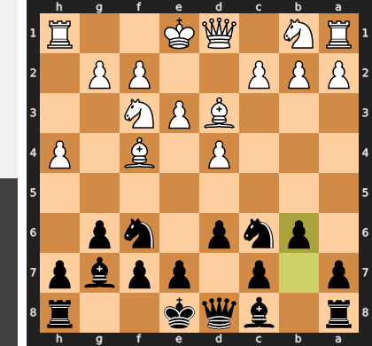

Played **b6**. The engine recommended **Nb4**.

### Move 7 (White): c3 - Good 👍

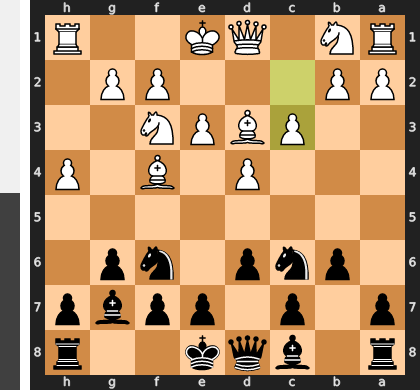

Played **c3**. The engine recommended **Bg5**.

### Move 7 (Black): Bb7 - Good 👍

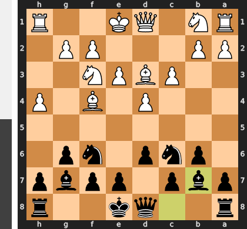

Played **Bb7**. The engine recommended **h6**.

### Move 8 (White): Nbd2 - Good 👍

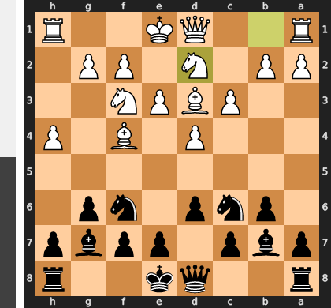

Played **Nbd2**. The engine recommended **Bg5**.

### Move 8 (Black): Nh5 - Best Move ✅

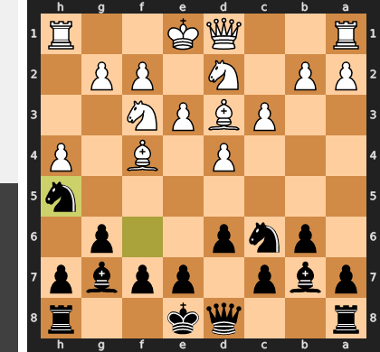

Played **Nh5**.

### Move 9 (White): Bh2 - Good 👍

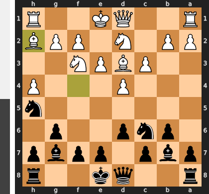

Played **Bh2**. The engine recommended **Qe2**.

### Move 9 (Black): e5 - Good 👍

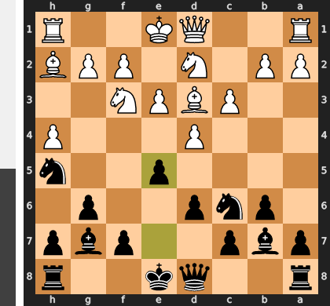

Played **e5**. The engine recommended **O-O**.

### Move 10 (White): dxe5 - Good 👍

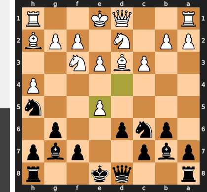

Played **dxe5**. The engine recommended **g4**.

### Move 10 (Black): Nxe5 - Good 👍

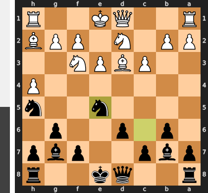

Played **Nxe5**. The engine recommended **Bxe5**.

### Move 11 (White): Nxe5 - Best Move ✅

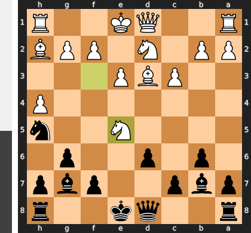

Played **Nxe5**.

### Move 11 (Black): Bxe5 - Best Move ✅

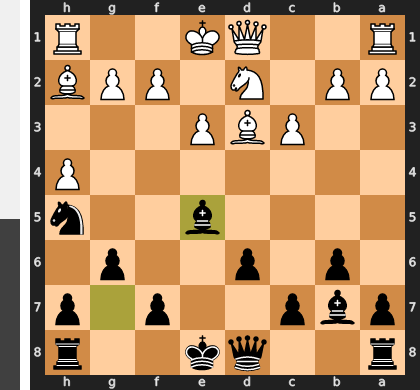

Played **Bxe5**.

### Move 12 (White): Bxe5 - Good 👍

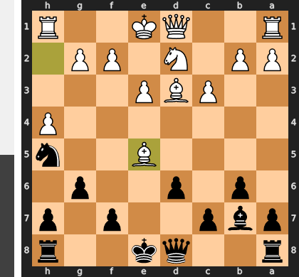

Played **Bxe5**. The engine recommended **Qa4+**.

### Move 12 (Black): dxe5 - Best Move ✅

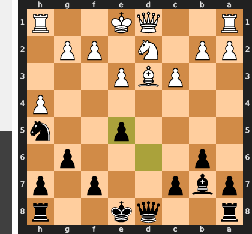

Played **dxe5**.

### Move 13 (White): Qc2 - Mistake ❓

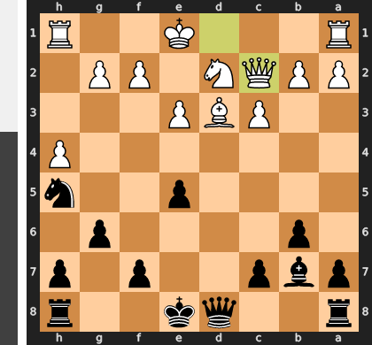

By playing $Qc2$ directly, you fail to address the immediate vulnerability of the g2-pawn to Black's powerful light-squared bishop on b7. The intermediate check $Qa4+$ was tactically mandatory because it would have forced ...c6—effectively shutting down that bishop's diagonal—or a queen trade that would ease the pressure on your uncasted king. Now, Black can comfortably capture on g2, leaving your kingside shredded and your king permanently stranded in the center without compensation.

### Move 13 (Black): Bxg2 - Best Move ✅

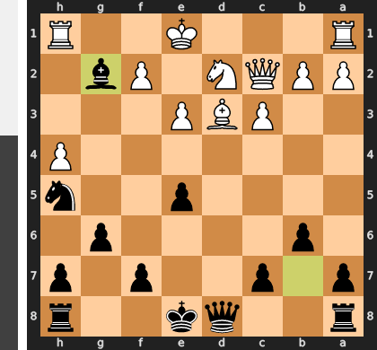

Played **Bxg2**.

### Move 14 (White): Rg1 - Best Move ✅

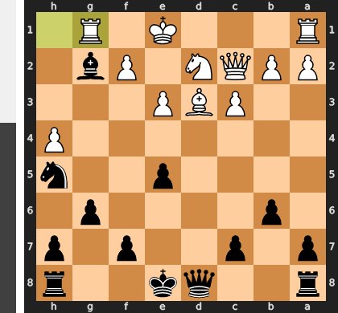

Played **Rg1**.

### Move 14 (Black): Bb7 - Inaccuracy ⁈

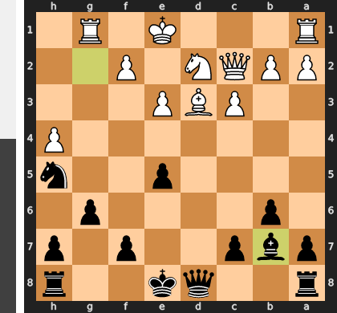

Played **Bb7**. The engine recommended **Bc6**.

### Move 15 (White): Qa4+ - Best Move ✅

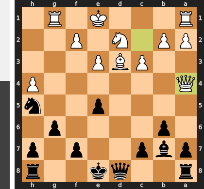

Played **Qa4+**.

### Move 15 (Black): Kf8 - Good 👍

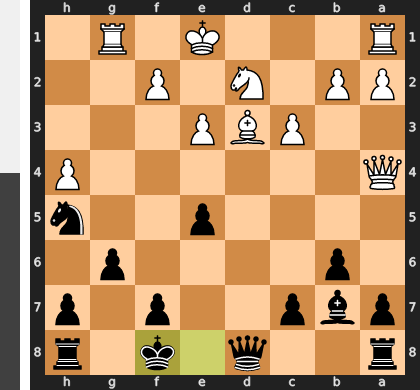

Played **Kf8**. The engine recommended **Qd7**.

### Move 16 (White): Qc2 - Mistake ❓

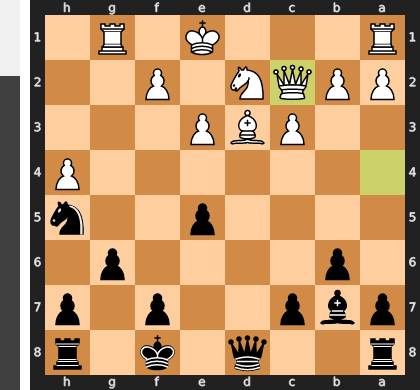

Instead of neutralizing Black's most active piece with the stabilizing 16. Be4—which would have forced a trade of the light-squared bishops and secured the center—16. Qc2 is a serious tactical oversight that abandons the h4-pawn. Black can now immediately seize the initiative with 16...Qxh4, winning a pawn and opening up lines of attack against White's drafty, uncastled king. Without the bishop trade, White's pieces remain disconnected and completely unable to cope with Black's mounting central and kingside pressure.

### Move 16 (Black): Qxh4 - Best Move ✅

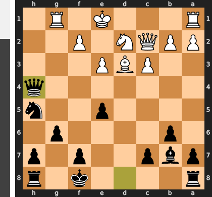

Played **Qxh4**.

### Move 17 (White): O-O-O - Good 👍

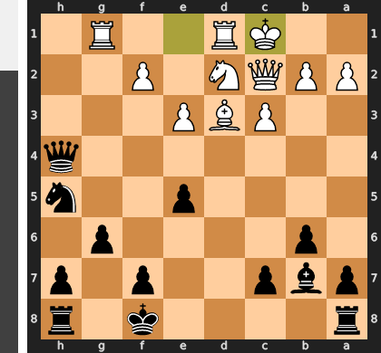

Played **O-O-O**. The engine recommended **c4**.

### Move 17 (Black): Qxf2 - Inaccuracy ⁈

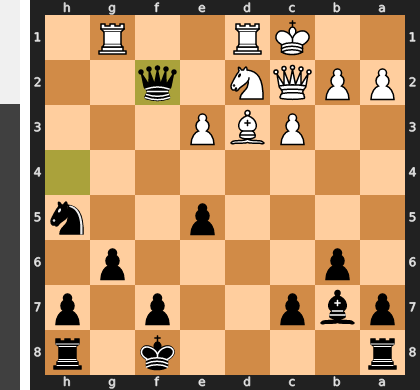

Played **Qxf2**. The engine recommended **Rd8**.

### Move 18 (White): Rde1 - Mistake ❓

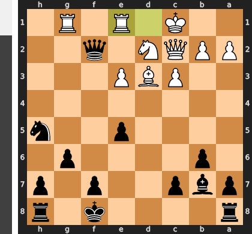

By playing `Rde1`, White catastrophically abandons the d-file, leaving the d3-bishop highly vulnerable to an immediate `...Rd8` while failing to contest Black's dominant light-squared bishop. The recommended `Be4` was a crucial central challenge, aiming to neutralize the long diagonal and trade off Black's key attacking minor piece to relieve the pressure. Without this defensive trade, Black's pieces coordinate flawlessly, allowing the knight to secure a devastating outpost on g3 and paralyze White's passive position.

### Move 18 (Black): Rd8 - Best Move ✅

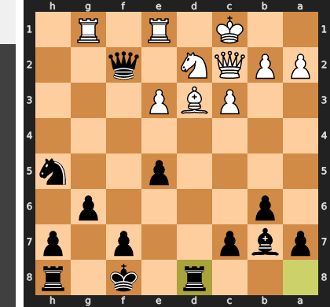

Played **Rd8**.

### Move 19 (White): Rgf1 - Best Move ✅

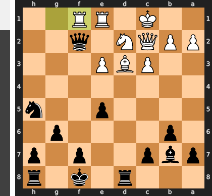

Played **Rgf1**.

### Move 19 (Black): Qh4 - Best Move ✅

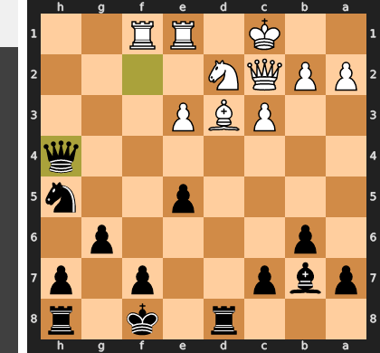

Played **Qh4**.

### Move 20 (White): Kb1 - Inaccuracy ⁈

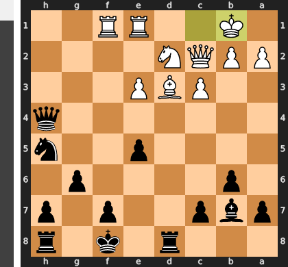

Played **Kb1**. The engine recommended **Nc4**.

### Move 20 (Black): Ng3 - Good 👍

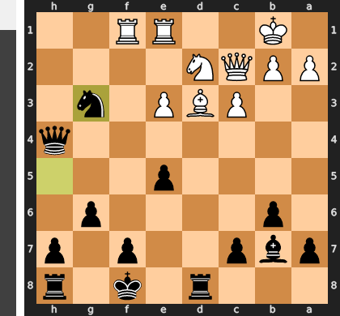

Played **Ng3**. The engine recommended **Kg7**.

### Move 21 (White): Rg1 - Best Move ✅

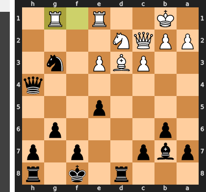

Played **Rg1**.

### Move 21 (Black): Kg7 - Best Move ✅

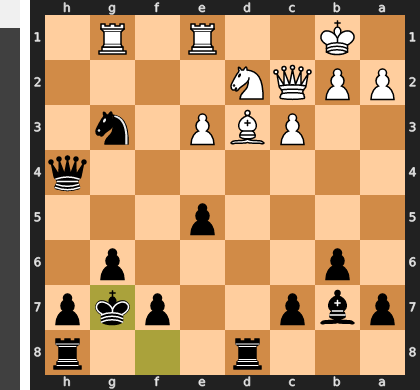

Played **Kg7**.

### Move 22 (White): e4 - Best Move ✅

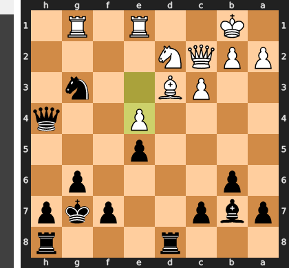

Played **e4**.

### Move 22 (Black): Rhe8 - Best Move ✅

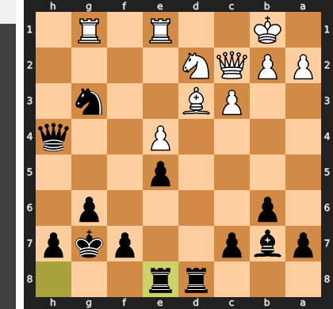

Played **Rhe8**.

### Move 23 (White): Nf3 - Inaccuracy ⁈

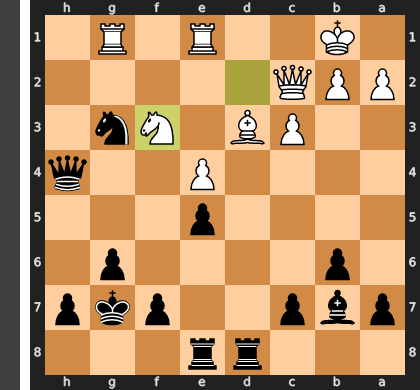

Played **Nf3**. The engine recommended **Ka1**.

### Move 23 (Black): Qg4 - Mistake ❓

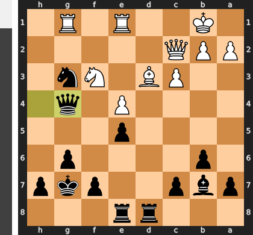

By opting for **...Qg4**, you allowed White the critical tempo-gaining resource of **Nh2**, which harasses your queen and helps White untangle their congested defensive minor pieces. Placing the queen on the more centralized **f4** square instead would have established an unassailable outpost immune to such knight jumps, keeping intense pressure on the f3-knight while securely defending your advanced threat on g3. This subtle inaccuracy hands White a defensive lifeline, allowing them to fight back for coordination instead of being completely suffocated.

### Move 24 (White): Nh2 - Best Move ✅

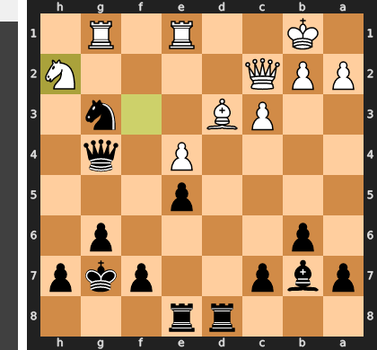

Played **Nh2**.

### Move 24 (Black): Qg5 - Blunder ❌

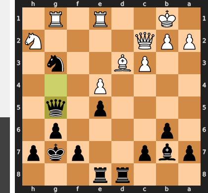

By placing the queen on g5, Black steps directly into a self-pin along the g-file, allowing White to exploit the alignment with the immediate **1. Nf1**, which wins the trapped g3-knight. The prophylactic **...Qh4** would have kept the queen off this vulnerable file, securing the knight’s powerful outpost while maintaining Black's decisive pressure. Instead, this tactical oversight completely surrenders Black's winning advantage by giving White's passive pieces an easy target.

### Move 25 (White): Nf3 - Blunder ❌

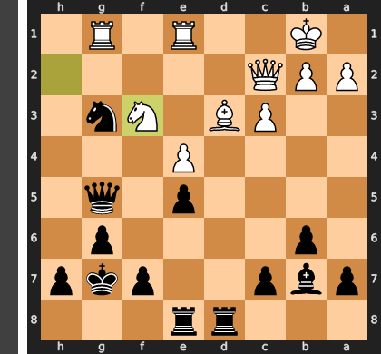

By playing **Nf3**, White neglects the primary defensive task of neutralizing Black’s powerful knight on g3 and invites the devastating reply **...Qf4**, which pressures the newly placed knight and exposes the overworked nature of White's queen. Because the queen on c2 cannot defend both the f3-knight and the d3-bishop, Black forces a decisive tactical breakthrough with **...Rxd3!**, winning major material after **Qxd3 Bxe4** pinning the queen. Instead, the prophylactic **Nf1** was essential to challenge and trade off Black's monster knight on g3, preserving White's defensive integrity.

### Move 25 (Black): Qf4 - Best Move ✅

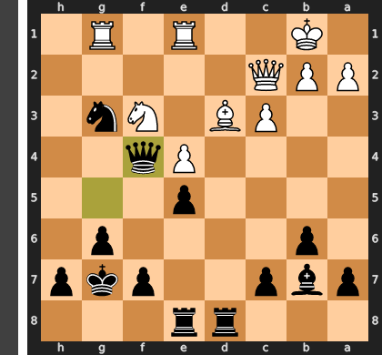

Played **Qf4**.

