# Chess Game Analysis: kuhankumar703 vs kar2on

- **Result:** 1-0
- **Date:** 2026.01.08
- **Opening:** Kings Indian Defense 3.Nf3 Bg7

### Move 1 (White): d4

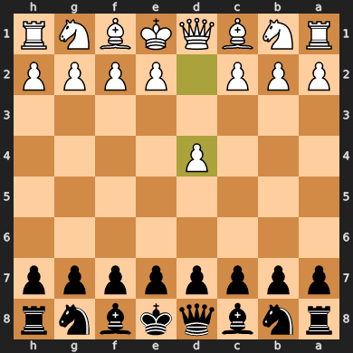

**Engine Recommendation:** The engine suggests `e4` which opens lines for the queen and king's bishop.

**Actual Move:** White played `d4`, a solid opening move that controls the center and opens lines for the queen and queen's bishop.

### Move 1 (Black): Nf6

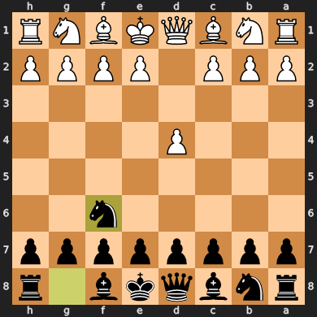

**Engine Recommendation:** The engine suggests `Nf6`, developing the knight and controlling the center.

**Actual Move:** Black played `Nf6`, a standard and strong developing move.

### Move 2 (White): c4

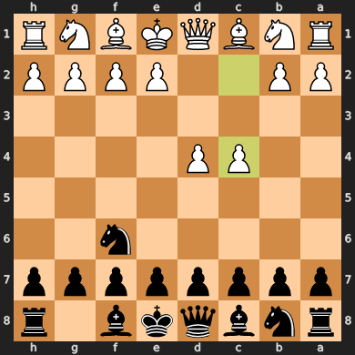

**Engine Recommendation:** The engine suggests `c4`, reinforcing the center and preparing for further development.

**Actual Move:** White played `c4`, a standard move in the Queen's Gambit or English Opening, asserting more central control.

### Move 2 (Black): g6

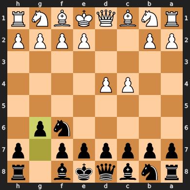

**Engine Recommendation:** The engine suggests `e6`, supporting the d5 square and preparing to develop the light-squared bishop.

**Actual Move:** Black played `g6`, indicating a King's Indian Defense setup where Black fianchettos their king's bishop to g7. This is a sound and thematic move in this opening.

### Move 3 (White): Nf3

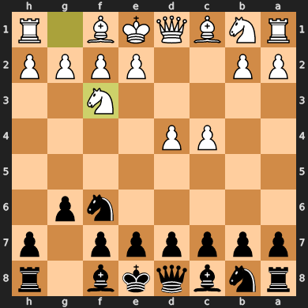

**Engine Recommendation:** The engine suggests `Nc3`, developing the knight to its most natural square and supporting the center.

**Actual Move:** White played `Nf3`, another good developing move, controlling the central squares and preparing for kingside castling. This is a common and flexible choice in response to Black's setup.

### Move 3 (Black): Bg7

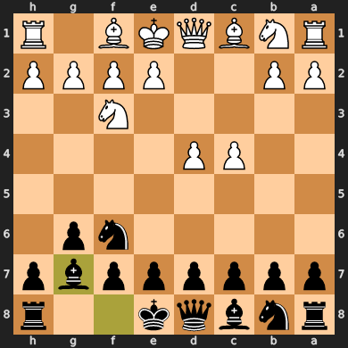

**Engine Recommendation:** The engine suggests `Bg7`, completing the fianchetto and putting pressure on the long diagonal.

**Actual Move:** Black played `Bg7`, fianchettoing the king's bishop, which is a key part of the King's Indian Defense setup. The bishop on g7 is a powerful piece, controlling the long diagonal.

### Move 4 (White): Bg5

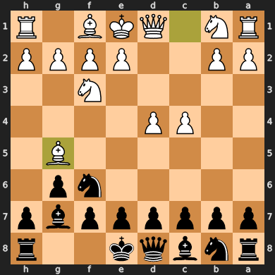

**Engine Recommendation:** The engine suggests `Nc3`, developing the knight and reinforcing the center.

**Actual Move:** White played `Bg5`, developing the bishop and pinning Black's knight on f6. This puts immediate pressure on Black's kingside and can lead to tactical opportunities.

### Move 4 (Black): O-O

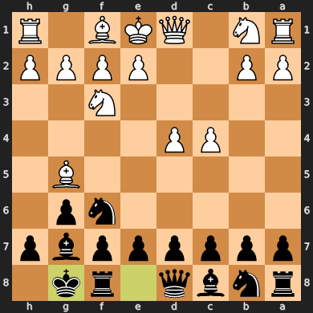

**Engine Recommendation:** The engine suggests `Ne4`, which challenges White's bishop on g5 and attempts to break the pin on the knight.

**Actual Move:** Black played `O-O` (kingside castling). This is a vital move for king safety and bringing the rook into play. While the engine preferred to challenge the pin, castling is a fundamental and often correct decision to secure the king.

### Move 5 (White): Qd2

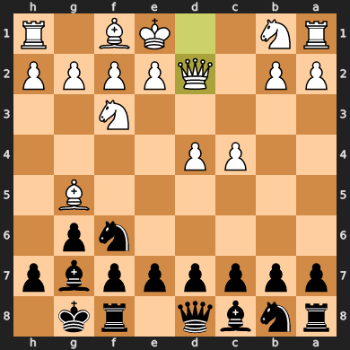

**Engine Recommendation:** The engine suggests `Nc3`, continuing development and controlling the center.

**Actual Move:** White played `Qd2`, which supports the d4 pawn and can prepare for queenside castling, although it's a less common developing move than `Nc3`.

### Move 5 (Black): Ne4

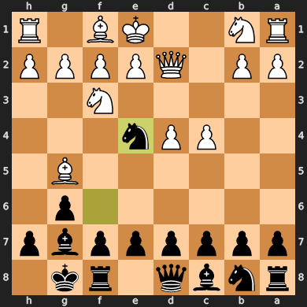

**Engine Recommendation:** The engine suggests `Ne4`, which attacks the white bishop on g5 and gains a tempo, forcing White to react.

**Actual Move:** Black played `Ne4`, a strong tactical move that immediately challenges White's pinned bishop and activates the knight to a central outpost. This is a very good move, as the engine also suggests it.

### Move 6 (White): Qf4

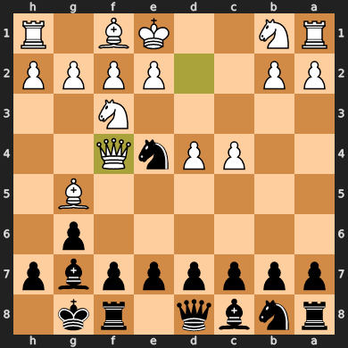

**Engine Recommendation:** The engine suggests `Qf4`, retreating the queen and maintaining pressure on Black's kingside.

**Actual Move:** White played `Qf4`, moving the queen to a safer square while keeping it active and aiming towards Black's kingside.

### Move 6 (Black): Nxg5

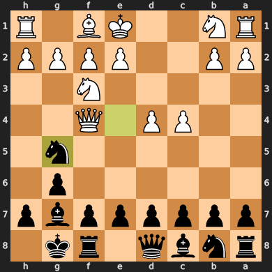

**Engine Recommendation:** The engine suggests `d5`, challenging White's central pawn structure.

**Actual Move:** Black played `Nxg5`, capturing White's bishop and removing the pin on the knight. This is a good tactical move that simplifies the position and gains material parity (knight for bishop) if white recaptures with the queen, or a clear advantage if White doesn't. However, the engine still preferred to open up the center with `d5`.

### Move 7 (White): Nxg5

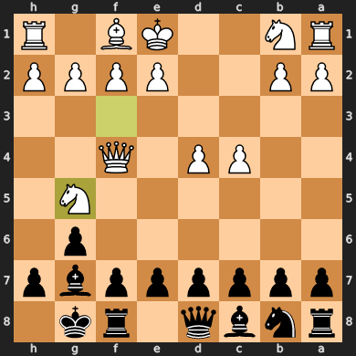

**Engine Recommendation:** The engine suggests `Qxg5`, recapturing with the queen, which keeps the queen active and in a central position.

**Actual Move:** White played `Nxg5`, recapturing with the knight. This develops another piece and keeps the queen on f4 for now, but the queen on g5 would have had more immediate impact and development.

### Move 7 (Black): d5

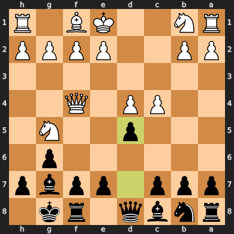

**Engine Recommendation:** The engine suggests `c5`, immediately challenging White's d4 pawn and creating space on the queenside.

**Actual Move:** Black played `d5`, a strong central push that directly challenges White's control of the center and opens lines for Black's pieces. This is a good move to activate the position.

### Move 8 (White): Qh4

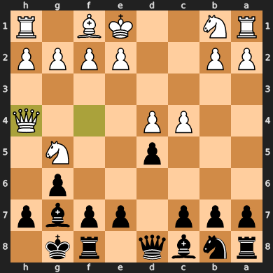

**Engine Recommendation:** The engine suggests `cxd5`, capturing Black's central pawn and opening up the center for White's pieces.

**Actual Move:** White played `Qh4`, an aggressive queen move that attacks the pawn on h7 and puts pressure on Black's kingside. However, this move also leaves the d4 pawn vulnerable and is a significant deviation from the engine's recommendation to deal with Black's central pawn push.

### Move 8 (Black): h6

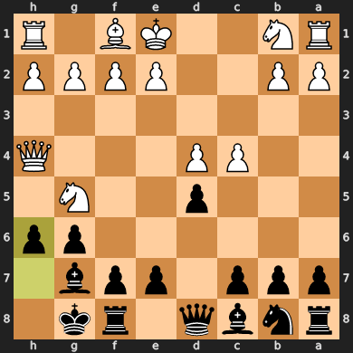

**Engine Recommendation:** The engine suggests `h6`, defending the h7 pawn and creating an escape square for the king.

**Actual Move:** Black played `h6`, a sensible defensive move that deals with the immediate threat from White's queen and prepares for potential kingside pawn pushes.

### Move 9 (White): Nf3

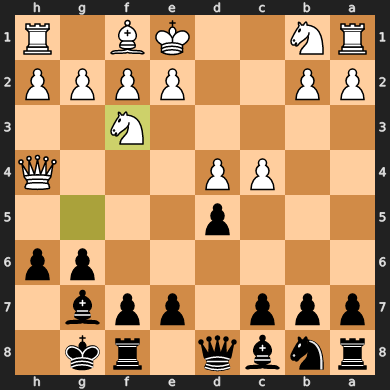

**Engine Recommendation:** The engine suggests `Nf3`, retreating the knight and maintaining a flexible position.

**Actual Move:** White played `Nf3`, retreating the knight from g5 to avoid an immediate exchange and keep the option of developing it to other squares.

### Move 9 (Black): dxc4

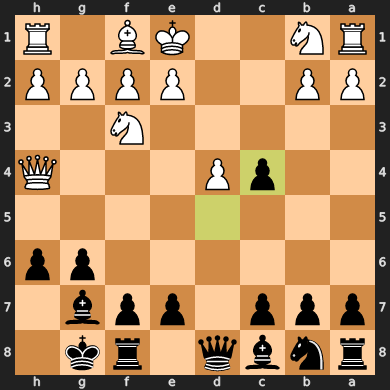

**Engine Recommendation:** The engine suggests `c5`, challenging White's central pawn and creating counterplay on the queenside.

**Actual Move:** Black played `dxc4`, capturing White's central pawn. This opens up the position and creates a passed pawn for Black on c4. While `c5` was also a strong option, `dxc4` directly attacks White's pawn structure.

### Move 10 (White): e3

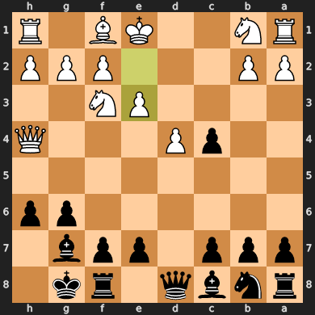

**Engine Recommendation:** The engine suggests `e3`, reinforcing the center and preparing to develop the light-squared bishop.

**Actual Move:** White played `e3`, supporting the d4 pawn and opening up a diagonal for the bishop on c1. This is a solid developing move.

### Move 10 (Black): Nc6

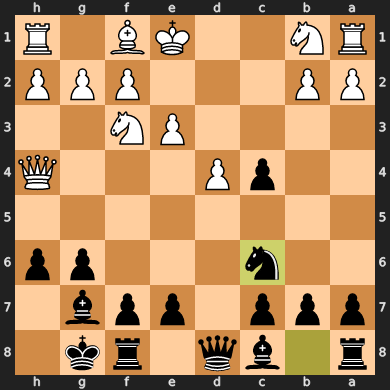

**Engine Recommendation:** The engine suggests `Be6`, developing the bishop and controlling the center.

**Actual Move:** Black played `Nc6`, developing the knight to a central square and attacking White's d4 pawn. This is a good developing move that also creates some pressure on White's position.

### Move 11 (White): Bxc4

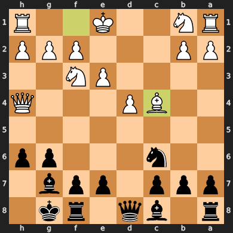

**Engine Recommendation:** The engine suggests `Bxc4`, recapturing the pawn and developing the bishop.

**Actual Move:** White played `Bxc4`, recapturing the pawn and bringing the bishop into an active diagonal, controlling the center and putting pressure on Black's kingside.

### Move 11 (Black): Be6

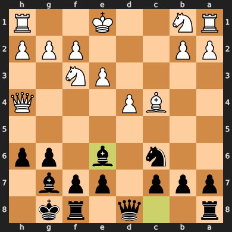

**Engine Recommendation:** The engine suggests `Nb4`, attacking White's queen and creating tactical threats against c2.

**Actual Move:** Black played `Be6`, developing the bishop and supporting the d5 pawn. While `Nb4` offered immediate tactical opportunities, `Be6` is a solid developing move that aims to control the center.

### Move 12 (White): Bxe6

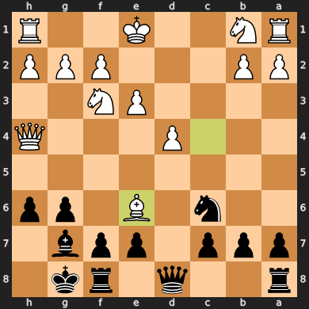

**Engine Recommendation:** The engine suggests `Bxe6`, exchanging bishops and inflicting doubled pawns on Black.

**Actual Move:** White played `Bxe6`, exchanging bishops and leaving Black with doubled pawns on the e-file. This weakens Black's pawn structure and can be a long-term disadvantage.

### Move 12 (Black): fxe6

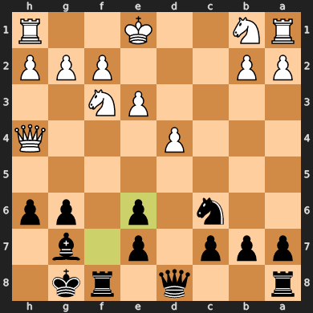

**Engine Recommendation:** The engine suggests `fxe6`, recapturing the bishop.

**Actual Move:** Black played `fxe6`, recapturing the bishop. This creates doubled pawns on the e-file, which can be a long-term structural weakness for Black.

### Move 13 (White): Qg4

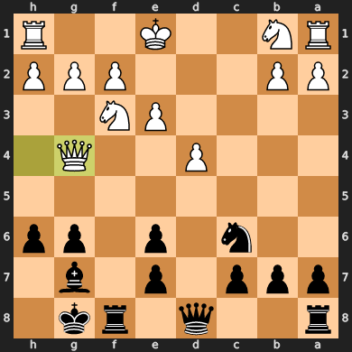

**Engine Recommendation:** The engine suggests `Nc3`, developing the knight and reinforcing the center.

**Actual Move:** White played `Qg4`, bringing the queen to a very aggressive square and directly attacking Black's g7 pawn. This is a bold move, but it also exposes the queen and allows Black to potentially gain a tempo.

### Move 13 (Black): Nb4

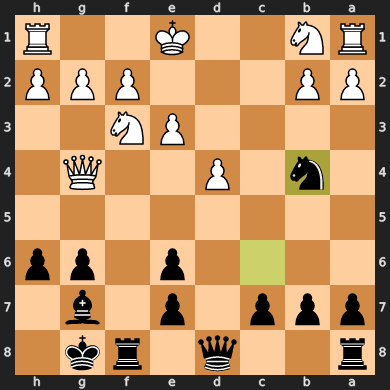

**Engine Recommendation:** The engine suggests `e5`, opening up the center and creating space for Black's pieces.

**Actual Move:** Black played `Nb4`, immediately attacking White's c2 pawn and forcing a reaction from White. This is a tactical move that gains a tempo and creates complications for White.

### Move 14 (White): Qxe6+

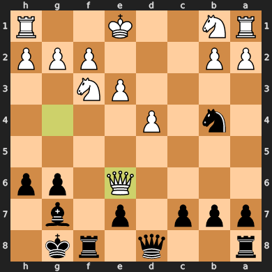

**Engine Recommendation:** The engine suggests `Qxg6`, which would maintain the attack on the kingside and prepare to win material.

**Actual Move:** White played `Qxe6+`, a major blunder! This sacrifices the queen for a pawn and a check. Black will capture the queen on the next move, giving Black a decisive material advantage. This was a critical mistake.

### Move 14 (Black): Kh8

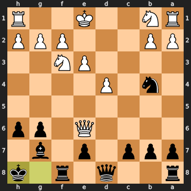

**Engine Recommendation:** The engine suggests `Kh7`, moving the king to a safer square and keeping the rook on f8 more active.

**Actual Move:** Black played `Kh8`, moving the king out of check. **However, this is an enormous missed opportunity!** Black could have captured the white queen with `Bxe6`, which would have given Black a decisive material advantage. This was a critical blunder by Black, completely missing White's queen sacrifice.

### Move 15 (White): Qxg6

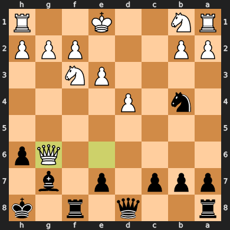

**Engine Recommendation:** The engine suggests `O-O`, castling kingside to bring the king to safety and activate the rook.

**Actual Move:** White played `Qxg6`, recapturing the g6 pawn. This was an excellent move by White, taking advantage of Black's incredible blunder of not capturing the queen on the previous move. White now has a significant material and positional advantage.

### Move 15 (Black): Nc2+

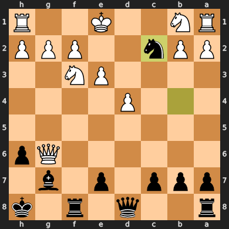

**Engine Recommendation:** The engine suggests `Qe8`, developing the queen and connecting the rooks.

**Actual Move:** Black played `Nc2+`, a strong tactical move! This forks White's king and rook, winning the exchange (a rook for a knight). This is a good recovery by Black after the previous blunder and gives them some compensation for the lost material.

### Move 16 (White): Qxc2

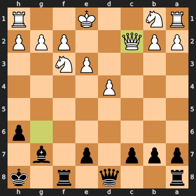

**Engine Recommendation:** The engine suggests `Qxc2`, capturing the attacking knight.

**Actual Move:** White played `Qxc2`, capturing Black's knight. However, this still results in White losing the exchange (rook for knight) after the king moves, as Black's knight had forked the king and rook.

### Move 16 (Black): Qd5

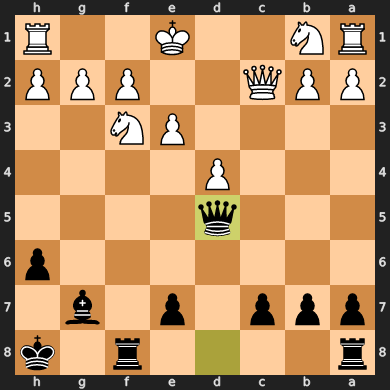

**Engine Recommendation:** The engine suggests `c5`, challenging White's central pawn and opening the c-file for Black's rook.

**Actual Move:** Black played `Qd5`, centralizing the queen and putting pressure on White's d4 pawn and the weakened kingside. This is a strong developing move that maintains Black's advantage.

### Move 17 (White): Nc3

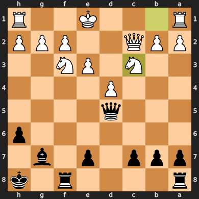

**Engine Recommendation:** The engine suggests `Nh4`, which would attempt to create some kingside threats and distract Black from the center.

**Actual Move:** White played `Nc3`, developing the knight and defending the d5 square. While a reasonable developing move, it doesn't address the pressure Black is putting on the center as directly as the engine's suggestion.

### Move 17 (Black): Qc6

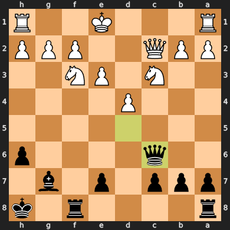

**Engine Recommendation:** The engine suggests `Qh5`, putting more pressure on White's kingside.

**Actual Move:** Black played `Qc6`, centralizing the queen and putting pressure on White's c2 pawn. This is a good developing move that keeps the initiative and maintains Black's advantage.

### Move 18 (White): O-O

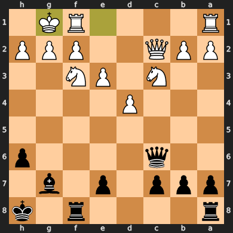

**Engine Recommendation:** The engine suggests `Nh4`, attempting to create some kingside threats and distract Black.

**Actual Move:** White played `O-O` (queenside castling), bringing the king to safety and connecting the rooks. However, with Black's queen on c6 and an open c-file, queenside castling might expose the king to more danger than kingside castling would have.

### Move 18 (Black): Rg8

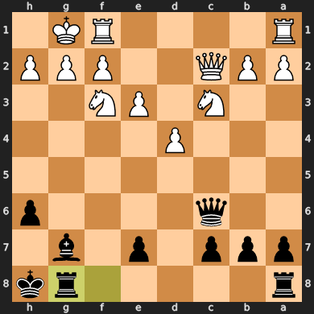

**Engine Recommendation:** The engine suggests `Rxf3`, winning White's knight and further increasing Black's material advantage.

**Actual Move:** Black played `Rg8`, bringing the rook to the open g-file and preparing to put pressure on White's kingside. While this is a reasonable developing move, Black missed a significant tactical opportunity to win material with `Rxf3`.

### Move 19 (White): Ne5

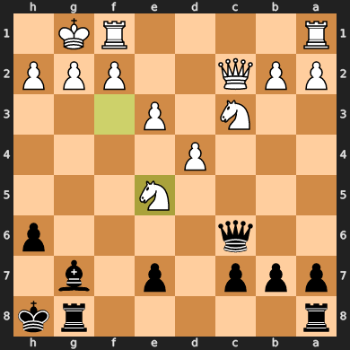

**Engine Recommendation:** The engine suggests `Qe4`, activating the queen and trying to generate some counterplay on the kingside.

**Actual Move:** White played `Ne5`, centralizing the knight and attacking Black's knight on c6. This is a reasonable developing move that puts pressure on Black's central pieces.

### Move 19 (Black): Bxe5

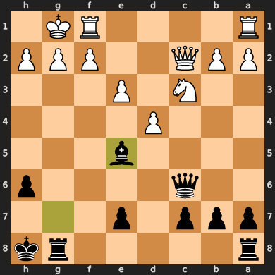

**Engine Recommendation:** The engine suggests `Bxe5`, exchanging the bishop for White's active knight.

**Actual Move:** Black played `Bxe5`, capturing White's knight. This simplifies the position and eliminates a strong attacking piece for White. This is a solid decision given Black's material advantage.

### Move 20 (White): d5

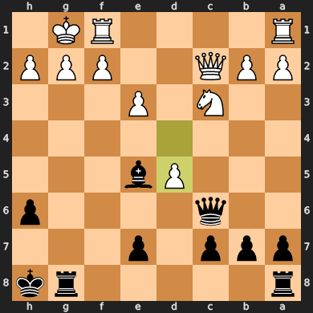

**Engine Recommendation:** The engine suggests `g3`, creating an escape square for the king and opening up the g-file for the rook.

**Actual Move:** White played `d5`, pushing the central pawn and opening up the d-file. This is an aggressive move, but it might create weaknesses around White's king, especially after queenside castling. It also leaves the e3 pawn unprotected.

### Move 20 (Black): Qf6

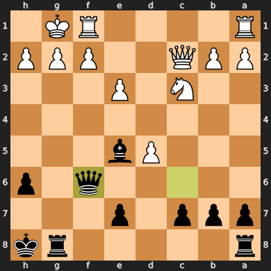

**Engine Recommendation:** The engine suggests `Qc4`, attacking the c2 pawn and activating the queen further.

**Actual Move:** Black played `Qf6`, putting pressure on White's f3 knight and aiming at White's kingside. This is a good move that keeps Black's attack going and maintains the initiative.

### Move 21 (White): Ne4

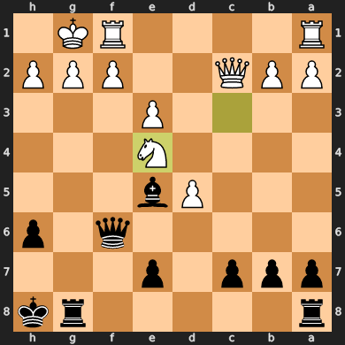

**Engine Recommendation:** The engine suggests `g3`, creating an escape square for the king and opening the g-file for the rook.

**Actual Move:** White played `Ne4`, developing the knight to a central square and attacking Black's queen. This creates some counterplay for White and forces Black to react.

### Move 21 (Black): Rxg2+

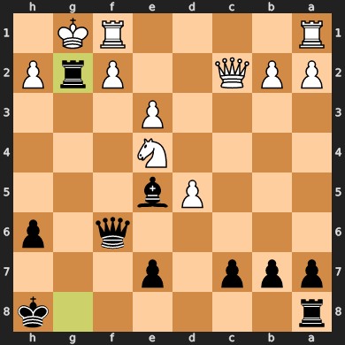

**Engine Recommendation:** The engine suggests `Bxh2+`, winning a pawn and creating immediate threats to White's king.

**Actual Move:** Black played `Rxg2+`, a spectacular rook sacrifice! This forces White's king to move and opens up the g-file for Black's other rook. This is a very strong tactical move that leads to a winning attack for Black.

### Move 22 (White): Kxg2

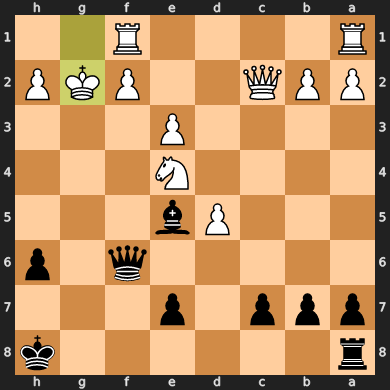

**Engine Recommendation:** The engine suggests `Kxg2`, which is the only legal move to get out of check.

**Actual Move:** White played `Kxg2`, capturing the rook and getting out of check. However, this exposes the king to further attacks from Black's queen and rook.

### Move 22 (Black): Rg8+

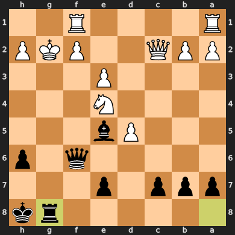

**Engine Recommendation:** The engine suggests `Qg6+`, which maintains the attack on the kingside and keeps the initiative.

**Actual Move:** Black played `Rg8+`, continuing the attack on White's king with a check. This brings the second rook into the attack and creates a mating net.

### Move 23 (White): Ng3

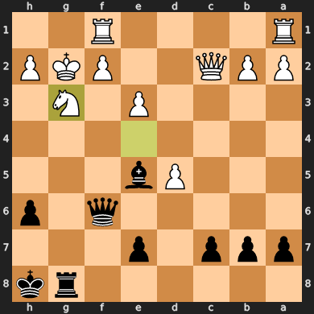

**Engine Recommendation:** The engine suggests `Ng3`, which is the only legal move to block the check.

**Actual Move:** White played `Ng3`, blocking the check. This moves the knight to a defensive square but it's still a difficult position for White.

### Move 23 (Black): h5

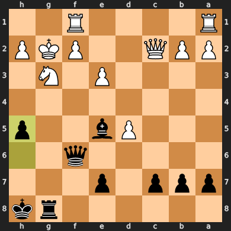

**Engine Recommendation:** The engine suggests `Bd6`, developing the bishop and adding to the attack on the kingside.

**Actual Move:** Black played `h5`, pushing the pawn and opening up the h-file for the rook. This move further intensifies Black's attack on White's king and prepares for more decisive blows.

### Move 24 (White): f4

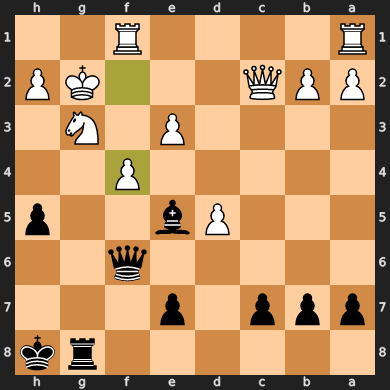

**Engine Recommendation:** The engine suggests `Qe2`, defending the f2 pawn and creating an escape square for the king.

**Actual Move:** White played `f4`, pushing the pawn in an attempt to block Black's attack. However, this move further weakens White's kingside and creates more targets for Black's attack. It also exposes the e3 pawn.

### Move 24 (Black): Bd6

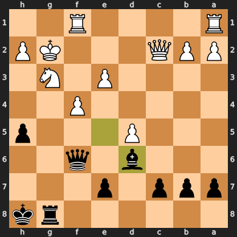

**Engine Recommendation:** The engine suggests `h4`, continuing the kingside pawn storm and opening the h-file for the rook.

**Actual Move:** Black played `Bd6`, developing the bishop and adding another attacker to White's kingside. This move strengthens Black's attack and puts more pressure on White's defenses.

### Move 25 (White): Qc3

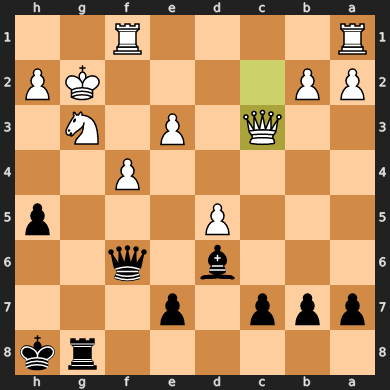

**Engine Recommendation:** The engine suggests `Kh1`, trying to move the king to a safer square.

**Actual Move:** White played `Qc3`, offering a queen exchange. This might relieve some of the immediate pressure on White's king, but White is still down material and Black has a strong attack developing.

### Move 25 (Black): Qxc3

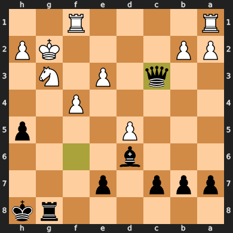

**Engine Recommendation:** The engine suggests `h4`, continuing the kingside attack and opening the h-file further.

**Actual Move:** Black played `Qxc3`, exchanging queens. This simplifies the position, and Black still retains a significant material and positional advantage, with a strong attack on White's king.

### Move 26 (White): bxc3

**Engine Recommendation:** The engine suggests `bxc3`, recapturing the queen and maintaining material equality.

**Actual Move:** White played `bxc3`, recapturing the queen. The position remains difficult for White due to Black's active pieces and the exposed king.

### Move 26 (Black): h4

**Engine Recommendation:** The engine suggests `h4`, continuing the kingside attack and opening the h-file for the rook.

**Actual Move:** Black played `h4`, pushing the pawn further and creating more attacking opportunities on White's kingside. This move maintains Black's strong initiative.

### Move 27 (White): Rh1

**Engine Recommendation:** The engine suggests `Kf3`, trying to bring the king to safety and consolidate the position.

**Actual Move:** White played `Rh1`, bringing the rook into play and defending the h-pawn. However, White's king remains exposed to Black's attack.

### Move 27 (Black): hxg3

**Engine Recommendation:** The engine suggests `hxg3`, opening the h-file and intensifying the kingside attack.

**Actual Move:** Black played `hxg3`, continuing the kingside attack and opening the h-file for the rook. This creates a powerful attack against White's king.

### Move 28 (White): hxg3+

**Engine Recommendation:** The engine suggests `hxg3+`, recapturing the pawn and checking the king.

**Actual Move:** White played `hxg3+`, recapturing the pawn and checking Black's king. This is a forced move to get out of check.

### Move 28 (Black): Kg7

**Engine Recommendation:** The engine suggests `Kg7`, moving the king to safety and continuing the attack.

**Actual Move:** Black played `Kg7`, getting the king out of check and preparing to unleash further attacks on White's exposed king.

### Move 29 (White): Rh5

**Engine Recommendation:** The engine suggests `Rh5`, activating the rook and potentially creating counterplay or a defensive maneuver.

**Actual Move:** White played `Rh5`, activating the rook and trying to defend against Black's attack on the kingside.

### Move 29 (Black): Kf8

**Engine Recommendation:** The engine suggests `c6`, reinforcing the d5 pawn and preparing for further expansion on the queenside.

**Actual Move:** Black played `Kf8`, moving the king to a safer square on the back rank and away from White's kingside attack. This is a good defensive move to consolidate Black's position.

### Move 30 (White): Rah1

**Engine Recommendation:** The engine suggests `Kf3`, trying to move the king to a safer square.

**Actual Move:** White played `Rah1`, bringing the other rook to the h-file to defend against Black's kingside attack. This consolidates White's kingside defenses.

### Move 30 (Black): Ba3

**Engine Recommendation:** The engine suggests `Bc5`, developing the bishop and adding to the attack on the kingside.

**Actual Move:** Black played `Ba3`, attacking White's rook on b2 and creating a powerful battery with the queen and bishop. This is a very strong tactical move that further increases Black's advantage.

### Move 31 (White): Rh8

**Engine Recommendation:** The engine suggests `Kf3`, trying to move the king to a safer square.

**Actual Move:** White played `Rh8`, trying to defend the back rank and prevent immediate checkmate. However, White's position is beyond repair, and Black has a clear path to victory.

